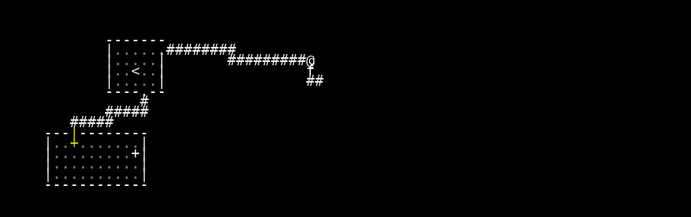

# VAE Reconstruction Comparison

_Generated: 2025-08-09T23:01:07_

## Sample 0

| Original | Reconstruction |
|---|---|
|  |  |

 Sample 1 Accuracy:   Character accuracy: 0.894 (1483/1659 cells)
   Color accuracy: 0.911 (1511/1659 cells)

================================================================================
## Sample 1

| Original | Reconstruction |
|---|---|
|  |  |

 Sample 2 Accuracy:   Character accuracy: 0.910 (1510/1659 cells)
   Color accuracy: 0.918 (1523/1659 cells)

================================================================================
## Sample 2

| Original | Reconstruction |
|---|---|
|  |  |

 Sample 3 Accuracy:   Character accuracy: 0.905 (1502/1659 cells)
   Color accuracy: 0.918 (1523/1659 cells)

================================================================================
## Sample 3

| Original | Reconstruction |
|---|---|
|  |  |

 Sample 4 Accuracy:   Character accuracy: 0.907 (1505/1659 cells)
   Color accuracy: 0.923 (1532/1659 cells)

📈 Overall Reconstruction Statistics:   Average Character Reconstruction Accuracy: 0.904
   Average Color Reconstruction Accuracy: 0.918
