# Enhanced VAE Reconstruction Comparison

_Generated: 2025-08-27T10:25:38_

This analysis includes the following reconstructions:
- **Ego View**: Character, color, and class predictions in ego-centric window
- **Bag Elements**: High-probability glyph elements
- **Passability/Safety**: 3x3 grids around hero position

## Sample 1

### Ego Map Reconstruction

| Original | Reconstruction |
|---|---|
| 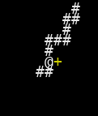 | 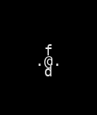 |

**Accuracy**: Character: 0.322, Color: 0.397

### Ego Class Reconstruction

| Original | Reconstruction |
|---|---|
| 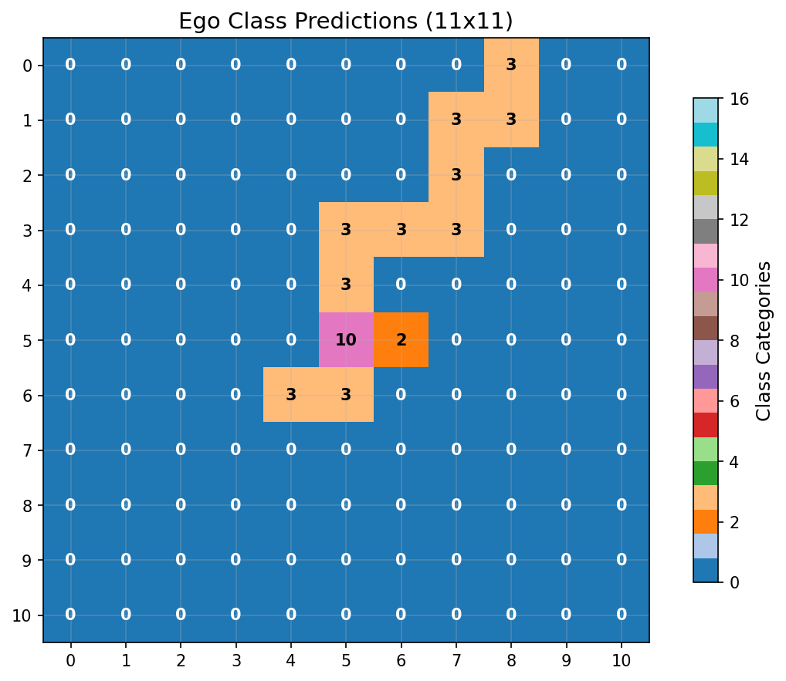 | 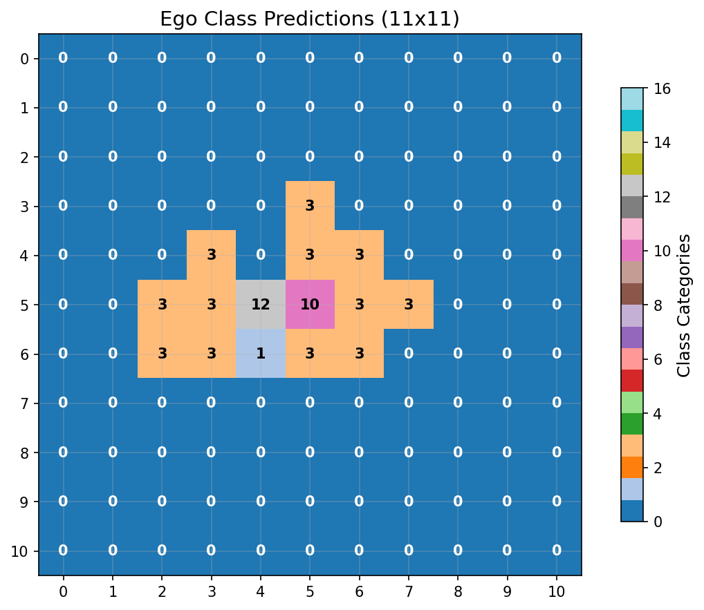 |

**Class Accuracy**: 0.438

### Bag Reconstruction

```
Bag Analysis:
========================================

Original Bag (10 items):
------------------------------
  '#' (color  7)
  ')' (color  6)
  '-' (color  3)
  '-' (color  7)
  '.' (color  7)
  '.' (color  8)
  '<' (color  7)
  '@' (color 15)
  'f' (color 15)
  '|' (color  7)

Reconstructed Bag (14 items):
------------------------------
  '#' (color  7)
  '(' (color  3)
  '-' (color  3)
  '-' (color  7)
  '.' (color  7)
  '.' (color  8)
  '<' (color  7)
  '>' (color  7)
  '@' (color 15)
  '[' (color  3)
  '[' (color  8)
  '`' (color  7)
  '|' (color  3)
  '|' (color  7)

Accuracy Metrics:
------------------------------
  Correctly predicted: 8 items
    '#' (color  7)
    '-' (color  3)
    '-' (color  7)
    '.' (color  7)
    '.' (color  8)
    '<' (color  7)
    '@' (color 15)
    '|' (color  7)
  Missed items: 2 items
    ')' (color  6)
    'f' (color 15)
  False positives: 6 items
    '(' (color  3)
    '>' (color  7)
    '[' (color  3)
    '[' (color  8)
    '`' (color  7)
    '|' (color  3)

Performance Summary:
------------------------------
  Precision: 0.571 (8/14)
  Recall: 0.800 (8/10)
  F1-Score: 0.667
  Total unique items: 16
```

### Passability & Safety

| Original | Reconstruction |
|---|---|
| 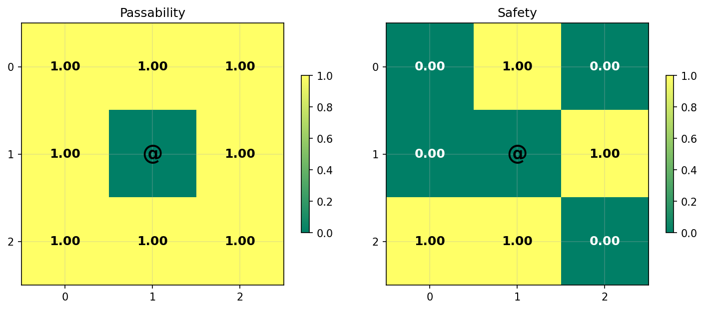 | 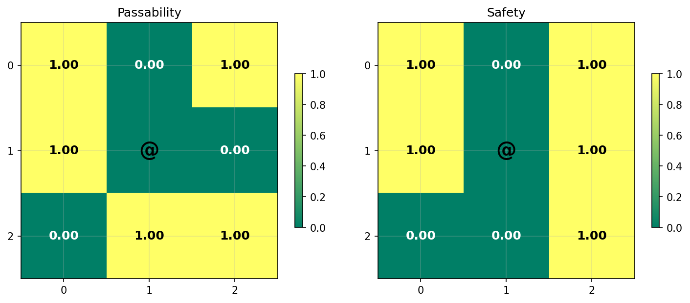 |

================================================================================

## Sample 2

### Ego Map Reconstruction

| Original | Reconstruction |
|---|---|
| 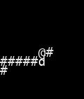 | 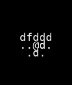 |

**Accuracy**: Character: 0.331, Color: 0.893

### Ego Class Reconstruction

| Original | Reconstruction |
|---|---|
| 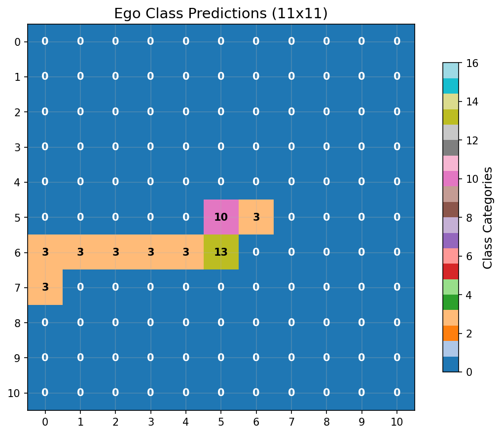 | 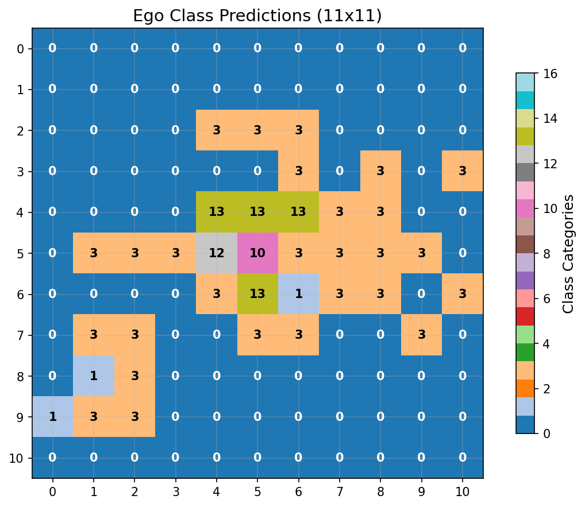 |

**Class Accuracy**: 0.868

### Bag Reconstruction

```
Bag Analysis:
========================================

Original Bag (10 items):
------------------------------
  '#' (color  7)
  '*' (color  7)
  '-' (color  7)
  '.' (color  7)
  '.' (color  8)
  '<' (color  7)
  '@' (color 15)
  'd' (color 15)
  '|' (color  3)
  '|' (color  7)

Reconstructed Bag (9 items):
------------------------------
  '#' (color  7)
  '-' (color  3)
  '-' (color  7)
  '.' (color  7)
  '.' (color  8)
  '<' (color  7)
  '>' (color  7)
  '@' (color 15)
  '|' (color  7)

Accuracy Metrics:
------------------------------
  Correctly predicted: 7 items
    '#' (color  7)
    '-' (color  7)
    '.' (color  7)
    '.' (color  8)
    '<' (color  7)
    '@' (color 15)
    '|' (color  7)
  Missed items: 3 items
    '*' (color  7)
    'd' (color 15)
    '|' (color  3)
  False positives: 2 items
    '-' (color  3)
    '>' (color  7)

Performance Summary:
------------------------------
  Precision: 0.778 (7/9)
  Recall: 0.700 (7/10)
  F1-Score: 0.737
  Total unique items: 12
```

### Passability & Safety

| Original | Reconstruction |
|---|---|
| 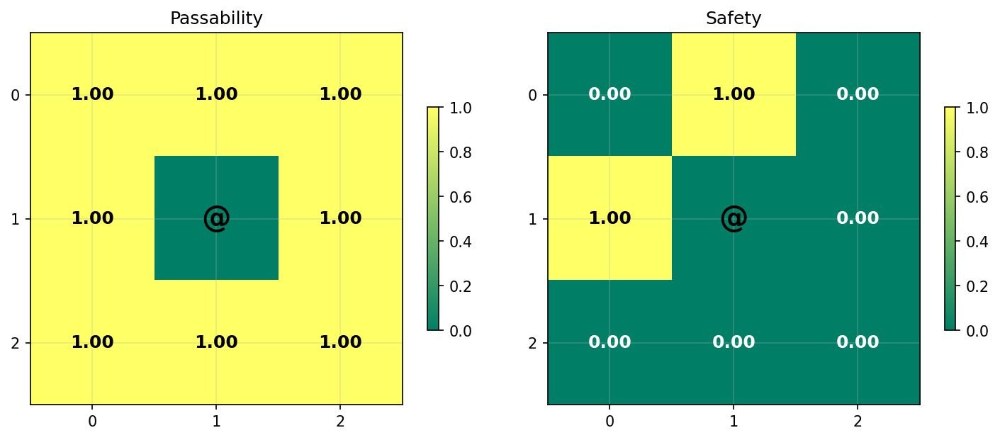 | 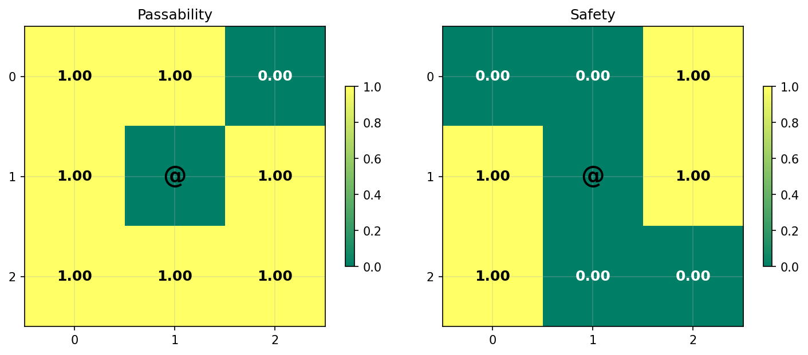 |

================================================================================

## Sample 3

### Ego Map Reconstruction

| Original | Reconstruction |
|---|---|
| 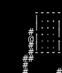 | 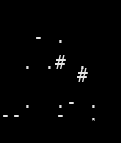 |

**Accuracy**: Character: 0.289, Color: 0.653

### Ego Class Reconstruction

| Original | Reconstruction |
|---|---|
| 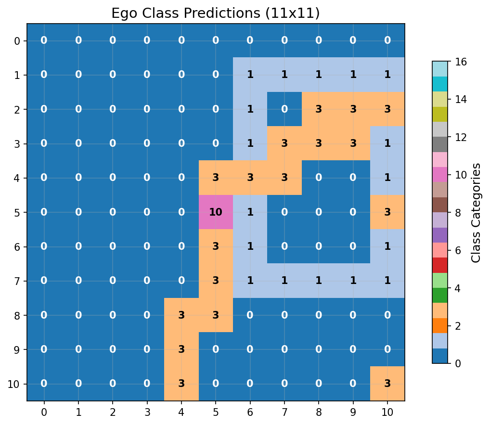 | 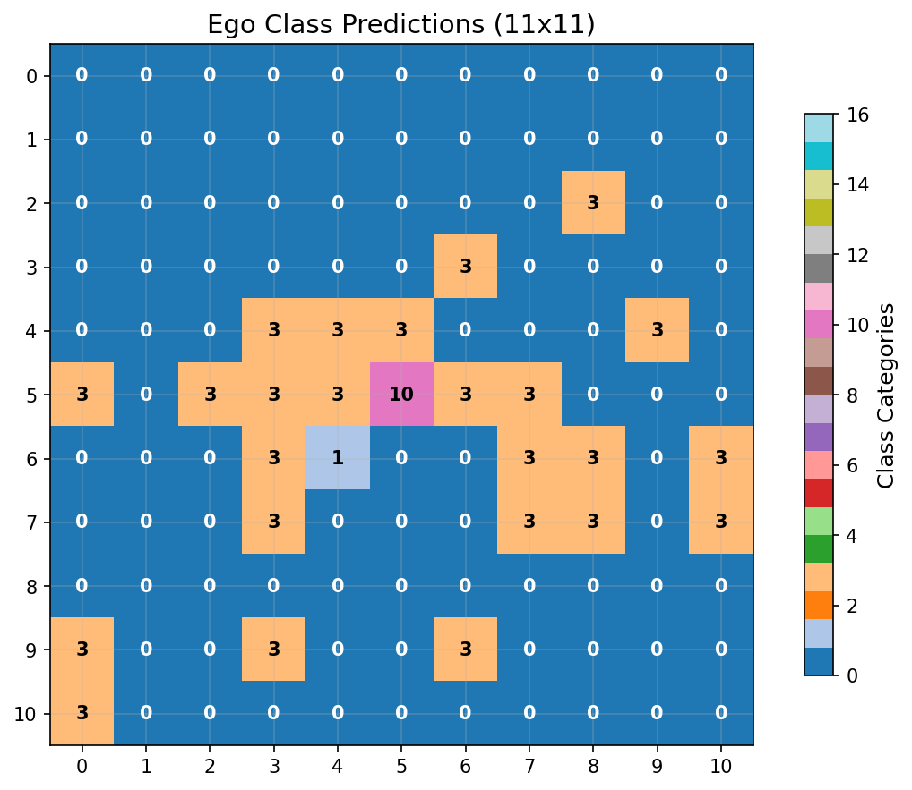 |

**Class Accuracy**: 0.653

### Bag Reconstruction

```
Bag Analysis:
========================================

Original Bag (12 items):
------------------------------
  '#' (color  7)
  '%' (color  3)
  ')' (color  6)
  '+' (color  3)
  '-' (color  3)
  '-' (color  7)
  '.' (color  7)
  '.' (color  8)
  '<' (color  7)
  '@' (color 15)
  '|' (color  3)
  '|' (color  7)

Reconstructed Bag (13 items):
------------------------------
  '#' (color  7)
  '-' (color  3)
  '-' (color  7)
  '.' (color  7)
  '.' (color  8)
  '<' (color  7)
  '>' (color  7)
  '@' (color 15)
  '^' (color  3)
  '`' (color  7)
  '{' (color 12)
  '|' (color  3)
  '|' (color  7)

Accuracy Metrics:
------------------------------
  Correctly predicted: 9 items
    '#' (color  7)
    '-' (color  3)
    '-' (color  7)
    '.' (color  7)
    '.' (color  8)
    '<' (color  7)
    '@' (color 15)
    '|' (color  3)
    '|' (color  7)
  Missed items: 3 items
    '%' (color  3)
    ')' (color  6)
    '+' (color  3)
  False positives: 4 items
    '>' (color  7)
    '^' (color  3)
    '`' (color  7)
    '{' (color 12)

Performance Summary:
------------------------------
  Precision: 0.692 (9/13)
  Recall: 0.750 (9/12)
  F1-Score: 0.720
  Total unique items: 16
```

### Passability & Safety

| Original | Reconstruction |
|---|---|
| 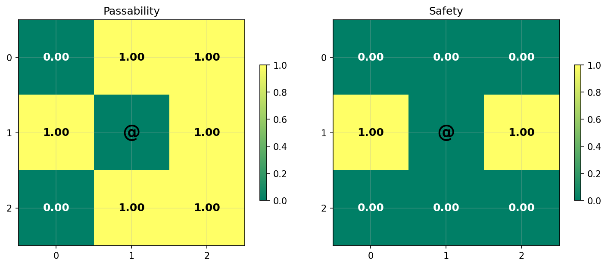 | 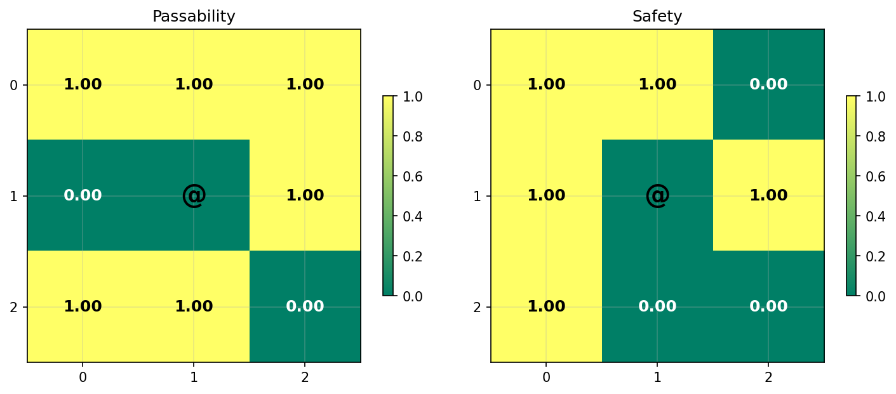 |

================================================================================

## Sample 4

### Ego Map Reconstruction

| Original | Reconstruction |
|---|---|
| 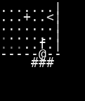 | 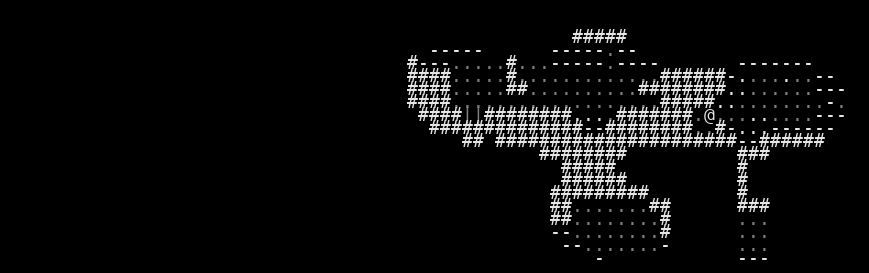 |

**Accuracy**: Character: 0.264, Color: 0.719

### Ego Class Reconstruction

| Original | Reconstruction |
|---|---|
| 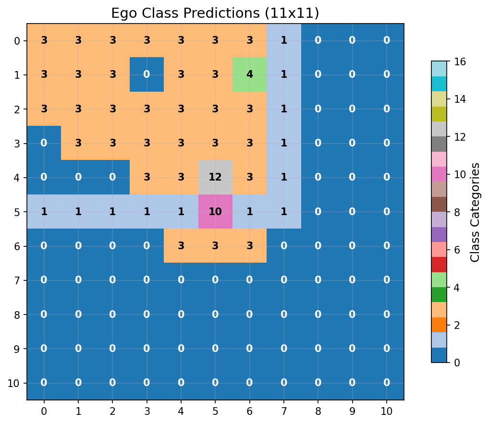 | 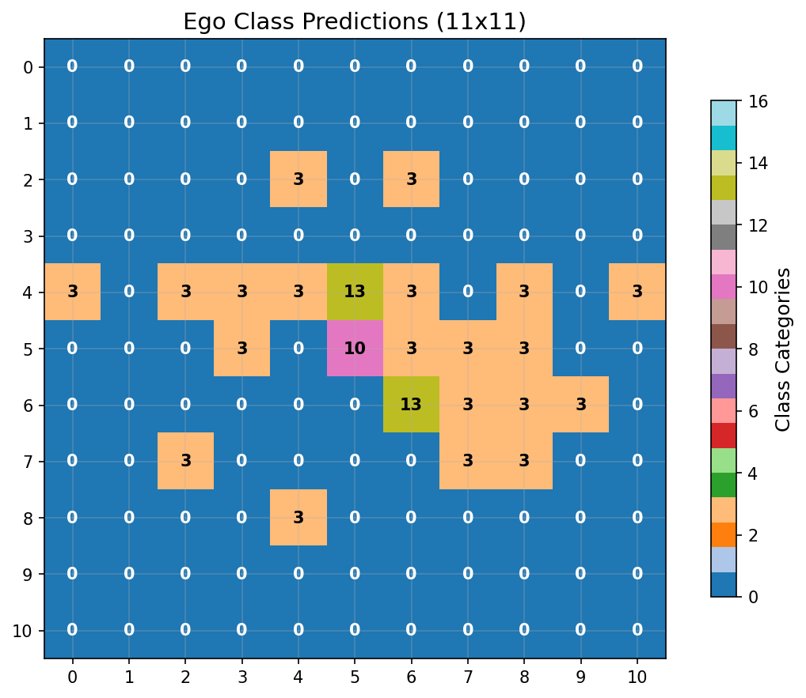 |

**Class Accuracy**: 0.645

### Bag Reconstruction

```
Bag Analysis:
========================================

Original Bag (10 items):
------------------------------
  '#' (color  7)
  '-' (color  3)
  '-' (color  7)
  '.' (color  7)
  '.' (color  8)
  '<' (color  7)
  '@' (color 15)
  'd' (color 15)
  '|' (color  3)
  '|' (color  7)

Reconstructed Bag (15 items):
------------------------------
  '#' (color  7)
  '(' (color  3)
  ')' (color  6)
  '*' (color  8)
  '-' (color  3)
  '-' (color  7)
  '.' (color  7)
  '.' (color  8)
  '<' (color  7)
  '@' (color 15)
  '`' (color  7)
  'd' (color 15)
  'f' (color 15)
  '|' (color  3)
  '|' (color  7)

Accuracy Metrics:
------------------------------
  Correctly predicted: 10 items
    '#' (color  7)
    '-' (color  3)
    '-' (color  7)
    '.' (color  7)
    '.' (color  8)
    '<' (color  7)
    '@' (color 15)
    'd' (color 15)
    '|' (color  3)
    '|' (color  7)
  Missed items: 0 items
  False positives: 5 items
    '(' (color  3)
    ')' (color  6)
    '*' (color  8)
    '`' (color  7)
    'f' (color 15)

Performance Summary:
------------------------------
  Precision: 0.667 (10/15)
  Recall: 1.000 (10/10)
  F1-Score: 0.800
  Total unique items: 15
```

### Passability & Safety

| Original | Reconstruction |
|---|---|
| 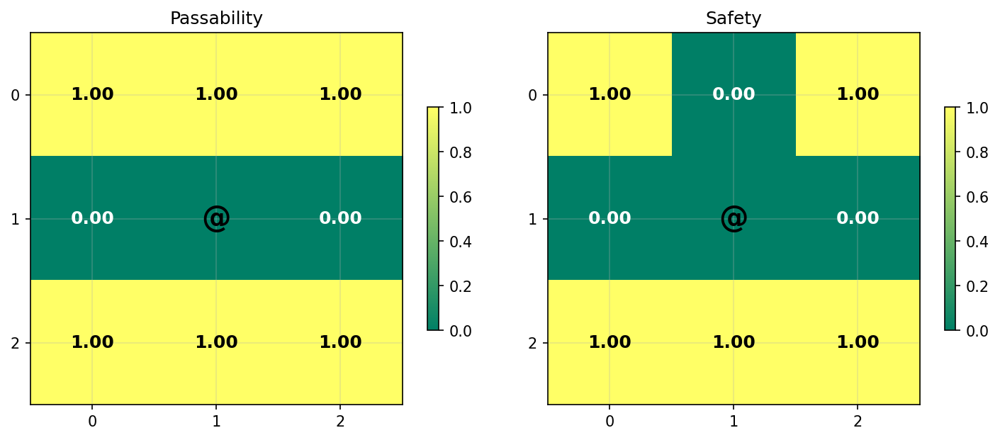 | 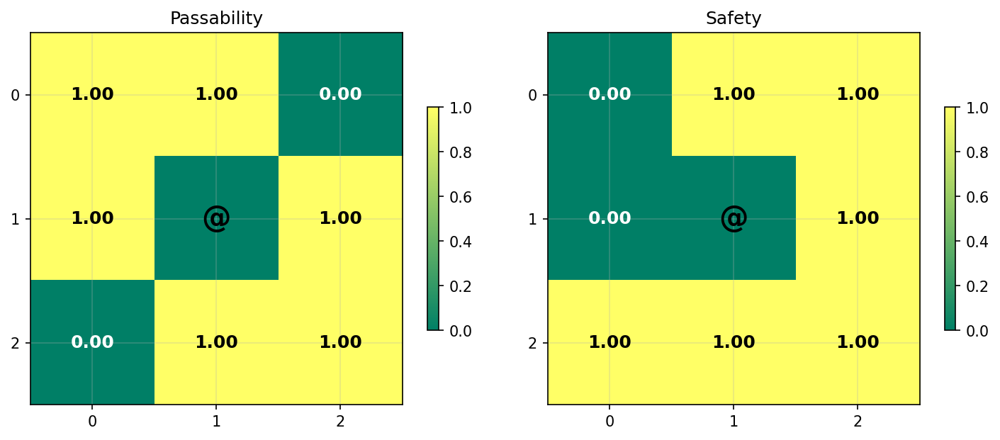 |

================================================================================

## Sample 5

### Ego Map Reconstruction

| Original | Reconstruction |
|---|---|
| 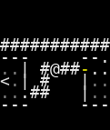 |  |

**Accuracy**: Character: 0.347, Color: 0.612

### Ego Class Reconstruction

| Original | Reconstruction |
|---|---|
| 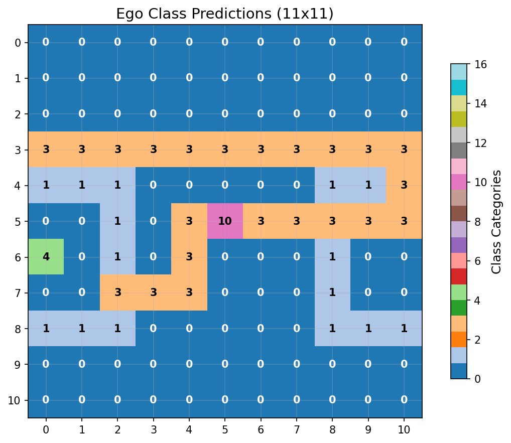 | 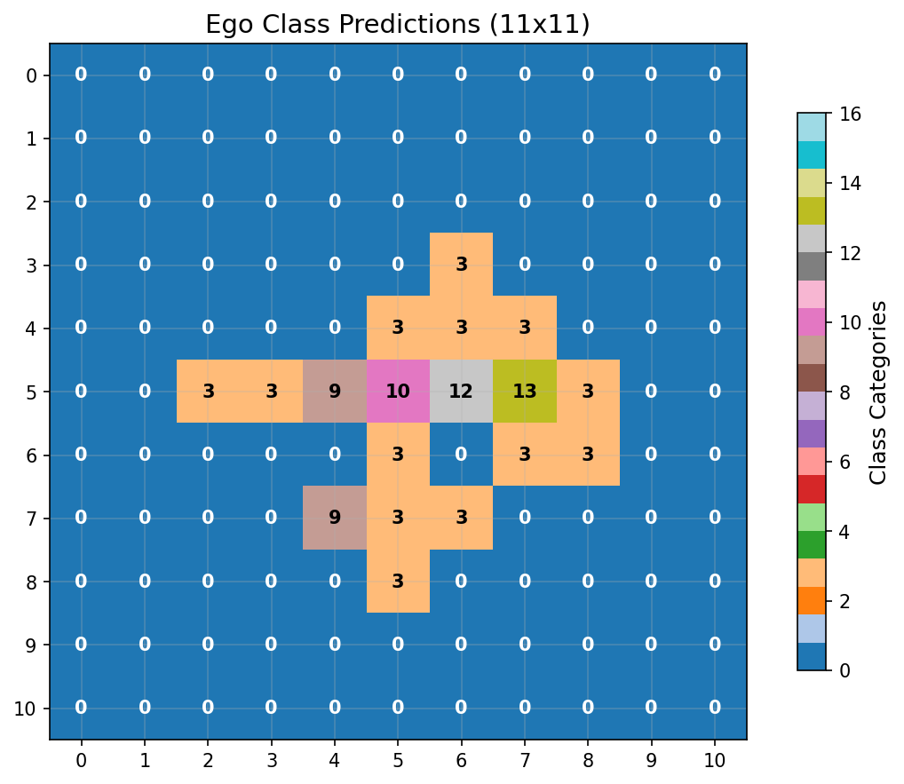 |

**Class Accuracy**: 0.628

### Bag Reconstruction

```
Bag Analysis:
========================================

Original Bag (9 items):
------------------------------
  '#' (color  7)
  '-' (color  3)
  '-' (color  7)
  '.' (color  7)
  '.' (color  8)
  '<' (color  7)
  '@' (color 15)
  '`' (color  7)
  '|' (color  7)

Reconstructed Bag (13 items):
------------------------------
  '#' (color  7)
  '%' (color  3)
  '-' (color  3)
  '-' (color  7)
  '.' (color  7)
  '.' (color  8)
  '<' (color  7)
  '>' (color  7)
  '@' (color 15)
  '[' (color  8)
  '`' (color  7)
  '|' (color  3)
  '|' (color  7)

Accuracy Metrics:
------------------------------
  Correctly predicted: 9 items
    '#' (color  7)
    '-' (color  3)
    '-' (color  7)
    '.' (color  7)
    '.' (color  8)
    '<' (color  7)
    '@' (color 15)
    '`' (color  7)
    '|' (color  7)
  Missed items: 0 items
  False positives: 4 items
    '%' (color  3)
    '>' (color  7)
    '[' (color  8)
    '|' (color  3)

Performance Summary:
------------------------------
  Precision: 0.692 (9/13)
  Recall: 1.000 (9/9)
  F1-Score: 0.818
  Total unique items: 13
```

### Passability & Safety

| Original | Reconstruction |
|---|---|
| 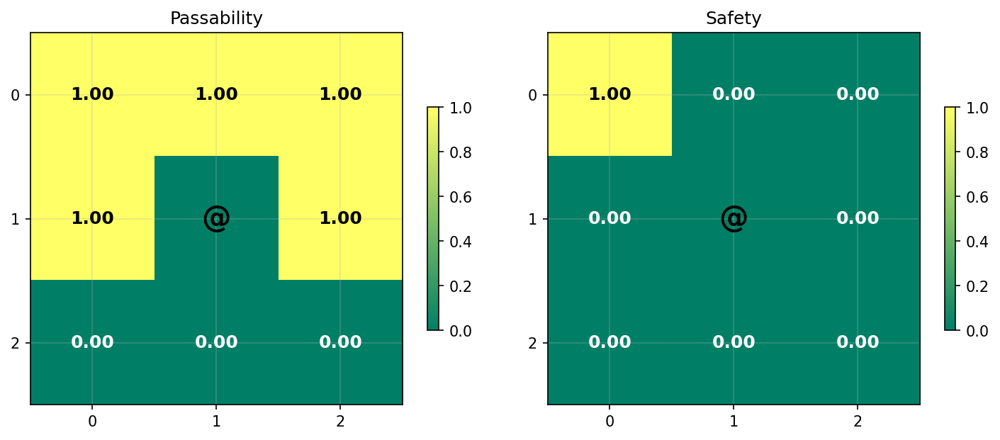 | 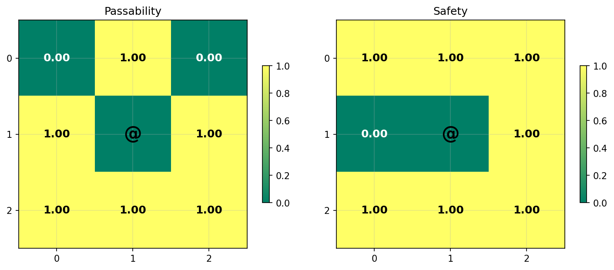 |

================================================================================

## Sample 6

### Ego Map Reconstruction

| Original | Reconstruction |
|---|---|
| 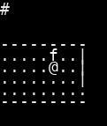 | 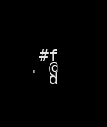 |

**Accuracy**: Character: 0.190, Color: 0.504

### Ego Class Reconstruction

| Original | Reconstruction |
|---|---|
| 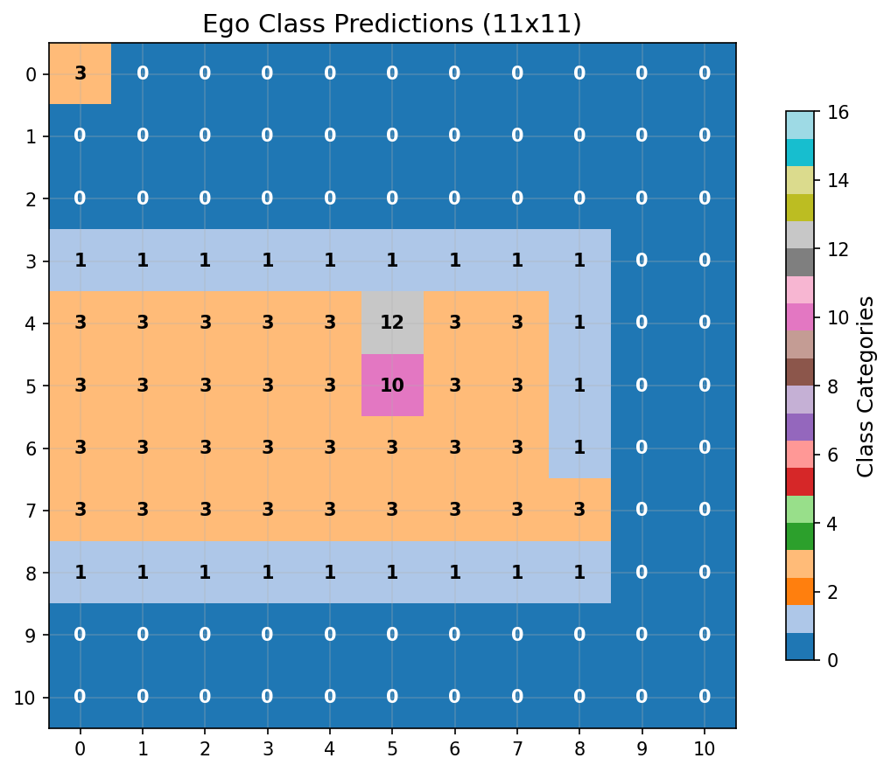 | 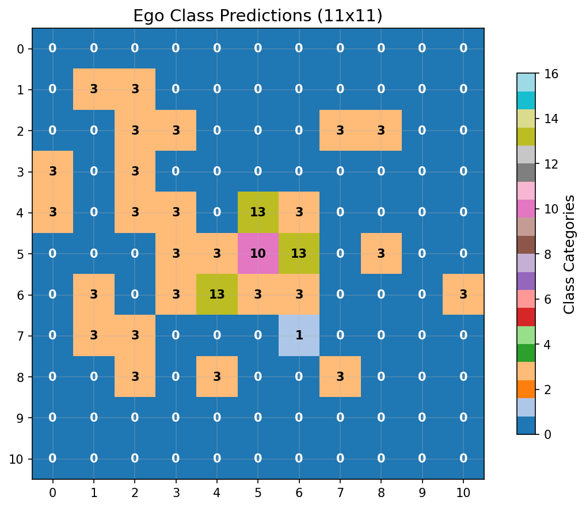 |

**Class Accuracy**: 0.488

### Bag Reconstruction

```
Bag Analysis:
========================================

Original Bag (15 items):
------------------------------
  '#' (color  7)
  ')' (color  3)
  ')' (color  6)
  '+' (color  3)
  '+' (color  5)
  '-' (color  3)
  '-' (color  7)
  '.' (color  7)
  '.' (color  8)
  '<' (color  7)
  '@' (color 15)
  '`' (color  7)
  'f' (color 15)
  '|' (color  3)
  '|' (color  7)

Reconstructed Bag (14 items):
------------------------------
  '#' (color  7)
  ')' (color  6)
  '-' (color  3)
  '-' (color  7)
  '.' (color  7)
  '.' (color  8)
  '<' (color  7)
  '>' (color  7)
  '@' (color 15)
  '`' (color  7)
  'd' (color 15)
  '{' (color 12)
  '|' (color  3)
  '|' (color  7)

Accuracy Metrics:
------------------------------
  Correctly predicted: 11 items
    '#' (color  7)
    ')' (color  6)
    '-' (color  3)
    '-' (color  7)
    '.' (color  7)
    '.' (color  8)
    '<' (color  7)
    '@' (color 15)
    '`' (color  7)
    '|' (color  3)
    '|' (color  7)
  Missed items: 4 items
    ')' (color  3)
    '+' (color  3)
    '+' (color  5)
    'f' (color 15)
  False positives: 3 items
    '>' (color  7)
    'd' (color 15)
    '{' (color 12)

Performance Summary:
------------------------------
  Precision: 0.786 (11/14)
  Recall: 0.733 (11/15)
  F1-Score: 0.759
  Total unique items: 18
```

### Passability & Safety

| Original | Reconstruction |
|---|---|
| 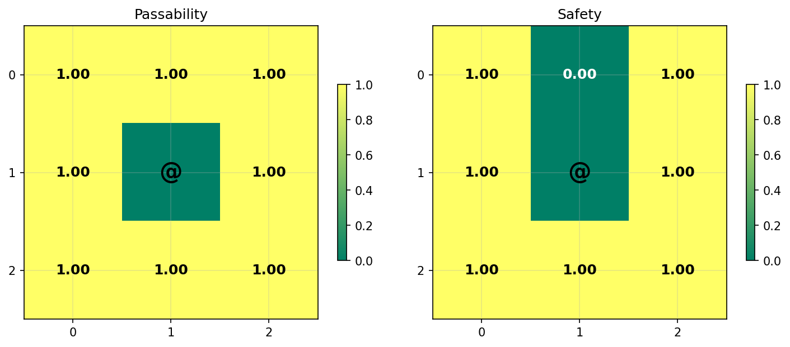 | 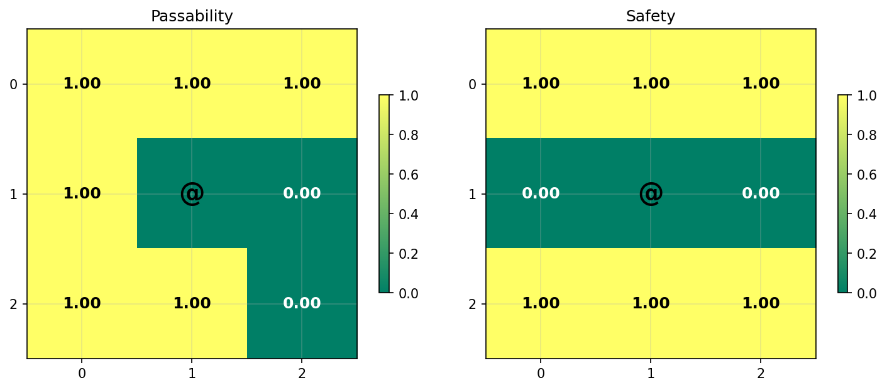 |

================================================================================

## Sample 7

### Ego Map Reconstruction

| Original | Reconstruction |
|---|---|
|  | 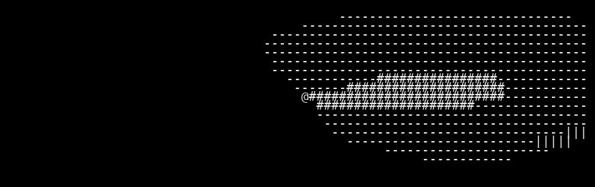 |

**Accuracy**: Character: 0.314, Color: 0.851

### Ego Class Reconstruction

| Original | Reconstruction |
|---|---|
| 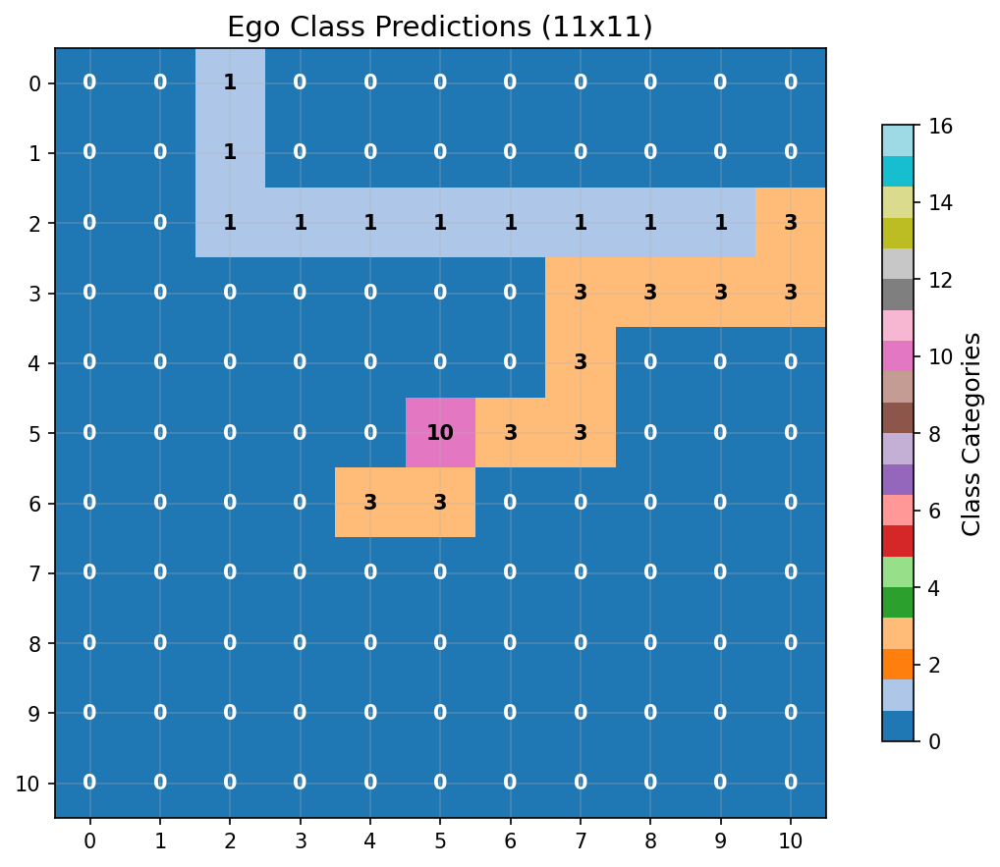 | 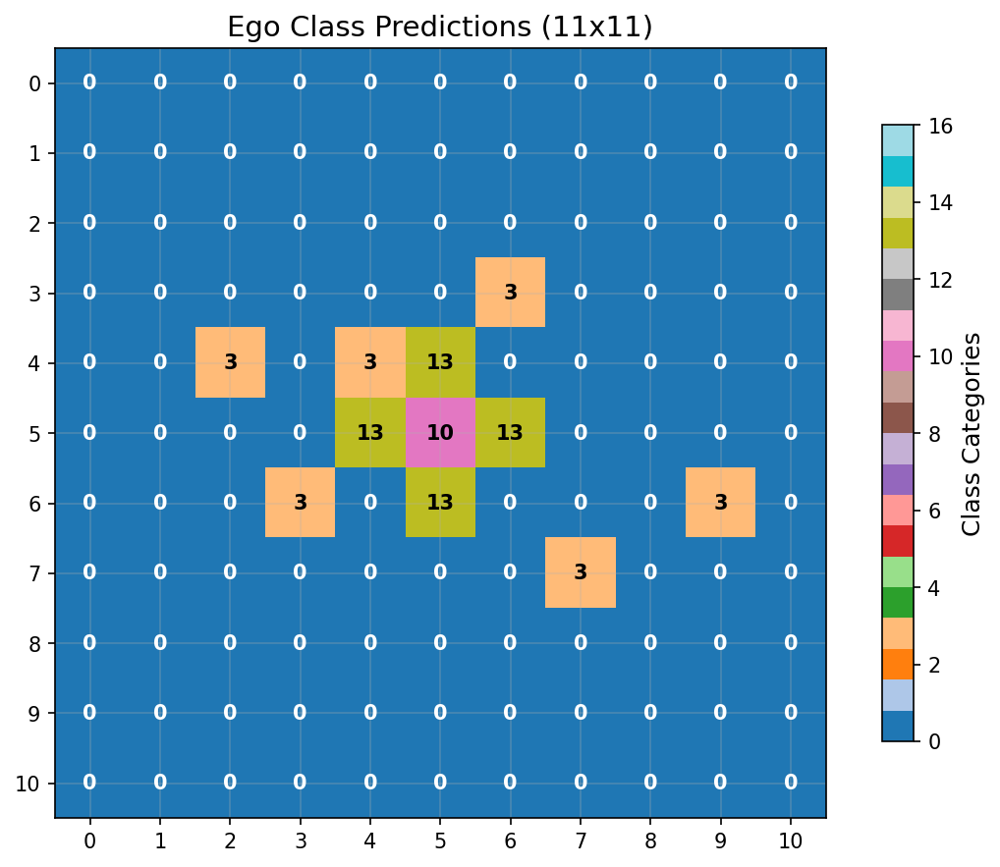 |

**Class Accuracy**: 0.826

### Bag Reconstruction

```
Bag Analysis:
========================================

Original Bag (8 items):
------------------------------
  '#' (color  7)
  ')' (color  6)
  '-' (color  7)
  '.' (color  7)
  '.' (color  8)
  '<' (color  7)
  '@' (color 15)
  '|' (color  7)

Reconstructed Bag (11 items):
------------------------------
  '#' (color  7)
  '-' (color  3)
  '-' (color  7)
  '.' (color  7)
  '.' (color  8)
  '<' (color  7)
  '>' (color  7)
  '@' (color 15)
  '`' (color  7)
  '|' (color  3)
  '|' (color  7)

Accuracy Metrics:
------------------------------
  Correctly predicted: 7 items
    '#' (color  7)
    '-' (color  7)
    '.' (color  7)
    '.' (color  8)
    '<' (color  7)
    '@' (color 15)
    '|' (color  7)
  Missed items: 1 items
    ')' (color  6)
  False positives: 4 items
    '-' (color  3)
    '>' (color  7)
    '`' (color  7)
    '|' (color  3)

Performance Summary:
------------------------------
  Precision: 0.636 (7/11)
  Recall: 0.875 (7/8)
  F1-Score: 0.737
  Total unique items: 12
```

### Passability & Safety

| Original | Reconstruction |
|---|---|
| 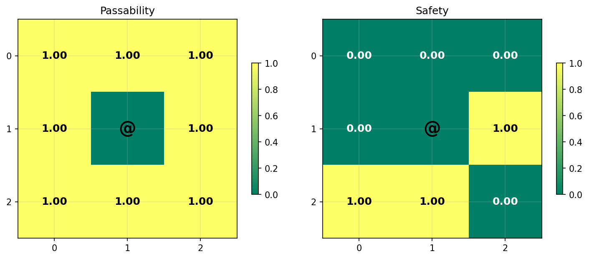 | 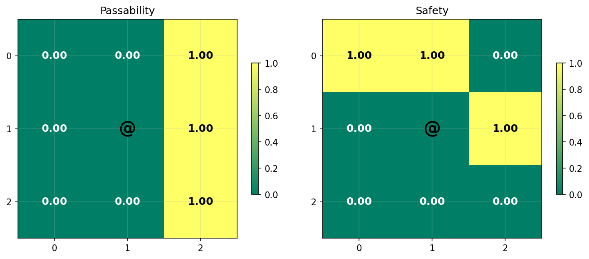 |

================================================================================

## Sample 8

### Ego Map Reconstruction

| Original | Reconstruction |
|---|---|
| 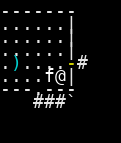 | 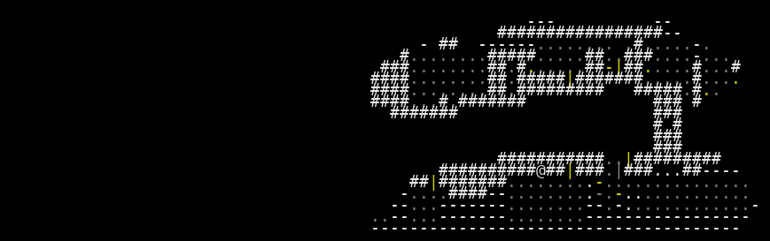 |

**Accuracy**: Character: 0.256, Color: 0.595

### Ego Class Reconstruction

| Original | Reconstruction |
|---|---|
| 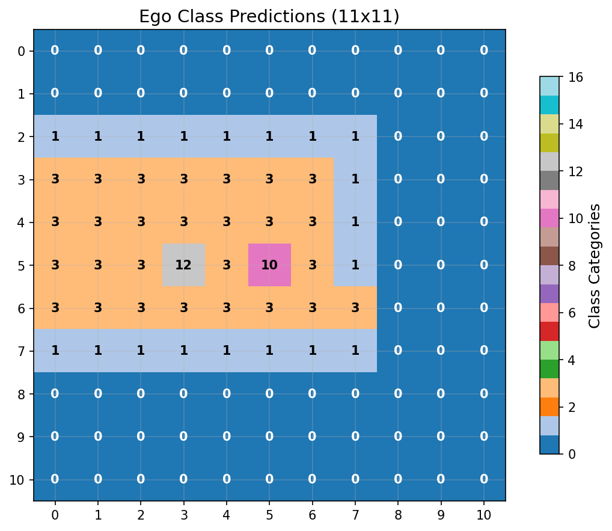 | 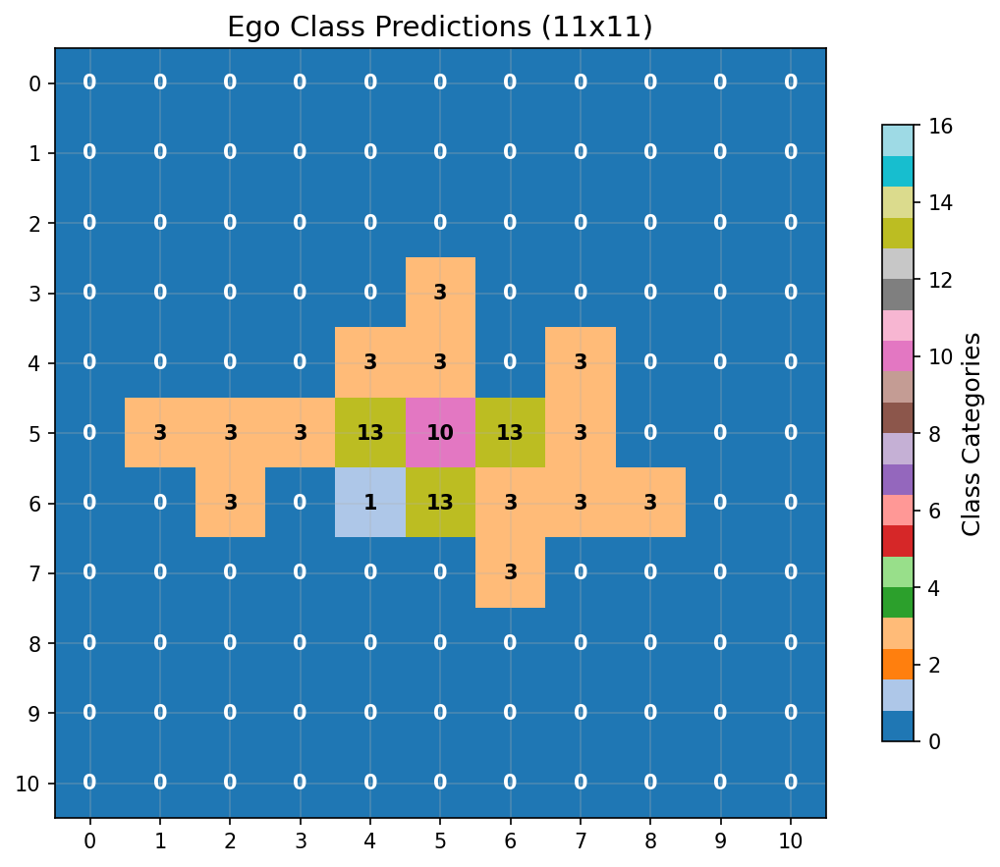 |

**Class Accuracy**: 0.603

### Bag Reconstruction

```
Bag Analysis:
========================================

Original Bag (15 items):
------------------------------
  '#' (color  7)
  ')' (color  3)
  ')' (color  6)
  '+' (color  3)
  '+' (color  5)
  '-' (color  3)
  '-' (color  7)
  '.' (color  7)
  '.' (color  8)
  '<' (color  7)
  '@' (color 15)
  '`' (color  7)
  'f' (color 15)
  '|' (color  3)
  '|' (color  7)

Reconstructed Bag (12 items):
------------------------------
  '#' (color  7)
  ')' (color  6)
  '-' (color  3)
  '-' (color  7)
  '.' (color  7)
  '.' (color  8)
  '<' (color  7)
  '>' (color  7)
  '@' (color 15)
  '`' (color  7)
  '|' (color  3)
  '|' (color  7)

Accuracy Metrics:
------------------------------
  Correctly predicted: 11 items
    '#' (color  7)
    ')' (color  6)
    '-' (color  3)
    '-' (color  7)
    '.' (color  7)
    '.' (color  8)
    '<' (color  7)
    '@' (color 15)
    '`' (color  7)
    '|' (color  3)
    '|' (color  7)
  Missed items: 4 items
    ')' (color  3)
    '+' (color  3)
    '+' (color  5)
    'f' (color 15)
  False positives: 1 items
    '>' (color  7)

Performance Summary:
------------------------------
  Precision: 0.917 (11/12)
  Recall: 0.733 (11/15)
  F1-Score: 0.815
  Total unique items: 16
```

### Passability & Safety

| Original | Reconstruction |
|---|---|
| 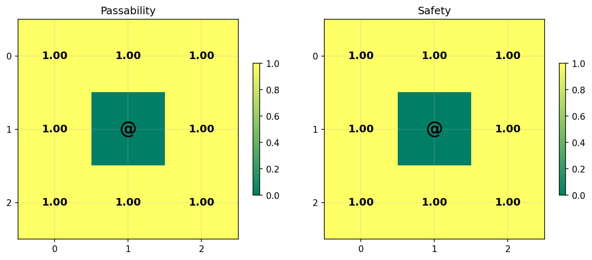 | 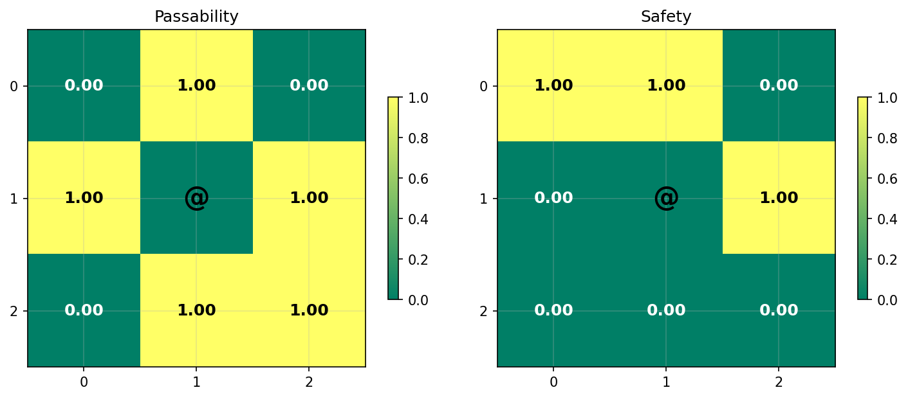 |

================================================================================

## Sample 9

### Ego Map Reconstruction

| Original | Reconstruction |
|---|---|
| 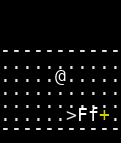 | 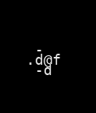 |

**Accuracy**: Character: 0.339, Color: 0.669

### Ego Class Reconstruction

| Original | Reconstruction |
|---|---|
| 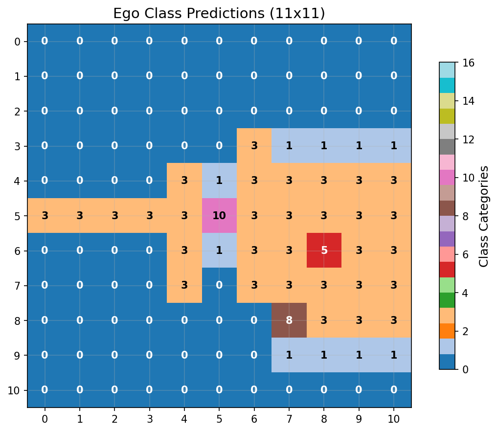 | 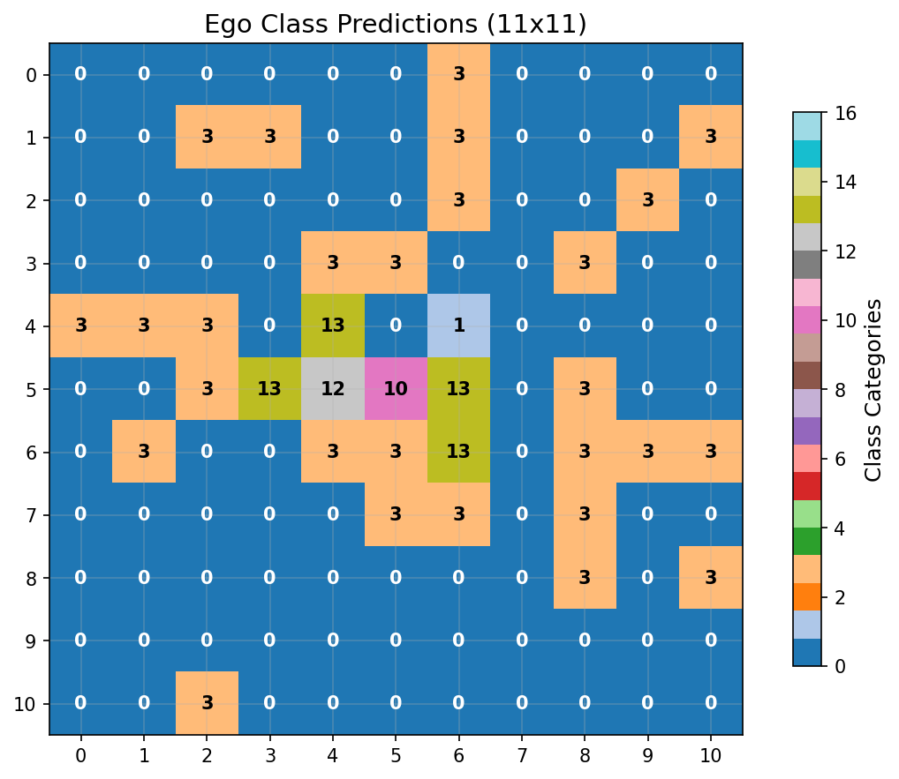 |

**Class Accuracy**: 0.653

### Bag Reconstruction

```
Bag Analysis:
========================================

Original Bag (14 items):
------------------------------
  '#' (color  7)
  '$' (color 11)
  '%' (color  3)
  '*' (color 15)
  '+' (color  3)
  '-' (color  3)
  '-' (color  7)
  '.' (color  7)
  '.' (color  8)
  '<' (color  7)
  '>' (color  7)
  '@' (color 15)
  '|' (color  3)
  '|' (color  7)

Reconstructed Bag (15 items):
------------------------------
  '#' (color  7)
  ')' (color  6)
  '-' (color  3)
  '-' (color  7)
  '.' (color  7)
  '.' (color  8)
  '<' (color  7)
  '>' (color  7)
  '@' (color 15)
  'F' (color 15)
  '[' (color  6)
  '`' (color  7)
  '{' (color 12)
  '|' (color  3)
  '|' (color  7)

Accuracy Metrics:
------------------------------
  Correctly predicted: 10 items
    '#' (color  7)
    '-' (color  3)
    '-' (color  7)
    '.' (color  7)
    '.' (color  8)
    '<' (color  7)
    '>' (color  7)
    '@' (color 15)
    '|' (color  3)
    '|' (color  7)
  Missed items: 4 items
    '$' (color 11)
    '%' (color  3)
    '*' (color 15)
    '+' (color  3)
  False positives: 5 items
    ')' (color  6)
    'F' (color 15)
    '[' (color  6)
    '`' (color  7)
    '{' (color 12)

Performance Summary:
------------------------------
  Precision: 0.667 (10/15)
  Recall: 0.714 (10/14)
  F1-Score: 0.690
  Total unique items: 19
```

### Passability & Safety

| Original | Reconstruction |
|---|---|
|  |  |

================================================================================

## Sample 10

### Ego Map Reconstruction

| Original | Reconstruction |
|---|---|
| 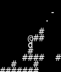 | 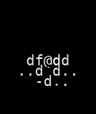 |

**Accuracy**: Character: 0.372, Color: 0.760

### Ego Class Reconstruction

| Original | Reconstruction |
|---|---|
| 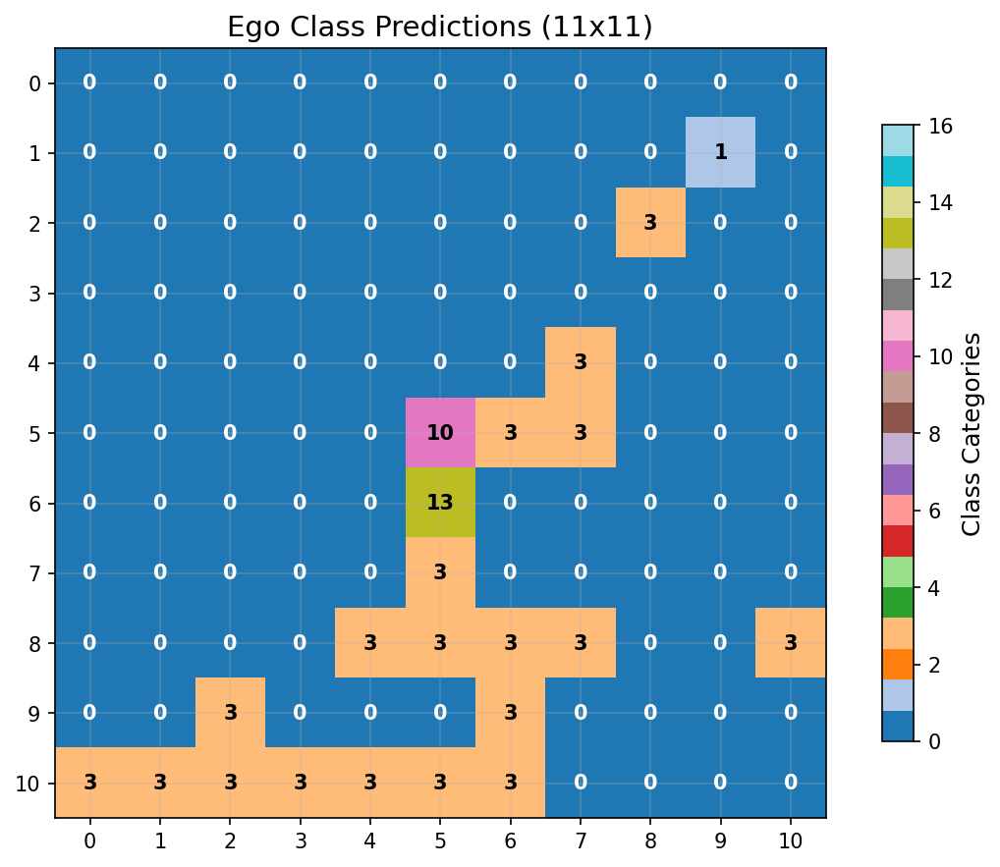 | 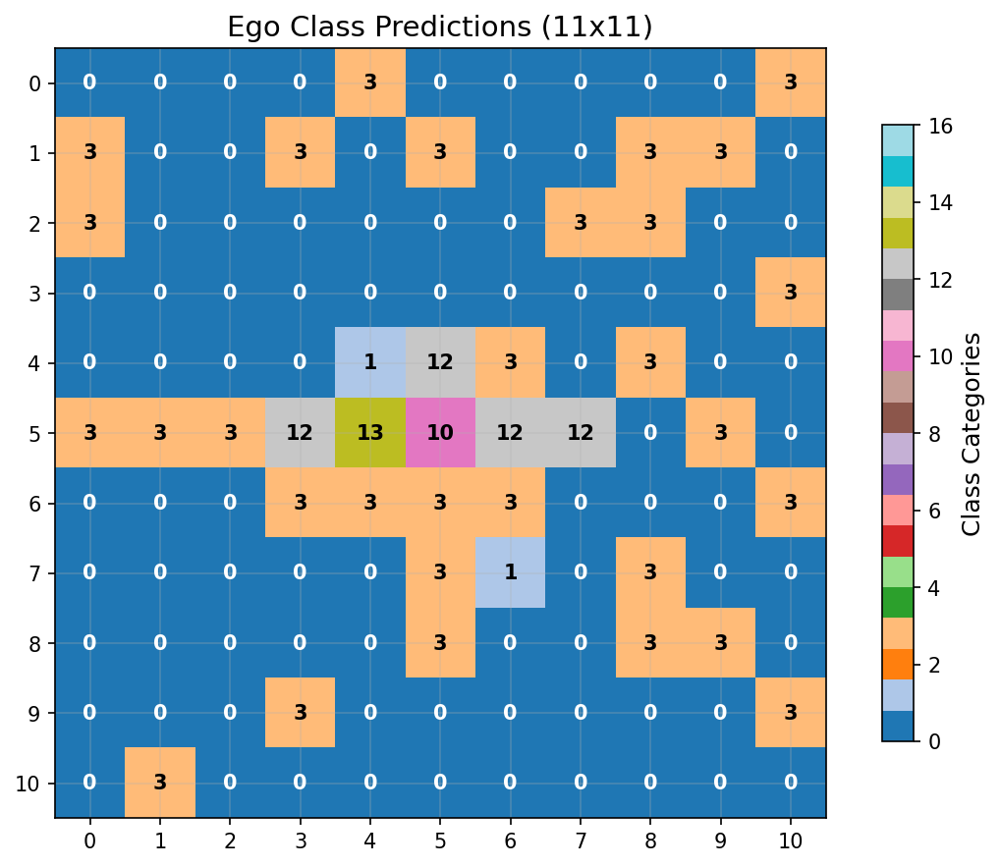 |

**Class Accuracy**: 0.711

### Bag Reconstruction

```
Bag Analysis:
========================================

Original Bag (11 items):
------------------------------
  '#' (color  7)
  '-' (color  3)
  '-' (color  7)
  '.' (color  7)
  '.' (color  8)
  '<' (color  7)
  '@' (color 15)
  'F' (color 10)
  'f' (color 15)
  '|' (color  3)
  '|' (color  7)

Reconstructed Bag (11 items):
------------------------------
  '#' (color  7)
  '-' (color  7)
  '.' (color  7)
  '.' (color  8)
  '<' (color  7)
  '>' (color  7)
  '@' (color 15)
  '`' (color  7)
  'd' (color 15)
  '|' (color  3)
  '|' (color  7)

Accuracy Metrics:
------------------------------
  Correctly predicted: 8 items
    '#' (color  7)
    '-' (color  7)
    '.' (color  7)
    '.' (color  8)
    '<' (color  7)
    '@' (color 15)
    '|' (color  3)
    '|' (color  7)
  Missed items: 3 items
    '-' (color  3)
    'F' (color 10)
    'f' (color 15)
  False positives: 3 items
    '>' (color  7)
    '`' (color  7)
    'd' (color 15)

Performance Summary:
------------------------------
  Precision: 0.727 (8/11)
  Recall: 0.727 (8/11)
  F1-Score: 0.727
  Total unique items: 14
```

### Passability & Safety

| Original | Reconstruction |
|---|---|
| 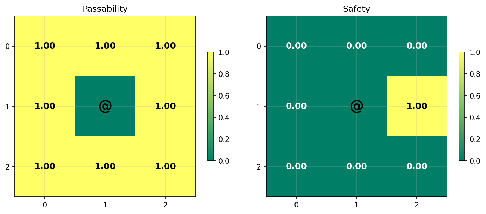 | 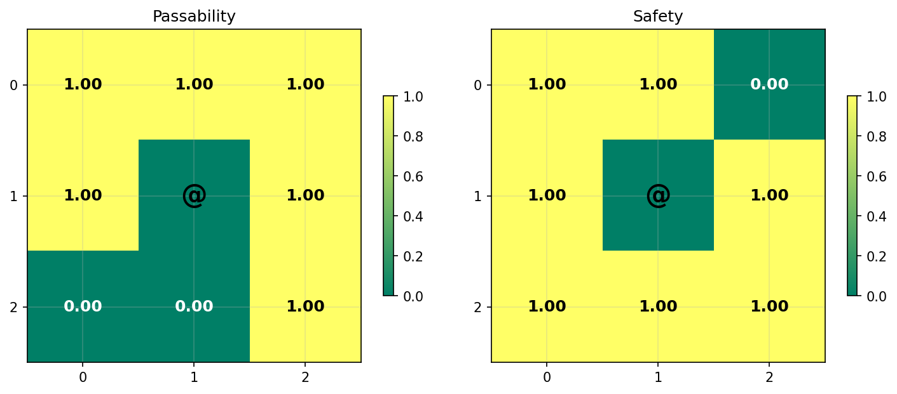 |

## Overall Statistics

- **Average Character Accuracy**: 0.302
- **Average Color Accuracy**: 0.665
- **Total Samples**: 10
