# VAE Reconstruction Comparison

_Generated: 2025-08-12T19:45:09_

## Sample 1

| Original | Reconstruction |
|---|---|
| 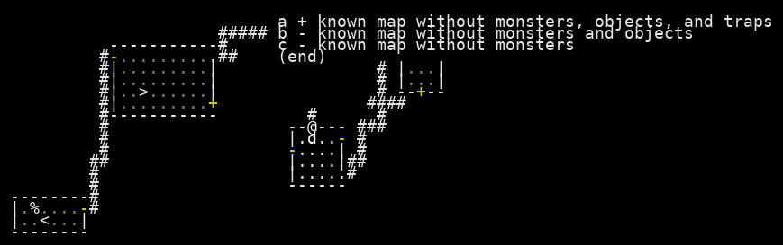 | 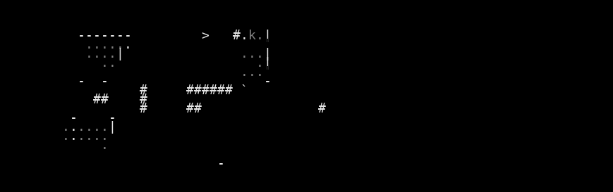 |

 Sample 1 Accuracy:   Character accuracy: 0.626 (1039/1659 cells)
   Color accuracy: 0.644 (1069/1659 cells)

================================================================================
## Sample 2

| Original | Reconstruction |
|---|---|
| 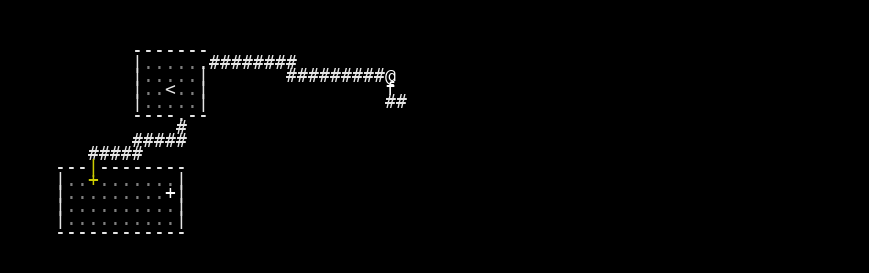 | 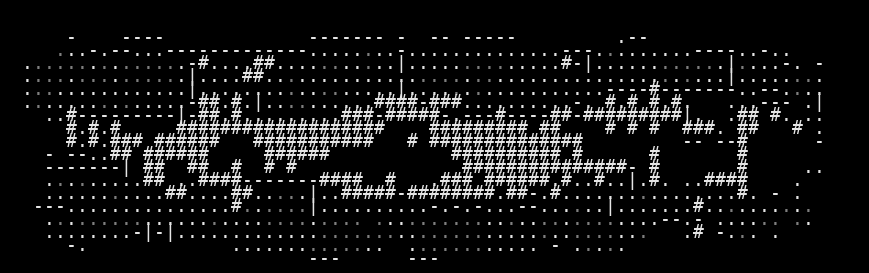 |

 Sample 2 Accuracy:   Character accuracy: 0.929 (1542/1659 cells)
   Color accuracy: 0.929 (1541/1659 cells)

================================================================================
## Sample 3

| Original | Reconstruction |
|---|---|
| 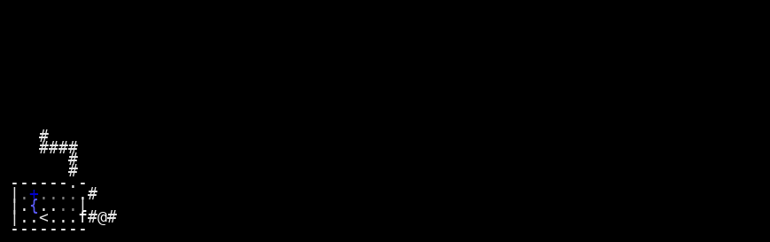 | 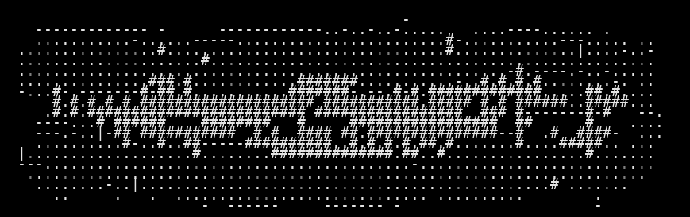 |

 Sample 3 Accuracy:   Character accuracy: 0.950 (1576/1659 cells)
   Color accuracy: 0.951 (1578/1659 cells)

================================================================================
## Sample 4

| Original | Reconstruction |
|---|---|
| 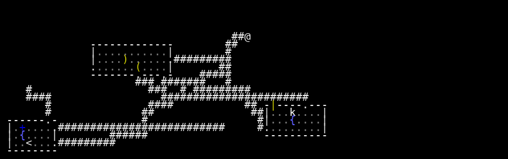 | 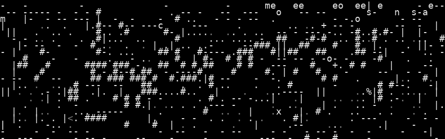 |

 Sample 4 Accuracy:   Character accuracy: 0.800 (1328/1659 cells)
   Color accuracy: 0.817 (1356/1659 cells)

================================================================================
## Sample 5

| Original | Reconstruction |
|---|---|
| 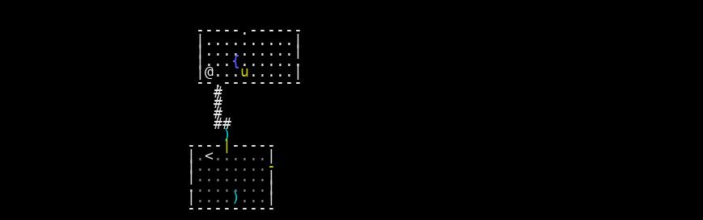 | 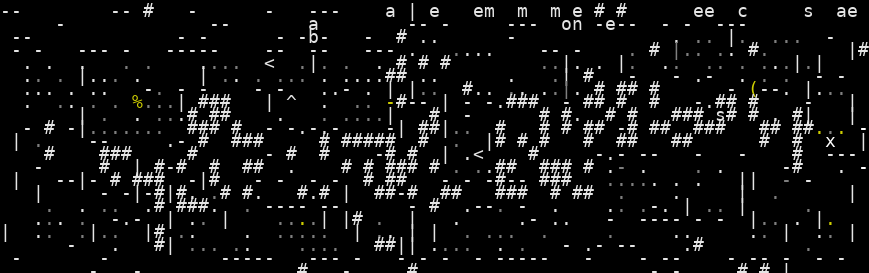 |

 Sample 5 Accuracy:   Character accuracy: 0.814 (1350/1659 cells)
   Color accuracy: 0.821 (1362/1659 cells)

================================================================================
## Sample 6

| Original | Reconstruction |
|---|---|
| 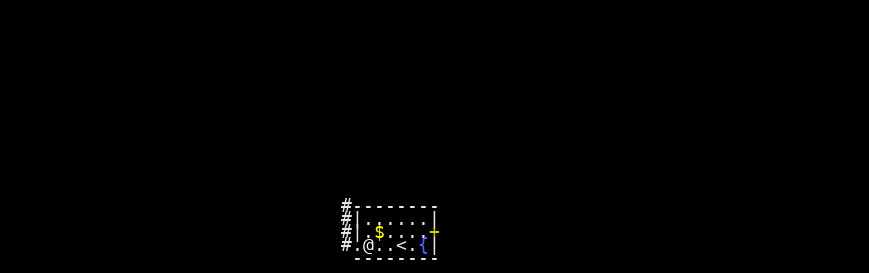 | 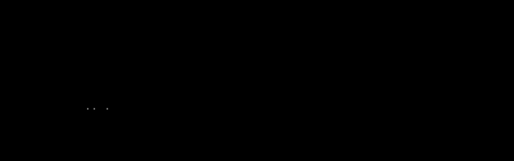 |

 Sample 6 Accuracy:   Character accuracy: 0.966 (1602/1659 cells)
   Color accuracy: 0.966 (1602/1659 cells)

================================================================================
## Sample 7

| Original | Reconstruction |
|---|---|
| 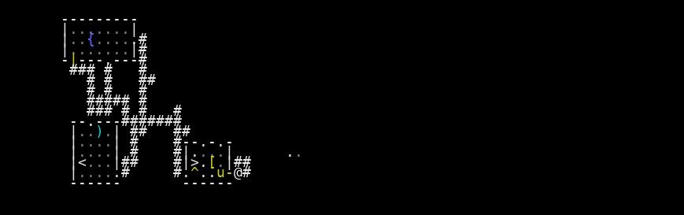 | 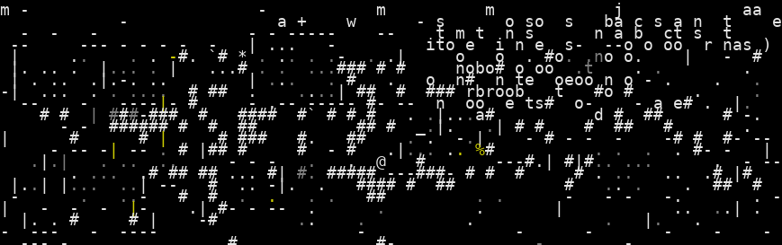 |

 Sample 7 Accuracy:   Character accuracy: 0.864 (1434/1659 cells)
   Color accuracy: 0.871 (1445/1659 cells)

================================================================================
## Sample 8

| Original | Reconstruction |
|---|---|
| 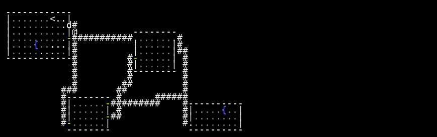 | 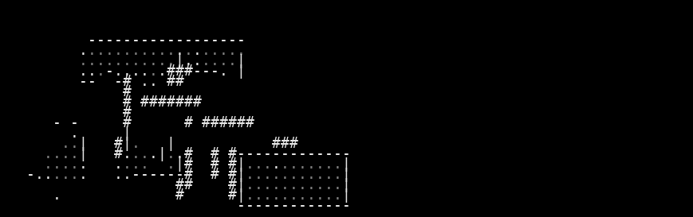 |

 Sample 8 Accuracy:   Character accuracy: 0.793 (1315/1659 cells)
   Color accuracy: 0.800 (1327/1659 cells)

================================================================================
## Sample 9

| Original | Reconstruction |
|---|---|
| 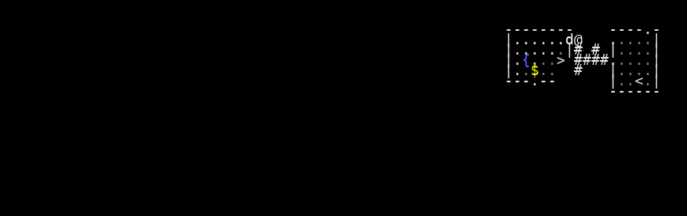 | 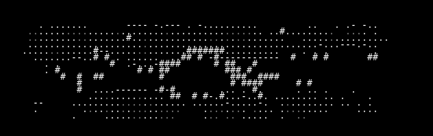 |

 Sample 9 Accuracy:   Character accuracy: 0.846 (1404/1659 cells)
   Color accuracy: 0.849 (1408/1659 cells)

================================================================================
## Sample 10

| Original | Reconstruction |
|---|---|
| 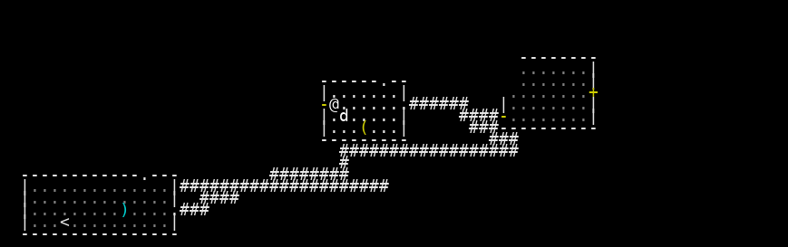 | 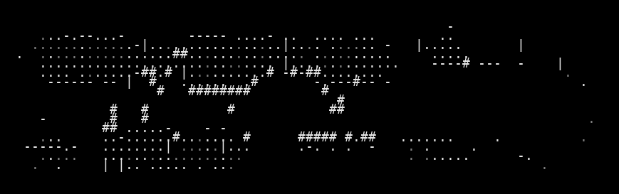 |

 Sample 10 Accuracy:   Character accuracy: 0.637 (1056/1659 cells)
   Color accuracy: 0.651 (1080/1659 cells)

📈 Overall Reconstruction Statistics:   Average Character Reconstruction Accuracy: 0.823
   Average Color Reconstruction Accuracy: 0.830
