# Enhanced VAE Reconstruction Comparison

_Generated: 2025-09-27T17:40:39_

This analysis includes the following reconstructions:
- **Ego View**: Character, color, and class predictions in ego-centric window
- **Bag Elements**: High-probability glyph elements
- **Passability/Safety**: 3x3 grids around hero position

## Sample 1

### Ego Map Reconstruction

| Original | Reconstruction |
|---|---|
| 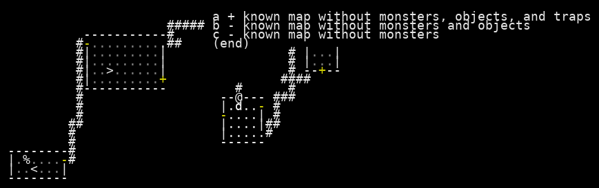 | 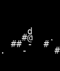 |

**Accuracy**: Character: 0.215, Color: 0.628

### Ego Class Reconstruction

| Original | Reconstruction |
|---|---|
| 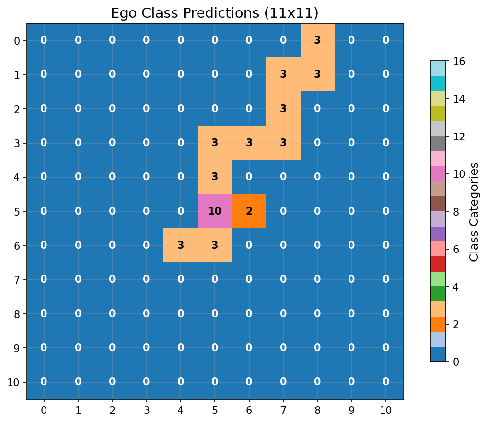 | 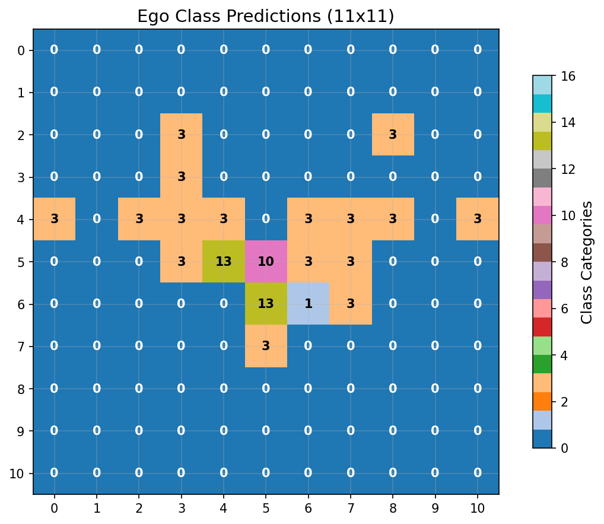 |

**Class Accuracy**: 0.653

### Bag Reconstruction

```
Bag Analysis:
========================================

Original Bag (14 items):
------------------------------
  '#' (color  7)
  '*' (color  4)
  '+' (color  3)
  '+' (color 13)
  '-' (color  3)
  '-' (color  7)
  '.' (color  7)
  '.' (color  8)
  '<' (color  7)
  '>' (color  7)
  '@' (color 15)
  '`' (color  7)
  '{' (color 12)
  '|' (color  7)

Reconstructed Bag (12 items):
------------------------------
  '#' (color  7)
  '%' (color  3)
  ')' (color  6)
  '-' (color  3)
  '-' (color  7)
  '.' (color  7)
  '.' (color  8)
  '<' (color  7)
  '@' (color 15)
  'u' (color  3)
  '|' (color  3)
  '|' (color  7)

Accuracy Metrics:
------------------------------
  Correctly predicted: 8 items
    '#' (color  7)
    '-' (color  3)
    '-' (color  7)
    '.' (color  7)
    '.' (color  8)
    '<' (color  7)
    '@' (color 15)
    '|' (color  7)
  Missed items: 6 items
    '*' (color  4)
    '+' (color  3)
    '+' (color 13)
    '>' (color  7)
    '`' (color  7)
    '{' (color 12)
  False positives: 4 items
    '%' (color  3)
    ')' (color  6)
    'u' (color  3)
    '|' (color  3)

Performance Summary:
------------------------------
  Precision: 0.667 (8/12)
  Recall: 0.571 (8/14)
  F1-Score: 0.615
  Total unique items: 18
```

### Passability & Safety

| Original | Reconstruction |
|---|---|
| 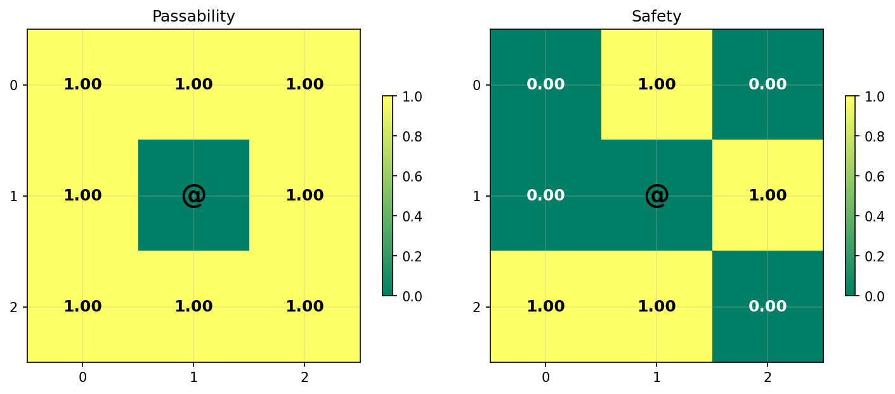 | 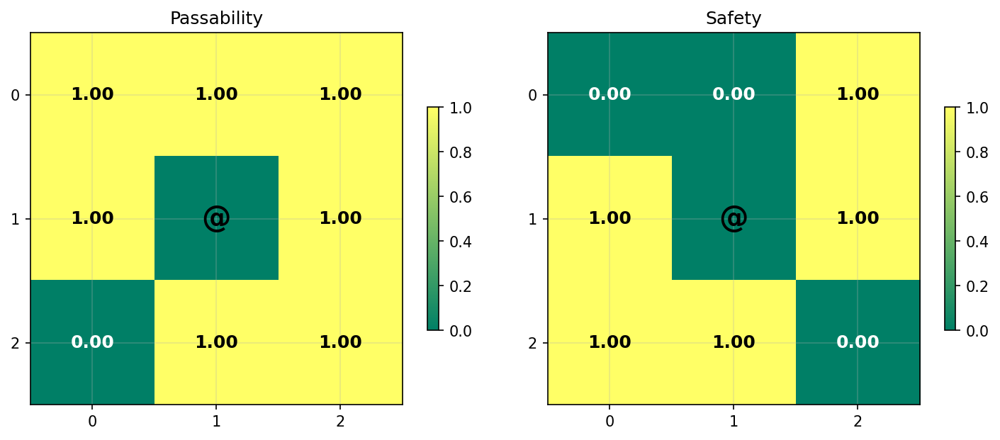 |

================================================================================

## Sample 2

### Ego Map Reconstruction

| Original | Reconstruction |
|---|---|
| 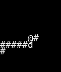 | 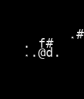 |

**Accuracy**: Character: 0.430, Color: 0.636

### Ego Class Reconstruction

| Original | Reconstruction |
|---|---|
| 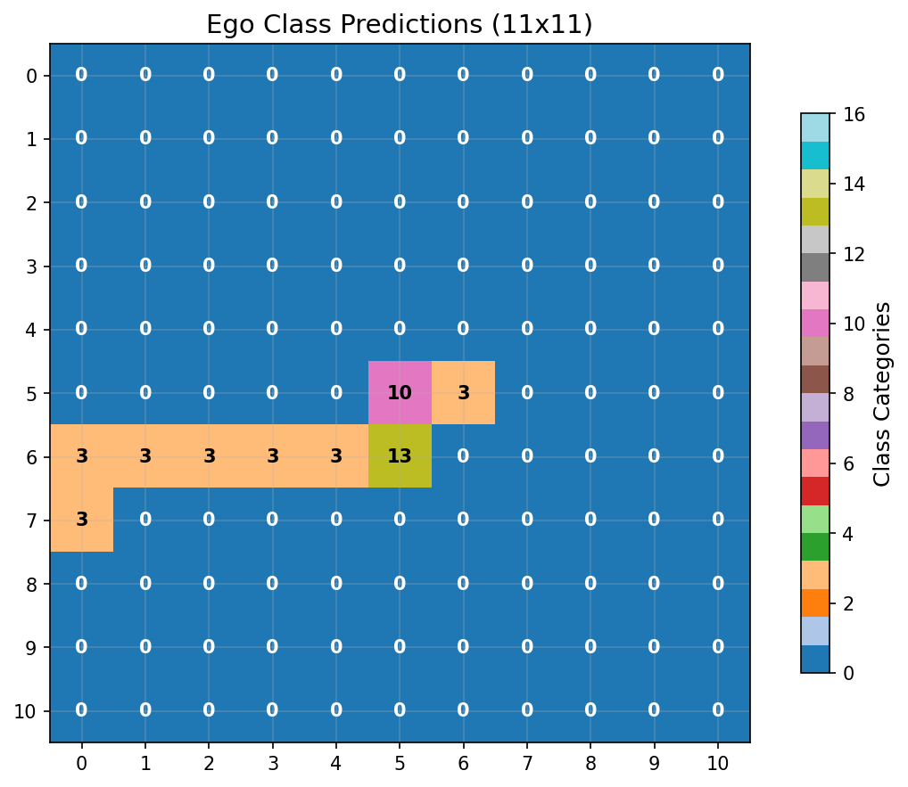 | 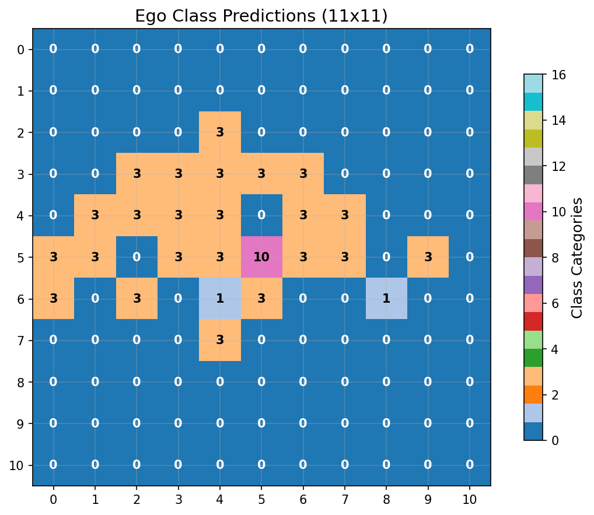 |

**Class Accuracy**: 0.711

### Bag Reconstruction

```
Bag Analysis:
========================================

Original Bag (11 items):
------------------------------
  '#' (color  7)
  '*' (color  3)
  '-' (color  3)
  '-' (color  7)
  '.' (color  7)
  '.' (color  8)
  '<' (color  7)
  '>' (color  7)
  '@' (color 15)
  '|' (color  3)
  '|' (color  7)

Reconstructed Bag (12 items):
------------------------------
  '#' (color  7)
  ')' (color  6)
  '-' (color  3)
  '-' (color  7)
  '.' (color  7)
  '.' (color  8)
  '<' (color  7)
  '>' (color  7)
  '@' (color 15)
  '[' (color  3)
  '`' (color  7)
  '|' (color  7)

Accuracy Metrics:
------------------------------
  Correctly predicted: 9 items
    '#' (color  7)
    '-' (color  3)
    '-' (color  7)
    '.' (color  7)
    '.' (color  8)
    '<' (color  7)
    '>' (color  7)
    '@' (color 15)
    '|' (color  7)
  Missed items: 2 items
    '*' (color  3)
    '|' (color  3)
  False positives: 3 items
    ')' (color  6)
    '[' (color  3)
    '`' (color  7)

Performance Summary:
------------------------------
  Precision: 0.750 (9/12)
  Recall: 0.818 (9/11)
  F1-Score: 0.783
  Total unique items: 14
```

### Passability & Safety

| Original | Reconstruction |
|---|---|
| 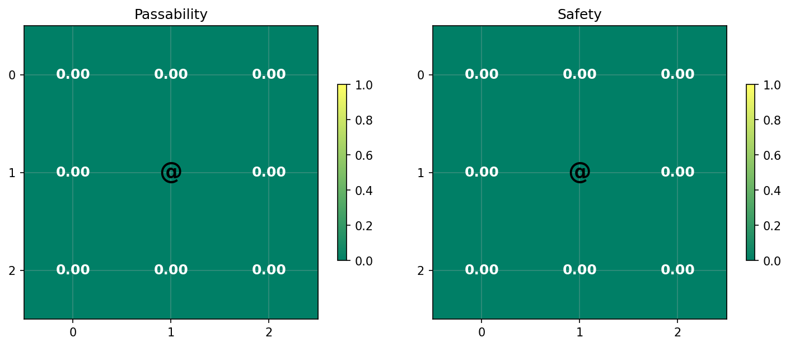 | 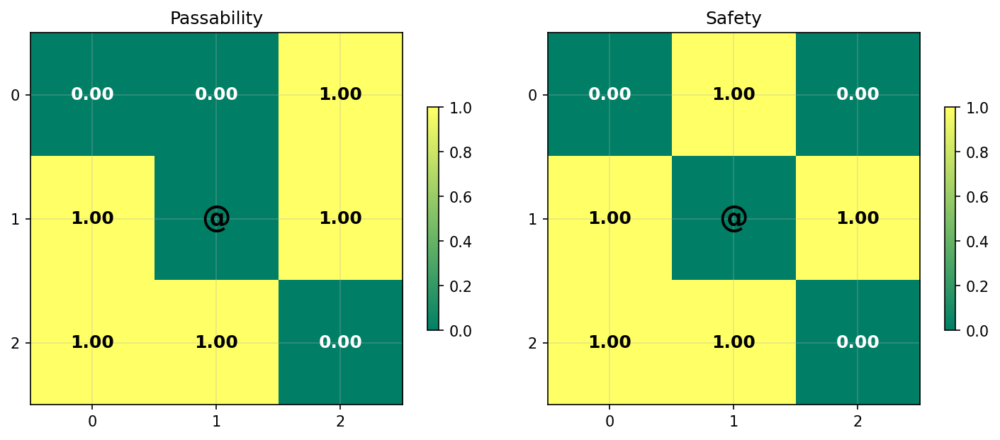 |

================================================================================

## Sample 3

### Ego Map Reconstruction

| Original | Reconstruction |
|---|---|
| 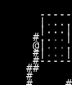 | 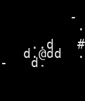 |

**Accuracy**: Character: 0.132, Color: 0.479

### Ego Class Reconstruction

| Original | Reconstruction |
|---|---|
| 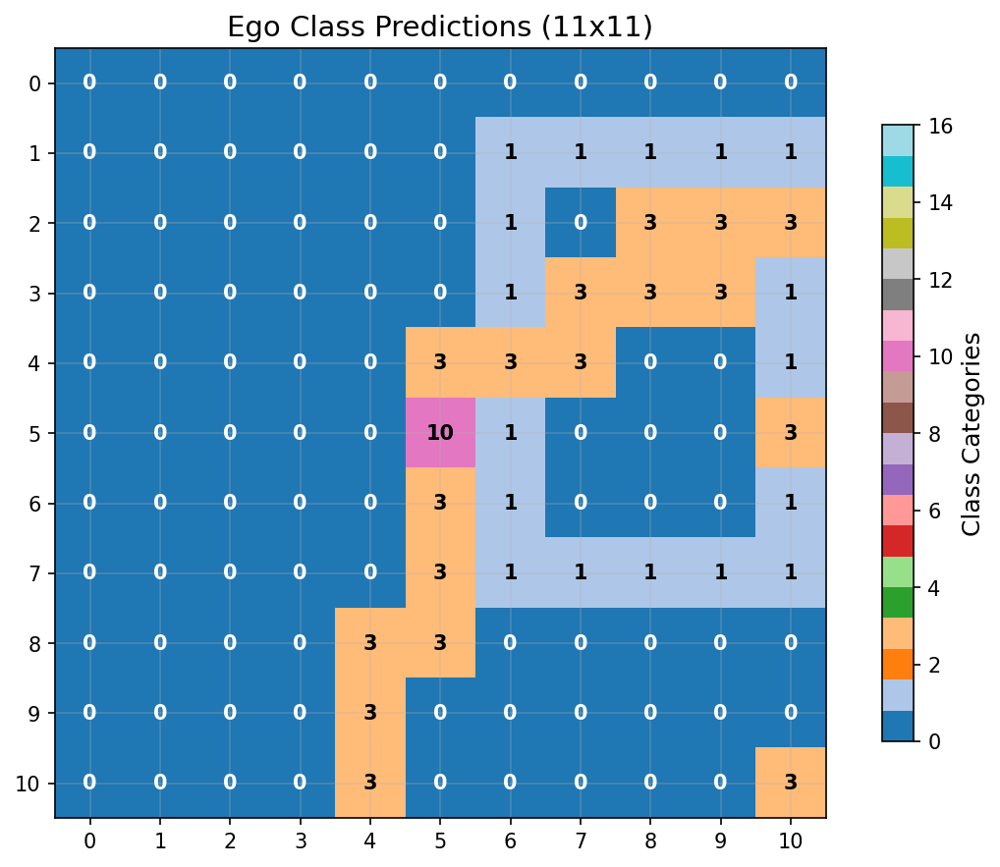 | 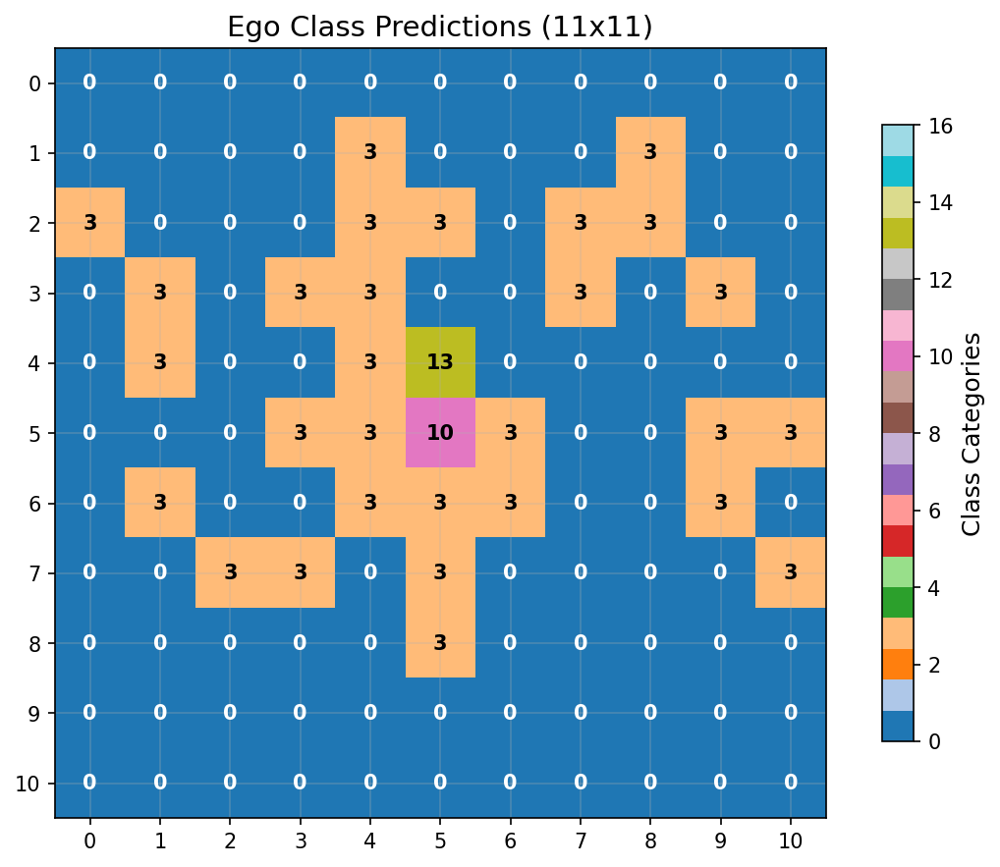 |

**Class Accuracy**: 0.554

### Bag Reconstruction

```
Bag Analysis:
========================================

Original Bag (14 items):
------------------------------
  '#' (color  7)
  '+' (color  3)
  '-' (color  3)
  '-' (color  7)
  '.' (color  7)
  '.' (color  8)
  '<' (color  7)
  '>' (color  7)
  '@' (color 15)
  '^' (color  5)
  '`' (color  7)
  'd' (color 15)
  '|' (color  3)
  '|' (color  7)

Reconstructed Bag (14 items):
------------------------------
  '#' (color  7)
  ')' (color  6)
  '*' (color  7)
  '-' (color  3)
  '-' (color  7)
  '.' (color  7)
  '.' (color  8)
  '<' (color  7)
  '>' (color  7)
  '@' (color 15)
  '`' (color  7)
  'd' (color 15)
  '|' (color  3)
  '|' (color  7)

Accuracy Metrics:
------------------------------
  Correctly predicted: 12 items
    '#' (color  7)
    '-' (color  3)
    '-' (color  7)
    '.' (color  7)
    '.' (color  8)
    '<' (color  7)
    '>' (color  7)
    '@' (color 15)
    '`' (color  7)
    'd' (color 15)
    '|' (color  3)
    '|' (color  7)
  Missed items: 2 items
    '+' (color  3)
    '^' (color  5)
  False positives: 2 items
    ')' (color  6)
    '*' (color  7)

Performance Summary:
------------------------------
  Precision: 0.857 (12/14)
  Recall: 0.857 (12/14)
  F1-Score: 0.857
  Total unique items: 16
```

### Passability & Safety

| Original | Reconstruction |
|---|---|
| 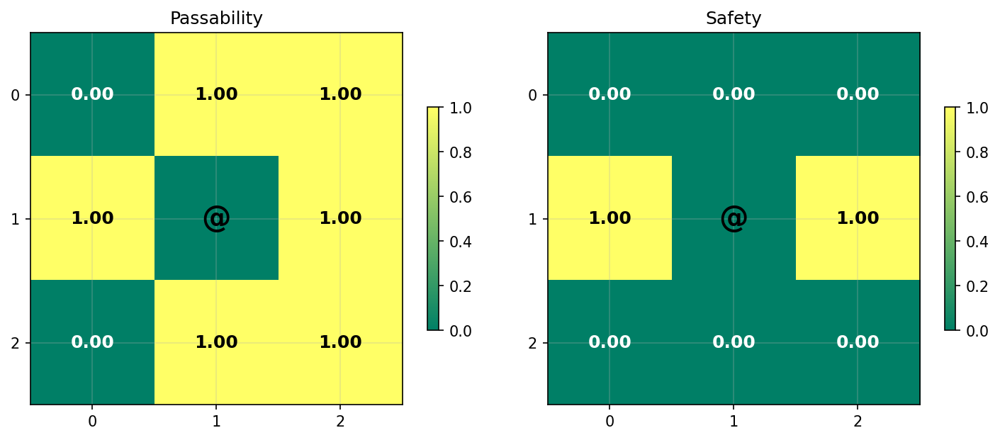 | 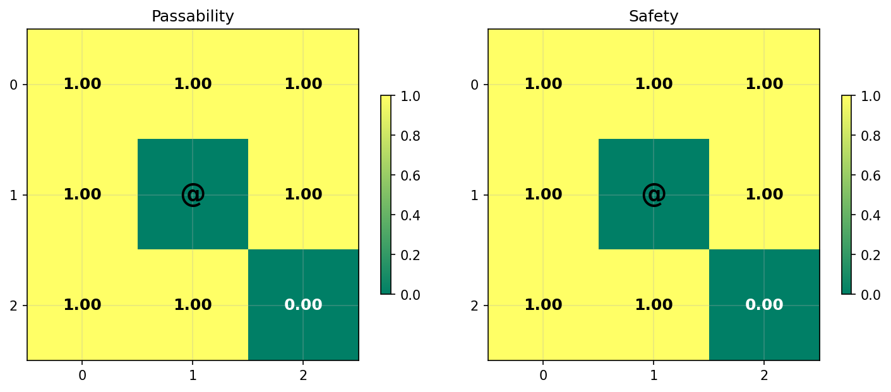 |

================================================================================

## Sample 4

### Ego Map Reconstruction

| Original | Reconstruction |
|---|---|
| 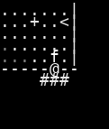 |  |

**Accuracy**: Character: 0.256, Color: 0.950

### Ego Class Reconstruction

| Original | Reconstruction |
|---|---|
| 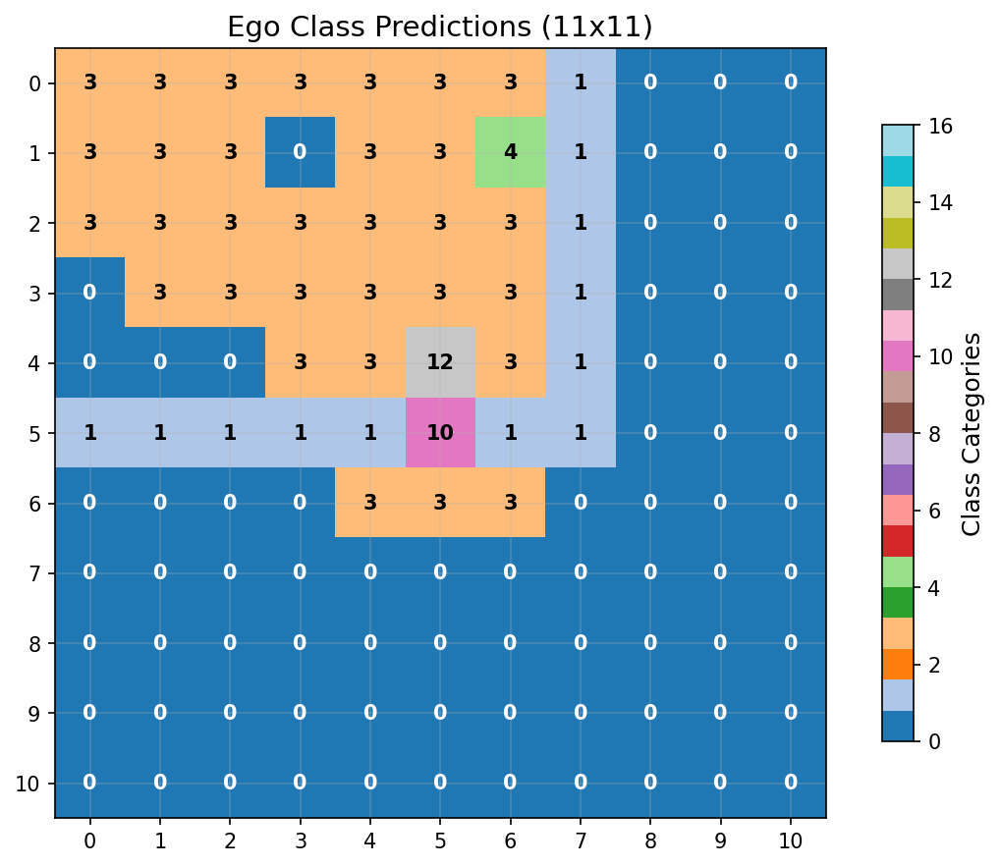 | 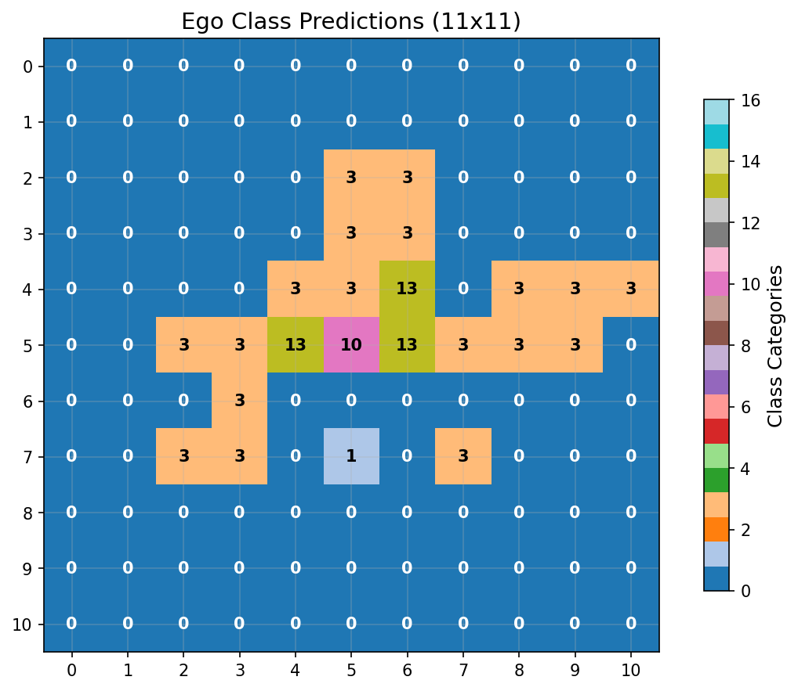 |

**Class Accuracy**: 0.835

### Bag Reconstruction

```
Bag Analysis:
========================================

Original Bag (11 items):
------------------------------
  '#' (color  7)
  ')' (color  6)
  '+' (color  3)
  '-' (color  3)
  '-' (color  7)
  '.' (color  7)
  '.' (color  8)
  '<' (color  7)
  '@' (color 15)
  '|' (color  3)
  '|' (color  7)

Reconstructed Bag (12 items):
------------------------------
  '#' (color  7)
  '-' (color  3)
  '-' (color  7)
  '.' (color  7)
  '.' (color  8)
  '<' (color  7)
  '>' (color  7)
  '@' (color 15)
  '^' (color  3)
  '{' (color 12)
  '|' (color  3)
  '|' (color  7)

Accuracy Metrics:
------------------------------
  Correctly predicted: 9 items
    '#' (color  7)
    '-' (color  3)
    '-' (color  7)
    '.' (color  7)
    '.' (color  8)
    '<' (color  7)
    '@' (color 15)
    '|' (color  3)
    '|' (color  7)
  Missed items: 2 items
    ')' (color  6)
    '+' (color  3)
  False positives: 3 items
    '>' (color  7)
    '^' (color  3)
    '{' (color 12)

Performance Summary:
------------------------------
  Precision: 0.750 (9/12)
  Recall: 0.818 (9/11)
  F1-Score: 0.783
  Total unique items: 14
```

### Passability & Safety

| Original | Reconstruction |
|---|---|
|  | 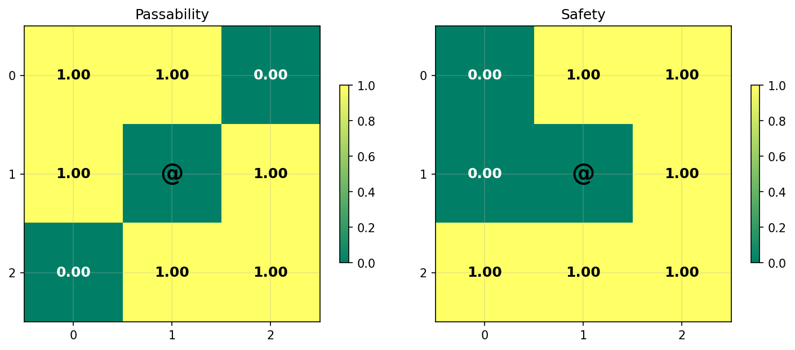 |

================================================================================

## Sample 5

### Ego Map Reconstruction

| Original | Reconstruction |
|---|---|
| 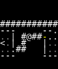 | 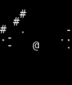 |

**Accuracy**: Character: 0.231, Color: 0.512

### Ego Class Reconstruction

| Original | Reconstruction |
|---|---|
| 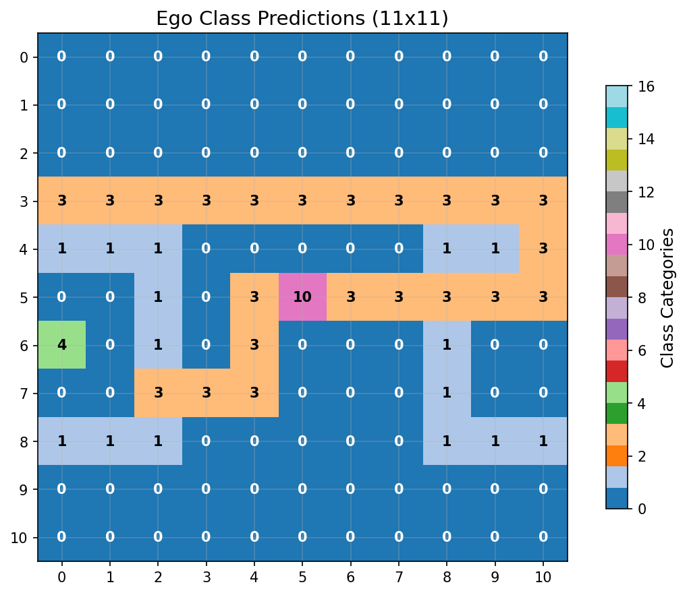 | 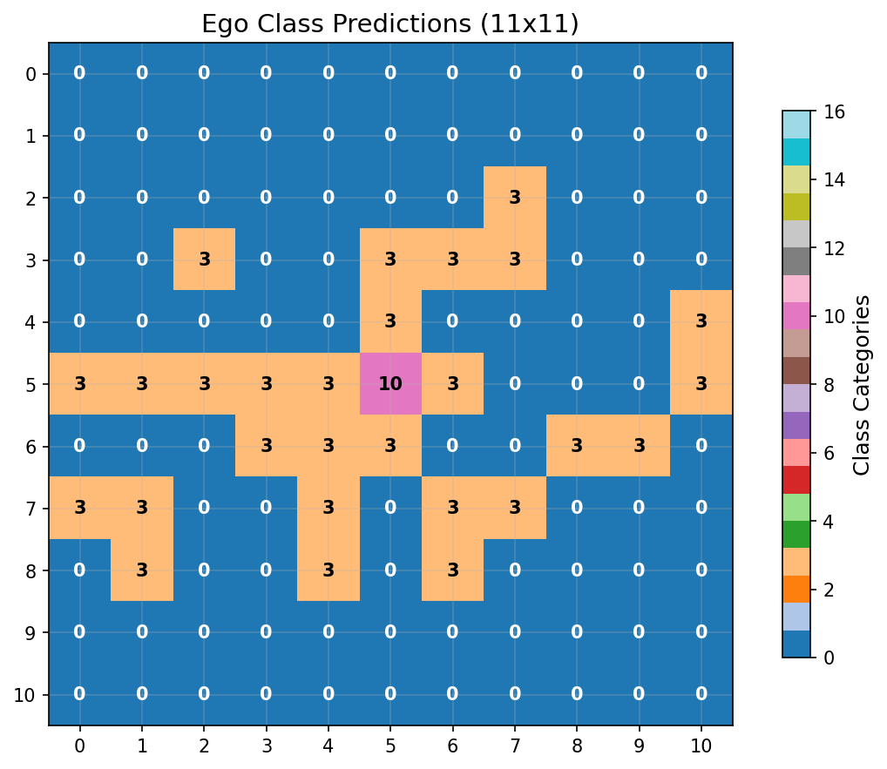 |

**Class Accuracy**: 0.537

### Bag Reconstruction

```
Bag Analysis:
========================================

Original Bag (13 items):
------------------------------
  '#' (color  7)
  ')' (color  3)
  '*' (color  7)
  '+' (color  3)
  '-' (color  3)
  '-' (color  7)
  '.' (color  7)
  '.' (color  8)
  '<' (color  7)
  '@' (color 15)
  '`' (color  7)
  '|' (color  3)
  '|' (color  7)

Reconstructed Bag (15 items):
------------------------------
  '#' (color  6)
  '#' (color  7)
  '%' (color  3)
  ')' (color  6)
  '-' (color  3)
  '-' (color  7)
  '.' (color  7)
  '.' (color  8)
  ':' (color 15)
  '<' (color  7)
  '>' (color  7)
  '@' (color 15)
  '`' (color  7)
  '|' (color  3)
  '|' (color  7)

Accuracy Metrics:
------------------------------
  Correctly predicted: 10 items
    '#' (color  7)
    '-' (color  3)
    '-' (color  7)
    '.' (color  7)
    '.' (color  8)
    '<' (color  7)
    '@' (color 15)
    '`' (color  7)
    '|' (color  3)
    '|' (color  7)
  Missed items: 3 items
    ')' (color  3)
    '*' (color  7)
    '+' (color  3)
  False positives: 5 items
    '#' (color  6)
    '%' (color  3)
    ')' (color  6)
    ':' (color 15)
    '>' (color  7)

Performance Summary:
------------------------------
  Precision: 0.667 (10/15)
  Recall: 0.769 (10/13)
  F1-Score: 0.714
  Total unique items: 18
```

### Passability & Safety

| Original | Reconstruction |
|---|---|
| 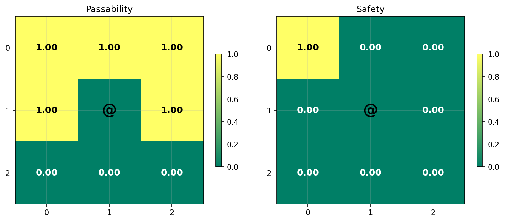 | 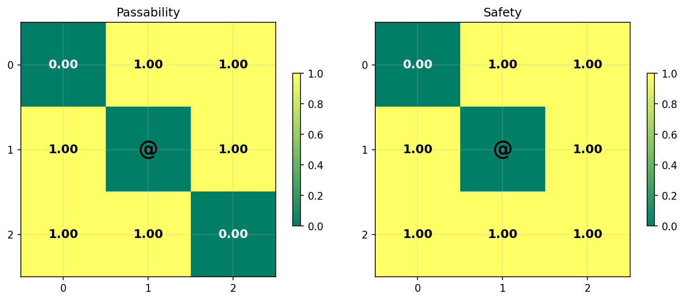 |

================================================================================

## Sample 6

### Ego Map Reconstruction

| Original | Reconstruction |
|---|---|
| 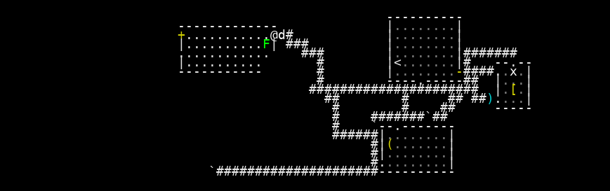 | 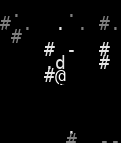 |

**Accuracy**: Character: 0.099, Color: 0.636

### Ego Class Reconstruction

| Original | Reconstruction |
|---|---|
| 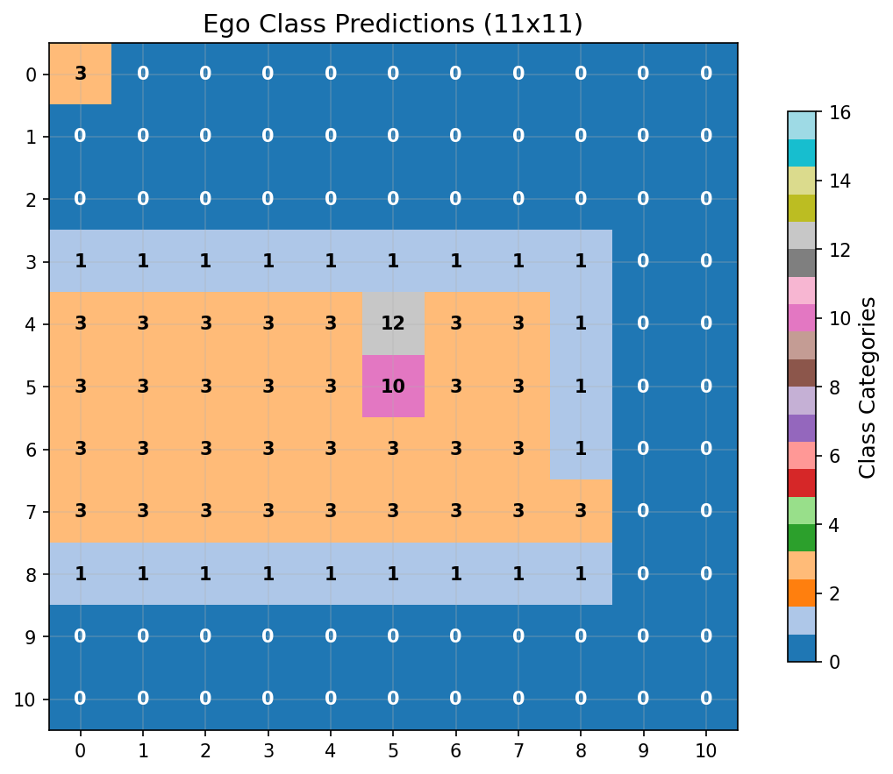 | 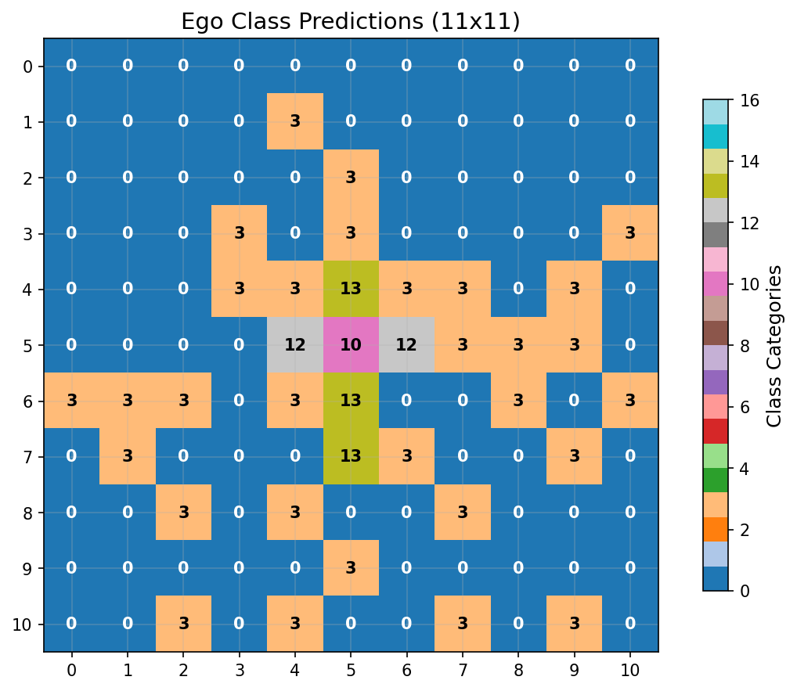 |

**Class Accuracy**: 0.570

### Bag Reconstruction

```
Bag Analysis:
========================================

Original Bag (12 items):
------------------------------
  '#' (color  7)
  '+' (color  3)
  '+' (color  5)
  '-' (color  3)
  '-' (color  7)
  '.' (color  7)
  '.' (color  8)
  '<' (color  7)
  '@' (color 15)
  '`' (color  7)
  'd' (color 15)
  '|' (color  7)

Reconstructed Bag (17 items):
------------------------------
  '#' (color  7)
  '%' (color  3)
  '(' (color  3)
  ')' (color  6)
  '+' (color  5)
  '+' (color 15)
  '-' (color  3)
  '-' (color  7)
  '.' (color  7)
  '.' (color  8)
  ':' (color 15)
  '<' (color  7)
  '@' (color 15)
  '[' (color  8)
  'd' (color 15)
  '|' (color  3)
  '|' (color  7)

Accuracy Metrics:
------------------------------
  Correctly predicted: 10 items
    '#' (color  7)
    '+' (color  5)
    '-' (color  3)
    '-' (color  7)
    '.' (color  7)
    '.' (color  8)
    '<' (color  7)
    '@' (color 15)
    'd' (color 15)
    '|' (color  7)
  Missed items: 2 items
    '+' (color  3)
    '`' (color  7)
  False positives: 7 items
    '%' (color  3)
    '(' (color  3)
    ')' (color  6)
    '+' (color 15)
    ':' (color 15)
    '[' (color  8)
    '|' (color  3)

Performance Summary:
------------------------------
  Precision: 0.588 (10/17)
  Recall: 0.833 (10/12)
  F1-Score: 0.690
  Total unique items: 19
```

### Passability & Safety

| Original | Reconstruction |
|---|---|
|  | 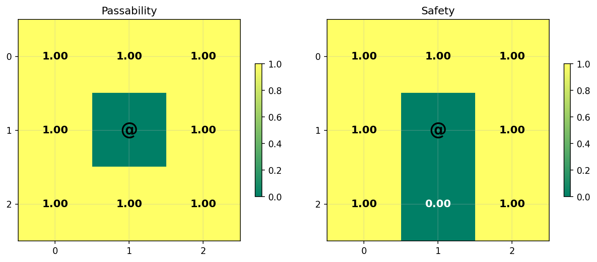 |

================================================================================

## Sample 7

### Ego Map Reconstruction

| Original | Reconstruction |
|---|---|
|  | 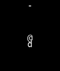 |

**Accuracy**: Character: 0.165, Color: 0.570

### Ego Class Reconstruction

| Original | Reconstruction |
|---|---|
| 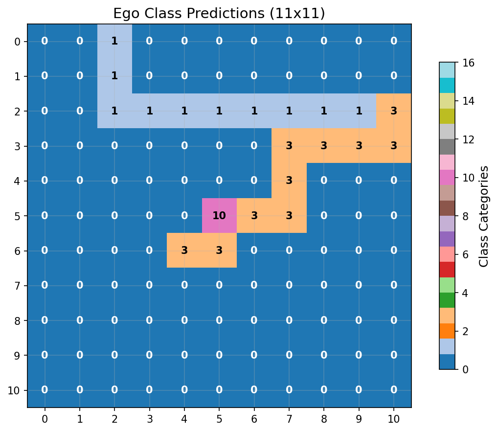 | 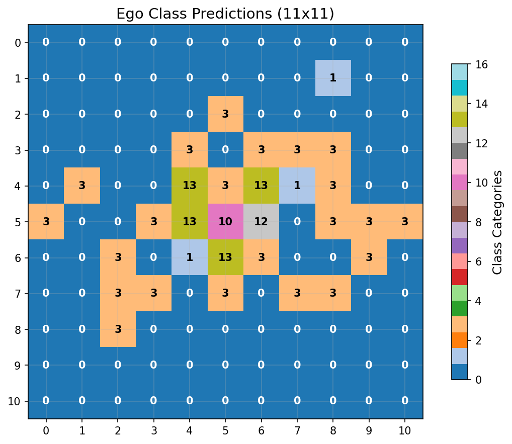 |

**Class Accuracy**: 0.603

### Bag Reconstruction

```
Bag Analysis:
========================================

Original Bag (12 items):
------------------------------
  '#' (color  7)
  '(' (color  3)
  '*' (color  1)
  '-' (color  3)
  '-' (color  7)
  '.' (color  7)
  '.' (color  8)
  '<' (color  7)
  '@' (color 15)
  'd' (color 15)
  '|' (color  3)
  '|' (color  7)

Reconstructed Bag (10 items):
------------------------------
  '#' (color  7)
  '+' (color 15)
  '-' (color  3)
  '-' (color  7)
  '.' (color  7)
  '.' (color  8)
  '<' (color  7)
  '@' (color 15)
  '{' (color 12)
  '|' (color  7)

Accuracy Metrics:
------------------------------
  Correctly predicted: 8 items
    '#' (color  7)
    '-' (color  3)
    '-' (color  7)
    '.' (color  7)
    '.' (color  8)
    '<' (color  7)
    '@' (color 15)
    '|' (color  7)
  Missed items: 4 items
    '(' (color  3)
    '*' (color  1)
    'd' (color 15)
    '|' (color  3)
  False positives: 2 items
    '+' (color 15)
    '{' (color 12)

Performance Summary:
------------------------------
  Precision: 0.800 (8/10)
  Recall: 0.667 (8/12)
  F1-Score: 0.727
  Total unique items: 14
```

### Passability & Safety

| Original | Reconstruction |
|---|---|
| 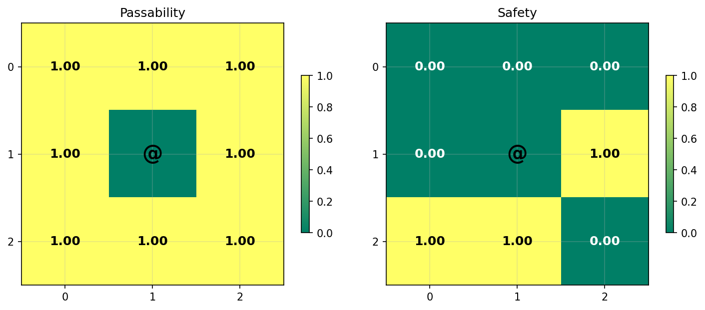 | 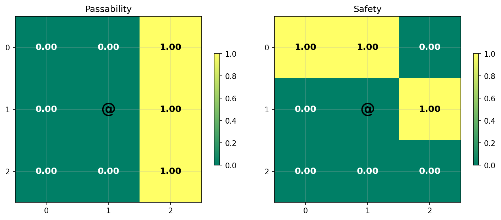 |

================================================================================

## Sample 8

### Ego Map Reconstruction

| Original | Reconstruction |
|---|---|
| 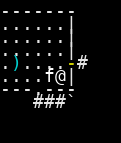 | 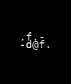 |

**Accuracy**: Character: 0.545, Color: 0.512

### Ego Class Reconstruction

| Original | Reconstruction |
|---|---|
| 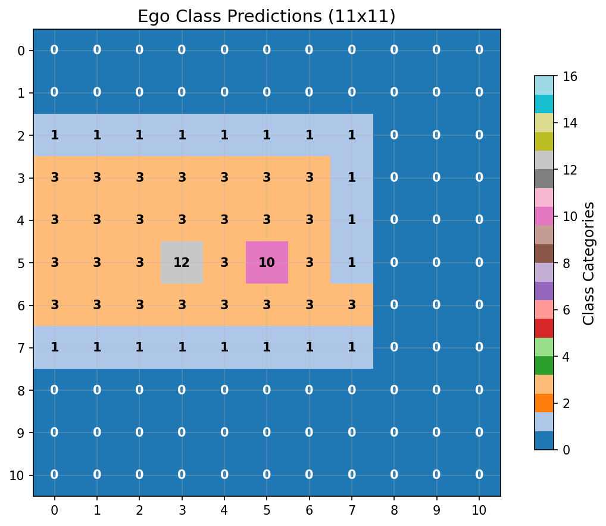 | 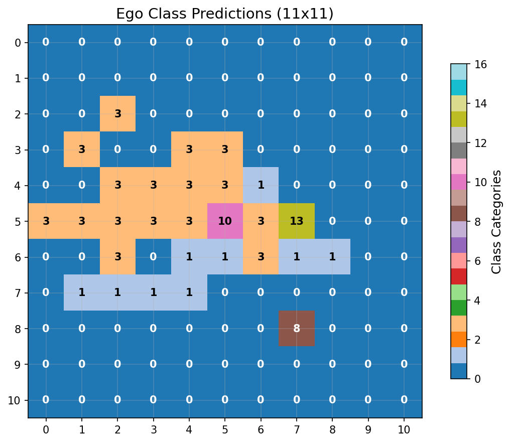 |

**Class Accuracy**: 0.562

### Bag Reconstruction

```
Bag Analysis:
========================================

Original Bag (14 items):
------------------------------
  '#' (color  7)
  '(' (color  3)
  ')' (color  6)
  '+' (color  3)
  '-' (color  3)
  '-' (color  7)
  '.' (color  7)
  '.' (color  8)
  '<' (color  7)
  '>' (color  7)
  '@' (color 15)
  '`' (color  7)
  'f' (color 15)
  '|' (color  7)

Reconstructed Bag (16 items):
------------------------------
  '#' (color  7)
  '%' (color 10)
  '(' (color  3)
  '-' (color  3)
  '-' (color  7)
  '.' (color  7)
  '.' (color  8)
  ':' (color 15)
  '<' (color  7)
  '>' (color  7)
  '@' (color 15)
  '`' (color  7)
  'd' (color 15)
  '|' (color  3)
  '|' (color  7)
  '|' (color 15)

Accuracy Metrics:
------------------------------
  Correctly predicted: 11 items
    '#' (color  7)
    '(' (color  3)
    '-' (color  3)
    '-' (color  7)
    '.' (color  7)
    '.' (color  8)
    '<' (color  7)
    '>' (color  7)
    '@' (color 15)
    '`' (color  7)
    '|' (color  7)
  Missed items: 3 items
    ')' (color  6)
    '+' (color  3)
    'f' (color 15)
  False positives: 5 items
    '%' (color 10)
    ':' (color 15)
    'd' (color 15)
    '|' (color  3)
    '|' (color 15)

Performance Summary:
------------------------------
  Precision: 0.688 (11/16)
  Recall: 0.786 (11/14)
  F1-Score: 0.733
  Total unique items: 19
```

### Passability & Safety

| Original | Reconstruction |
|---|---|
| 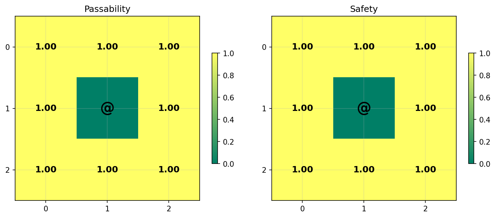 | 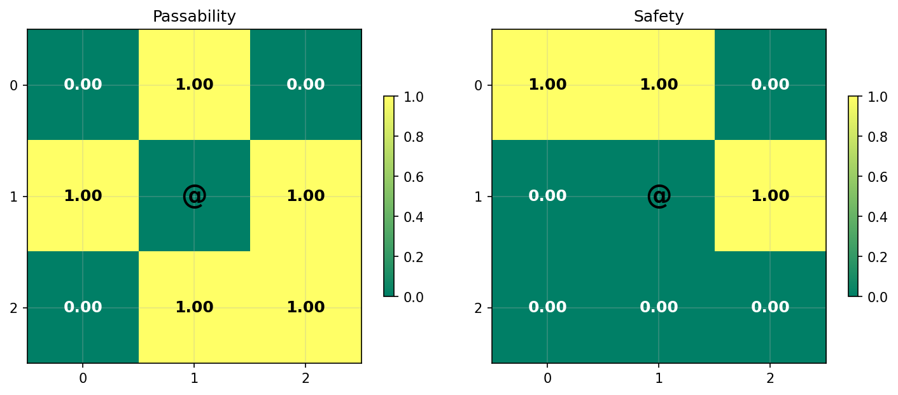 |

================================================================================

## Sample 9

### Ego Map Reconstruction

| Original | Reconstruction |
|---|---|
| 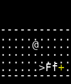 | 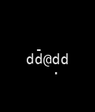 |

**Accuracy**: Character: 0.364, Color: 0.694

### Ego Class Reconstruction

| Original | Reconstruction |
|---|---|
| 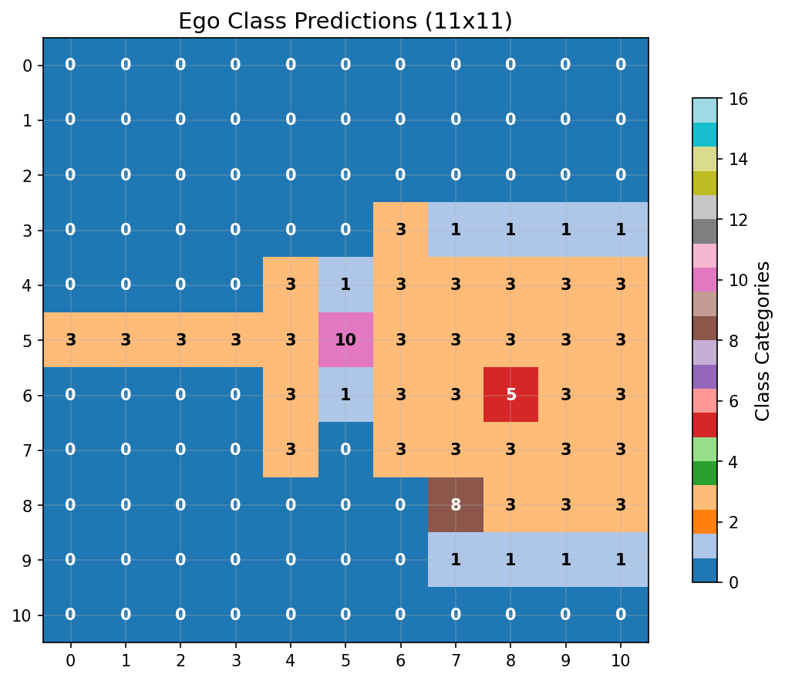 | 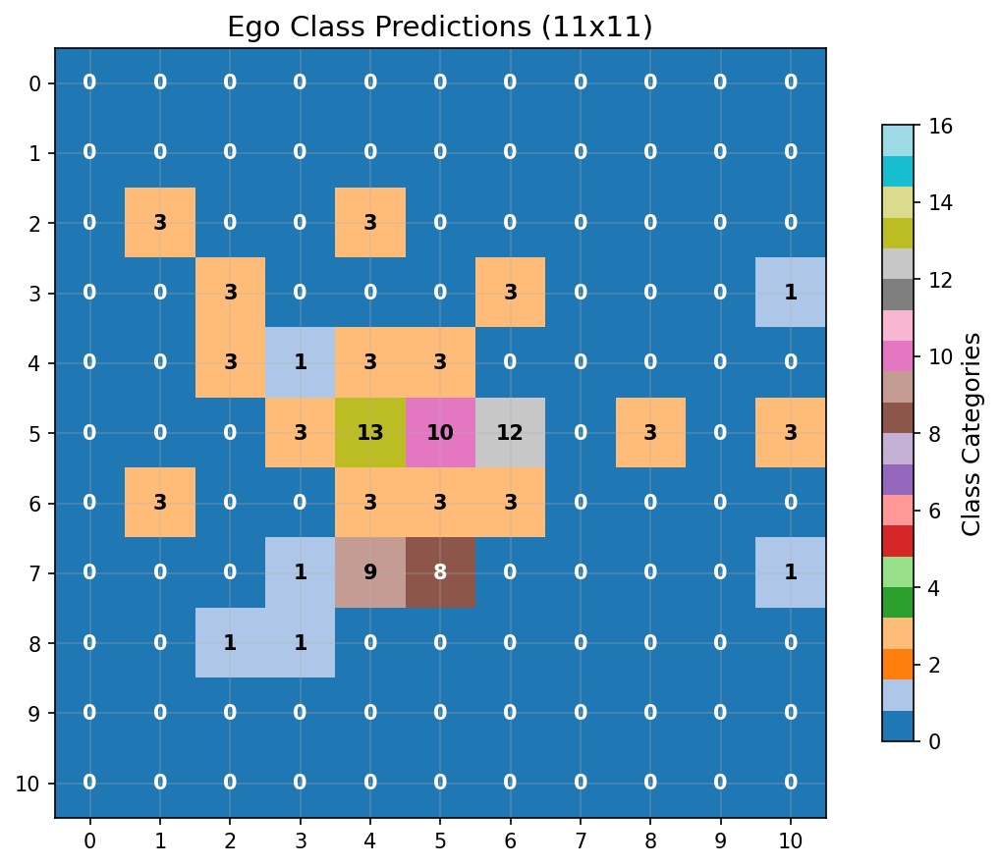 |

**Class Accuracy**: 0.653

### Bag Reconstruction

```
Bag Analysis:
========================================

Original Bag (6 items):
------------------------------
  '+' (color  3)
  '-' (color  7)
  '.' (color  7)
  '@' (color 15)
  'f' (color 15)
  '|' (color  7)

Reconstructed Bag (17 items):
------------------------------
  '#' (color  7)
  '%' (color  3)
  '(' (color  3)
  ')' (color  3)
  ')' (color  6)
  '*' (color  8)
  '-' (color  3)
  '-' (color  7)
  '.' (color  7)
  '.' (color  8)
  '<' (color  7)
  '>' (color  7)
  '@' (color 15)
  '[' (color  3)
  'd' (color 15)
  'x' (color  5)
  '|' (color  7)

Accuracy Metrics:
------------------------------
  Correctly predicted: 4 items
    '-' (color  7)
    '.' (color  7)
    '@' (color 15)
    '|' (color  7)
  Missed items: 2 items
    '+' (color  3)
    'f' (color 15)
  False positives: 13 items
    '#' (color  7)
    '%' (color  3)
    '(' (color  3)
    ')' (color  3)
    ')' (color  6)
    '*' (color  8)
    '-' (color  3)
    '.' (color  8)
    '<' (color  7)
    '>' (color  7)
    '[' (color  3)
    'd' (color 15)
    'x' (color  5)

Performance Summary:
------------------------------
  Precision: 0.235 (4/17)
  Recall: 0.667 (4/6)
  F1-Score: 0.348
  Total unique items: 19
```

### Passability & Safety

| Original | Reconstruction |
|---|---|
|  | 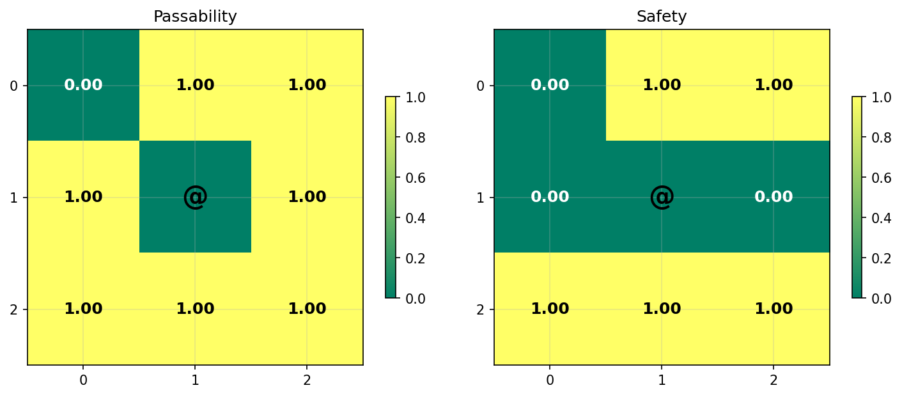 |

================================================================================

## Sample 10

### Ego Map Reconstruction

| Original | Reconstruction |
|---|---|
| 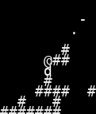 | 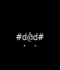 |

**Accuracy**: Character: 0.364, Color: 0.587

### Ego Class Reconstruction

| Original | Reconstruction |
|---|---|
| 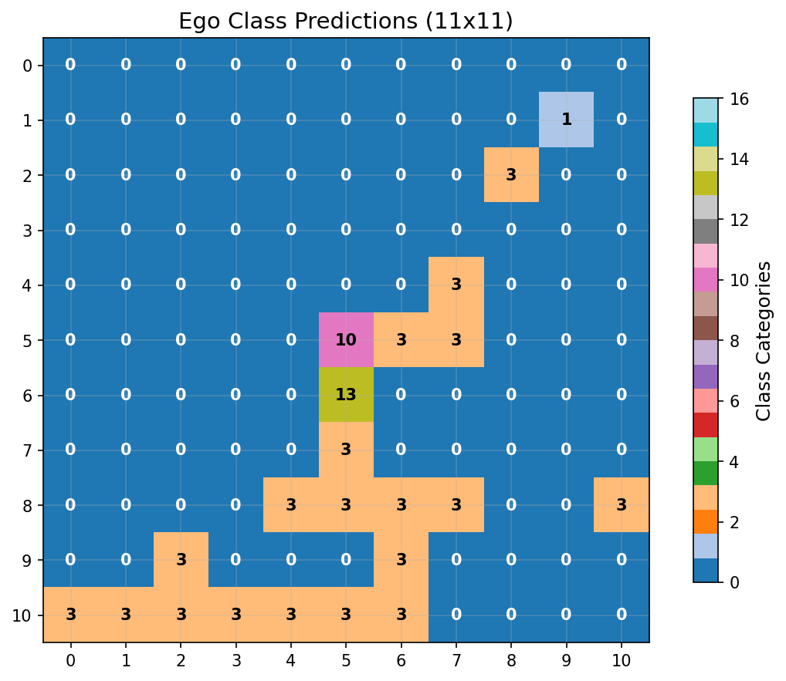 | 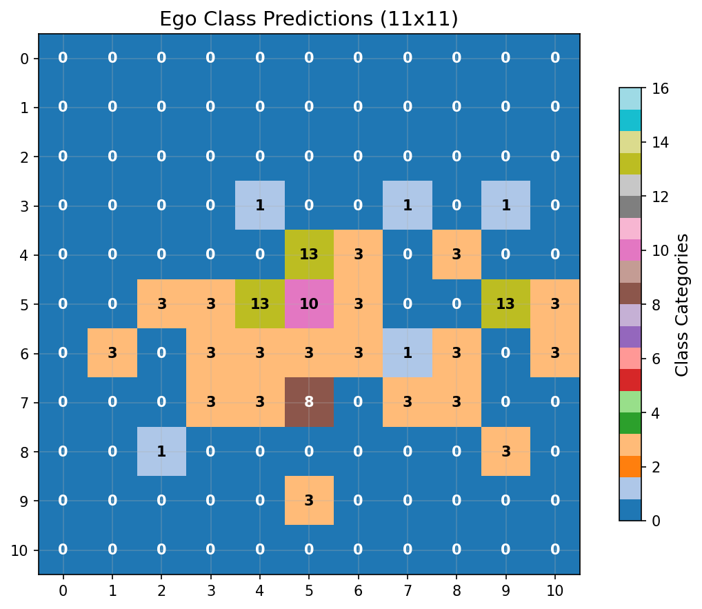 |

**Class Accuracy**: 0.537

### Bag Reconstruction

```
Bag Analysis:
========================================

Original Bag (10 items):
------------------------------
  '#' (color  7)
  ')' (color  6)
  '-' (color  3)
  '-' (color  7)
  '.' (color  7)
  '.' (color  8)
  '<' (color  7)
  '@' (color 15)
  '|' (color  3)
  '|' (color  7)

Reconstructed Bag (15 items):
------------------------------
  '#' (color  7)
  ')' (color  6)
  ')' (color  8)
  '+' (color  4)
  '+' (color  5)
  '+' (color 15)
  '-' (color  3)
  '-' (color  7)
  '.' (color  7)
  '.' (color  8)
  '<' (color  7)
  '>' (color  7)
  '@' (color 15)
  '|' (color  3)
  '|' (color  7)

Accuracy Metrics:
------------------------------
  Correctly predicted: 10 items
    '#' (color  7)
    ')' (color  6)
    '-' (color  3)
    '-' (color  7)
    '.' (color  7)
    '.' (color  8)
    '<' (color  7)
    '@' (color 15)
    '|' (color  3)
    '|' (color  7)
  Missed items: 0 items
  False positives: 5 items
    ')' (color  8)
    '+' (color  4)
    '+' (color  5)
    '+' (color 15)
    '>' (color  7)

Performance Summary:
------------------------------
  Precision: 0.667 (10/15)
  Recall: 1.000 (10/10)
  F1-Score: 0.800
  Total unique items: 15
```

### Passability & Safety

| Original | Reconstruction |
|---|---|
| 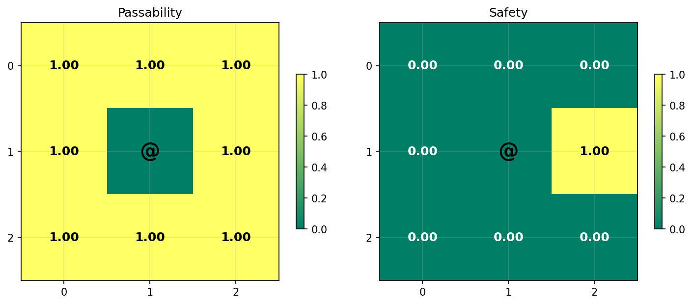 | 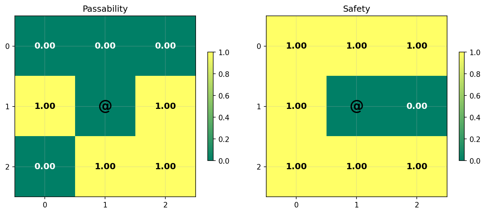 |

## Overall Statistics

- **Average Character Accuracy**: 0.280
- **Average Color Accuracy**: 0.621
- **Total Samples**: 10
