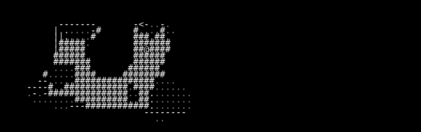
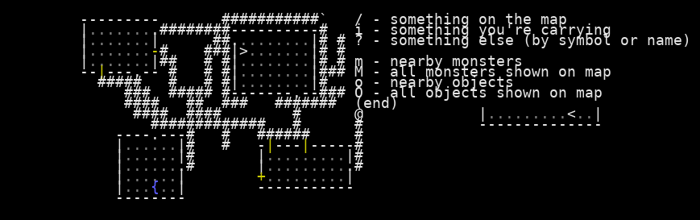
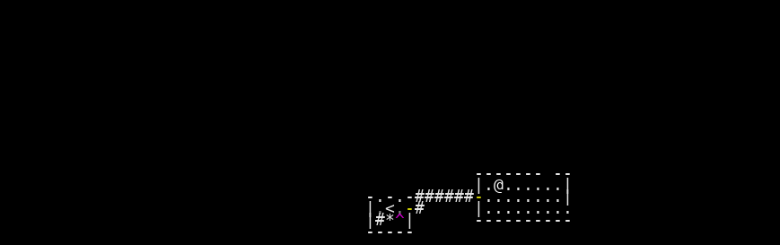
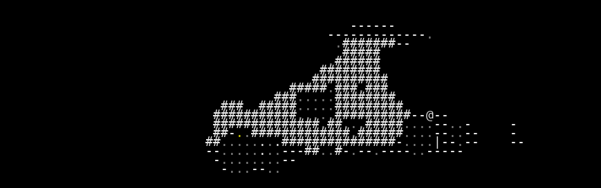

# VAE Reconstruction Comparison

_Generated: 2025-08-12T15:19:37_

## Sample 1

| Original | Reconstruction |
|---|---|
|  |  |

 Sample 1 Accuracy:   Character accuracy: 0.497 (825/1659 cells)
   Color accuracy: 0.533 (885/1659 cells)

================================================================================
## Sample 2

| Original | Reconstruction |
|---|---|
|  |  |

 Sample 2 Accuracy:   Character accuracy: 0.916 (1520/1659 cells)
   Color accuracy: 0.916 (1519/1659 cells)

================================================================================
## Sample 3

| Original | Reconstruction |
|---|---|
|  |  |

 Sample 3 Accuracy:   Character accuracy: 0.966 (1602/1659 cells)
   Color accuracy: 0.962 (1596/1659 cells)

================================================================================
## Sample 4

| Original | Reconstruction |
|---|---|
|  |  |

 Sample 4 Accuracy:   Character accuracy: 0.734 (1218/1659 cells)
   Color accuracy: 0.743 (1233/1659 cells)

================================================================================
## Sample 5

| Original | Reconstruction |
|---|---|
|  |  |

 Sample 5 Accuracy:   Character accuracy: 0.803 (1332/1659 cells)
   Color accuracy: 0.814 (1351/1659 cells)

================================================================================
## Sample 6

| Original | Reconstruction |
|---|---|
|  |  |

 Sample 6 Accuracy:   Character accuracy: 0.972 (1612/1659 cells)
   Color accuracy: 0.972 (1612/1659 cells)

================================================================================
## Sample 7

| Original | Reconstruction |
|---|---|
|  |  |

 Sample 7 Accuracy:   Character accuracy: 0.860 (1427/1659 cells)
   Color accuracy: 0.868 (1440/1659 cells)

================================================================================
## Sample 8

| Original | Reconstruction |
|---|---|
|  |  |

 Sample 8 Accuracy:   Character accuracy: 0.747 (1239/1659 cells)
   Color accuracy: 0.763 (1265/1659 cells)

================================================================================
## Sample 9

| Original | Reconstruction |
|---|---|
|  |  |

 Sample 9 Accuracy:   Character accuracy: 0.818 (1357/1659 cells)
   Color accuracy: 0.836 (1387/1659 cells)

================================================================================
## Sample 10

| Original | Reconstruction |
|---|---|
|  |  |

 Sample 10 Accuracy:   Character accuracy: 0.753 (1249/1659 cells)
   Color accuracy: 0.759 (1259/1659 cells)

📈 Overall Reconstruction Statistics:   Average Character Reconstruction Accuracy: 0.807
   Average Color Reconstruction Accuracy: 0.817
