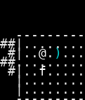
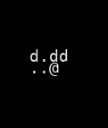
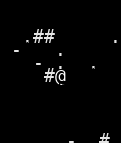
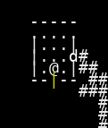
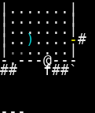
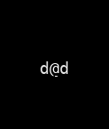
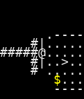
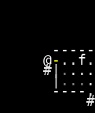

# VAE Reconstruction Comparison

_Generated: 2025-08-16T21:56:43_

## Sample 1

| Original | Reconstruction |
|---|---|
|  |  |

 Sample 1 Accuracy:   Character accuracy: 0.518 (860/1659 cells)
   Color accuracy: 0.593 (984/1659 cells)

================================================================================
## Sample 2

| Original | Reconstruction |
|---|---|
|  |  |

 Sample 2 Accuracy:   Character accuracy: 0.703 (1166/1659 cells)
   Color accuracy: 0.714 (1185/1659 cells)

================================================================================
## Sample 3

| Original | Reconstruction |
|---|---|
|  |  |

 Sample 3 Accuracy:   Character accuracy: 0.521 (864/1659 cells)
   Color accuracy: 0.618 (1026/1659 cells)

================================================================================
## Sample 4

| Original | Reconstruction |
|---|---|
|  |  |

 Sample 4 Accuracy:   Character accuracy: 0.669 (1110/1659 cells)
   Color accuracy: 0.702 (1165/1659 cells)

================================================================================
## Sample 5

| Original | Reconstruction |
|---|---|
|  |  |

 Sample 5 Accuracy:   Character accuracy: 0.695 (1153/1659 cells)
   Color accuracy: 0.723 (1200/1659 cells)

================================================================================
## Sample 6

| Original | Reconstruction |
|---|---|
|  |  |

 Sample 6 Accuracy:   Character accuracy: 0.561 (931/1659 cells)
   Color accuracy: 0.632 (1048/1659 cells)

================================================================================
## Sample 7

| Original | Reconstruction |
|---|---|
|  |  |

 Sample 7 Accuracy:   Character accuracy: 0.613 (1017/1659 cells)
   Color accuracy: 0.624 (1035/1659 cells)

================================================================================
## Sample 8

| Original | Reconstruction |
|---|---|
|  |  |

 Sample 8 Accuracy:   Character accuracy: 0.647 (1074/1659 cells)
   Color accuracy: 0.698 (1158/1659 cells)

================================================================================
## Sample 9

| Original | Reconstruction |
|---|---|
|  |  |

 Sample 9 Accuracy:   Character accuracy: 0.571 (947/1659 cells)
   Color accuracy: 0.597 (990/1659 cells)

================================================================================
## Sample 10

| Original | Reconstruction |
|---|---|
|  |  |

 Sample 10 Accuracy:   Character accuracy: 0.548 (909/1659 cells)
   Color accuracy: 0.570 (945/1659 cells)

📈 Overall Reconstruction Statistics:   Average Character Reconstruction Accuracy: 0.605
   Average Color Reconstruction Accuracy: 0.647
