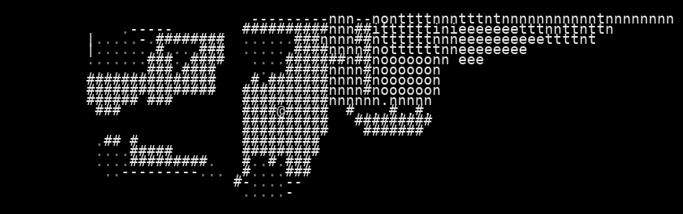

# VAE Reconstruction Comparison

_Generated: 2025-08-11T22:57:06_

## Sample 1

| Original | Reconstruction |
|---|---|
|  |  |

 Sample 1 Accuracy:   Character accuracy: 0.406 (674/1659 cells)
   Color accuracy: 0.461 (764/1659 cells)

================================================================================
## Sample 2

| Original | Reconstruction |
|---|---|
|  |  |

 Sample 2 Accuracy:   Character accuracy: 0.908 (1506/1659 cells)
   Color accuracy: 0.907 (1504/1659 cells)

================================================================================
## Sample 3

| Original | Reconstruction |
|---|---|
|  |  |

 Sample 3 Accuracy:   Character accuracy: 0.876 (1454/1659 cells)
   Color accuracy: 0.876 (1454/1659 cells)

================================================================================
## Sample 4

| Original | Reconstruction |
|---|---|
|  |  |

 Sample 4 Accuracy:   Character accuracy: 0.502 (832/1659 cells)
   Color accuracy: 0.518 (859/1659 cells)

================================================================================
## Sample 5

| Original | Reconstruction |
|---|---|
|  |  |

 Sample 5 Accuracy:   Character accuracy: 0.500 (829/1659 cells)
   Color accuracy: 0.508 (843/1659 cells)

================================================================================
## Sample 6

| Original | Reconstruction |
|---|---|
|  |  |

 Sample 6 Accuracy:   Character accuracy: 0.955 (1585/1659 cells)
   Color accuracy: 0.955 (1585/1659 cells)

================================================================================
## Sample 7

| Original | Reconstruction |
|---|---|
|  |  |

 Sample 7 Accuracy:   Character accuracy: 0.614 (1019/1659 cells)
   Color accuracy: 0.629 (1044/1659 cells)

================================================================================
## Sample 8

| Original | Reconstruction |
|---|---|
|  |  |

 Sample 8 Accuracy:   Character accuracy: 0.528 (876/1659 cells)
   Color accuracy: 0.538 (893/1659 cells)

================================================================================
## Sample 9

| Original | Reconstruction |
|---|---|
|  |  |

 Sample 9 Accuracy:   Character accuracy: 0.608 (1008/1659 cells)
   Color accuracy: 0.602 (999/1659 cells)

================================================================================
## Sample 10

| Original | Reconstruction |
|---|---|
|  |  |

 Sample 10 Accuracy:   Character accuracy: 0.463 (768/1659 cells)
   Color accuracy: 0.502 (833/1659 cells)

📈 Overall Reconstruction Statistics:   Average Character Reconstruction Accuracy: 0.636
   Average Color Reconstruction Accuracy: 0.650
