# Enhanced VAE Reconstruction Comparison

_Generated: 2025-08-23T02:17:24_

This analysis includes the following reconstructions:
- **Ego View**: Character, color, and class predictions in ego-centric window
- **Bag Elements**: High-probability glyph elements
- **Passability/Safety**: 3x3 grids around hero position

## Sample 1

### Ego Map Reconstruction

| Original | Reconstruction |
|---|---|
|  |  |

**Accuracy**: Character: 0.099, Color: 0.802

### Ego Class Reconstruction

| Original | Reconstruction |
|---|---|
| 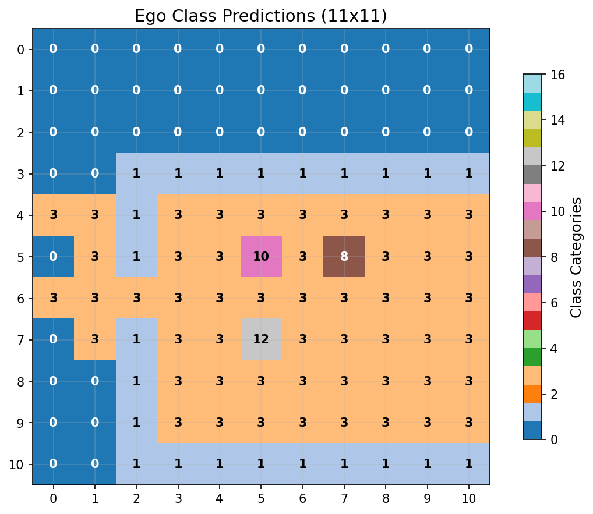 |  |

**Class Accuracy**: 0.612

### Bag Reconstruction

```
Bag Analysis:
========================================

Original Bag (14 items):
------------------------------
  '#' (color  7)
  ')' (color  6)
  '+' (color  3)
  '-' (color  3)
  '-' (color  7)
  '.' (color  7)
  '.' (color  8)
  '<' (color  7)
  '>' (color  7)
  '@' (color 15)
  '^' (color  3)
  '{' (color 12)
  '|' (color  3)
  '|' (color  7)

Reconstructed Bag (20 items):
------------------------------
  '#' (color  7)
  '%' (color  3)
  '*' (color  1)
  '+' (color  6)
  '+' (color 14)
  '-' (color  3)
  '-' (color  7)
  '.' (color  7)
  '.' (color  8)
  '5' (color  7)
  ':' (color  7)
  '<' (color  7)
  '@' (color 15)
  '_' (color  7)
  'e' (color  7)
  'j' (color  7)
  'x' (color  5)
  '{' (color 12)
  '|' (color  3)
  '|' (color  7)

Accuracy Metrics:
------------------------------
  Correctly predicted: 10 items
    '#' (color  7)
    '-' (color  3)
    '-' (color  7)
    '.' (color  7)
    '.' (color  8)
    '<' (color  7)
    '@' (color 15)
    '{' (color 12)
    '|' (color  3)
    '|' (color  7)
  Missed items: 4 items
    ')' (color  6)
    '+' (color  3)
    '>' (color  7)
    '^' (color  3)
  False positives: 10 items
    '%' (color  3)
    '*' (color  1)
    '+' (color  6)
    '+' (color 14)
    '5' (color  7)
    ':' (color  7)
    '_' (color  7)
    'e' (color  7)
    'j' (color  7)
    'x' (color  5)

Performance Summary:
------------------------------
  Precision: 0.500 (10/20)
  Recall: 0.714 (10/14)
  F1-Score: 0.588
  Total unique items: 24
```

### Passability & Safety

| Original | Reconstruction |
|---|---|
| 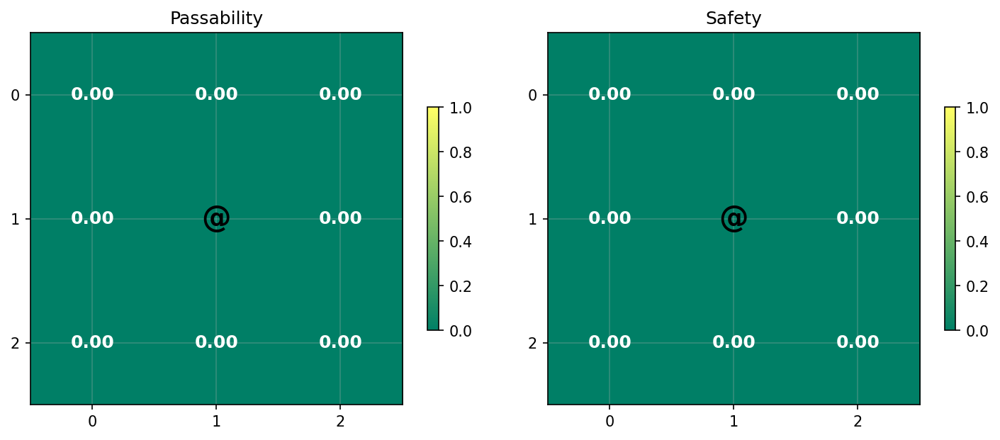 |  |

================================================================================

## Sample 2

### Ego Map Reconstruction

| Original | Reconstruction |
|---|---|
|  |  |

**Accuracy**: Character: 0.124, Color: 0.760

### Ego Class Reconstruction

| Original | Reconstruction |
|---|---|
|  |  |

**Class Accuracy**: 0.612

### Bag Reconstruction

```
Bag Analysis:
========================================

Original Bag (13 items):
------------------------------
  '#' (color  7)
  '%' (color  1)
  '*' (color  3)
  '+' (color  3)
  '+' (color 15)
  '-' (color  3)
  '-' (color  7)
  '.' (color  7)
  '.' (color  8)
  '<' (color  7)
  '@' (color 15)
  'o' (color 15)
  '|' (color  7)

Reconstructed Bag (15 items):
------------------------------
  '#' (color  7)
  ')' (color  6)
  '+' (color 12)
  '-' (color  3)
  '-' (color  7)
  '.' (color  7)
  '.' (color  8)
  '<' (color  7)
  '@' (color 15)
  '^' (color  3)
  'd' (color 15)
  'f' (color 15)
  '|' (color  3)
  '|' (color  7)
  '|' (color 15)

Accuracy Metrics:
------------------------------
  Correctly predicted: 8 items
    '#' (color  7)
    '-' (color  3)
    '-' (color  7)
    '.' (color  7)
    '.' (color  8)
    '<' (color  7)
    '@' (color 15)
    '|' (color  7)
  Missed items: 5 items
    '%' (color  1)
    '*' (color  3)
    '+' (color  3)
    '+' (color 15)
    'o' (color 15)
  False positives: 7 items
    ')' (color  6)
    '+' (color 12)
    '^' (color  3)
    'd' (color 15)
    'f' (color 15)
    '|' (color  3)
    '|' (color 15)

Performance Summary:
------------------------------
  Precision: 0.533 (8/15)
  Recall: 0.615 (8/13)
  F1-Score: 0.571
  Total unique items: 20
```

### Passability & Safety

| Original | Reconstruction |
|---|---|
|  |  |

================================================================================

## Sample 3

### Ego Map Reconstruction

| Original | Reconstruction |
|---|---|
|  |  |

**Accuracy**: Character: 0.190, Color: 0.570

### Ego Class Reconstruction

| Original | Reconstruction |
|---|---|
|  |  |

**Class Accuracy**: 0.545

### Bag Reconstruction

```
Bag Analysis:
========================================

Original Bag (39 items):
------------------------------
  '#' (color  7)
  '(' (color  7)
  ')' (color  7)
  '+' (color  3)
  '+' (color  5)
  '+' (color  7)
  '+' (color 15)
  ',' (color  7)
  '-' (color  3)
  '-' (color  7)
  '.' (color  7)
  '.' (color  8)
  '<' (color  7)
  '>' (color  7)
  '@' (color 15)
  '_' (color  7)
  '`' (color  7)
  'a' (color  7)
  'b' (color  7)
  'c' (color  7)
  'd' (color  7)
  'e' (color  7)
  'f' (color 15)
  'h' (color  7)
  'i' (color  7)
  'j' (color  7)
  'k' (color  7)
  'm' (color  7)
  'n' (color  7)
  'o' (color  7)
  'p' (color  7)
  'r' (color  7)
  's' (color  7)
  't' (color  7)
  'u' (color  7)
  'w' (color  7)
  '{' (color 12)
  '|' (color  3)
  '|' (color  7)

Reconstructed Bag (14 items):
------------------------------
  '#' (color  7)
  '$' (color 11)
  '+' (color  3)
  '-' (color  3)
  '-' (color  7)
  '.' (color  7)
  '>' (color  7)
  '@' (color 15)
  '`' (color  7)
  'd' (color 15)
  'r' (color 15)
  '{' (color 12)
  '|' (color  3)
  '|' (color  7)

Accuracy Metrics:
------------------------------
  Correctly predicted: 11 items
    '#' (color  7)
    '+' (color  3)
    '-' (color  3)
    '-' (color  7)
    '.' (color  7)
    '>' (color  7)
    '@' (color 15)
    '`' (color  7)
    '{' (color 12)
    '|' (color  3)
    '|' (color  7)
  Missed items: 28 items
    '(' (color  7)
    ')' (color  7)
    '+' (color  5)
    '+' (color  7)
    '+' (color 15)
    ',' (color  7)
    '.' (color  8)
    '<' (color  7)
    '_' (color  7)
    'a' (color  7)
    'b' (color  7)
    'c' (color  7)
    'd' (color  7)
    'e' (color  7)
    'f' (color 15)
    'h' (color  7)
    'i' (color  7)
    'j' (color  7)
    'k' (color  7)
    'm' (color  7)
    'n' (color  7)
    'o' (color  7)
    'p' (color  7)
    'r' (color  7)
    's' (color  7)
    't' (color  7)
    'u' (color  7)
    'w' (color  7)
  False positives: 3 items
    '$' (color 11)
    'd' (color 15)
    'r' (color 15)

Performance Summary:
------------------------------
  Precision: 0.786 (11/14)
  Recall: 0.282 (11/39)
  F1-Score: 0.415
  Total unique items: 42
```

### Passability & Safety

| Original | Reconstruction |
|---|---|
| 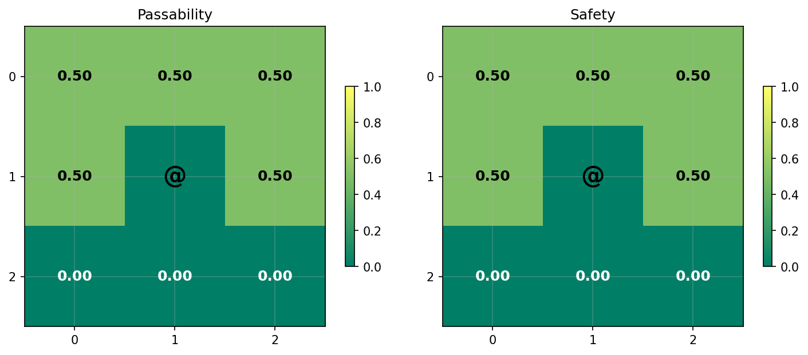 | 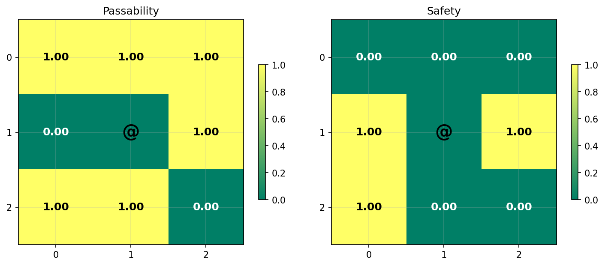 |

================================================================================

## Sample 4

### Ego Map Reconstruction

| Original | Reconstruction |
|---|---|
|  |  |

**Accuracy**: Character: 0.215, Color: 0.579

### Ego Class Reconstruction

| Original | Reconstruction |
|---|---|
|  | 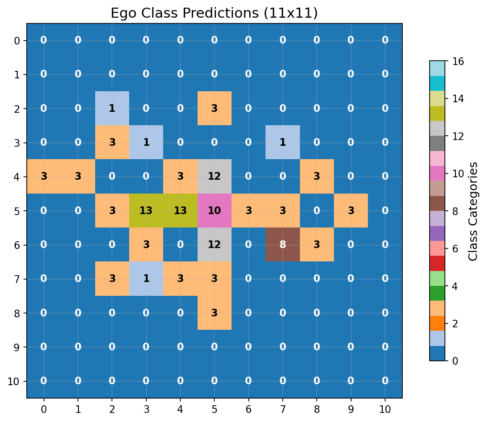 |

**Class Accuracy**: 0.570

### Bag Reconstruction

```
Bag Analysis:
========================================

Original Bag (11 items):
------------------------------
  '#' (color  7)
  '+' (color  3)
  '+' (color  7)
  '-' (color  7)
  '.' (color  7)
  '.' (color  8)
  '<' (color  7)
  '@' (color 15)
  'f' (color 15)
  '|' (color  3)
  '|' (color  7)

Reconstructed Bag (11 items):
------------------------------
  '#' (color  7)
  '+' (color 15)
  '-' (color  7)
  '.' (color  7)
  '.' (color  8)
  '@' (color 15)
  '`' (color  7)
  'd' (color 15)
  'f' (color 15)
  '|' (color  3)
  '|' (color  7)

Accuracy Metrics:
------------------------------
  Correctly predicted: 8 items
    '#' (color  7)
    '-' (color  7)
    '.' (color  7)
    '.' (color  8)
    '@' (color 15)
    'f' (color 15)
    '|' (color  3)
    '|' (color  7)
  Missed items: 3 items
    '+' (color  3)
    '+' (color  7)
    '<' (color  7)
  False positives: 3 items
    '+' (color 15)
    '`' (color  7)
    'd' (color 15)

Performance Summary:
------------------------------
  Precision: 0.727 (8/11)
  Recall: 0.727 (8/11)
  F1-Score: 0.727
  Total unique items: 14
```

### Passability & Safety

| Original | Reconstruction |
|---|---|
|  |  |

================================================================================

## Sample 5

### Ego Map Reconstruction

| Original | Reconstruction |
|---|---|
|  |  |

**Accuracy**: Character: 0.240, Color: 0.554

### Ego Class Reconstruction

| Original | Reconstruction |
|---|---|
|  |  |

**Class Accuracy**: 0.686

### Bag Reconstruction

```
Bag Analysis:
========================================

Original Bag (11 items):
------------------------------
  '#' (color  7)
  '+' (color  3)
  '+' (color 15)
  '-' (color  7)
  '.' (color  7)
  '.' (color  8)
  '<' (color  7)
  '@' (color 15)
  'f' (color 15)
  '|' (color  3)
  '|' (color  7)

Reconstructed Bag (14 items):
------------------------------
  '#' (color  7)
  '$' (color 11)
  '+' (color 11)
  '-' (color  7)
  '.' (color  7)
  '.' (color  8)
  '<' (color  7)
  '>' (color  7)
  '@' (color 15)
  '`' (color  7)
  'f' (color 15)
  'j' (color  7)
  '|' (color  3)
  '|' (color  7)

Accuracy Metrics:
------------------------------
  Correctly predicted: 9 items
    '#' (color  7)
    '-' (color  7)
    '.' (color  7)
    '.' (color  8)
    '<' (color  7)
    '@' (color 15)
    'f' (color 15)
    '|' (color  3)
    '|' (color  7)
  Missed items: 2 items
    '+' (color  3)
    '+' (color 15)
  False positives: 5 items
    '$' (color 11)
    '+' (color 11)
    '>' (color  7)
    '`' (color  7)
    'j' (color  7)

Performance Summary:
------------------------------
  Precision: 0.643 (9/14)
  Recall: 0.818 (9/11)
  F1-Score: 0.720
  Total unique items: 16
```

### Passability & Safety

| Original | Reconstruction |
|---|---|
|  |  |

================================================================================

## Sample 6

### Ego Map Reconstruction

| Original | Reconstruction |
|---|---|
|  | 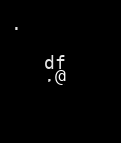 |

**Accuracy**: Character: 0.240, Color: 0.636

### Ego Class Reconstruction

| Original | Reconstruction |
|---|---|
|  |  |

**Class Accuracy**: 0.537

### Bag Reconstruction

```
Bag Analysis:
========================================

Original Bag (14 items):
------------------------------
  '#' (color  7)
  ')' (color  6)
  '-' (color  3)
  '-' (color  7)
  '.' (color  7)
  '.' (color  8)
  '<' (color  7)
  '>' (color  7)
  '@' (color 15)
  '^' (color  3)
  'f' (color 15)
  '{' (color 12)
  '|' (color  3)
  '|' (color  7)

Reconstructed Bag (19 items):
------------------------------
  '#' (color  7)
  '%' (color  3)
  ')' (color  6)
  '*' (color  7)
  ',' (color  7)
  '-' (color  3)
  '-' (color  7)
  '.' (color  7)
  '.' (color  8)
  '<' (color  7)
  '>' (color  7)
  '@' (color 15)
  '[' (color  3)
  '^' (color  8)
  '`' (color  7)
  'a' (color  7)
  's' (color  7)
  '|' (color  3)
  '|' (color  7)

Accuracy Metrics:
------------------------------
  Correctly predicted: 11 items
    '#' (color  7)
    ')' (color  6)
    '-' (color  3)
    '-' (color  7)
    '.' (color  7)
    '.' (color  8)
    '<' (color  7)
    '>' (color  7)
    '@' (color 15)
    '|' (color  3)
    '|' (color  7)
  Missed items: 3 items
    '^' (color  3)
    'f' (color 15)
    '{' (color 12)
  False positives: 8 items
    '%' (color  3)
    '*' (color  7)
    ',' (color  7)
    '[' (color  3)
    '^' (color  8)
    '`' (color  7)
    'a' (color  7)
    's' (color  7)

Performance Summary:
------------------------------
  Precision: 0.579 (11/19)
  Recall: 0.786 (11/14)
  F1-Score: 0.667
  Total unique items: 22
```

### Passability & Safety

| Original | Reconstruction |
|---|---|
|  | 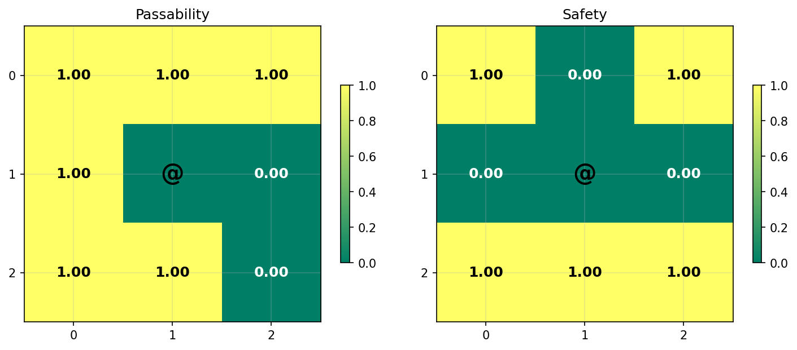 |

================================================================================

## Sample 7

### Ego Map Reconstruction

| Original | Reconstruction |
|---|---|
|  |  |

**Accuracy**: Character: 0.132, Color: 0.636

### Ego Class Reconstruction

| Original | Reconstruction |
|---|---|
| 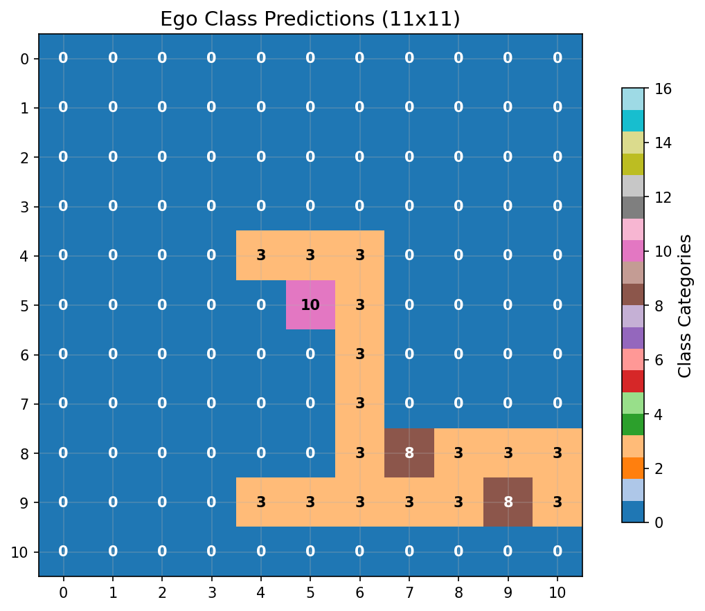 |  |

**Class Accuracy**: 0.661

### Bag Reconstruction

```
Bag Analysis:
========================================

Original Bag (9 items):
------------------------------
  '#' (color  7)
  '+' (color  9)
  '+' (color 15)
  '-' (color  7)
  '.' (color  7)
  '.' (color  8)
  '<' (color  7)
  '@' (color 15)
  '|' (color  7)

Reconstructed Bag (13 items):
------------------------------
  '#' (color  7)
  '$' (color 11)
  '&' (color  8)
  ')' (color  6)
  '+' (color 15)
  '-' (color  3)
  '-' (color  7)
  '.' (color  7)
  '<' (color  7)
  '@' (color 15)
  '`' (color  7)
  'i' (color  7)
  '|' (color  7)

Accuracy Metrics:
------------------------------
  Correctly predicted: 7 items
    '#' (color  7)
    '+' (color 15)
    '-' (color  7)
    '.' (color  7)
    '<' (color  7)
    '@' (color 15)
    '|' (color  7)
  Missed items: 2 items
    '+' (color  9)
    '.' (color  8)
  False positives: 6 items
    '$' (color 11)
    '&' (color  8)
    ')' (color  6)
    '-' (color  3)
    '`' (color  7)
    'i' (color  7)

Performance Summary:
------------------------------
  Precision: 0.538 (7/13)
  Recall: 0.778 (7/9)
  F1-Score: 0.636
  Total unique items: 15
```

### Passability & Safety

| Original | Reconstruction |
|---|---|
|  | 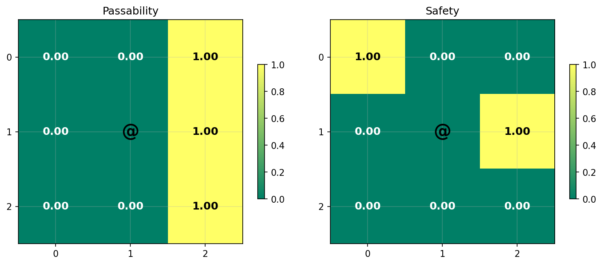 |

================================================================================

## Sample 8

### Ego Map Reconstruction

| Original | Reconstruction |
|---|---|
|  |  |

**Accuracy**: Character: 0.198, Color: 0.661

### Ego Class Reconstruction

| Original | Reconstruction |
|---|---|
| 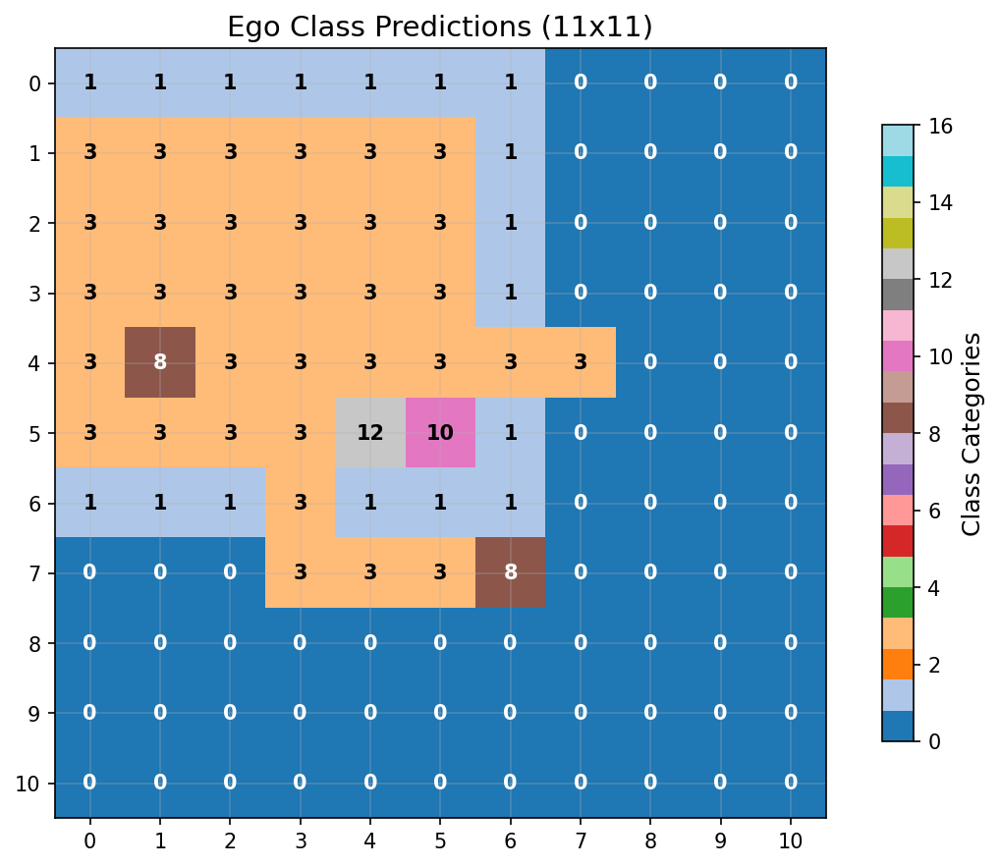 |  |

**Class Accuracy**: 0.562

### Bag Reconstruction

```
Bag Analysis:
========================================

Original Bag (14 items):
------------------------------
  '#' (color  7)
  ')' (color  6)
  '-' (color  3)
  '-' (color  7)
  '.' (color  7)
  '.' (color  8)
  '<' (color  7)
  '>' (color  7)
  '@' (color 15)
  '^' (color  3)
  'f' (color 15)
  '{' (color 12)
  '|' (color  3)
  '|' (color  7)

Reconstructed Bag (21 items):
------------------------------
  '#' (color  7)
  ')' (color  6)
  '*' (color  8)
  '*' (color  9)
  '*' (color 15)
  '-' (color  7)
  '.' (color  7)
  '.' (color  8)
  ':' (color 15)
  '<' (color  7)
  '@' (color 15)
  '[' (color  3)
  '[' (color  8)
  '`' (color  7)
  'a' (color  7)
  'd' (color 15)
  'f' (color 15)
  'r' (color 15)
  '{' (color 12)
  '|' (color  3)
  '|' (color  7)

Accuracy Metrics:
------------------------------
  Correctly predicted: 11 items
    '#' (color  7)
    ')' (color  6)
    '-' (color  7)
    '.' (color  7)
    '.' (color  8)
    '<' (color  7)
    '@' (color 15)
    'f' (color 15)
    '{' (color 12)
    '|' (color  3)
    '|' (color  7)
  Missed items: 3 items
    '-' (color  3)
    '>' (color  7)
    '^' (color  3)
  False positives: 10 items
    '*' (color  8)
    '*' (color  9)
    '*' (color 15)
    ':' (color 15)
    '[' (color  3)
    '[' (color  8)
    '`' (color  7)
    'a' (color  7)
    'd' (color 15)
    'r' (color 15)

Performance Summary:
------------------------------
  Precision: 0.524 (11/21)
  Recall: 0.786 (11/14)
  F1-Score: 0.629
  Total unique items: 24
```

### Passability & Safety

| Original | Reconstruction |
|---|---|
|  | 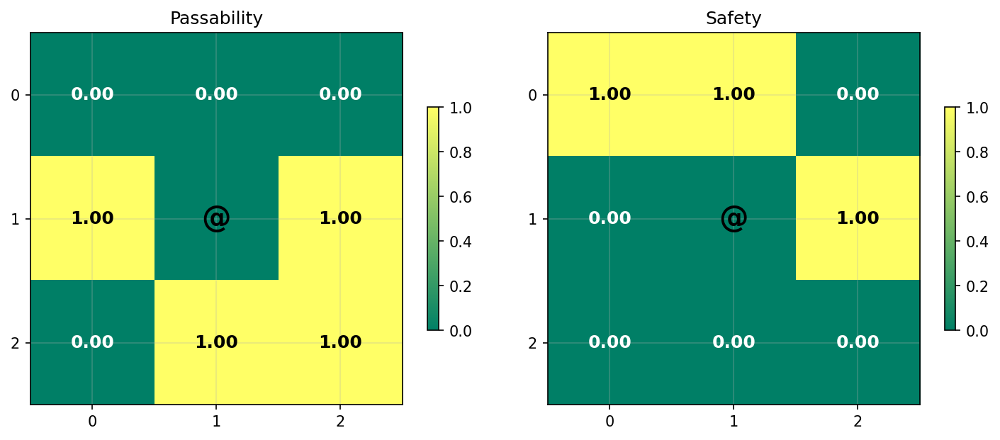 |

================================================================================

## Sample 9

### Ego Map Reconstruction

| Original | Reconstruction |
|---|---|
|  |  |

**Accuracy**: Character: 0.289, Color: 0.438

### Ego Class Reconstruction

| Original | Reconstruction |
|---|---|
|  | 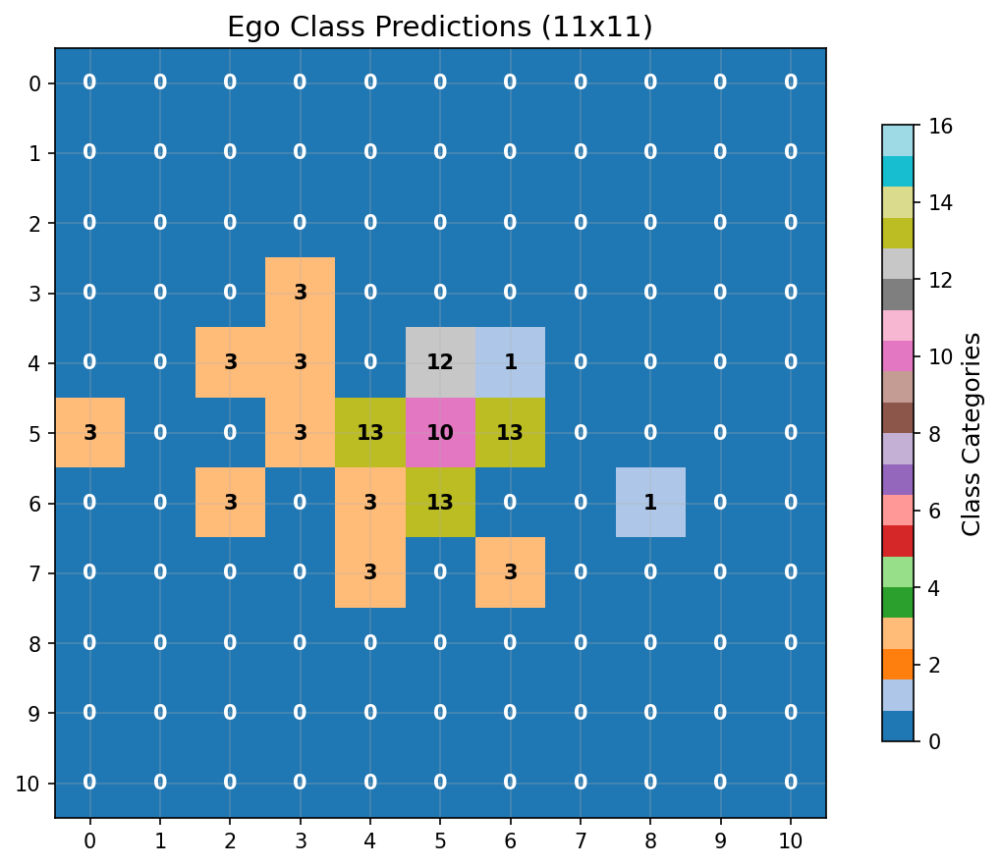 |

**Class Accuracy**: 0.430

### Bag Reconstruction

```
Bag Analysis:
========================================

Original Bag (18 items):
------------------------------
  '#' (color  7)
  '%' (color  3)
  '*' (color 11)
  '+' (color  3)
  '+' (color 15)
  '-' (color  3)
  '-' (color  7)
  '.' (color  7)
  '.' (color  8)
  '<' (color  7)
  '>' (color  7)
  '@' (color 15)
  'F' (color 15)
  '`' (color  7)
  'f' (color 15)
  '{' (color 12)
  '|' (color  3)
  '|' (color  7)

Reconstructed Bag (13 items):
------------------------------
  '#' (color  7)
  '*' (color  9)
  '-' (color  3)
  '-' (color  7)
  '.' (color  7)
  '.' (color  8)
  '<' (color  7)
  '>' (color  7)
  '@' (color 15)
  '`' (color  7)
  'm' (color  7)
  '|' (color  3)
  '|' (color  7)

Accuracy Metrics:
------------------------------
  Correctly predicted: 11 items
    '#' (color  7)
    '-' (color  3)
    '-' (color  7)
    '.' (color  7)
    '.' (color  8)
    '<' (color  7)
    '>' (color  7)
    '@' (color 15)
    '`' (color  7)
    '|' (color  3)
    '|' (color  7)
  Missed items: 7 items
    '%' (color  3)
    '*' (color 11)
    '+' (color  3)
    '+' (color 15)
    'F' (color 15)
    'f' (color 15)
    '{' (color 12)
  False positives: 2 items
    '*' (color  9)
    'm' (color  7)

Performance Summary:
------------------------------
  Precision: 0.846 (11/13)
  Recall: 0.611 (11/18)
  F1-Score: 0.710
  Total unique items: 20
```

### Passability & Safety

| Original | Reconstruction |
|---|---|
|  | 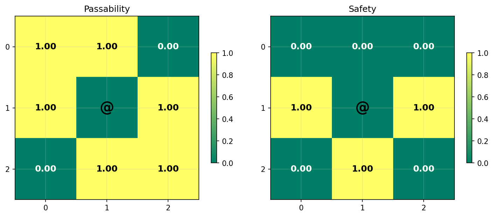 |

================================================================================

## Sample 10

### Ego Map Reconstruction

| Original | Reconstruction |
|---|---|
|  |  |

**Accuracy**: Character: 0.140, Color: 0.736

### Ego Class Reconstruction

| Original | Reconstruction |
|---|---|
|  | 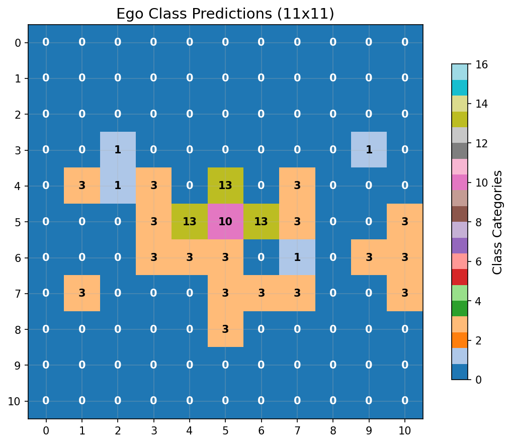 |

**Class Accuracy**: 0.620

### Bag Reconstruction

```
Bag Analysis:
========================================

Original Bag (12 items):
------------------------------
  '#' (color  7)
  ')' (color  6)
  '-' (color  7)
  '.' (color  7)
  '.' (color  8)
  '<' (color  7)
  '>' (color  7)
  '@' (color 15)
  'd' (color 15)
  'r' (color 15)
  '|' (color  3)
  '|' (color  7)

Reconstructed Bag (18 items):
------------------------------
  '#' (color  7)
  '%' (color  2)
  '(' (color  3)
  ')' (color  7)
  '*' (color  7)
  '+' (color  3)
  '-' (color  7)
  '.' (color  7)
  '.' (color  8)
  '<' (color  7)
  '@' (color 15)
  '^' (color  4)
  '`' (color  7)
  'd' (color 15)
  'f' (color 15)
  '|' (color  3)
  '|' (color  7)
  '\x7f' (color  2)

Accuracy Metrics:
------------------------------
  Correctly predicted: 9 items
    '#' (color  7)
    '-' (color  7)
    '.' (color  7)
    '.' (color  8)
    '<' (color  7)
    '@' (color 15)
    'd' (color 15)
    '|' (color  3)
    '|' (color  7)
  Missed items: 3 items
    ')' (color  6)
    '>' (color  7)
    'r' (color 15)
  False positives: 9 items
    '%' (color  2)
    '(' (color  3)
    ')' (color  7)
    '*' (color  7)
    '+' (color  3)
    '^' (color  4)
    '`' (color  7)
    'f' (color 15)
    '\x7f' (color  2)

Performance Summary:
------------------------------
  Precision: 0.500 (9/18)
  Recall: 0.750 (9/12)
  F1-Score: 0.600
  Total unique items: 21
```

### Passability & Safety

| Original | Reconstruction |
|---|---|
|  |  |

## Overall Statistics

- **Average Character Accuracy**: 0.187
- **Average Color Accuracy**: 0.637
- **Total Samples**: 10
