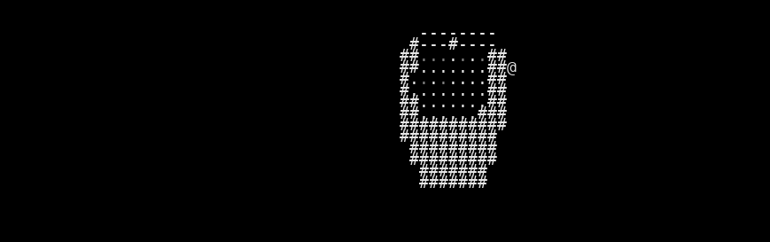

# VAE Reconstruction Comparison

_Generated: 2025-08-13T11:18:34_

## Sample 1

| Original | Reconstruction |
|---|---|
|  |  |

 Sample 1 Accuracy:   Character accuracy: 0.532 (883/1659 cells)
   Color accuracy: 0.558 (926/1659 cells)

================================================================================
## Sample 2

| Original | Reconstruction |
|---|---|
|  |  |

 Sample 2 Accuracy:   Character accuracy: 0.940 (1560/1659 cells)
   Color accuracy: 0.941 (1561/1659 cells)

================================================================================
## Sample 3

| Original | Reconstruction |
|---|---|
|  |  |

 Sample 3 Accuracy:   Character accuracy: 0.983 (1631/1659 cells)
   Color accuracy: 0.978 (1622/1659 cells)

================================================================================
## Sample 4

| Original | Reconstruction |
|---|---|
|  |  |

 Sample 4 Accuracy:   Character accuracy: 0.646 (1071/1659 cells)
   Color accuracy: 0.665 (1104/1659 cells)

================================================================================
## Sample 5

| Original | Reconstruction |
|---|---|
|  |  |

 Sample 5 Accuracy:   Character accuracy: 0.784 (1301/1659 cells)
   Color accuracy: 0.794 (1318/1659 cells)

================================================================================
## Sample 6

| Original | Reconstruction |
|---|---|
|  |  |

 Sample 6 Accuracy:   Character accuracy: 0.943 (1564/1659 cells)
   Color accuracy: 0.943 (1564/1659 cells)

================================================================================
## Sample 7

| Original | Reconstruction |
|---|---|
|  |  |

 Sample 7 Accuracy:   Character accuracy: 0.890 (1477/1659 cells)
   Color accuracy: 0.900 (1493/1659 cells)

================================================================================
## Sample 8

| Original | Reconstruction |
|---|---|
|  |  |

 Sample 8 Accuracy:   Character accuracy: 0.758 (1257/1659 cells)
   Color accuracy: 0.767 (1273/1659 cells)

================================================================================
## Sample 9

| Original | Reconstruction |
|---|---|
|  |  |

 Sample 9 Accuracy:   Character accuracy: 0.861 (1429/1659 cells)
   Color accuracy: 0.860 (1427/1659 cells)

================================================================================
## Sample 10

| Original | Reconstruction |
|---|---|
|  |  |

 Sample 10 Accuracy:   Character accuracy: 0.741 (1229/1659 cells)
   Color accuracy: 0.751 (1246/1659 cells)

📈 Overall Reconstruction Statistics:   Average Character Reconstruction Accuracy: 0.808
   Average Color Reconstruction Accuracy: 0.816
