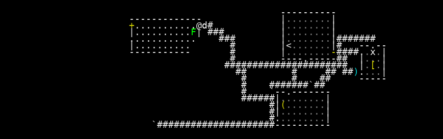
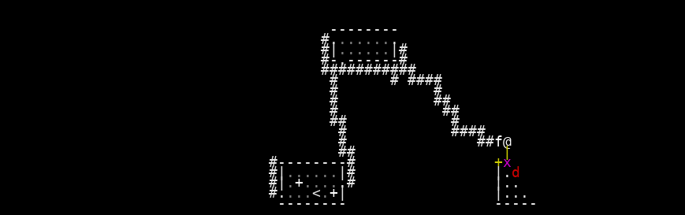

# VAE Reconstruction Comparison

_Generated: 2025-08-15T00:34:22_

## Sample 1

| Original | Reconstruction |
|---|---|
|  |  |

 Sample 1 Accuracy:   Character accuracy: 0.600 (996/1659 cells)
   Color accuracy: 0.617 (1024/1659 cells)

================================================================================
## Sample 2

| Original | Reconstruction |
|---|---|
|  |  |

 Sample 2 Accuracy:   Character accuracy: 0.916 (1519/1659 cells)
   Color accuracy: 0.916 (1520/1659 cells)

================================================================================
## Sample 3

| Original | Reconstruction |
|---|---|
|  |  |

 Sample 3 Accuracy:   Character accuracy: 0.977 (1621/1659 cells)
   Color accuracy: 0.975 (1617/1659 cells)

================================================================================
## Sample 4

| Original | Reconstruction |
|---|---|
|  |  |

 Sample 4 Accuracy:   Character accuracy: 0.811 (1346/1659 cells)
   Color accuracy: 0.822 (1364/1659 cells)

================================================================================
## Sample 5

| Original | Reconstruction |
|---|---|
|  |  |

 Sample 5 Accuracy:   Character accuracy: 0.813 (1349/1659 cells)
   Color accuracy: 0.822 (1364/1659 cells)

================================================================================
## Sample 6

| Original | Reconstruction |
|---|---|
|  |  |

 Sample 6 Accuracy:   Character accuracy: 0.969 (1607/1659 cells)
   Color accuracy: 0.969 (1608/1659 cells)

================================================================================
## Sample 7

| Original | Reconstruction |
|---|---|
|  |  |

 Sample 7 Accuracy:   Character accuracy: 0.847 (1405/1659 cells)
   Color accuracy: 0.847 (1406/1659 cells)

================================================================================
## Sample 8

| Original | Reconstruction |
|---|---|
|  |  |

 Sample 8 Accuracy:   Character accuracy: 0.733 (1216/1659 cells)
   Color accuracy: 0.738 (1224/1659 cells)

================================================================================
## Sample 9

| Original | Reconstruction |
|---|---|
|  |  |

 Sample 9 Accuracy:   Character accuracy: 0.838 (1390/1659 cells)
   Color accuracy: 0.839 (1392/1659 cells)

================================================================================
## Sample 10

| Original | Reconstruction |
|---|---|
|  |  |

 Sample 10 Accuracy:   Character accuracy: 0.702 (1165/1659 cells)
   Color accuracy: 0.712 (1182/1659 cells)

📈 Overall Reconstruction Statistics:   Average Character Reconstruction Accuracy: 0.821
   Average Color Reconstruction Accuracy: 0.826
