# Enhanced VAE Reconstruction Comparison

_Generated: 2025-08-27T08:15:40_

This analysis includes the following reconstructions:
- **Ego View**: Character, color, and class predictions in ego-centric window
- **Bag Elements**: High-probability glyph elements
- **Passability/Safety**: 3x3 grids around hero position

## Sample 1

### Ego Map Reconstruction

| Original | Reconstruction |
|---|---|
|  |  |

**Accuracy**: Character: 0.479, Color: 0.587

### Ego Class Reconstruction

| Original | Reconstruction |
|---|---|
| 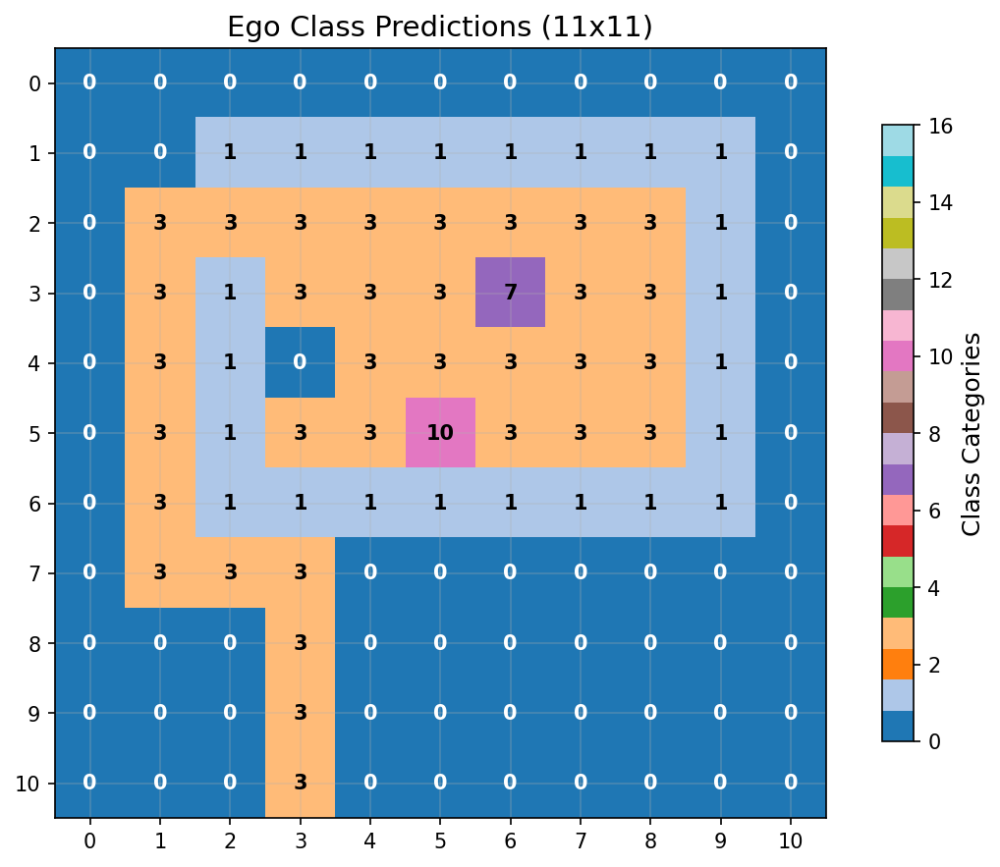 | 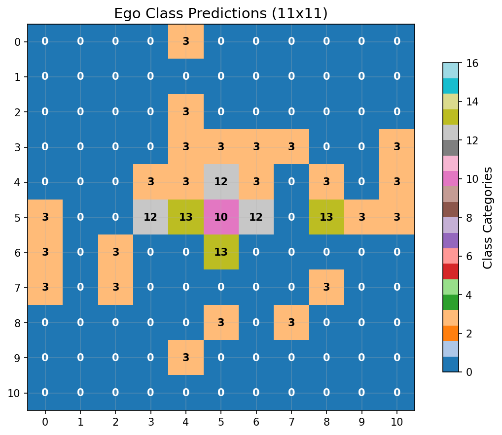 |

**Class Accuracy**: 0.603

### Bag Reconstruction

```
Bag Analysis:
========================================

Original Bag (17 items):
------------------------------
  '#' (color  7)
  '%' (color  3)
  '(' (color  3)
  ')' (color  3)
  ')' (color  6)
  '-' (color  3)
  '-' (color  7)
  '.' (color  7)
  '.' (color  8)
  '>' (color  7)
  '@' (color 15)
  '[' (color  8)
  '_' (color  7)
  '`' (color  7)
  'r' (color  3)
  '|' (color  3)
  '|' (color  7)

Reconstructed Bag (11 items):
------------------------------
  '#' (color  7)
  ')' (color  6)
  '-' (color  3)
  '-' (color  7)
  '.' (color  7)
  '.' (color  8)
  '<' (color  7)
  '@' (color 15)
  '`' (color  7)
  '|' (color  3)
  '|' (color  7)

Accuracy Metrics:
------------------------------
  Correctly predicted: 10 items
    '#' (color  7)
    ')' (color  6)
    '-' (color  3)
    '-' (color  7)
    '.' (color  7)
    '.' (color  8)
    '@' (color 15)
    '`' (color  7)
    '|' (color  3)
    '|' (color  7)
  Missed items: 7 items
    '%' (color  3)
    '(' (color  3)
    ')' (color  3)
    '>' (color  7)
    '[' (color  8)
    '_' (color  7)
    'r' (color  3)
  False positives: 1 items
    '<' (color  7)

Performance Summary:
------------------------------
  Precision: 0.909 (10/11)
  Recall: 0.588 (10/17)
  F1-Score: 0.714
  Total unique items: 18
```

### Passability & Safety

| Original | Reconstruction |
|---|---|
| 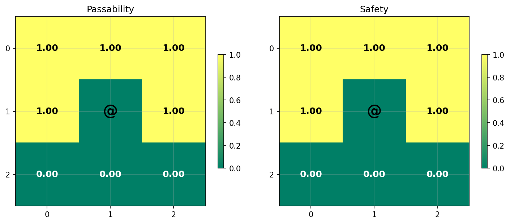 | 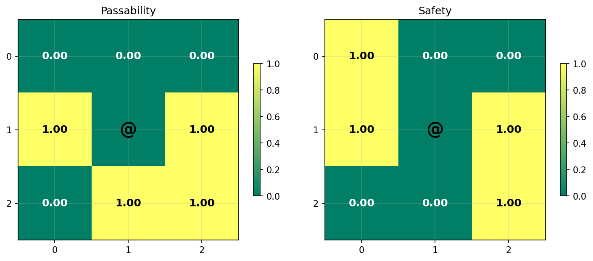 |

================================================================================

## Sample 2

### Ego Map Reconstruction

| Original | Reconstruction |
|---|---|
|  |  |

**Accuracy**: Character: 0.289, Color: 0.653

### Ego Class Reconstruction

| Original | Reconstruction |
|---|---|
| 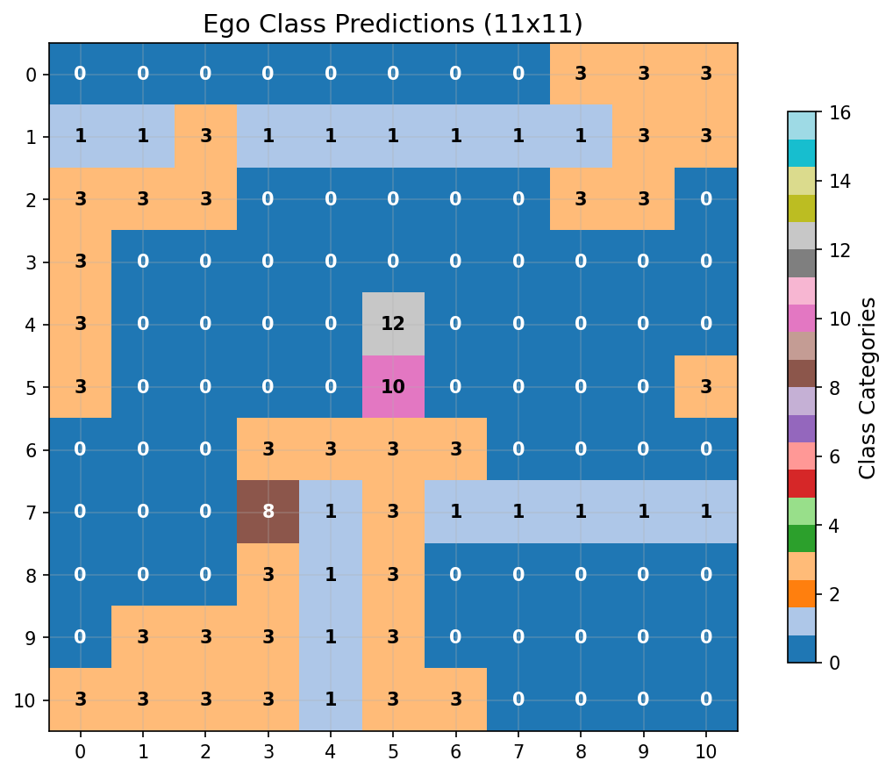 | 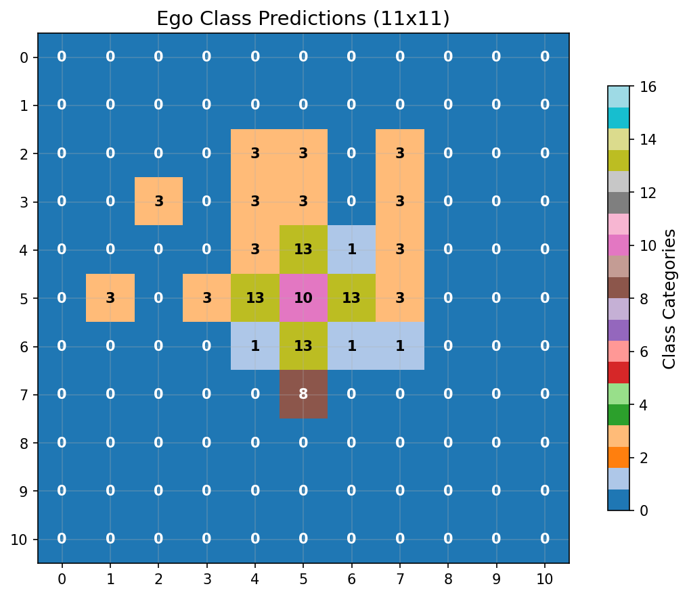 |

**Class Accuracy**: 0.603

### Bag Reconstruction

```
Bag Analysis:
========================================

Original Bag (14 items):
------------------------------
  '#' (color  7)
  ')' (color  6)
  '-' (color  3)
  '-' (color  7)
  '.' (color  7)
  '.' (color  8)
  '<' (color  7)
  '>' (color  7)
  '@' (color 15)
  '_' (color  7)
  'd' (color 15)
  '{' (color 12)
  '|' (color  3)
  '|' (color  7)

Reconstructed Bag (14 items):
------------------------------
  '#' (color  7)
  '+' (color  3)
  '-' (color  3)
  '-' (color  7)
  '.' (color  7)
  '.' (color  8)
  '<' (color  7)
  '>' (color  7)
  '@' (color 15)
  '`' (color  7)
  'd' (color 15)
  'f' (color 15)
  '|' (color  3)
  '|' (color  7)

Accuracy Metrics:
------------------------------
  Correctly predicted: 11 items
    '#' (color  7)
    '-' (color  3)
    '-' (color  7)
    '.' (color  7)
    '.' (color  8)
    '<' (color  7)
    '>' (color  7)
    '@' (color 15)
    'd' (color 15)
    '|' (color  3)
    '|' (color  7)
  Missed items: 3 items
    ')' (color  6)
    '_' (color  7)
    '{' (color 12)
  False positives: 3 items
    '+' (color  3)
    '`' (color  7)
    'f' (color 15)

Performance Summary:
------------------------------
  Precision: 0.786 (11/14)
  Recall: 0.786 (11/14)
  F1-Score: 0.786
  Total unique items: 17
```

### Passability & Safety

| Original | Reconstruction |
|---|---|
| 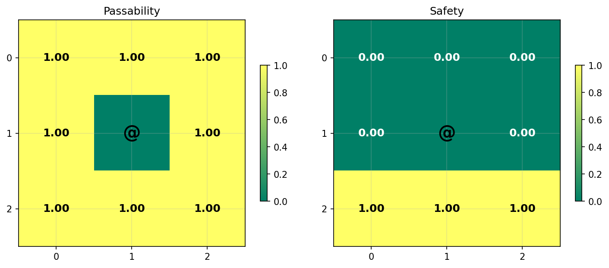 | 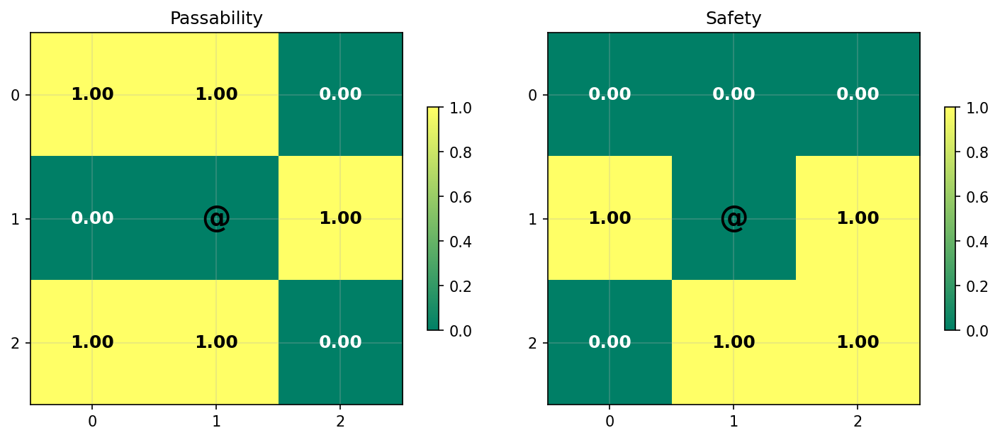 |

================================================================================

## Sample 3

### Ego Map Reconstruction

| Original | Reconstruction |
|---|---|
|  |  |

**Accuracy**: Character: 0.149, Color: 0.603

### Ego Class Reconstruction

| Original | Reconstruction |
|---|---|
| 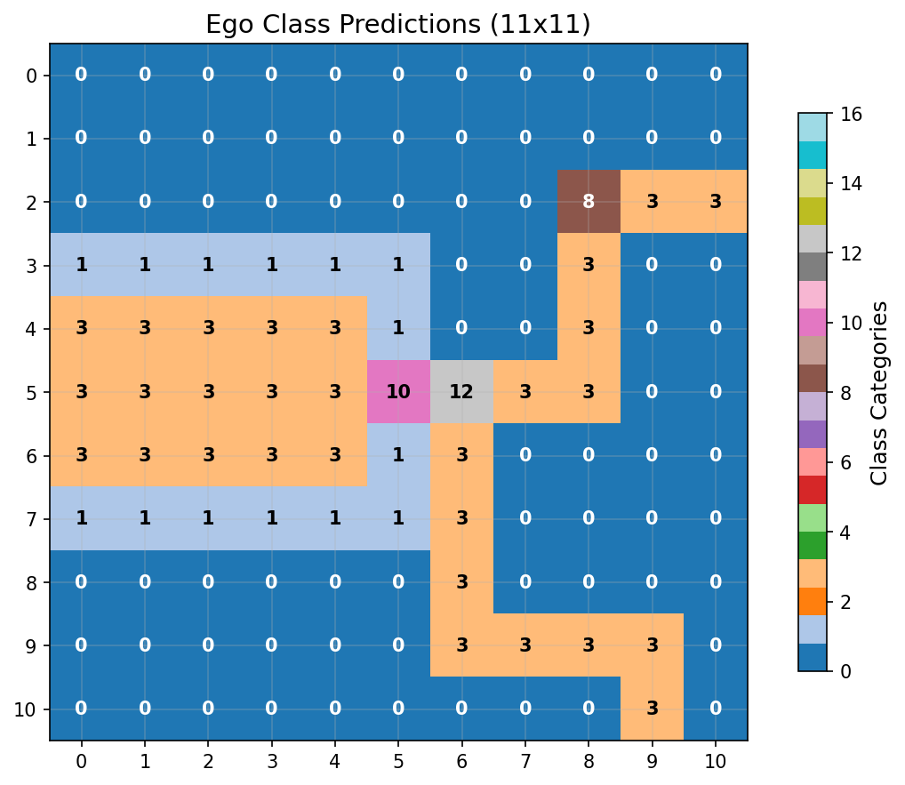 |  |

**Class Accuracy**: 0.653

### Bag Reconstruction

```
Bag Analysis:
========================================

Original Bag (17 items):
------------------------------
  '#' (color  7)
  '%' (color  3)
  '%' (color 10)
  ')' (color  6)
  '*' (color  1)
  '-' (color  3)
  '-' (color  7)
  '.' (color  7)
  '.' (color  8)
  '<' (color  7)
  '@' (color 15)
  'F' (color 10)
  '[' (color  6)
  '^' (color  8)
  '`' (color  7)
  '|' (color  3)
  '|' (color  7)

Reconstructed Bag (13 items):
------------------------------
  '#' (color  7)
  ')' (color  6)
  '-' (color  3)
  '-' (color  7)
  '.' (color  7)
  '.' (color  8)
  '<' (color  7)
  '>' (color  7)
  '@' (color 15)
  '^' (color 12)
  '{' (color 12)
  '|' (color  3)
  '|' (color  7)

Accuracy Metrics:
------------------------------
  Correctly predicted: 10 items
    '#' (color  7)
    ')' (color  6)
    '-' (color  3)
    '-' (color  7)
    '.' (color  7)
    '.' (color  8)
    '<' (color  7)
    '@' (color 15)
    '|' (color  3)
    '|' (color  7)
  Missed items: 7 items
    '%' (color  3)
    '%' (color 10)
    '*' (color  1)
    'F' (color 10)
    '[' (color  6)
    '^' (color  8)
    '`' (color  7)
  False positives: 3 items
    '>' (color  7)
    '^' (color 12)
    '{' (color 12)

Performance Summary:
------------------------------
  Precision: 0.769 (10/13)
  Recall: 0.588 (10/17)
  F1-Score: 0.667
  Total unique items: 20
```

### Passability & Safety

| Original | Reconstruction |
|---|---|
| 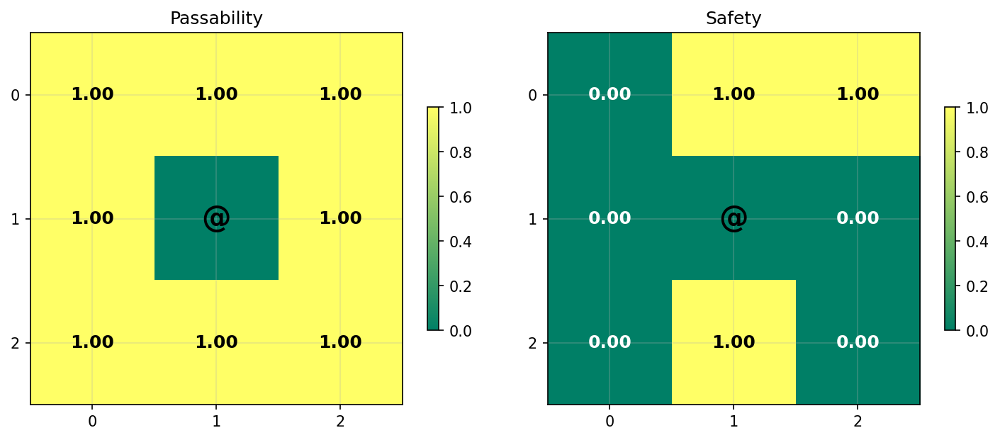 | 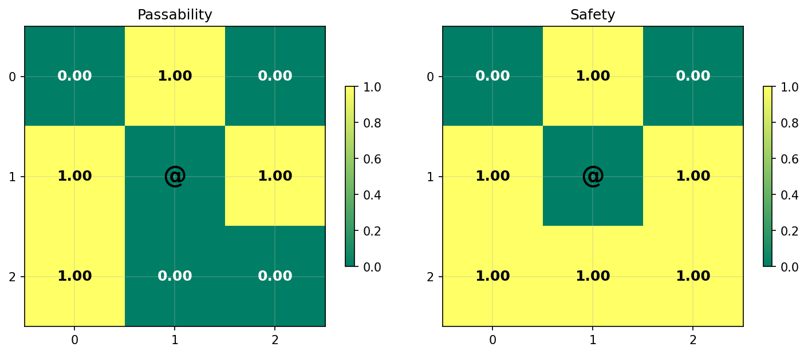 |

================================================================================

## Sample 4

### Ego Map Reconstruction

| Original | Reconstruction |
|---|---|
|  |  |

**Accuracy**: Character: 0.504, Color: 0.603

### Ego Class Reconstruction

| Original | Reconstruction |
|---|---|
| 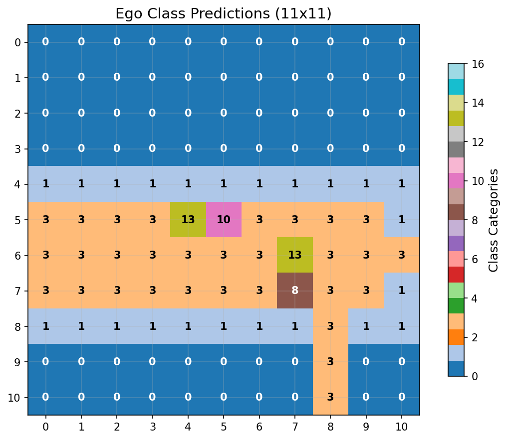 | 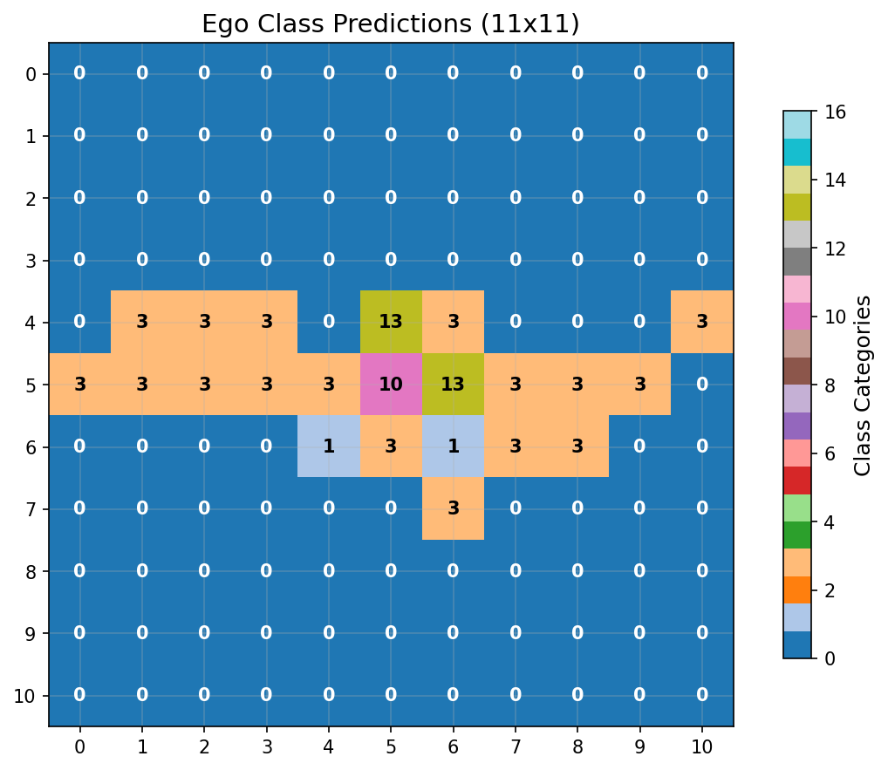 |

**Class Accuracy**: 0.620

### Bag Reconstruction

```
Bag Analysis:
========================================

Original Bag (24 items):
------------------------------
  '#' (color  7)
  '%' (color  3)
  '(' (color  3)
  ')' (color  3)
  ')' (color  6)
  '*' (color  7)
  '-' (color  3)
  '-' (color  7)
  '.' (color  7)
  '.' (color  8)
  '<' (color  7)
  '>' (color  7)
  '@' (color 15)
  '[' (color  8)
  '^' (color  3)
  '^' (color  8)
  '^' (color 12)
  '_' (color  7)
  '`' (color  7)
  'd' (color 15)
  'o' (color 15)
  '|' (color  3)
  '|' (color  7)
  '|' (color 15)

Reconstructed Bag (15 items):
------------------------------
  '#' (color  7)
  '%' (color  3)
  ')' (color  6)
  '+' (color 15)
  '-' (color  3)
  '-' (color  7)
  '.' (color  7)
  '.' (color  8)
  '<' (color  7)
  '>' (color  7)
  '@' (color 15)
  '`' (color  7)
  'd' (color 15)
  '|' (color  3)
  '|' (color  7)

Accuracy Metrics:
------------------------------
  Correctly predicted: 14 items
    '#' (color  7)
    '%' (color  3)
    ')' (color  6)
    '-' (color  3)
    '-' (color  7)
    '.' (color  7)
    '.' (color  8)
    '<' (color  7)
    '>' (color  7)
    '@' (color 15)
    '`' (color  7)
    'd' (color 15)
    '|' (color  3)
    '|' (color  7)
  Missed items: 10 items
    '(' (color  3)
    ')' (color  3)
    '*' (color  7)
    '[' (color  8)
    '^' (color  3)
    '^' (color  8)
    '^' (color 12)
    '_' (color  7)
    'o' (color 15)
    '|' (color 15)
  False positives: 1 items
    '+' (color 15)

Performance Summary:
------------------------------
  Precision: 0.933 (14/15)
  Recall: 0.583 (14/24)
  F1-Score: 0.718
  Total unique items: 25
```

### Passability & Safety

| Original | Reconstruction |
|---|---|
| 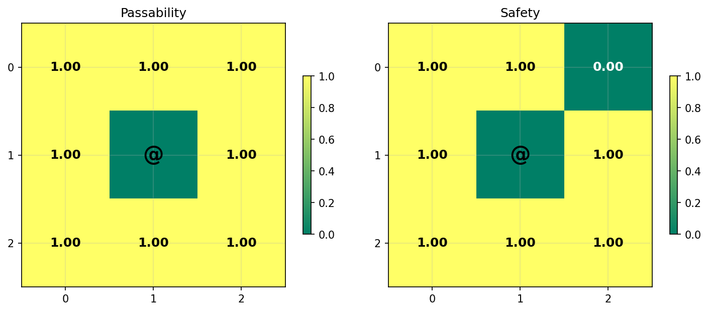 | 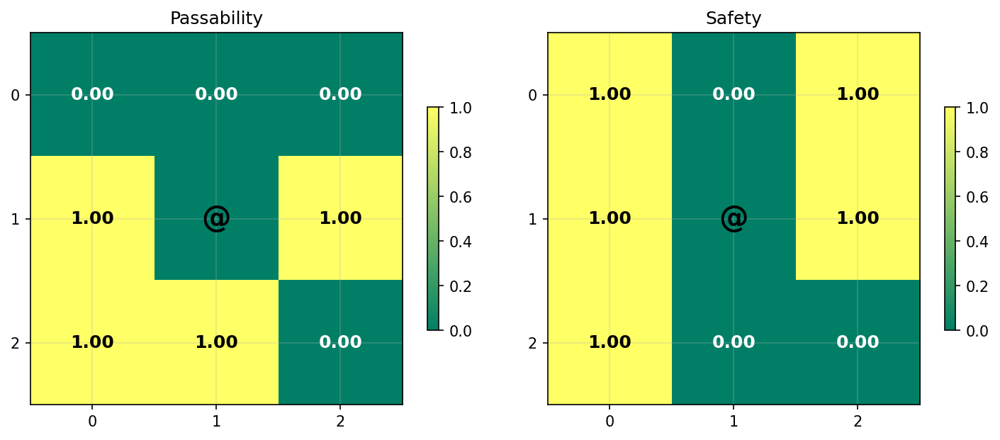 |

================================================================================

## Sample 5

### Ego Map Reconstruction

| Original | Reconstruction |
|---|---|
|  |  |

**Accuracy**: Character: 0.231, Color: 0.496

### Ego Class Reconstruction

| Original | Reconstruction |
|---|---|
| 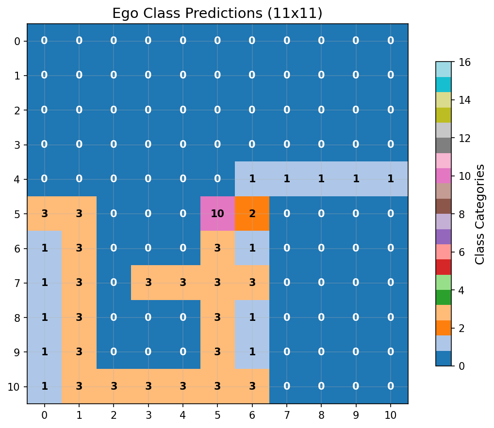 | 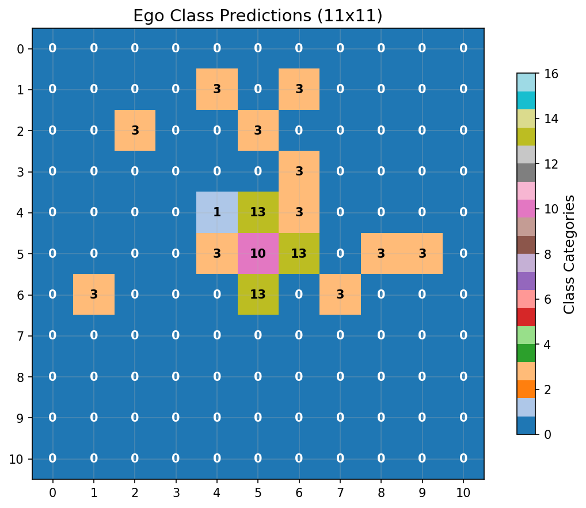 |

**Class Accuracy**: 0.446

### Bag Reconstruction

```
Bag Analysis:
========================================

Original Bag (14 items):
------------------------------
  '#' (color  6)
  '#' (color  7)
  '-' (color  3)
  '-' (color  7)
  '.' (color  7)
  '.' (color  8)
  '<' (color  7)
  '>' (color  7)
  '@' (color 15)
  '`' (color  7)
  'f' (color 15)
  '{' (color 12)
  '|' (color  3)
  '|' (color  7)

Reconstructed Bag (12 items):
------------------------------
  '#' (color  7)
  '-' (color  3)
  '-' (color  7)
  '.' (color  7)
  '.' (color  8)
  '<' (color  7)
  '>' (color  7)
  '@' (color 15)
  '`' (color  7)
  'd' (color 15)
  '|' (color  3)
  '|' (color  7)

Accuracy Metrics:
------------------------------
  Correctly predicted: 11 items
    '#' (color  7)
    '-' (color  3)
    '-' (color  7)
    '.' (color  7)
    '.' (color  8)
    '<' (color  7)
    '>' (color  7)
    '@' (color 15)
    '`' (color  7)
    '|' (color  3)
    '|' (color  7)
  Missed items: 3 items
    '#' (color  6)
    'f' (color 15)
    '{' (color 12)
  False positives: 1 items
    'd' (color 15)

Performance Summary:
------------------------------
  Precision: 0.917 (11/12)
  Recall: 0.786 (11/14)
  F1-Score: 0.846
  Total unique items: 15
```

### Passability & Safety

| Original | Reconstruction |
|---|---|
| 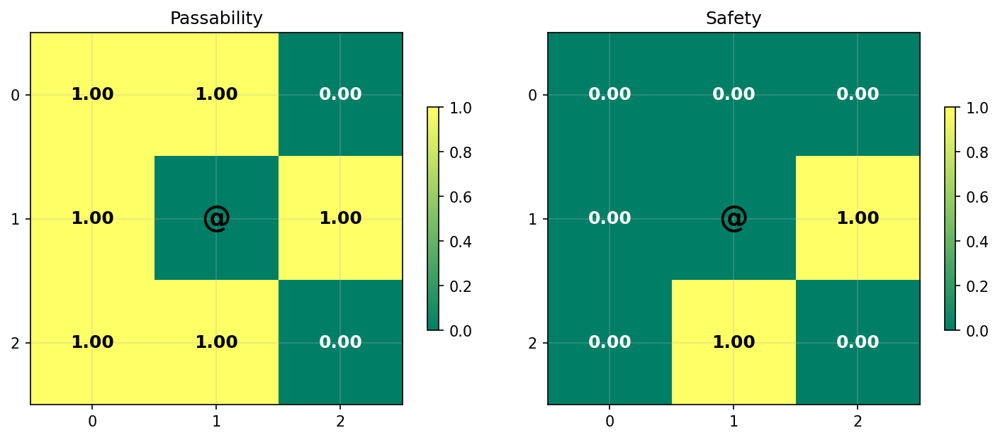 | 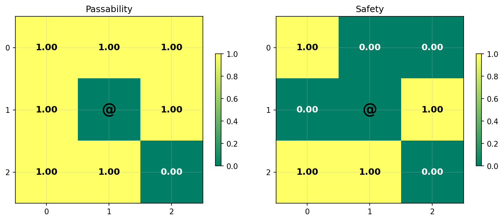 |

================================================================================

## Sample 6

### Ego Map Reconstruction

| Original | Reconstruction |
|---|---|
|  |  |

**Accuracy**: Character: 0.298, Color: 0.628

### Ego Class Reconstruction

| Original | Reconstruction |
|---|---|
| 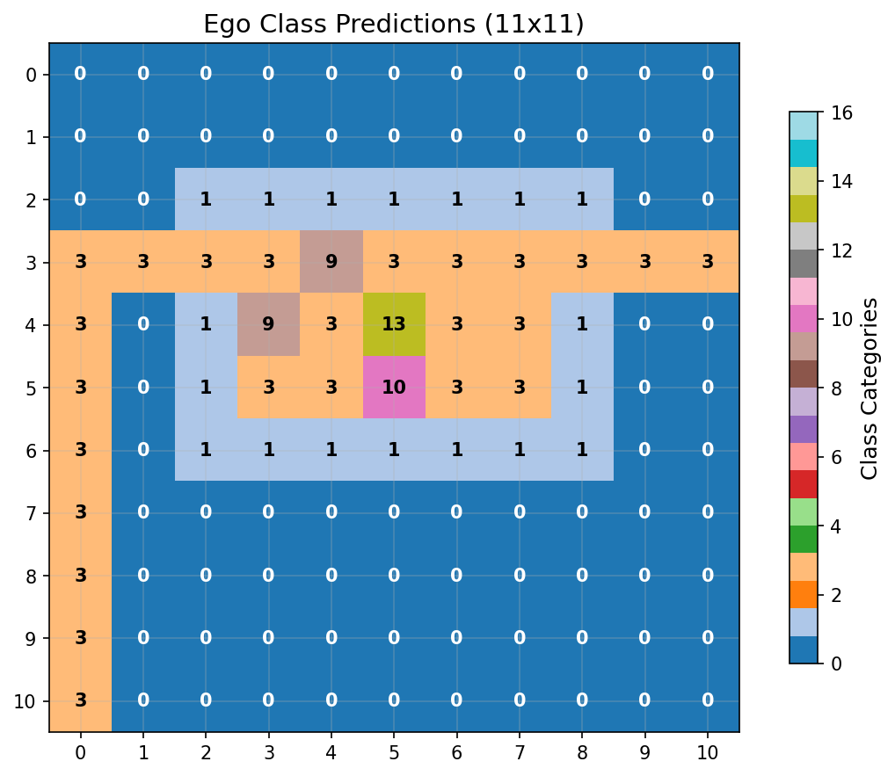 |  |

**Class Accuracy**: 0.579

### Bag Reconstruction

```
Bag Analysis:
========================================

Original Bag (16 items):
------------------------------
  '#' (color  7)
  '*' (color  8)
  '-' (color  3)
  '-' (color  7)
  '.' (color  7)
  '.' (color  8)
  '<' (color  7)
  '>' (color  7)
  '@' (color 15)
  '[' (color  3)
  '[' (color  8)
  '^' (color  6)
  '`' (color  7)
  'd' (color 15)
  '|' (color  3)
  '|' (color  7)

Reconstructed Bag (13 items):
------------------------------
  '#' (color  7)
  '-' (color  3)
  '-' (color  7)
  '.' (color  7)
  '.' (color  8)
  '<' (color  7)
  '>' (color  7)
  '@' (color 15)
  '[' (color  3)
  '`' (color  7)
  '{' (color 12)
  '|' (color  3)
  '|' (color  7)

Accuracy Metrics:
------------------------------
  Correctly predicted: 12 items
    '#' (color  7)
    '-' (color  3)
    '-' (color  7)
    '.' (color  7)
    '.' (color  8)
    '<' (color  7)
    '>' (color  7)
    '@' (color 15)
    '[' (color  3)
    '`' (color  7)
    '|' (color  3)
    '|' (color  7)
  Missed items: 4 items
    '*' (color  8)
    '[' (color  8)
    '^' (color  6)
    'd' (color 15)
  False positives: 1 items
    '{' (color 12)

Performance Summary:
------------------------------
  Precision: 0.923 (12/13)
  Recall: 0.750 (12/16)
  F1-Score: 0.828
  Total unique items: 17
```

### Passability & Safety

| Original | Reconstruction |
|---|---|
| 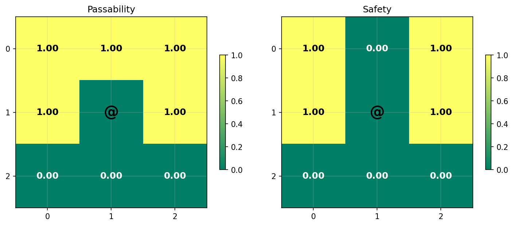 | 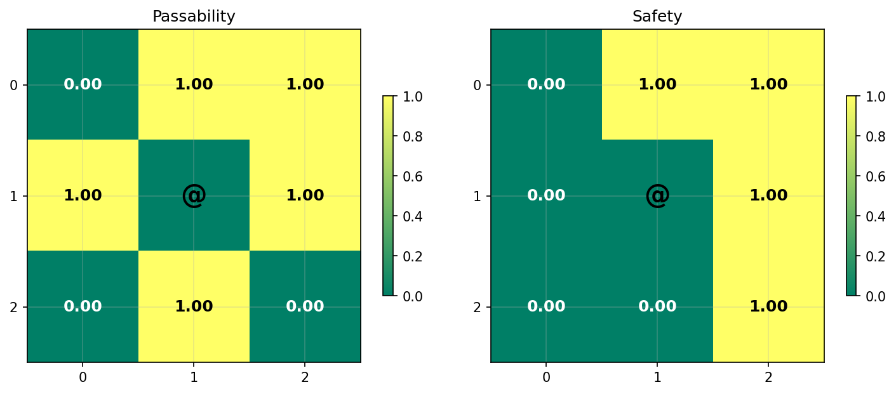 |

================================================================================

## Sample 7

### Ego Map Reconstruction

| Original | Reconstruction |
|---|---|
|  |  |

**Accuracy**: Character: 0.364, Color: 0.686

### Ego Class Reconstruction

| Original | Reconstruction |
|---|---|
| 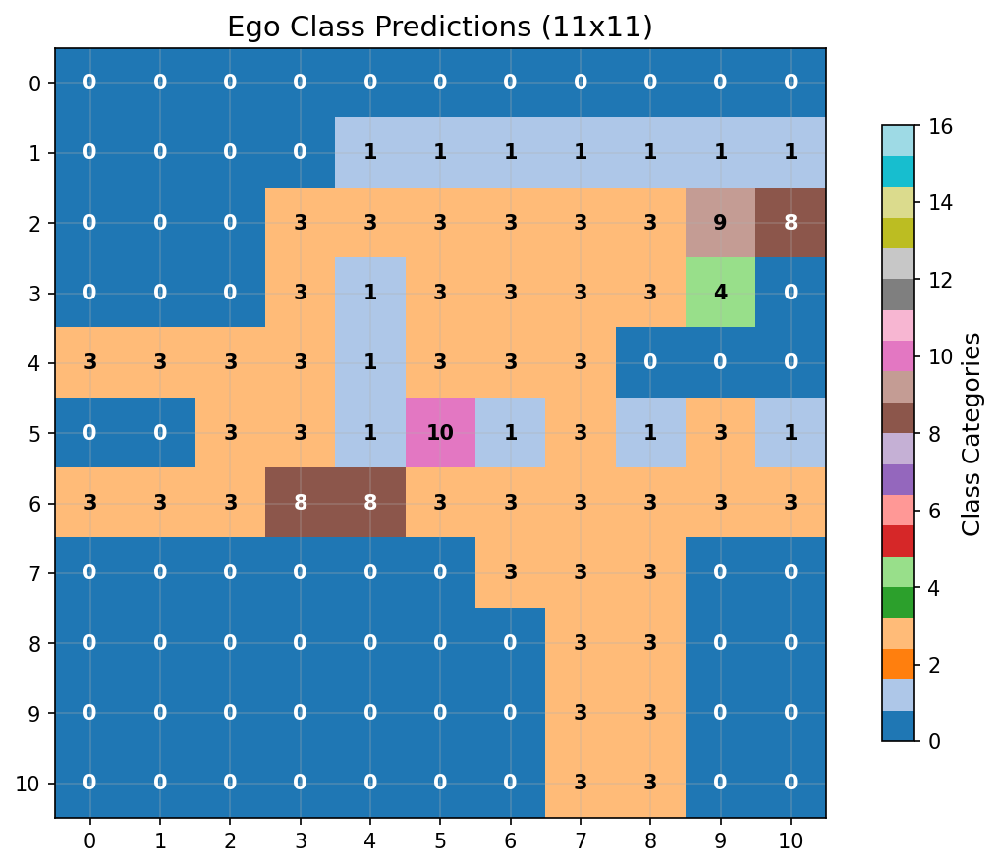 | 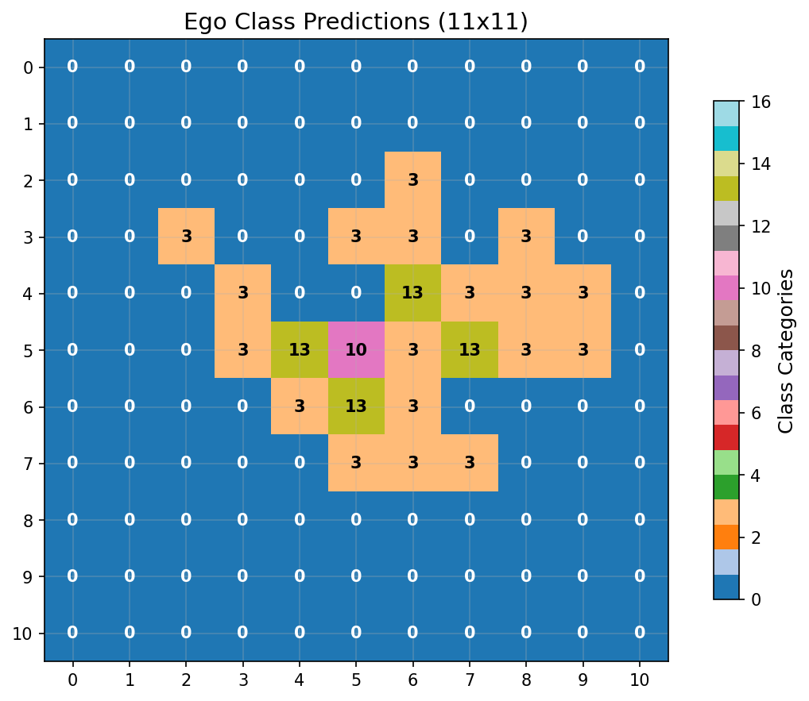 |

**Class Accuracy**: 0.760

### Bag Reconstruction

```
Bag Analysis:
========================================

Original Bag (18 items):
------------------------------
  '#' (color  7)
  '(' (color  3)
  ')' (color  3)
  ')' (color  6)
  '*' (color  8)
  '+' (color  5)
  '-' (color  3)
  '-' (color  7)
  '.' (color  7)
  '.' (color  8)
  '>' (color  7)
  '@' (color 15)
  '[' (color  3)
  '^' (color  5)
  '{' (color 12)
  '|' (color  3)
  '|' (color  7)
  '|' (color 15)

Reconstructed Bag (13 items):
------------------------------
  '#' (color  7)
  ')' (color  6)
  '-' (color  3)
  '-' (color  7)
  '.' (color  7)
  '.' (color  8)
  '<' (color  7)
  '>' (color  7)
  '@' (color 15)
  '`' (color  7)
  '{' (color 12)
  '|' (color  3)
  '|' (color  7)

Accuracy Metrics:
------------------------------
  Correctly predicted: 11 items
    '#' (color  7)
    ')' (color  6)
    '-' (color  3)
    '-' (color  7)
    '.' (color  7)
    '.' (color  8)
    '>' (color  7)
    '@' (color 15)
    '{' (color 12)
    '|' (color  3)
    '|' (color  7)
  Missed items: 7 items
    '(' (color  3)
    ')' (color  3)
    '*' (color  8)
    '+' (color  5)
    '[' (color  3)
    '^' (color  5)
    '|' (color 15)
  False positives: 2 items
    '<' (color  7)
    '`' (color  7)

Performance Summary:
------------------------------
  Precision: 0.846 (11/13)
  Recall: 0.611 (11/18)
  F1-Score: 0.710
  Total unique items: 20
```

### Passability & Safety

| Original | Reconstruction |
|---|---|
| 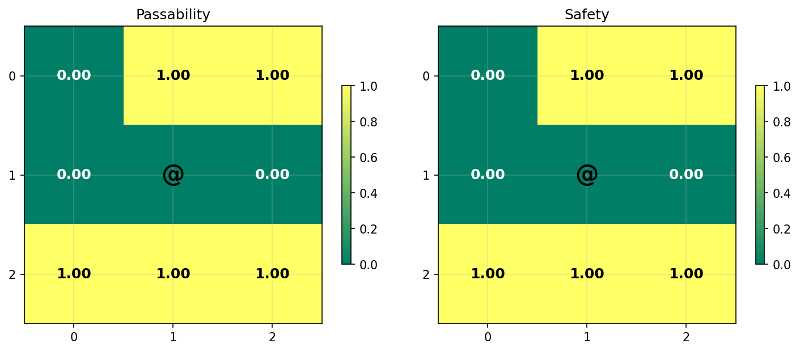 | 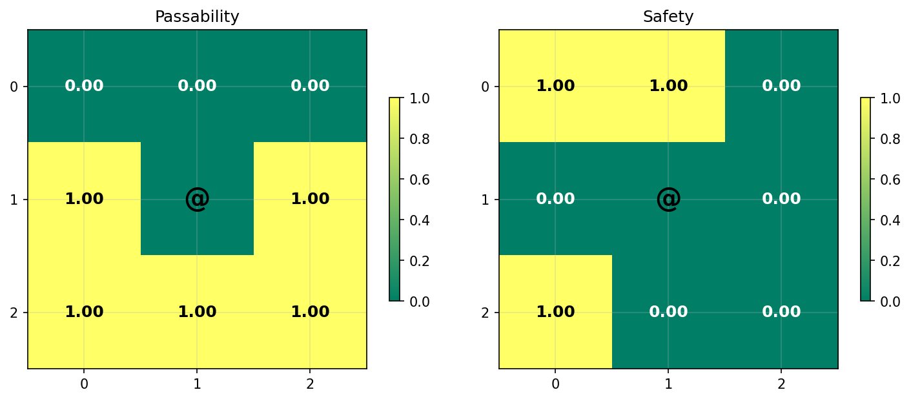 |

================================================================================

## Sample 8

### Ego Map Reconstruction

| Original | Reconstruction |
|---|---|
|  |  |

**Accuracy**: Character: 0.322, Color: 0.860

### Ego Class Reconstruction

| Original | Reconstruction |
|---|---|
| 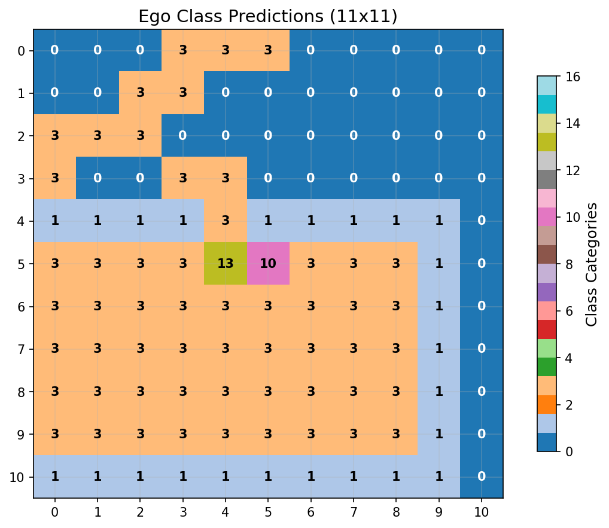 | 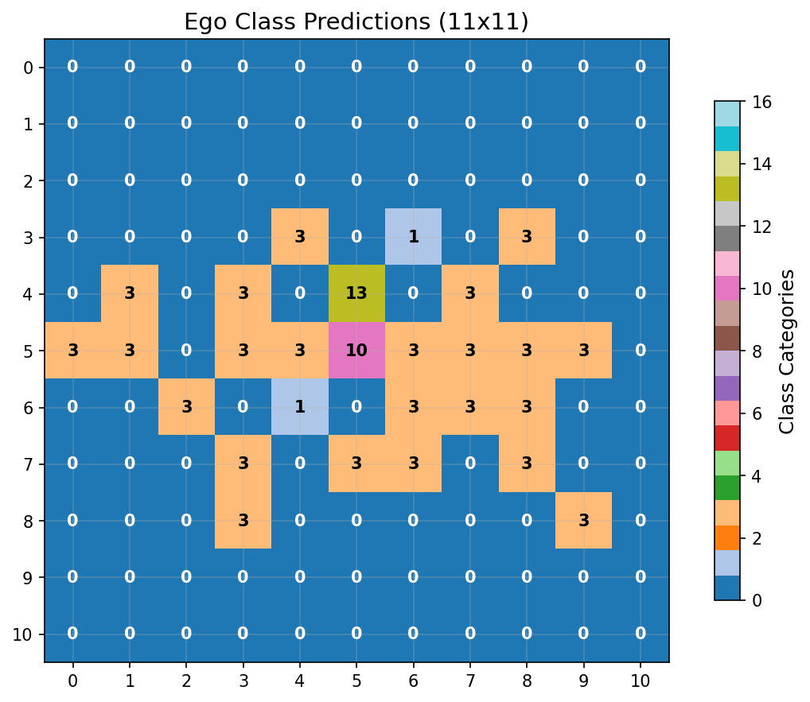 |

**Class Accuracy**: 0.810

### Bag Reconstruction

```
Bag Analysis:
========================================

Original Bag (17 items):
------------------------------
  '#' (color  7)
  '*' (color  1)
  '*' (color  7)
  '+' (color 10)
  '-' (color  3)
  '-' (color  7)
  '.' (color  7)
  '.' (color  8)
  '<' (color  7)
  '>' (color  7)
  '@' (color 15)
  '[' (color  8)
  '`' (color  7)
  'd' (color 15)
  'r' (color 15)
  '|' (color  3)
  '|' (color  7)

Reconstructed Bag (11 items):
------------------------------
  '#' (color  7)
  '-' (color  3)
  '-' (color  7)
  '.' (color  7)
  '.' (color  8)
  '<' (color  7)
  '>' (color  7)
  '@' (color 15)
  '`' (color  7)
  '|' (color  3)
  '|' (color  7)

Accuracy Metrics:
------------------------------
  Correctly predicted: 11 items
    '#' (color  7)
    '-' (color  3)
    '-' (color  7)
    '.' (color  7)
    '.' (color  8)
    '<' (color  7)
    '>' (color  7)
    '@' (color 15)
    '`' (color  7)
    '|' (color  3)
    '|' (color  7)
  Missed items: 6 items
    '*' (color  1)
    '*' (color  7)
    '+' (color 10)
    '[' (color  8)
    'd' (color 15)
    'r' (color 15)
  False positives: 0 items

Performance Summary:
------------------------------
  Precision: 1.000 (11/11)
  Recall: 0.647 (11/17)
  F1-Score: 0.786
  Total unique items: 17
```

### Passability & Safety

| Original | Reconstruction |
|---|---|
| 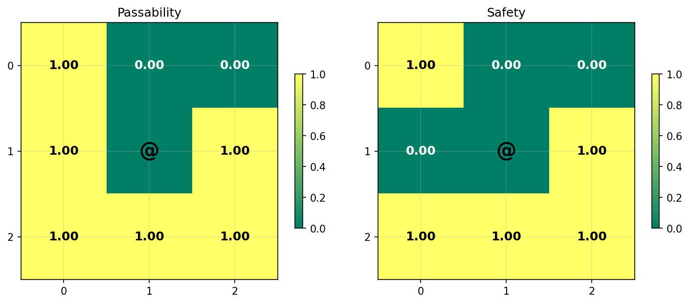 | 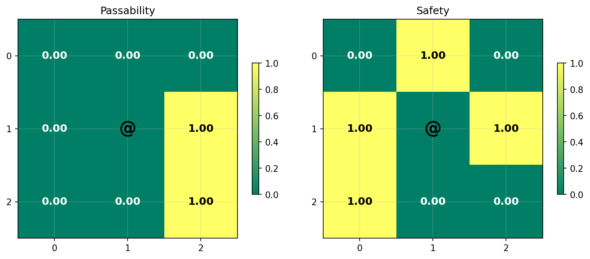 |

================================================================================

## Sample 9

### Ego Map Reconstruction

| Original | Reconstruction |
|---|---|
|  |  |

**Accuracy**: Character: 0.149, Color: 0.686

### Ego Class Reconstruction

| Original | Reconstruction |
|---|---|
| 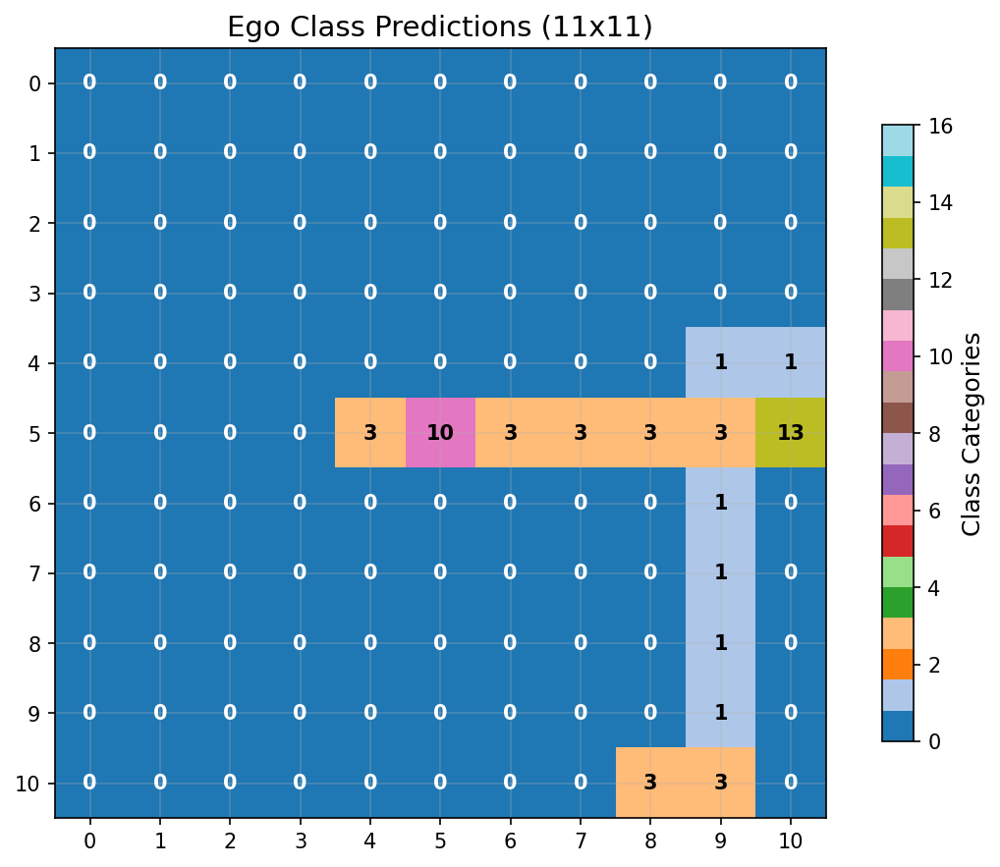 | 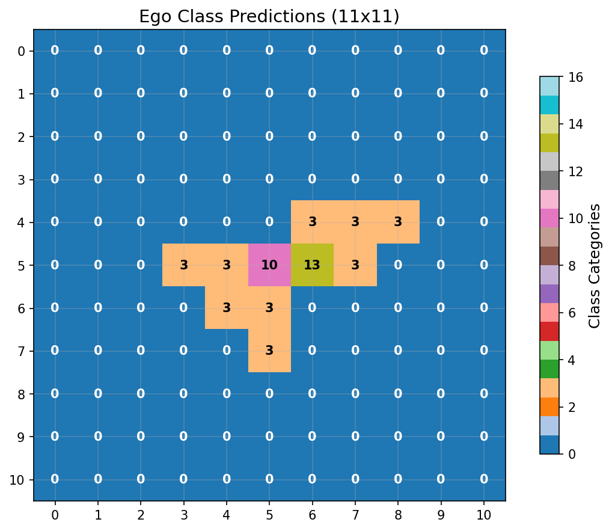 |

**Class Accuracy**: 0.702

### Bag Reconstruction

```
Bag Analysis:
========================================

Original Bag (14 items):
------------------------------
  '#' (color  7)
  ')' (color  6)
  '+' (color  3)
  '-' (color  3)
  '-' (color  7)
  '.' (color  7)
  '.' (color  8)
  '<' (color  7)
  '@' (color 15)
  'Z' (color  3)
  '^' (color  8)
  '`' (color  7)
  'o' (color  7)
  '|' (color  7)

Reconstructed Bag (14 items):
------------------------------
  '#' (color  7)
  '(' (color  3)
  ')' (color  6)
  '-' (color  3)
  '-' (color  7)
  '.' (color  7)
  '.' (color  8)
  '<' (color  7)
  '>' (color  7)
  '@' (color 15)
  '[' (color  3)
  '`' (color  7)
  '|' (color  3)
  '|' (color  7)

Accuracy Metrics:
------------------------------
  Correctly predicted: 10 items
    '#' (color  7)
    ')' (color  6)
    '-' (color  3)
    '-' (color  7)
    '.' (color  7)
    '.' (color  8)
    '<' (color  7)
    '@' (color 15)
    '`' (color  7)
    '|' (color  7)
  Missed items: 4 items
    '+' (color  3)
    'Z' (color  3)
    '^' (color  8)
    'o' (color  7)
  False positives: 4 items
    '(' (color  3)
    '>' (color  7)
    '[' (color  3)
    '|' (color  3)

Performance Summary:
------------------------------
  Precision: 0.714 (10/14)
  Recall: 0.714 (10/14)
  F1-Score: 0.714
  Total unique items: 18
```

### Passability & Safety

| Original | Reconstruction |
|---|---|
| 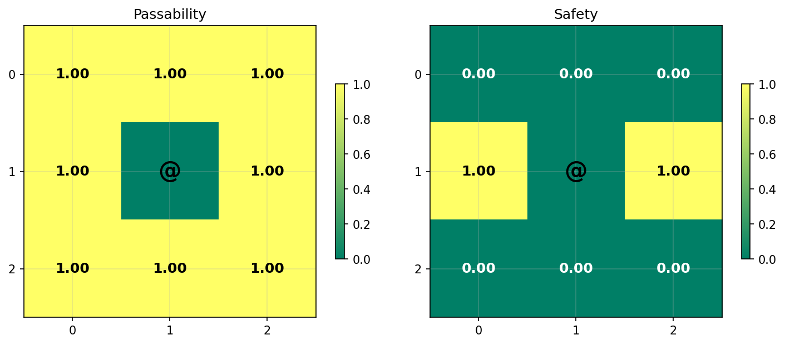 | 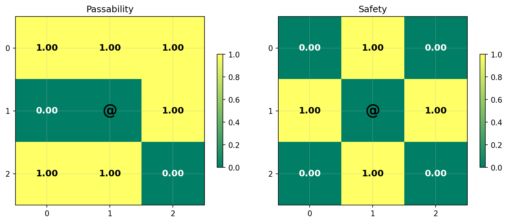 |

================================================================================

## Sample 10

### Ego Map Reconstruction

| Original | Reconstruction |
|---|---|
|  |  |

**Accuracy**: Character: 0.256, Color: 0.273

### Ego Class Reconstruction

| Original | Reconstruction |
|---|---|
| 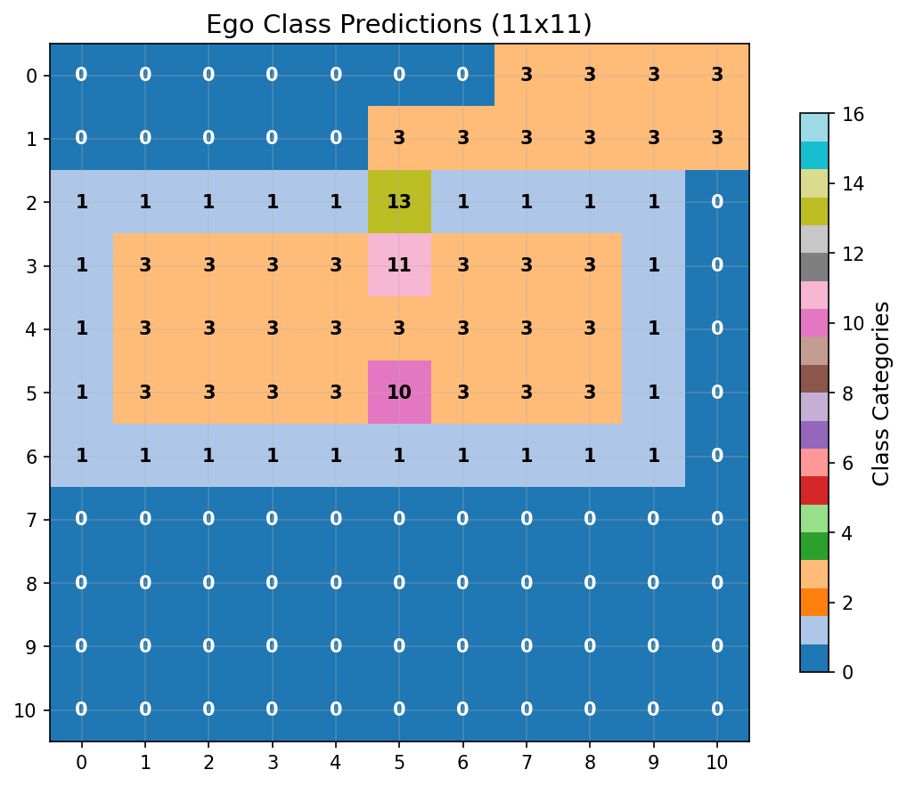 | 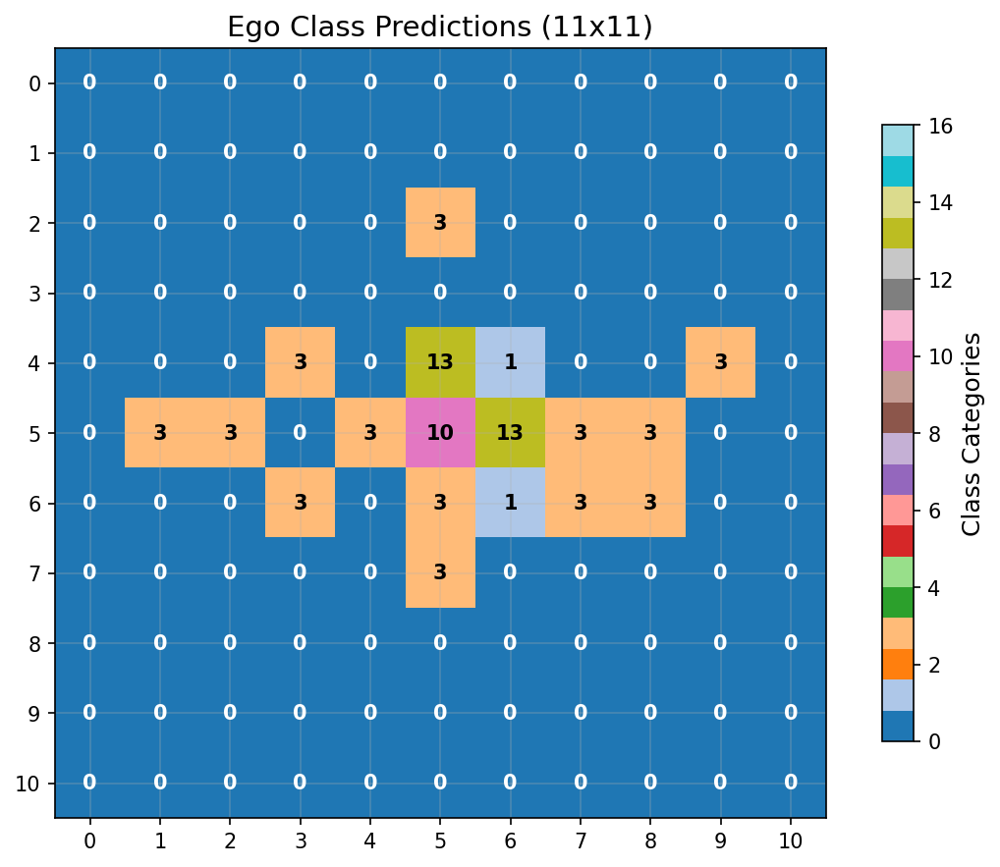 |

**Class Accuracy**: 0.545

### Bag Reconstruction

```
Bag Analysis:
========================================

Original Bag (18 items):
------------------------------
  '#' (color  7)
  '(' (color  3)
  ')' (color  6)
  '*' (color  1)
  '+' (color  2)
  '+' (color  5)
  '-' (color  3)
  '-' (color  7)
  '.' (color  7)
  '.' (color  8)
  '<' (color  7)
  '>' (color  7)
  '@' (color 15)
  '[' (color  3)
  '^' (color 12)
  '`' (color  7)
  '|' (color  3)
  '|' (color  7)

Reconstructed Bag (14 items):
------------------------------
  '#' (color  7)
  ')' (color  6)
  '*' (color  7)
  '+' (color  1)
  '-' (color  3)
  '-' (color  7)
  '.' (color  7)
  '.' (color  8)
  '<' (color  7)
  '>' (color  7)
  '@' (color 15)
  '`' (color  7)
  '|' (color  3)
  '|' (color  7)

Accuracy Metrics:
------------------------------
  Correctly predicted: 12 items
    '#' (color  7)
    ')' (color  6)
    '-' (color  3)
    '-' (color  7)
    '.' (color  7)
    '.' (color  8)
    '<' (color  7)
    '>' (color  7)
    '@' (color 15)
    '`' (color  7)
    '|' (color  3)
    '|' (color  7)
  Missed items: 6 items
    '(' (color  3)
    '*' (color  1)
    '+' (color  2)
    '+' (color  5)
    '[' (color  3)
    '^' (color 12)
  False positives: 2 items
    '*' (color  7)
    '+' (color  1)

Performance Summary:
------------------------------
  Precision: 0.857 (12/14)
  Recall: 0.667 (12/18)
  F1-Score: 0.750
  Total unique items: 20
```

### Passability & Safety

| Original | Reconstruction |
|---|---|
| 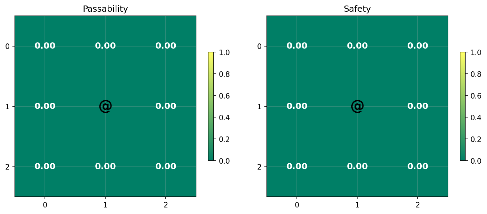 | 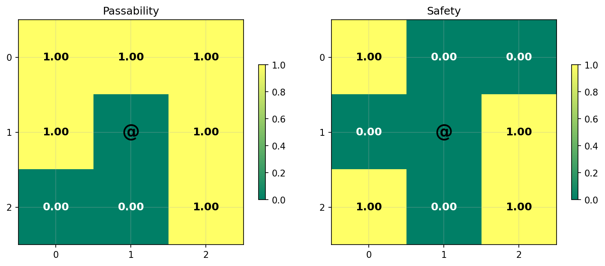 |

## Overall Statistics

- **Average Character Accuracy**: 0.304
- **Average Color Accuracy**: 0.607
- **Total Samples**: 10
