# Enhanced VAE Reconstruction Comparison

_Generated: 2025-09-27T20:45:27_

This analysis includes the following reconstructions:
- **Ego View**: Character, color, and class predictions in ego-centric window
- **Bag Elements**: High-probability glyph elements
- **Passability/Safety**: 3x3 grids around hero position

## Sample 1

### Ego Map Reconstruction

| Original | Reconstruction |
|---|---|
| 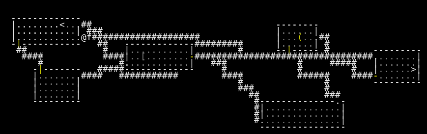 | 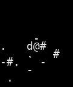 |

**Accuracy**: Character: 0.264, Color: 0.719

### Ego Class Reconstruction

| Original | Reconstruction |
|---|---|
| 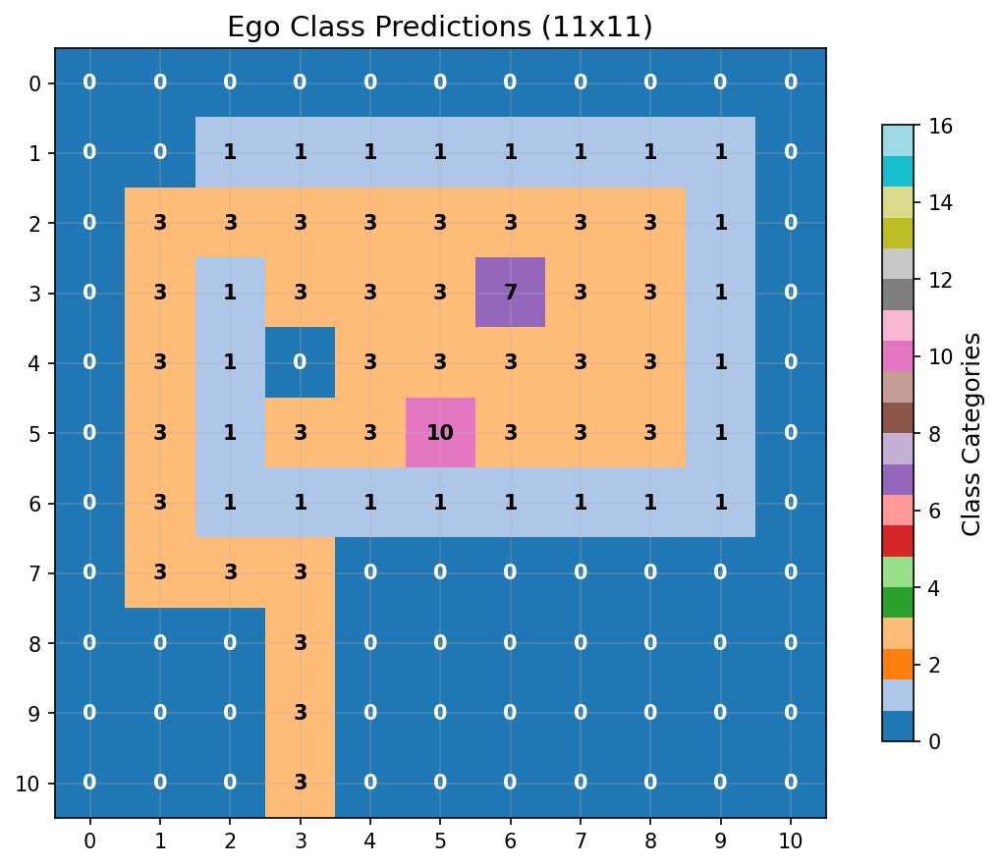 | 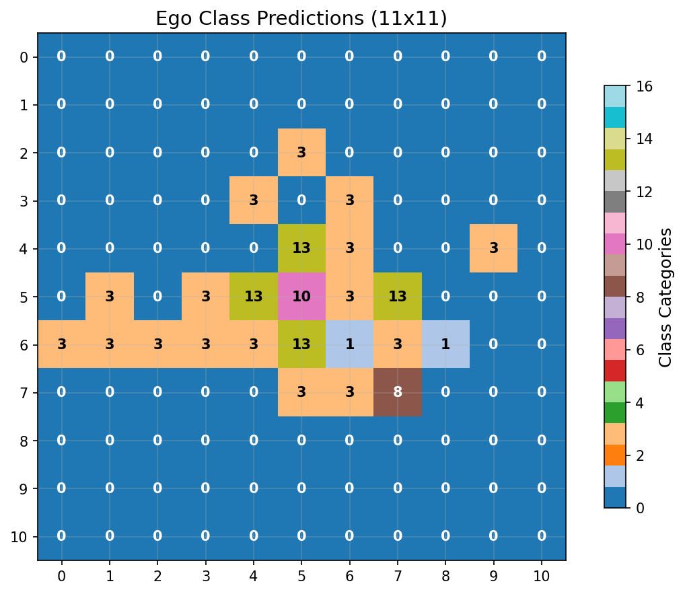 |

**Class Accuracy**: 0.653

### Bag Reconstruction

```
Bag Analysis:
========================================

Original Bag (15 items):
------------------------------
  '#' (color  7)
  '(' (color  3)
  ')' (color  6)
  '*' (color  7)
  '-' (color  3)
  '-' (color  7)
  '.' (color  7)
  '.' (color  8)
  '<' (color  7)
  '>' (color  7)
  '@' (color 15)
  '^' (color  3)
  '^' (color 12)
  '|' (color  3)
  '|' (color  7)

Reconstructed Bag (19 items):
------------------------------
  '!' (color  6)
  '#' (color  7)
  ')' (color  6)
  '*' (color  7)
  '-' (color  3)
  '-' (color  7)
  '.' (color  7)
  '.' (color  8)
  ':' (color 15)
  '<' (color  7)
  '>' (color  7)
  '@' (color 15)
  'F' (color 15)
  '[' (color  3)
  '^' (color  3)
  '^' (color  8)
  'd' (color 15)
  '|' (color  3)
  '|' (color  7)

Accuracy Metrics:
------------------------------
  Correctly predicted: 13 items
    '#' (color  7)
    ')' (color  6)
    '*' (color  7)
    '-' (color  3)
    '-' (color  7)
    '.' (color  7)
    '.' (color  8)
    '<' (color  7)
    '>' (color  7)
    '@' (color 15)
    '^' (color  3)
    '|' (color  3)
    '|' (color  7)
  Missed items: 2 items
    '(' (color  3)
    '^' (color 12)
  False positives: 6 items
    '!' (color  6)
    ':' (color 15)
    'F' (color 15)
    '[' (color  3)
    '^' (color  8)
    'd' (color 15)

Performance Summary:
------------------------------
  Precision: 0.684 (13/19)
  Recall: 0.867 (13/15)
  F1-Score: 0.765
  Total unique items: 21
```

### Passability & Safety

| Original | Reconstruction |
|---|---|
|  | 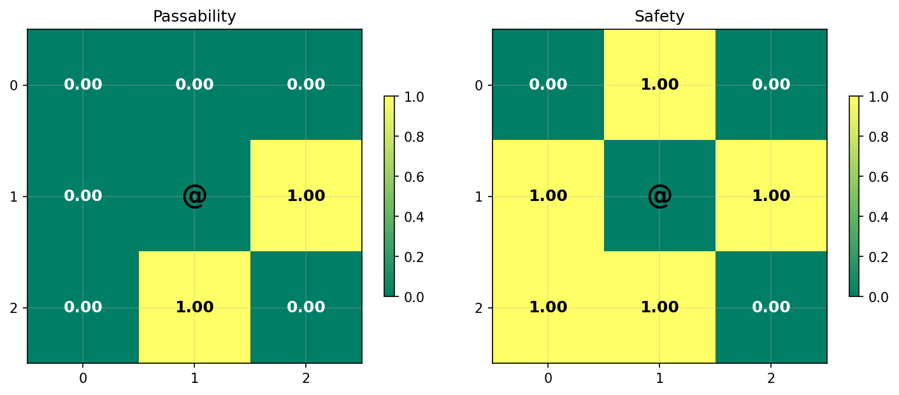 |

================================================================================

## Sample 2

### Ego Map Reconstruction

| Original | Reconstruction |
|---|---|
| 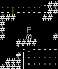 | 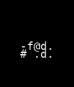 |

**Accuracy**: Character: 0.339, Color: 0.860

### Ego Class Reconstruction

| Original | Reconstruction |
|---|---|
| 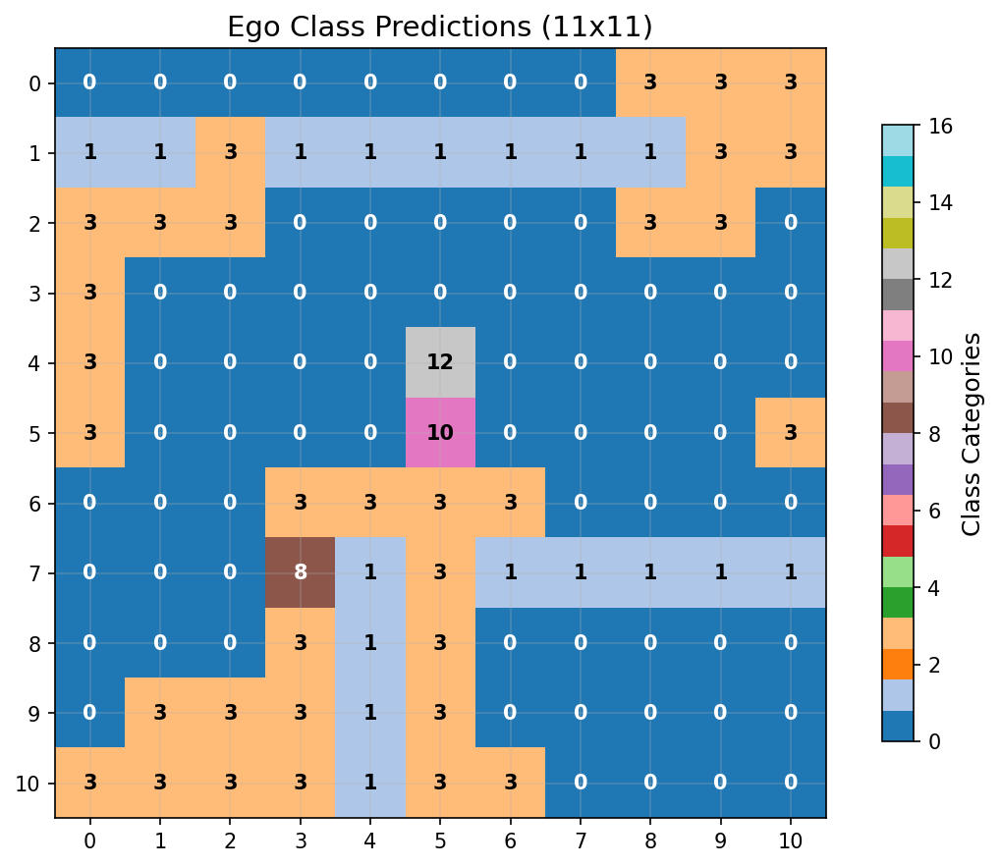 | 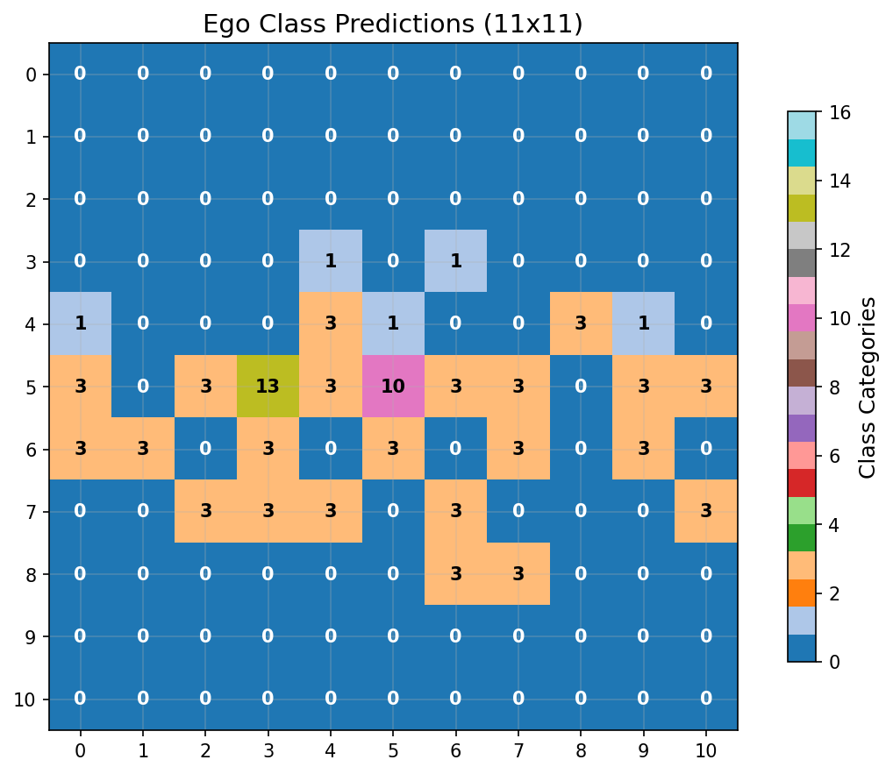 |

**Class Accuracy**: 0.769

### Bag Reconstruction

```
Bag Analysis:
========================================

Original Bag (16 items):
------------------------------
  '#' (color  7)
  '(' (color  3)
  ')' (color  6)
  '-' (color  3)
  '-' (color  7)
  '.' (color  7)
  '.' (color  8)
  ':' (color  2)
  ':' (color 15)
  '<' (color  7)
  '>' (color  7)
  '@' (color 15)
  '[' (color  3)
  '`' (color  7)
  '|' (color  3)
  '|' (color  7)

Reconstructed Bag (20 items):
------------------------------
  '#' (color  7)
  '%' (color  3)
  '%' (color 10)
  '(' (color  3)
  ')' (color  6)
  '*' (color  1)
  '-' (color  3)
  '-' (color  7)
  '.' (color  7)
  '.' (color  8)
  '<' (color  7)
  '>' (color  7)
  '@' (color 15)
  '^' (color  8)
  '_' (color  7)
  '`' (color  7)
  'd' (color 15)
  '{' (color 12)
  '|' (color  3)
  '|' (color  7)

Accuracy Metrics:
------------------------------
  Correctly predicted: 13 items
    '#' (color  7)
    '(' (color  3)
    ')' (color  6)
    '-' (color  3)
    '-' (color  7)
    '.' (color  7)
    '.' (color  8)
    '<' (color  7)
    '>' (color  7)
    '@' (color 15)
    '`' (color  7)
    '|' (color  3)
    '|' (color  7)
  Missed items: 3 items
    ':' (color  2)
    ':' (color 15)
    '[' (color  3)
  False positives: 7 items
    '%' (color  3)
    '%' (color 10)
    '*' (color  1)
    '^' (color  8)
    '_' (color  7)
    'd' (color 15)
    '{' (color 12)

Performance Summary:
------------------------------
  Precision: 0.650 (13/20)
  Recall: 0.812 (13/16)
  F1-Score: 0.722
  Total unique items: 23
```

### Passability & Safety

| Original | Reconstruction |
|---|---|
|  | 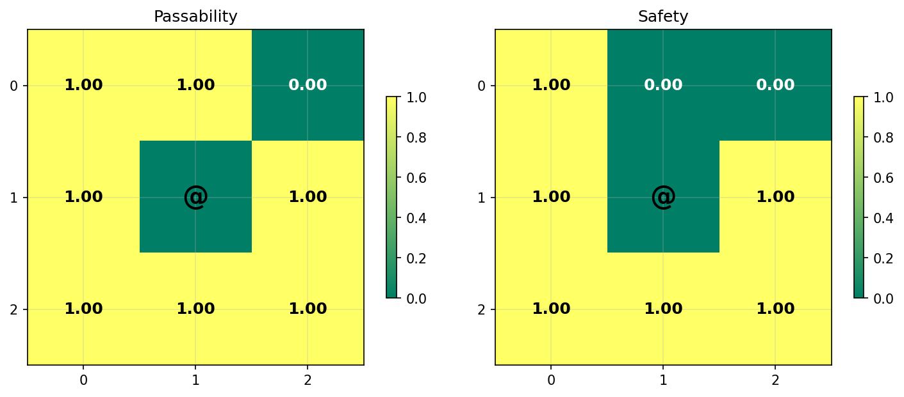 |

================================================================================

## Sample 3

### Ego Map Reconstruction

| Original | Reconstruction |
|---|---|
| 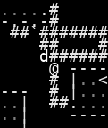 | 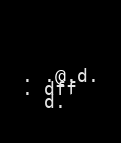 |

**Accuracy**: Character: 0.479, Color: 0.537

### Ego Class Reconstruction

| Original | Reconstruction |
|---|---|
| 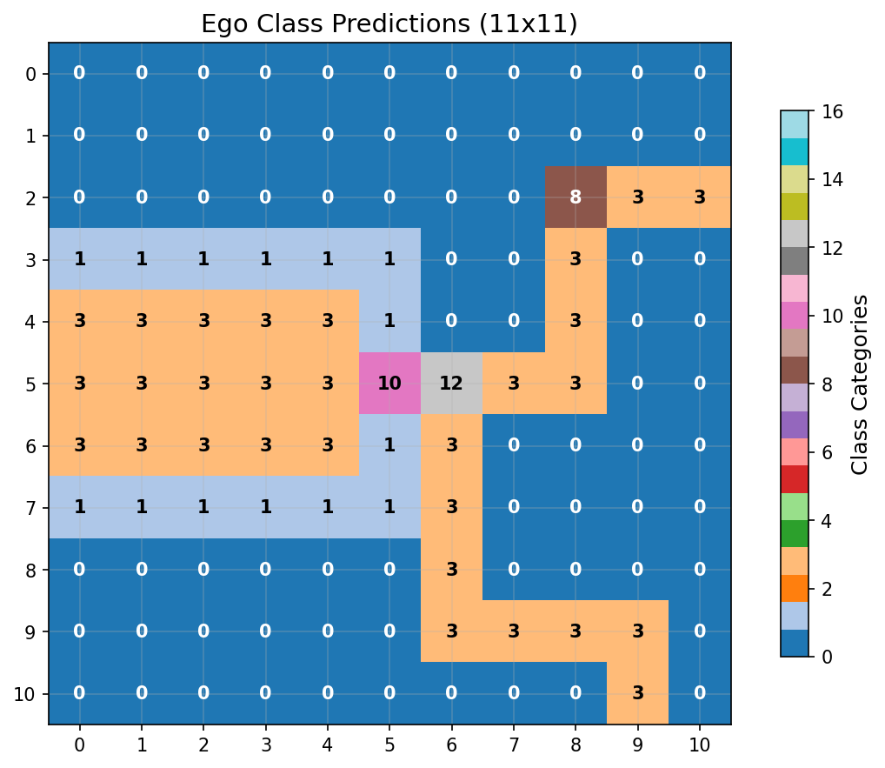 | 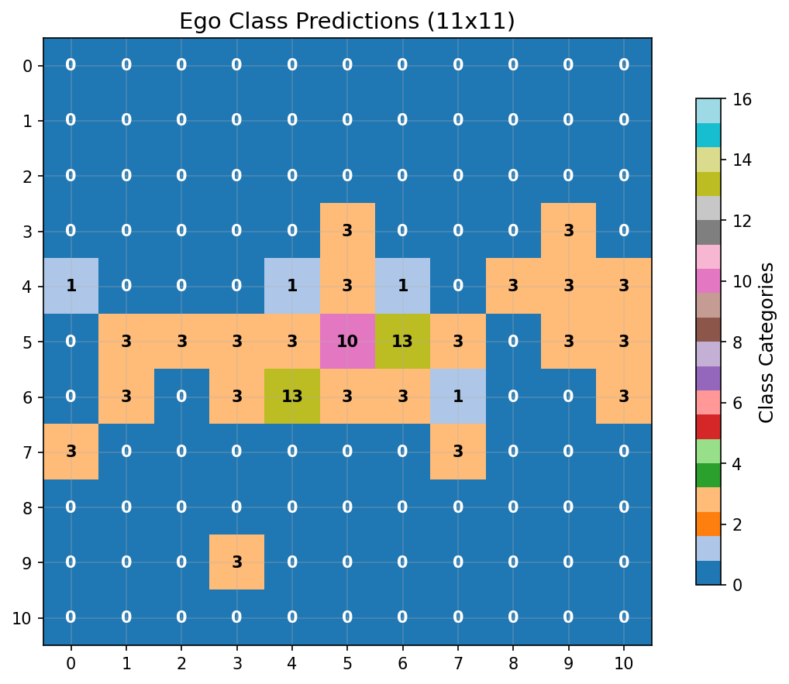 |

**Class Accuracy**: 0.579

### Bag Reconstruction

```
Bag Analysis:
========================================

Original Bag (15 items):
------------------------------
  '#' (color  7)
  '*' (color  8)
  '-' (color  3)
  '-' (color  7)
  '.' (color  7)
  '.' (color  8)
  '<' (color  7)
  '>' (color  7)
  '@' (color 15)
  '[' (color  8)
  '^' (color  6)
  '`' (color  7)
  'd' (color 15)
  '|' (color  3)
  '|' (color  7)

Reconstructed Bag (15 items):
------------------------------
  '#' (color  7)
  '%' (color  3)
  '(' (color  3)
  '-' (color  3)
  '-' (color  7)
  '.' (color  7)
  '.' (color  8)
  '<' (color  7)
  '@' (color 15)
  '^' (color 12)
  '`' (color  7)
  'd' (color 15)
  '{' (color 12)
  '|' (color  3)
  '|' (color  7)

Accuracy Metrics:
------------------------------
  Correctly predicted: 11 items
    '#' (color  7)
    '-' (color  3)
    '-' (color  7)
    '.' (color  7)
    '.' (color  8)
    '<' (color  7)
    '@' (color 15)
    '`' (color  7)
    'd' (color 15)
    '|' (color  3)
    '|' (color  7)
  Missed items: 4 items
    '*' (color  8)
    '>' (color  7)
    '[' (color  8)
    '^' (color  6)
  False positives: 4 items
    '%' (color  3)
    '(' (color  3)
    '^' (color 12)
    '{' (color 12)

Performance Summary:
------------------------------
  Precision: 0.733 (11/15)
  Recall: 0.733 (11/15)
  F1-Score: 0.733
  Total unique items: 19
```

### Passability & Safety

| Original | Reconstruction |
|---|---|
|  | 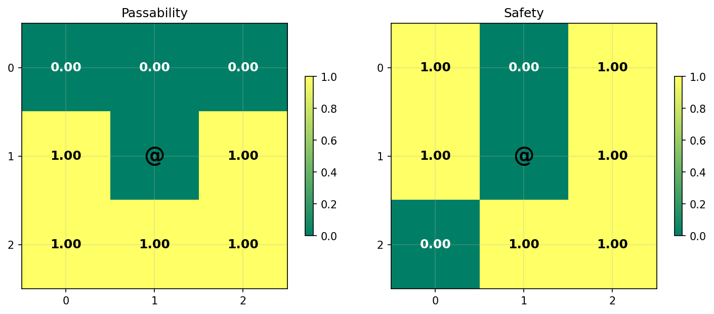 |

================================================================================

## Sample 4

### Ego Map Reconstruction

| Original | Reconstruction |
|---|---|
| 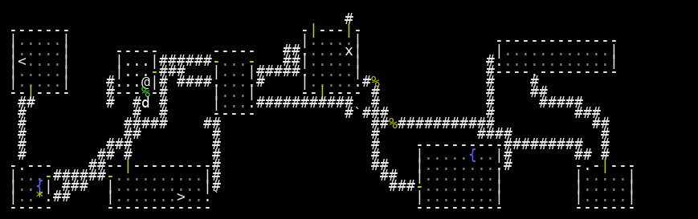 |  |

**Accuracy**: Character: 0.149, Color: 0.653

### Ego Class Reconstruction

| Original | Reconstruction |
|---|---|
| 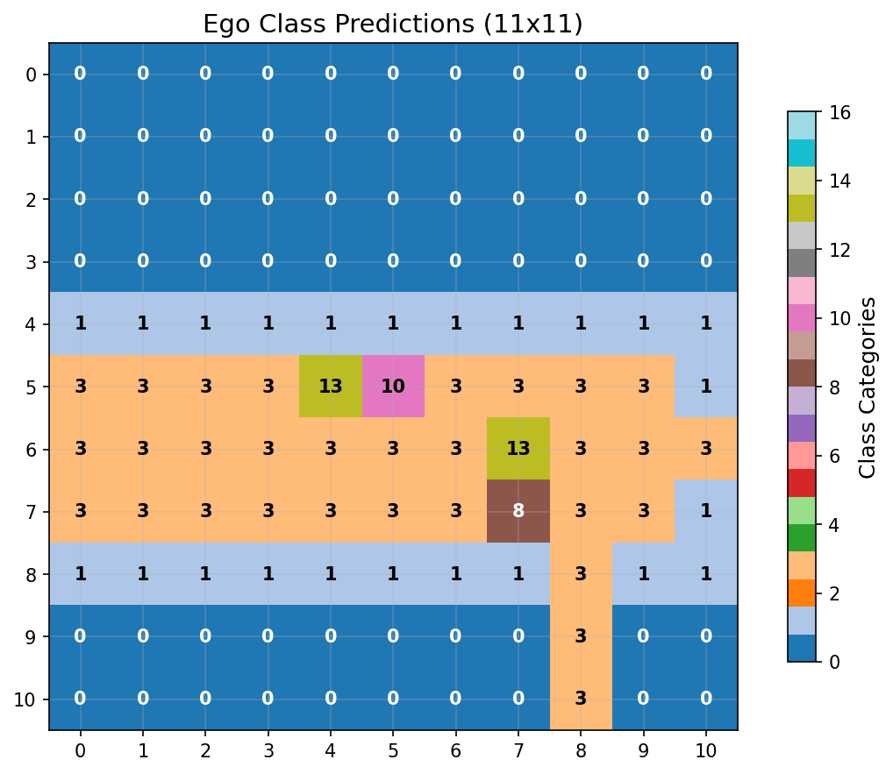 | 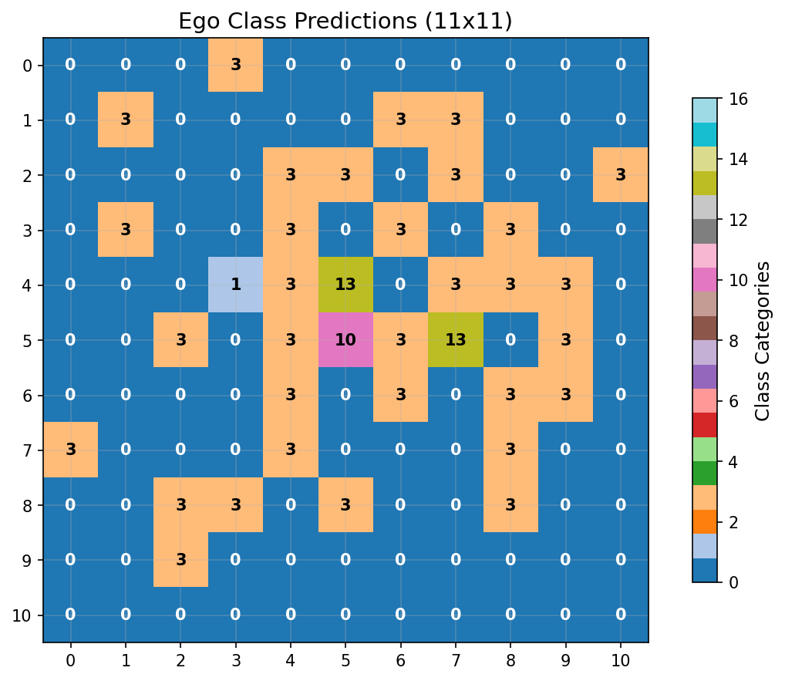 |

**Class Accuracy**: 0.636

### Bag Reconstruction

```
Bag Analysis:
========================================

Original Bag (17 items):
------------------------------
  '#' (color  7)
  '(' (color  3)
  '(' (color  6)
  '+' (color  3)
  '+' (color  6)
  '+' (color 11)
  '-' (color  3)
  '-' (color  7)
  '.' (color  7)
  '.' (color  8)
  '<' (color  7)
  '>' (color  7)
  '@' (color 15)
  '`' (color  7)
  'd' (color 15)
  '{' (color 12)
  '|' (color  7)

Reconstructed Bag (18 items):
------------------------------
  '#' (color  7)
  '(' (color  3)
  '+' (color  2)
  '+' (color  3)
  '+' (color 12)
  '-' (color  3)
  '-' (color  7)
  '.' (color  7)
  '.' (color  8)
  '<' (color  7)
  '>' (color  7)
  '@' (color 15)
  '[' (color  8)
  '`' (color  7)
  'd' (color 15)
  '{' (color 12)
  '|' (color  3)
  '|' (color  7)

Accuracy Metrics:
------------------------------
  Correctly predicted: 14 items
    '#' (color  7)
    '(' (color  3)
    '+' (color  3)
    '-' (color  3)
    '-' (color  7)
    '.' (color  7)
    '.' (color  8)
    '<' (color  7)
    '>' (color  7)
    '@' (color 15)
    '`' (color  7)
    'd' (color 15)
    '{' (color 12)
    '|' (color  7)
  Missed items: 3 items
    '(' (color  6)
    '+' (color  6)
    '+' (color 11)
  False positives: 4 items
    '+' (color  2)
    '+' (color 12)
    '[' (color  8)
    '|' (color  3)

Performance Summary:
------------------------------
  Precision: 0.778 (14/18)
  Recall: 0.824 (14/17)
  F1-Score: 0.800
  Total unique items: 21
```

### Passability & Safety

| Original | Reconstruction |
|---|---|
| 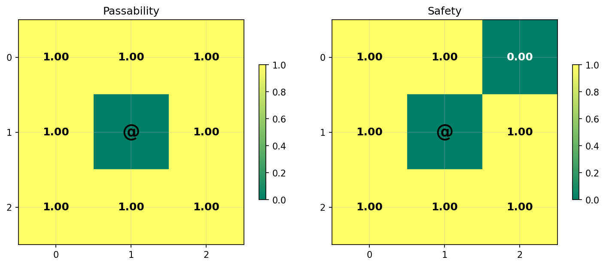 | 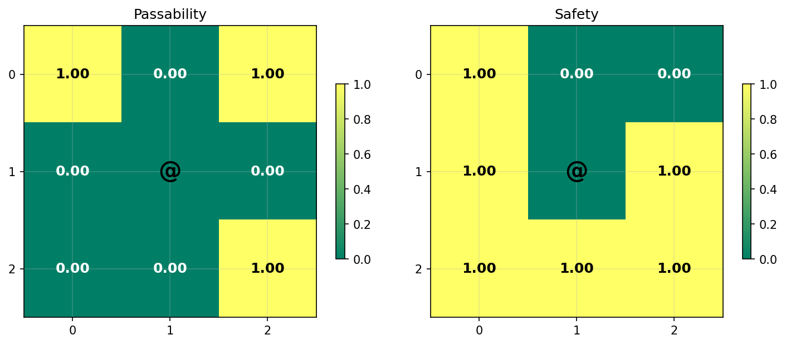 |

================================================================================

## Sample 5

### Ego Map Reconstruction

| Original | Reconstruction |
|---|---|
| 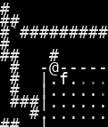 | 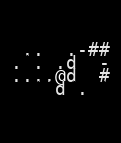 |

**Accuracy**: Character: 0.380, Color: 0.587

### Ego Class Reconstruction

| Original | Reconstruction |
|---|---|
| 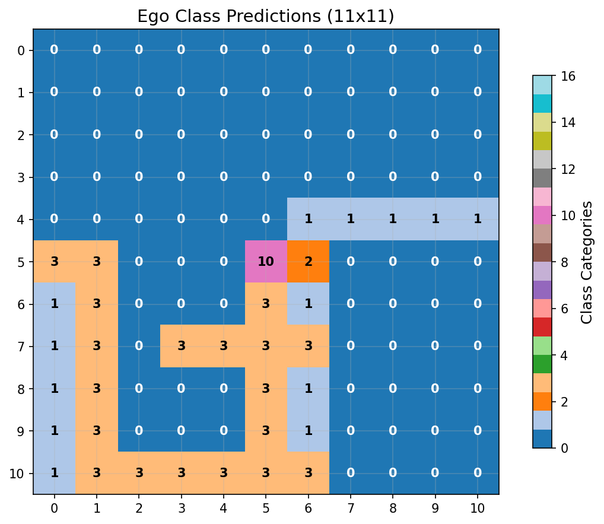 | 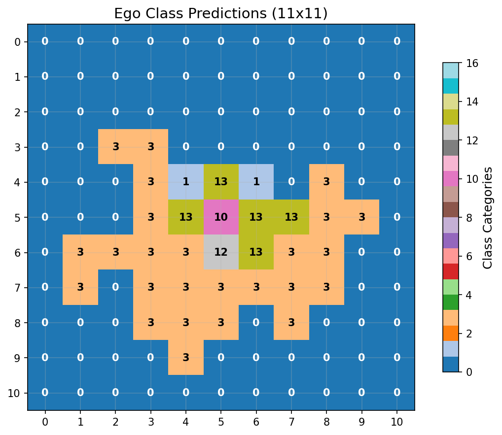 |

**Class Accuracy**: 0.570

### Bag Reconstruction

```
Bag Analysis:
========================================

Original Bag (17 items):
------------------------------
  '#' (color  7)
  ')' (color  6)
  '+' (color  3)
  '+' (color  5)
  '-' (color  3)
  '-' (color  7)
  '.' (color  7)
  '.' (color  8)
  '<' (color  7)
  '>' (color  7)
  '@' (color 15)
  '[' (color  8)
  '^' (color 12)
  '_' (color  7)
  'f' (color 15)
  '|' (color  3)
  '|' (color  7)

Reconstructed Bag (12 items):
------------------------------
  '#' (color  7)
  ')' (color  6)
  '+' (color 15)
  '-' (color  3)
  '-' (color  7)
  '.' (color  7)
  '.' (color  8)
  '<' (color  7)
  '@' (color 15)
  'd' (color 15)
  '|' (color  3)
  '|' (color  7)

Accuracy Metrics:
------------------------------
  Correctly predicted: 10 items
    '#' (color  7)
    ')' (color  6)
    '-' (color  3)
    '-' (color  7)
    '.' (color  7)
    '.' (color  8)
    '<' (color  7)
    '@' (color 15)
    '|' (color  3)
    '|' (color  7)
  Missed items: 7 items
    '+' (color  3)
    '+' (color  5)
    '>' (color  7)
    '[' (color  8)
    '^' (color 12)
    '_' (color  7)
    'f' (color 15)
  False positives: 2 items
    '+' (color 15)
    'd' (color 15)

Performance Summary:
------------------------------
  Precision: 0.833 (10/12)
  Recall: 0.588 (10/17)
  F1-Score: 0.690
  Total unique items: 19
```

### Passability & Safety

| Original | Reconstruction |
|---|---|
| 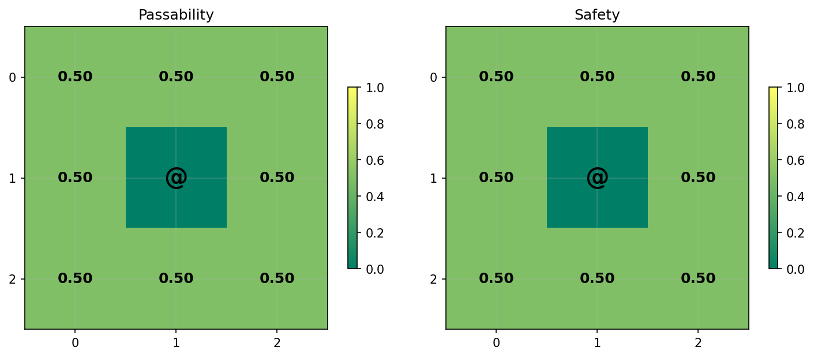 | 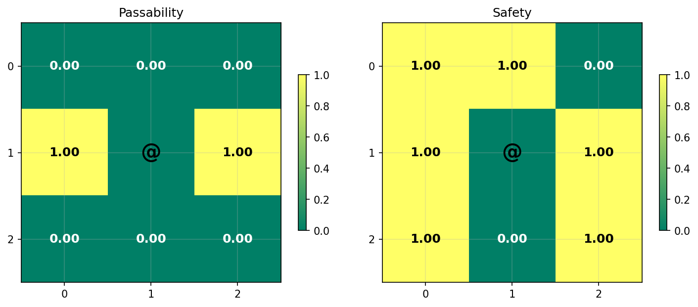 |

================================================================================

## Sample 6

### Ego Map Reconstruction

| Original | Reconstruction |
|---|---|
| 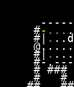 | 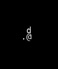 |

**Accuracy**: Character: 0.355, Color: 0.562

### Ego Class Reconstruction

| Original | Reconstruction |
|---|---|
| 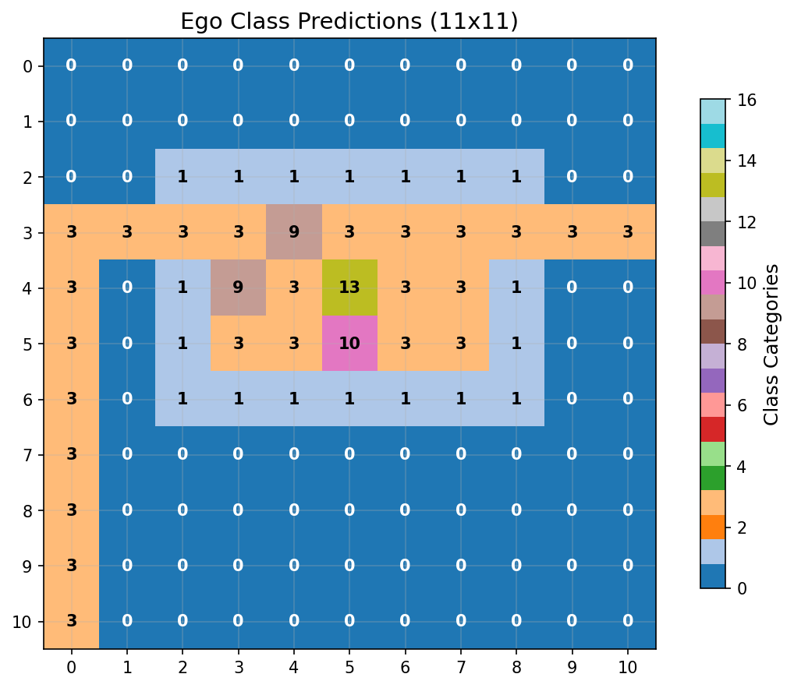 | 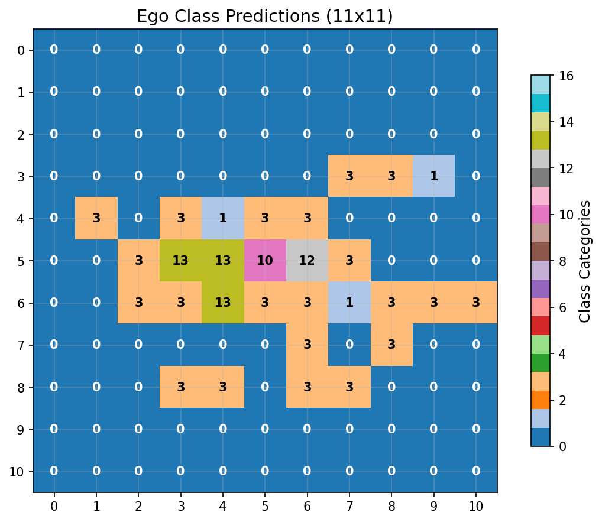 |

**Class Accuracy**: 0.545

### Bag Reconstruction

```
Bag Analysis:
========================================

Original Bag (10 items):
------------------------------
  '#' (color  7)
  '-' (color  3)
  '-' (color  7)
  '.' (color  7)
  '.' (color  8)
  '<' (color  7)
  '@' (color 15)
  '`' (color  7)
  '|' (color  3)
  '|' (color  7)

Reconstructed Bag (14 items):
------------------------------
  '#' (color  7)
  '%' (color  3)
  '*' (color  7)
  '+' (color  5)
  '+' (color 15)
  '-' (color  7)
  '.' (color  7)
  '.' (color  8)
  '<' (color  7)
  '>' (color  7)
  '@' (color 15)
  '|' (color  3)
  '|' (color  7)
  '|' (color 15)

Accuracy Metrics:
------------------------------
  Correctly predicted: 8 items
    '#' (color  7)
    '-' (color  7)
    '.' (color  7)
    '.' (color  8)
    '<' (color  7)
    '@' (color 15)
    '|' (color  3)
    '|' (color  7)
  Missed items: 2 items
    '-' (color  3)
    '`' (color  7)
  False positives: 6 items
    '%' (color  3)
    '*' (color  7)
    '+' (color  5)
    '+' (color 15)
    '>' (color  7)
    '|' (color 15)

Performance Summary:
------------------------------
  Precision: 0.571 (8/14)
  Recall: 0.800 (8/10)
  F1-Score: 0.667
  Total unique items: 16
```

### Passability & Safety

| Original | Reconstruction |
|---|---|
| 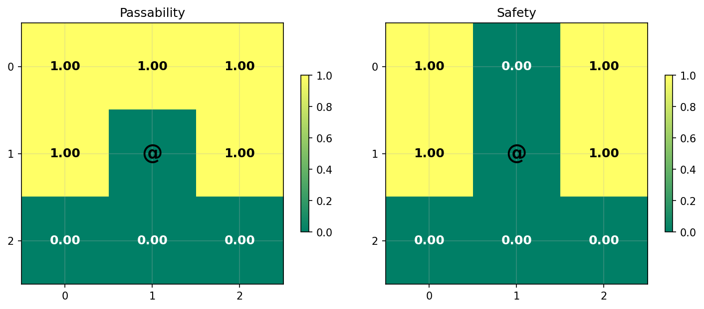 |  |

================================================================================

## Sample 7

### Ego Map Reconstruction

| Original | Reconstruction |
|---|---|
| 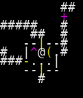 | 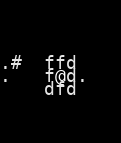 |

**Accuracy**: Character: 0.207, Color: 0.645

### Ego Class Reconstruction

| Original | Reconstruction |
|---|---|
| 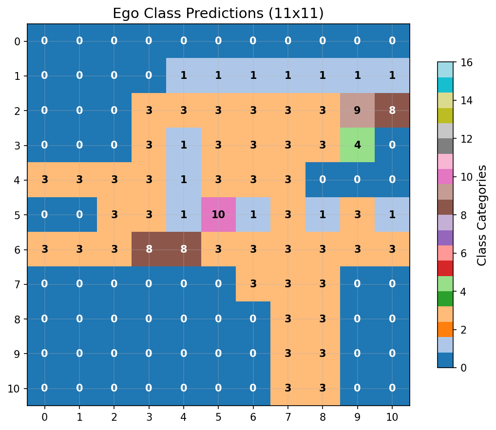 | 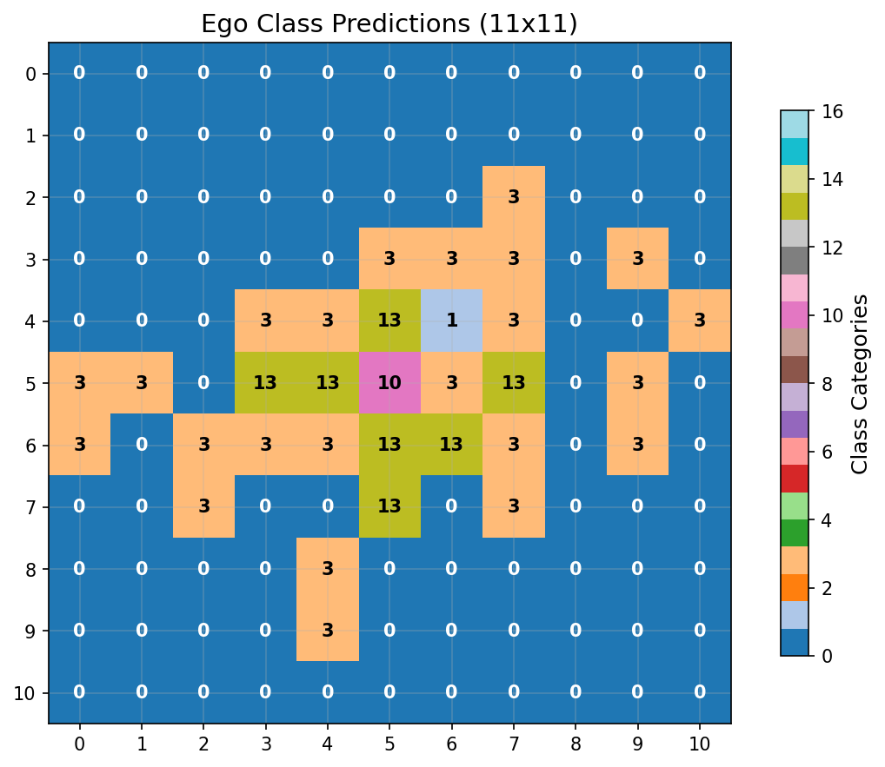 |

**Class Accuracy**: 0.620

### Bag Reconstruction

```
Bag Analysis:
========================================

Original Bag (17 items):
------------------------------
  '#' (color  7)
  '%' (color  2)
  '%' (color  3)
  '%' (color 11)
  '(' (color  3)
  '+' (color  5)
  '+' (color 15)
  '-' (color  3)
  '-' (color  7)
  '.' (color  7)
  '.' (color  8)
  '<' (color  7)
  '>' (color  7)
  '@' (color 15)
  'd' (color 15)
  '|' (color  3)
  '|' (color  7)

Reconstructed Bag (16 items):
------------------------------
  '#' (color  7)
  '+' (color  5)
  '-' (color  3)
  '-' (color  7)
  '.' (color  7)
  '.' (color  8)
  '<' (color  7)
  '>' (color  7)
  '@' (color 15)
  '[' (color  8)
  '`' (color  7)
  'd' (color 15)
  'f' (color 15)
  'x' (color  5)
  '|' (color  3)
  '|' (color  7)

Accuracy Metrics:
------------------------------
  Correctly predicted: 12 items
    '#' (color  7)
    '+' (color  5)
    '-' (color  3)
    '-' (color  7)
    '.' (color  7)
    '.' (color  8)
    '<' (color  7)
    '>' (color  7)
    '@' (color 15)
    'd' (color 15)
    '|' (color  3)
    '|' (color  7)
  Missed items: 5 items
    '%' (color  2)
    '%' (color  3)
    '%' (color 11)
    '(' (color  3)
    '+' (color 15)
  False positives: 4 items
    '[' (color  8)
    '`' (color  7)
    'f' (color 15)
    'x' (color  5)

Performance Summary:
------------------------------
  Precision: 0.750 (12/16)
  Recall: 0.706 (12/17)
  F1-Score: 0.727
  Total unique items: 21
```

### Passability & Safety

| Original | Reconstruction |
|---|---|
|  | 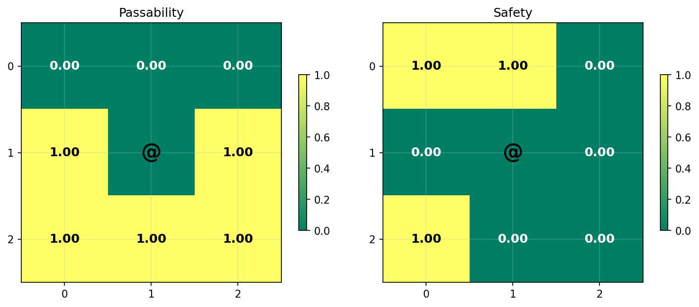 |

================================================================================

## Sample 8

### Ego Map Reconstruction

| Original | Reconstruction |
|---|---|
| 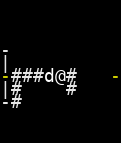 | 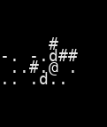 |

**Accuracy**: Character: 0.331, Color: 0.603

### Ego Class Reconstruction

| Original | Reconstruction |
|---|---|
| 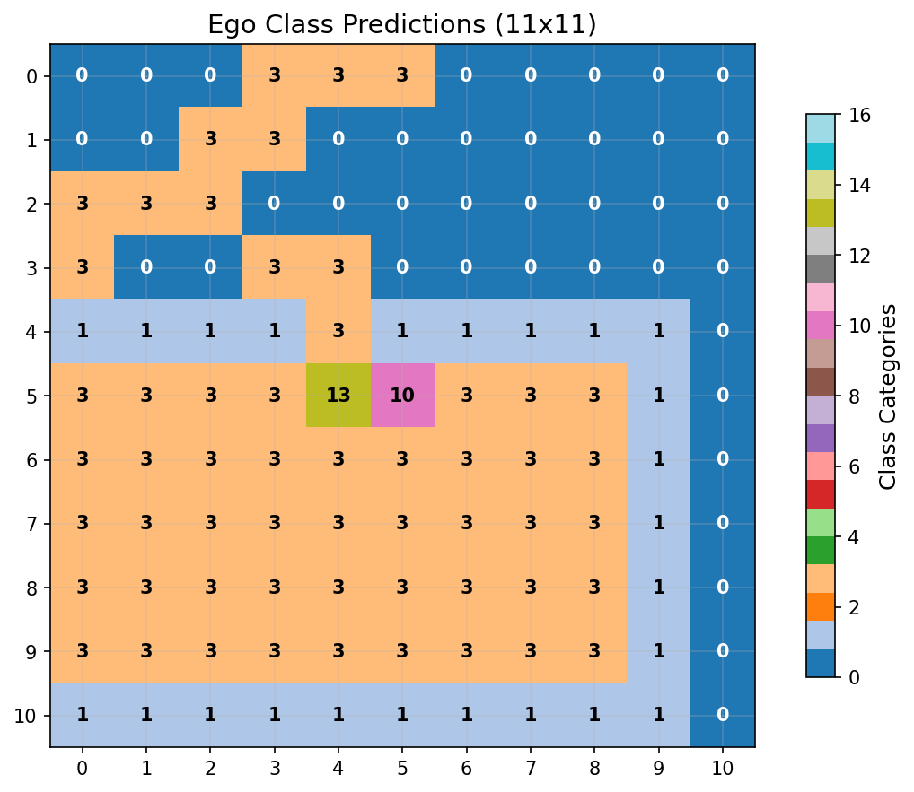 | 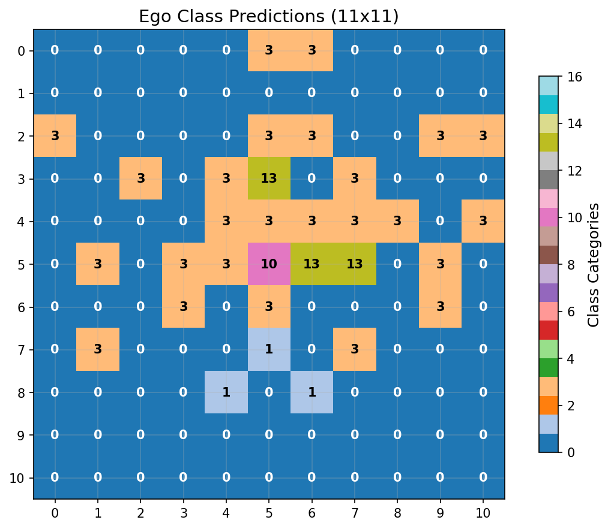 |

**Class Accuracy**: 0.612

### Bag Reconstruction

```
Bag Analysis:
========================================

Original Bag (17 items):
------------------------------
  '#' (color  7)
  '(' (color  3)
  ')' (color  6)
  '+' (color 12)
  '+' (color 15)
  '-' (color  3)
  '-' (color  7)
  '.' (color  7)
  '.' (color  8)
  '<' (color  7)
  '>' (color  7)
  '@' (color 15)
  '[' (color  8)
  '`' (color  7)
  '{' (color 12)
  '|' (color  3)
  '|' (color  7)

Reconstructed Bag (13 items):
------------------------------
  '#' (color  7)
  ')' (color  6)
  '-' (color  7)
  '.' (color  7)
  '.' (color  8)
  '<' (color  7)
  '>' (color  7)
  '@' (color 15)
  '^' (color 12)
  'f' (color 15)
  'u' (color  3)
  '|' (color  3)
  '|' (color  7)

Accuracy Metrics:
------------------------------
  Correctly predicted: 10 items
    '#' (color  7)
    ')' (color  6)
    '-' (color  7)
    '.' (color  7)
    '.' (color  8)
    '<' (color  7)
    '>' (color  7)
    '@' (color 15)
    '|' (color  3)
    '|' (color  7)
  Missed items: 7 items
    '(' (color  3)
    '+' (color 12)
    '+' (color 15)
    '-' (color  3)
    '[' (color  8)
    '`' (color  7)
    '{' (color 12)
  False positives: 3 items
    '^' (color 12)
    'f' (color 15)
    'u' (color  3)

Performance Summary:
------------------------------
  Precision: 0.769 (10/13)
  Recall: 0.588 (10/17)
  F1-Score: 0.667
  Total unique items: 20
```

### Passability & Safety

| Original | Reconstruction |
|---|---|
|  | 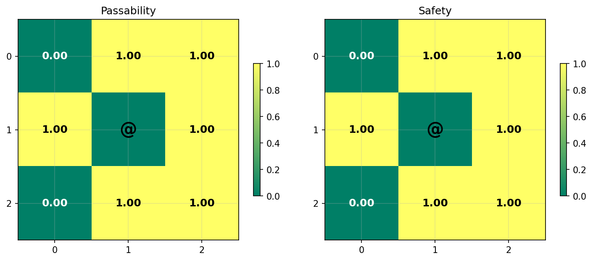 |

================================================================================

## Sample 9

### Ego Map Reconstruction

| Original | Reconstruction |
|---|---|
|  | 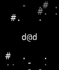 |

**Accuracy**: Character: 0.124, Color: 0.446

### Ego Class Reconstruction

| Original | Reconstruction |
|---|---|
| 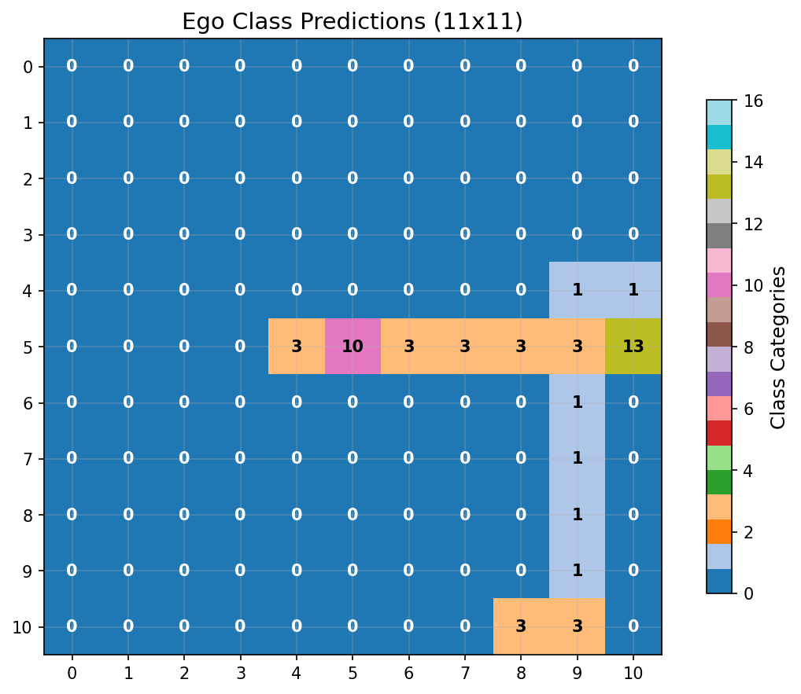 | 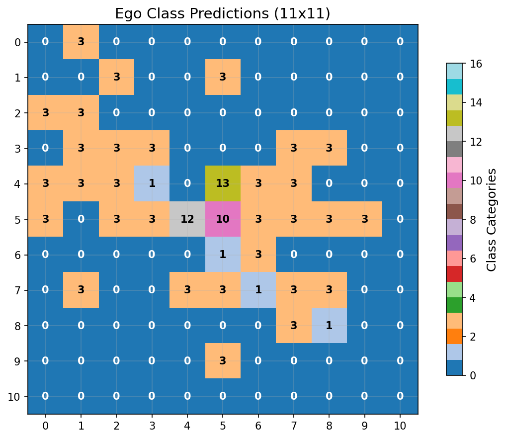 |

**Class Accuracy**: 0.521

### Bag Reconstruction

```
Bag Analysis:
========================================

Original Bag (15 items):
------------------------------
  '#' (color  7)
  '(' (color  3)
  ')' (color  6)
  '*' (color  7)
  '-' (color  3)
  '-' (color  7)
  '.' (color  7)
  '.' (color  8)
  '<' (color  7)
  '>' (color  7)
  '@' (color 15)
  '`' (color  7)
  'd' (color 15)
  '|' (color  3)
  '|' (color  7)

Reconstructed Bag (22 items):
------------------------------
  '#' (color  7)
  '%' (color 11)
  '(' (color  3)
  ')' (color  6)
  ')' (color  8)
  '*' (color  1)
  '*' (color  7)
  '+' (color 12)
  '-' (color  3)
  '-' (color  7)
  '.' (color  7)
  '.' (color  8)
  '<' (color  7)
  '>' (color  7)
  '@' (color 15)
  '[' (color  3)
  '[' (color  8)
  '`' (color  7)
  'd' (color 15)
  '{' (color 12)
  '|' (color  3)
  '|' (color  7)

Accuracy Metrics:
------------------------------
  Correctly predicted: 15 items
    '#' (color  7)
    '(' (color  3)
    ')' (color  6)
    '*' (color  7)
    '-' (color  3)
    '-' (color  7)
    '.' (color  7)
    '.' (color  8)
    '<' (color  7)
    '>' (color  7)
    '@' (color 15)
    '`' (color  7)
    'd' (color 15)
    '|' (color  3)
    '|' (color  7)
  Missed items: 0 items
  False positives: 7 items
    '%' (color 11)
    ')' (color  8)
    '*' (color  1)
    '+' (color 12)
    '[' (color  3)
    '[' (color  8)
    '{' (color 12)

Performance Summary:
------------------------------
  Precision: 0.682 (15/22)
  Recall: 1.000 (15/15)
  F1-Score: 0.811
  Total unique items: 22
```

### Passability & Safety

| Original | Reconstruction |
|---|---|
|  |  |

================================================================================

## Sample 10

### Ego Map Reconstruction

| Original | Reconstruction |
|---|---|
| 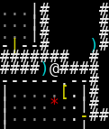 | 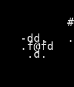 |

**Accuracy**: Character: 0.339, Color: 0.603

### Ego Class Reconstruction

| Original | Reconstruction |
|---|---|
| 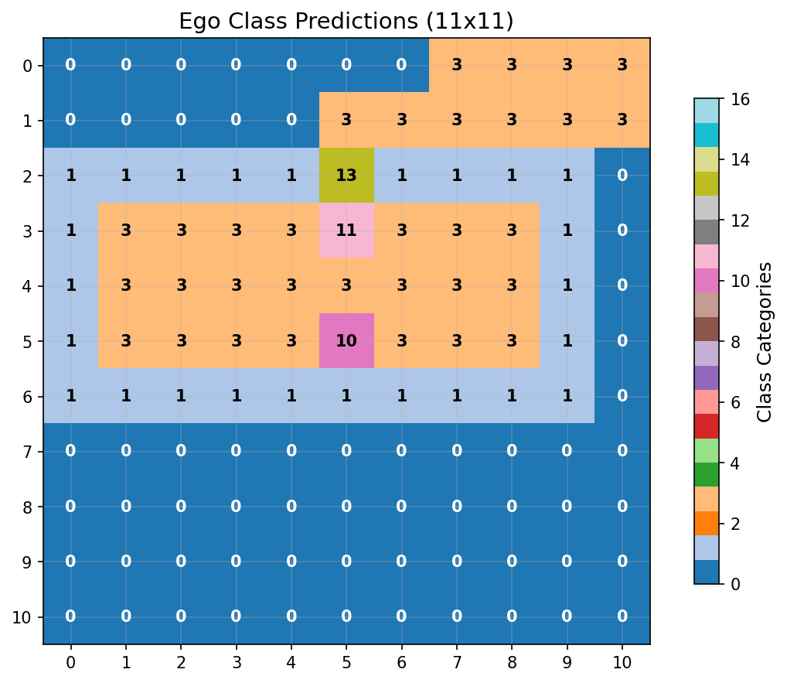 | 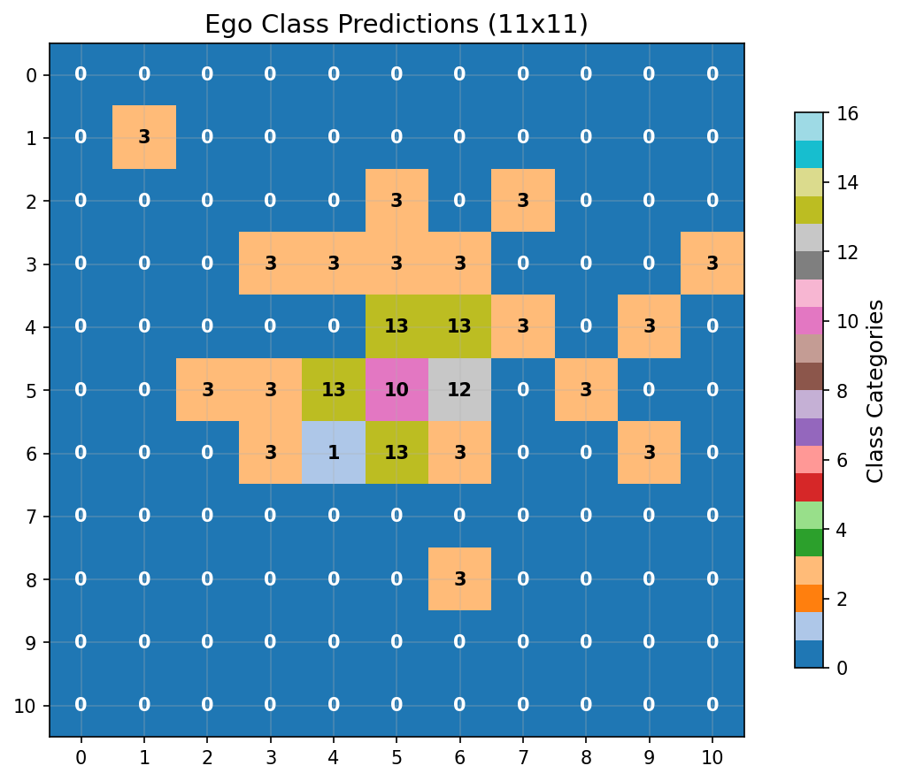 |

**Class Accuracy**: 0.636

### Bag Reconstruction

```
Bag Analysis:
========================================

Original Bag (16 items):
------------------------------
  '#' (color  7)
  '%' (color  3)
  ')' (color  6)
  '-' (color  3)
  '-' (color  7)
  '.' (color  7)
  '.' (color  8)
  '<' (color  7)
  '>' (color  7)
  '@' (color 15)
  '^' (color  8)
  'd' (color 15)
  'r' (color  3)
  '{' (color 12)
  '|' (color  3)
  '|' (color  7)

Reconstructed Bag (13 items):
------------------------------
  '#' (color  6)
  '#' (color  7)
  '(' (color  3)
  '+' (color  5)
  '-' (color  3)
  '-' (color  7)
  '.' (color  7)
  '.' (color  8)
  '<' (color  7)
  '@' (color 15)
  'd' (color 15)
  '|' (color  3)
  '|' (color  7)

Accuracy Metrics:
------------------------------
  Correctly predicted: 10 items
    '#' (color  7)
    '-' (color  3)
    '-' (color  7)
    '.' (color  7)
    '.' (color  8)
    '<' (color  7)
    '@' (color 15)
    'd' (color 15)
    '|' (color  3)
    '|' (color  7)
  Missed items: 6 items
    '%' (color  3)
    ')' (color  6)
    '>' (color  7)
    '^' (color  8)
    'r' (color  3)
    '{' (color 12)
  False positives: 3 items
    '#' (color  6)
    '(' (color  3)
    '+' (color  5)

Performance Summary:
------------------------------
  Precision: 0.769 (10/13)
  Recall: 0.625 (10/16)
  F1-Score: 0.690
  Total unique items: 19
```

### Passability & Safety

| Original | Reconstruction |
|---|---|
| 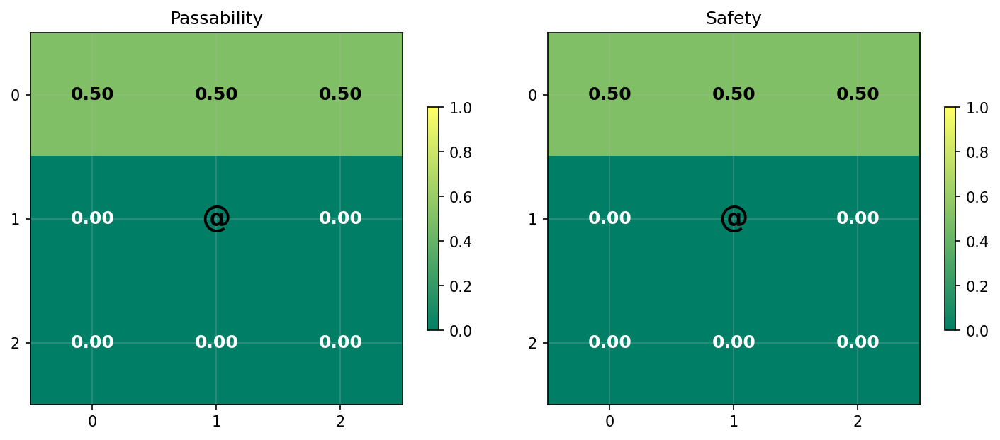 | 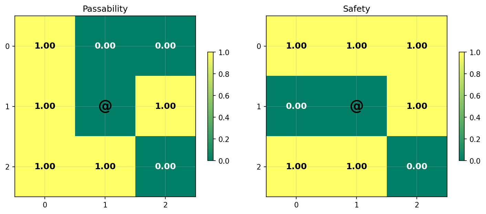 |

## Overall Statistics

- **Average Character Accuracy**: 0.297
- **Average Color Accuracy**: 0.621
- **Total Samples**: 10
