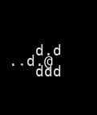
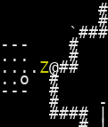

# VAE Reconstruction Comparison

_Generated: 2025-08-16T21:56:41_

## Sample 1

| Original | Reconstruction |
|---|---|
|  |  |

 Sample 1 Accuracy:   Character accuracy: 0.482 (800/1659 cells)
   Color accuracy: 0.517 (857/1659 cells)

================================================================================
## Sample 2

| Original | Reconstruction |
|---|---|
|  |  |

 Sample 2 Accuracy:   Character accuracy: 0.486 (806/1659 cells)
   Color accuracy: 0.570 (946/1659 cells)

================================================================================
## Sample 3

| Original | Reconstruction |
|---|---|
|  |  |

 Sample 3 Accuracy:   Character accuracy: 0.418 (694/1659 cells)
   Color accuracy: 0.468 (777/1659 cells)

================================================================================
## Sample 4

| Original | Reconstruction |
|---|---|
|  |  |

 Sample 4 Accuracy:   Character accuracy: 0.456 (756/1659 cells)
   Color accuracy: 0.508 (842/1659 cells)

================================================================================
## Sample 5

| Original | Reconstruction |
|---|---|
|  |  |

 Sample 5 Accuracy:   Character accuracy: 0.473 (785/1659 cells)
   Color accuracy: 0.535 (887/1659 cells)

================================================================================
## Sample 6

| Original | Reconstruction |
|---|---|
|  |  |

 Sample 6 Accuracy:   Character accuracy: 0.399 (662/1659 cells)
   Color accuracy: 0.467 (775/1659 cells)

================================================================================
## Sample 7

| Original | Reconstruction |
|---|---|
|  |  |

 Sample 7 Accuracy:   Character accuracy: 0.467 (774/1659 cells)
   Color accuracy: 0.534 (886/1659 cells)

================================================================================
## Sample 8

| Original | Reconstruction |
|---|---|
|  |  |

 Sample 8 Accuracy:   Character accuracy: 0.492 (816/1659 cells)
   Color accuracy: 0.565 (938/1659 cells)

================================================================================
## Sample 9

| Original | Reconstruction |
|---|---|
|  |  |

 Sample 9 Accuracy:   Character accuracy: 0.596 (989/1659 cells)
   Color accuracy: 0.611 (1014/1659 cells)

================================================================================
## Sample 10

| Original | Reconstruction |
|---|---|
|  |  |

 Sample 10 Accuracy:   Character accuracy: 0.550 (912/1659 cells)
   Color accuracy: 0.608 (1009/1659 cells)

📈 Overall Reconstruction Statistics:   Average Character Reconstruction Accuracy: 0.482
   Average Color Reconstruction Accuracy: 0.538
