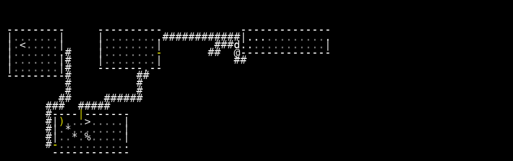

# VAE Reconstruction Comparison

_Generated: 2025-08-11T21:11:49_

## Sample 0

| Original | Reconstruction |
|---|---|
|  |  |

 Sample 1 Accuracy:   Character accuracy: 0.612 (1015/1659 cells)
   Color accuracy: 0.631 (1047/1659 cells)

================================================================================
## Sample 1

| Original | Reconstruction |
|---|---|
|  |  |

 Sample 2 Accuracy:   Character accuracy: 0.716 (1188/1659 cells)
   Color accuracy: 0.726 (1205/1659 cells)

================================================================================
## Sample 2

| Original | Reconstruction |
|---|---|
|  |  |

 Sample 3 Accuracy:   Character accuracy: 0.937 (1555/1659 cells)
   Color accuracy: 0.937 (1555/1659 cells)

================================================================================
## Sample 3

| Original | Reconstruction |
|---|---|
|  |  |

 Sample 4 Accuracy:   Character accuracy: 0.631 (1047/1659 cells)
   Color accuracy: 0.637 (1057/1659 cells)

================================================================================
## Sample 4

| Original | Reconstruction |
|---|---|
|  |  |

 Sample 5 Accuracy:   Character accuracy: 0.873 (1449/1659 cells)
   Color accuracy: 0.884 (1466/1659 cells)

================================================================================
## Sample 5

| Original | Reconstruction |
|---|---|
|  |  |

 Sample 6 Accuracy:   Character accuracy: 0.855 (1418/1659 cells)
   Color accuracy: 0.875 (1452/1659 cells)

================================================================================
## Sample 6

| Original | Reconstruction |
|---|---|
|  |  |

 Sample 7 Accuracy:   Character accuracy: 0.668 (1109/1659 cells)
   Color accuracy: 0.670 (1112/1659 cells)

================================================================================
## Sample 7

| Original | Reconstruction |
|---|---|
|  |  |

 Sample 8 Accuracy:   Character accuracy: 0.681 (1129/1659 cells)
   Color accuracy: 0.676 (1121/1659 cells)

================================================================================
## Sample 8

| Original | Reconstruction |
|---|---|
|  |  |

 Sample 9 Accuracy:   Character accuracy: 0.609 (1010/1659 cells)
   Color accuracy: 0.625 (1037/1659 cells)

================================================================================
## Sample 9

| Original | Reconstruction |
|---|---|
|  |  |

 Sample 10 Accuracy:   Character accuracy: 0.572 (949/1659 cells)
   Color accuracy: 0.583 (967/1659 cells)

📈 Overall Reconstruction Statistics:   Average Character Reconstruction Accuracy: 0.715
   Average Color Reconstruction Accuracy: 0.724
