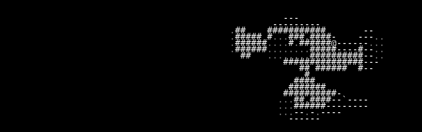
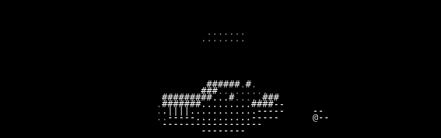
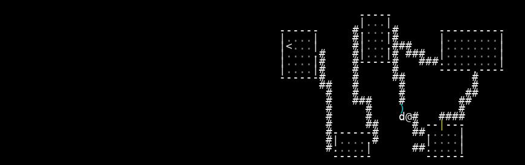

# VAE Reconstruction Comparison

_Generated: 2025-08-12T23:00:30_

## Sample 1

| Original | Reconstruction |
|---|---|
|  |  |

 Sample 1 Accuracy:   Character accuracy: 0.979 (1624/1659 cells)
   Color accuracy: 0.978 (1623/1659 cells)

================================================================================
## Sample 2

| Original | Reconstruction |
|---|---|
|  |  |

 Sample 2 Accuracy:   Character accuracy: 0.975 (1618/1659 cells)
   Color accuracy: 0.977 (1621/1659 cells)

================================================================================
## Sample 3

| Original | Reconstruction |
|---|---|
|  |  |

 Sample 3 Accuracy:   Character accuracy: 0.942 (1562/1659 cells)
   Color accuracy: 0.950 (1576/1659 cells)

================================================================================
## Sample 4

| Original | Reconstruction |
|---|---|
|  |  |

 Sample 4 Accuracy:   Character accuracy: 0.891 (1478/1659 cells)
   Color accuracy: 0.907 (1505/1659 cells)

================================================================================
## Sample 5

| Original | Reconstruction |
|---|---|
|  |  |

 Sample 5 Accuracy:   Character accuracy: 0.979 (1624/1659 cells)
   Color accuracy: 0.981 (1628/1659 cells)

================================================================================
## Sample 6

| Original | Reconstruction |
|---|---|
|  |  |

 Sample 6 Accuracy:   Character accuracy: 0.610 (1012/1659 cells)
   Color accuracy: 0.641 (1064/1659 cells)

================================================================================
## Sample 7

| Original | Reconstruction |
|---|---|
|  |  |

 Sample 7 Accuracy:   Character accuracy: 0.985 (1634/1659 cells)
   Color accuracy: 0.984 (1632/1659 cells)

================================================================================
## Sample 8

| Original | Reconstruction |
|---|---|
|  |  |

 Sample 8 Accuracy:   Character accuracy: 0.973 (1615/1659 cells)
   Color accuracy: 0.980 (1625/1659 cells)

================================================================================
## Sample 9

| Original | Reconstruction |
|---|---|
|  |  |

 Sample 9 Accuracy:   Character accuracy: 0.969 (1608/1659 cells)
   Color accuracy: 0.976 (1620/1659 cells)

================================================================================
## Sample 10

| Original | Reconstruction |
|---|---|
|  |  |

 Sample 10 Accuracy:   Character accuracy: 0.951 (1577/1659 cells)
   Color accuracy: 0.927 (1538/1659 cells)

📈 Overall Reconstruction Statistics:   Average Character Reconstruction Accuracy: 0.925
   Average Color Reconstruction Accuracy: 0.930
