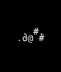

# VAE Reconstruction Comparison

_Generated: 2025-08-15T13:03:42_

## Sample 1

| Original | Reconstruction |
|---|---|
|  |  |

 Sample 1 Accuracy:   Character accuracy: 0.851 (1411/1659 cells)
   Color accuracy: 0.889 (1475/1659 cells)

================================================================================
## Sample 2

| Original | Reconstruction |
|---|---|
|  |  |

 Sample 2 Accuracy:   Character accuracy: 0.641 (1064/1659 cells)
   Color accuracy: 0.755 (1252/1659 cells)

================================================================================
## Sample 3

| Original | Reconstruction |
|---|---|
|  |  |

 Sample 3 Accuracy:   Character accuracy: 0.817 (1356/1659 cells)
   Color accuracy: 0.871 (1445/1659 cells)

================================================================================
## Sample 4

| Original | Reconstruction |
|---|---|
|  |  |

 Sample 4 Accuracy:   Character accuracy: 0.801 (1329/1659 cells)
   Color accuracy: 0.854 (1416/1659 cells)

================================================================================
## Sample 5

| Original | Reconstruction |
|---|---|
|  |  |

 Sample 5 Accuracy:   Character accuracy: 0.861 (1428/1659 cells)
   Color accuracy: 0.896 (1487/1659 cells)

================================================================================
## Sample 6

| Original | Reconstruction |
|---|---|
|  |  |

 Sample 6 Accuracy:   Character accuracy: 0.775 (1286/1659 cells)
   Color accuracy: 0.821 (1362/1659 cells)

================================================================================
## Sample 7

| Original | Reconstruction |
|---|---|
|  |  |

 Sample 7 Accuracy:   Character accuracy: 0.766 (1270/1659 cells)
   Color accuracy: 0.822 (1364/1659 cells)

================================================================================
## Sample 8

| Original | Reconstruction |
|---|---|
|  |  |

 Sample 8 Accuracy:   Character accuracy: 0.809 (1342/1659 cells)
   Color accuracy: 0.842 (1397/1659 cells)

================================================================================
## Sample 9

| Original | Reconstruction |
|---|---|
|  |  |

 Sample 9 Accuracy:   Character accuracy: 0.700 (1161/1659 cells)
   Color accuracy: 0.725 (1203/1659 cells)

================================================================================
## Sample 10

| Original | Reconstruction |
|---|---|
|  |  |

 Sample 10 Accuracy:   Character accuracy: 0.778 (1290/1659 cells)
   Color accuracy: 0.842 (1397/1659 cells)

📈 Overall Reconstruction Statistics:   Average Character Reconstruction Accuracy: 0.780
   Average Color Reconstruction Accuracy: 0.832
