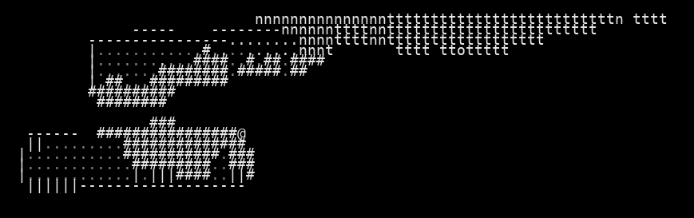
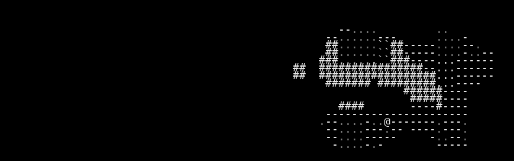

# VAE Reconstruction Comparison

_Generated: 2025-08-13T11:18:32_

## Sample 1

| Original | Reconstruction |
|---|---|
|  |  |

 Sample 1 Accuracy:   Character accuracy: 0.983 (1630/1659 cells)
   Color accuracy: 0.979 (1624/1659 cells)

================================================================================
## Sample 2

| Original | Reconstruction |
|---|---|
|  |  |

 Sample 2 Accuracy:   Character accuracy: 0.985 (1634/1659 cells)
   Color accuracy: 0.987 (1637/1659 cells)

================================================================================
## Sample 3

| Original | Reconstruction |
|---|---|
|  |  |

 Sample 3 Accuracy:   Character accuracy: 0.926 (1537/1659 cells)
   Color accuracy: 0.934 (1549/1659 cells)

================================================================================
## Sample 4

| Original | Reconstruction |
|---|---|
|  |  |

 Sample 4 Accuracy:   Character accuracy: 0.904 (1500/1659 cells)
   Color accuracy: 0.948 (1573/1659 cells)

================================================================================
## Sample 5

| Original | Reconstruction |
|---|---|
|  |  |

 Sample 5 Accuracy:   Character accuracy: 0.986 (1635/1659 cells)
   Color accuracy: 0.988 (1639/1659 cells)

================================================================================
## Sample 6

| Original | Reconstruction |
|---|---|
|  |  |

 Sample 6 Accuracy:   Character accuracy: 0.983 (1630/1659 cells)
   Color accuracy: 0.977 (1621/1659 cells)

================================================================================
## Sample 7

| Original | Reconstruction |
|---|---|
|  |  |

 Sample 7 Accuracy:   Character accuracy: 0.990 (1643/1659 cells)
   Color accuracy: 0.987 (1638/1659 cells)

================================================================================
## Sample 8

| Original | Reconstruction |
|---|---|
|  |  |

 Sample 8 Accuracy:   Character accuracy: 0.979 (1624/1659 cells)
   Color accuracy: 0.983 (1631/1659 cells)

================================================================================
## Sample 9

| Original | Reconstruction |
|---|---|
|  |  |

 Sample 9 Accuracy:   Character accuracy: 0.974 (1616/1659 cells)
   Color accuracy: 0.982 (1629/1659 cells)

================================================================================
## Sample 10

| Original | Reconstruction |
|---|---|
|  |  |

 Sample 10 Accuracy:   Character accuracy: 0.954 (1583/1659 cells)
   Color accuracy: 0.928 (1540/1659 cells)

📈 Overall Reconstruction Statistics:   Average Character Reconstruction Accuracy: 0.966
   Average Color Reconstruction Accuracy: 0.969
