# Enhanced VAE Reconstruction Comparison

_Generated: 2025-08-23T02:17:08_

This analysis includes the following reconstructions:
- **Ego View**: Character, color, and class predictions in ego-centric window
- **Bag Elements**: High-probability glyph elements
- **Passability/Safety**: 3x3 grids around hero position

## Sample 1

### Ego Map Reconstruction

| Original | Reconstruction |
|---|---|
| 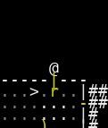 |  |

**Accuracy**: Character: 0.182, Color: 0.545

### Ego Class Reconstruction

| Original | Reconstruction |
|---|---|
| 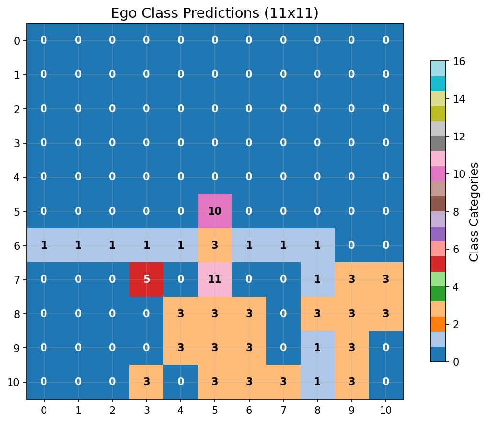 | 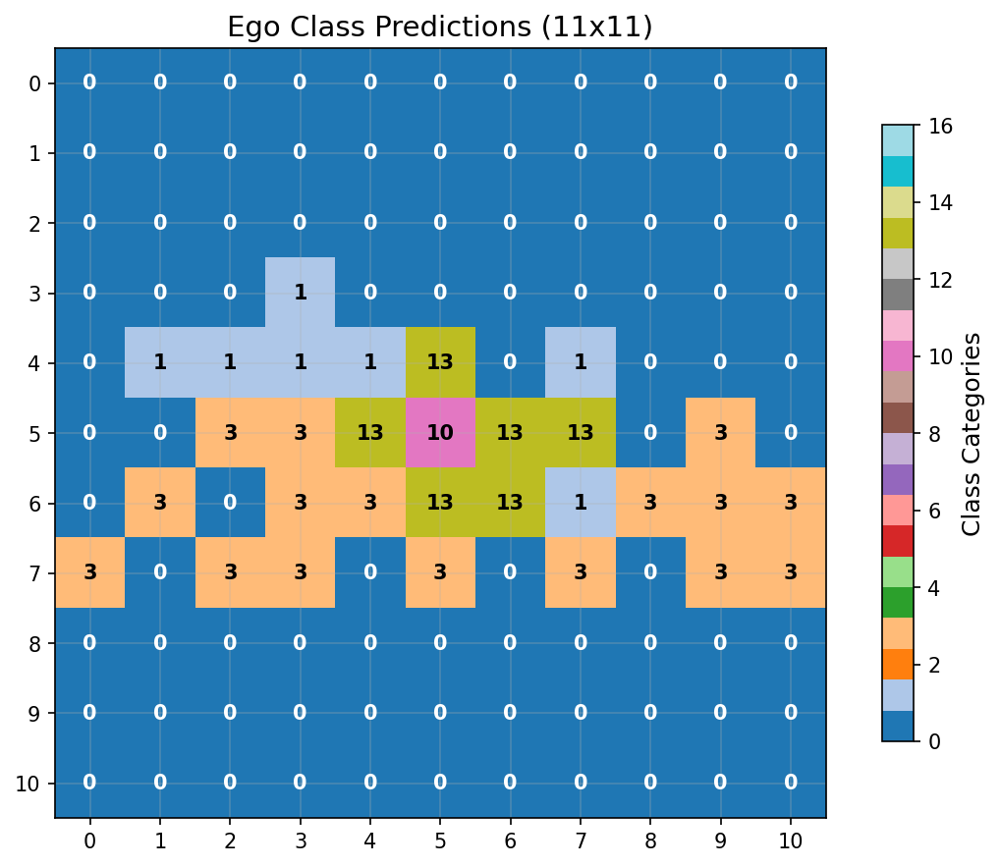 |

**Class Accuracy**: 0.496

### Bag Reconstruction

```
Bag Analysis:
========================================

Original Bag (13 items):
------------------------------
  '#' (color  7)
  '*' (color  4)
  '*' (color  7)
  '-' (color  3)
  '-' (color  7)
  '.' (color  7)
  '.' (color  8)
  '<' (color  7)
  '@' (color 15)
  '^' (color  5)
  '`' (color  7)
  '|' (color  3)
  '|' (color  7)

Reconstructed Bag (14 items):
------------------------------
  '#' (color  7)
  '(' (color  3)
  '+' (color  3)
  '-' (color  3)
  '-' (color  7)
  '.' (color  7)
  '.' (color  8)
  '<' (color  7)
  '@' (color 15)
  '`' (color  7)
  'd' (color 15)
  'o' (color  7)
  '|' (color  3)
  '|' (color  7)

Accuracy Metrics:
------------------------------
  Correctly predicted: 10 items
    '#' (color  7)
    '-' (color  3)
    '-' (color  7)
    '.' (color  7)
    '.' (color  8)
    '<' (color  7)
    '@' (color 15)
    '`' (color  7)
    '|' (color  3)
    '|' (color  7)
  Missed items: 3 items
    '*' (color  4)
    '*' (color  7)
    '^' (color  5)
  False positives: 4 items
    '(' (color  3)
    '+' (color  3)
    'd' (color 15)
    'o' (color  7)

Performance Summary:
------------------------------
  Precision: 0.714 (10/14)
  Recall: 0.769 (10/13)
  F1-Score: 0.741
  Total unique items: 17
```

### Passability & Safety

| Original | Reconstruction |
|---|---|
|  |  |

================================================================================

## Sample 2

### Ego Map Reconstruction

| Original | Reconstruction |
|---|---|
|  |  |

**Accuracy**: Character: 0.215, Color: 0.413

### Ego Class Reconstruction

| Original | Reconstruction |
|---|---|
| 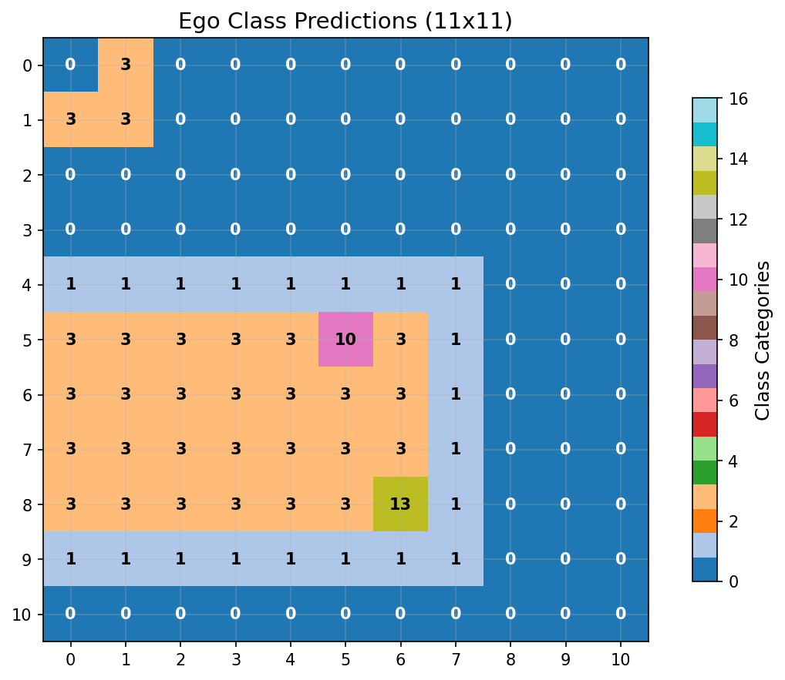 | 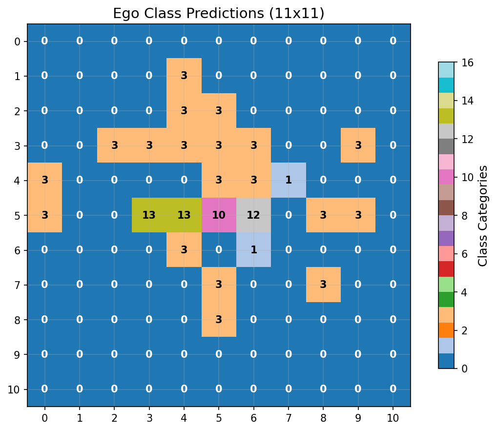 |

**Class Accuracy**: 0.438

### Bag Reconstruction

```
Bag Analysis:
========================================

Original Bag (16 items):
------------------------------
  '#' (color  7)
  '%' (color  3)
  '(' (color  3)
  ')' (color  6)
  '-' (color  3)
  '-' (color  7)
  '.' (color  7)
  '.' (color  8)
  '<' (color  7)
  '>' (color  7)
  '@' (color 15)
  'F' (color 10)
  '[' (color  8)
  '`' (color  7)
  '|' (color  3)
  '|' (color  7)

Reconstructed Bag (22 items):
------------------------------
  '#' (color  7)
  '%' (color  2)
  '*' (color  5)
  '+' (color  6)
  '+' (color 15)
  '-' (color  3)
  '-' (color  7)
  '.' (color  7)
  '.' (color  8)
  ':' (color 15)
  '<' (color  7)
  '>' (color  7)
  '@' (color 15)
  '[' (color  6)
  '^' (color  3)
  '`' (color  7)
  'a' (color  7)
  'd' (color 15)
  'y' (color  7)
  '{' (color 12)
  '|' (color  3)
  '|' (color  7)

Accuracy Metrics:
------------------------------
  Correctly predicted: 11 items
    '#' (color  7)
    '-' (color  3)
    '-' (color  7)
    '.' (color  7)
    '.' (color  8)
    '<' (color  7)
    '>' (color  7)
    '@' (color 15)
    '`' (color  7)
    '|' (color  3)
    '|' (color  7)
  Missed items: 5 items
    '%' (color  3)
    '(' (color  3)
    ')' (color  6)
    'F' (color 10)
    '[' (color  8)
  False positives: 11 items
    '%' (color  2)
    '*' (color  5)
    '+' (color  6)
    '+' (color 15)
    ':' (color 15)
    '[' (color  6)
    '^' (color  3)
    'a' (color  7)
    'd' (color 15)
    'y' (color  7)
    '{' (color 12)

Performance Summary:
------------------------------
  Precision: 0.500 (11/22)
  Recall: 0.688 (11/16)
  F1-Score: 0.579
  Total unique items: 27
```

### Passability & Safety

| Original | Reconstruction |
|---|---|
|  | 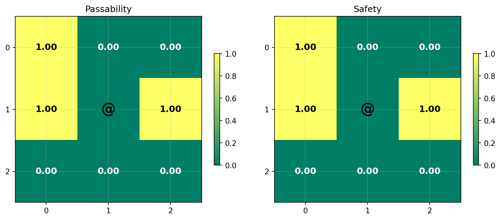 |

================================================================================

## Sample 3

### Ego Map Reconstruction

| Original | Reconstruction |
|---|---|
|  | 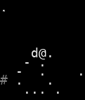 |

**Accuracy**: Character: 0.182, Color: 0.463

### Ego Class Reconstruction

| Original | Reconstruction |
|---|---|
|  |  |

**Class Accuracy**: 0.455

### Bag Reconstruction

```
Bag Analysis:
========================================

Original Bag (17 items):
------------------------------
  '#' (color  7)
  '*' (color  8)
  '-' (color  3)
  '-' (color  7)
  '.' (color  7)
  '.' (color  8)
  '<' (color  7)
  '>' (color  7)
  '@' (color 15)
  '[' (color  8)
  '_' (color  7)
  '`' (color  7)
  'd' (color 15)
  '{' (color 12)
  '|' (color  3)
  '|' (color  7)
  '|' (color 15)

Reconstructed Bag (18 items):
------------------------------
  '#' (color  7)
  ')' (color  8)
  '+' (color  3)
  '-' (color  3)
  '-' (color  7)
  '.' (color  7)
  '.' (color  8)
  '<' (color  7)
  '>' (color  7)
  '@' (color 15)
  '[' (color  3)
  '[' (color  6)
  '_' (color  7)
  'd' (color 15)
  'g' (color  7)
  'k' (color  3)
  '|' (color  3)
  '|' (color  7)

Accuracy Metrics:
------------------------------
  Correctly predicted: 12 items
    '#' (color  7)
    '-' (color  3)
    '-' (color  7)
    '.' (color  7)
    '.' (color  8)
    '<' (color  7)
    '>' (color  7)
    '@' (color 15)
    '_' (color  7)
    'd' (color 15)
    '|' (color  3)
    '|' (color  7)
  Missed items: 5 items
    '*' (color  8)
    '[' (color  8)
    '`' (color  7)
    '{' (color 12)
    '|' (color 15)
  False positives: 6 items
    ')' (color  8)
    '+' (color  3)
    '[' (color  3)
    '[' (color  6)
    'g' (color  7)
    'k' (color  3)

Performance Summary:
------------------------------
  Precision: 0.667 (12/18)
  Recall: 0.706 (12/17)
  F1-Score: 0.686
  Total unique items: 23
```

### Passability & Safety

| Original | Reconstruction |
|---|---|
|  | 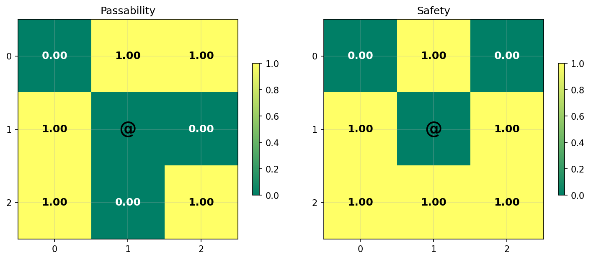 |

================================================================================

## Sample 4

### Ego Map Reconstruction

| Original | Reconstruction |
|---|---|
| 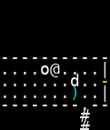 |  |

**Accuracy**: Character: 0.240, Color: 0.471

### Ego Class Reconstruction

| Original | Reconstruction |
|---|---|
|  |  |

**Class Accuracy**: 0.413

### Bag Reconstruction

```
Bag Analysis:
========================================

Original Bag (18 items):
------------------------------
  '#' (color  7)
  '(' (color  3)
  ')' (color  6)
  '-' (color  3)
  '-' (color  7)
  '.' (color  7)
  '.' (color  8)
  '<' (color  7)
  '>' (color  7)
  '@' (color 15)
  '^' (color  6)
  '^' (color  8)
  '`' (color  7)
  'd' (color 15)
  'r' (color 15)
  '{' (color 12)
  '|' (color  3)
  '|' (color  7)

Reconstructed Bag (25 items):
------------------------------
  '#' (color  7)
  '%' (color  3)
  '(' (color  3)
  ')' (color  3)
  ')' (color  6)
  '*' (color  7)
  '+' (color  2)
  '-' (color  3)
  '-' (color  7)
  '.' (color  7)
  '.' (color  8)
  '<' (color  7)
  '>' (color  7)
  '@' (color 15)
  'F' (color 15)
  '_' (color  7)
  '`' (color  7)
  'd' (color 15)
  'f' (color 15)
  'i' (color  7)
  'o' (color  7)
  'r' (color  7)
  't' (color  7)
  '|' (color  3)
  '|' (color  7)

Accuracy Metrics:
------------------------------
  Correctly predicted: 14 items
    '#' (color  7)
    '(' (color  3)
    ')' (color  6)
    '-' (color  3)
    '-' (color  7)
    '.' (color  7)
    '.' (color  8)
    '<' (color  7)
    '>' (color  7)
    '@' (color 15)
    '`' (color  7)
    'd' (color 15)
    '|' (color  3)
    '|' (color  7)
  Missed items: 4 items
    '^' (color  6)
    '^' (color  8)
    'r' (color 15)
    '{' (color 12)
  False positives: 11 items
    '%' (color  3)
    ')' (color  3)
    '*' (color  7)
    '+' (color  2)
    'F' (color 15)
    '_' (color  7)
    'f' (color 15)
    'i' (color  7)
    'o' (color  7)
    'r' (color  7)
    't' (color  7)

Performance Summary:
------------------------------
  Precision: 0.560 (14/25)
  Recall: 0.778 (14/18)
  F1-Score: 0.651
  Total unique items: 29
```

### Passability & Safety

| Original | Reconstruction |
|---|---|
|  |  |

================================================================================

## Sample 5

### Ego Map Reconstruction

| Original | Reconstruction |
|---|---|
|  |  |

**Accuracy**: Character: 0.182, Color: 0.455

### Ego Class Reconstruction

| Original | Reconstruction |
|---|---|
| 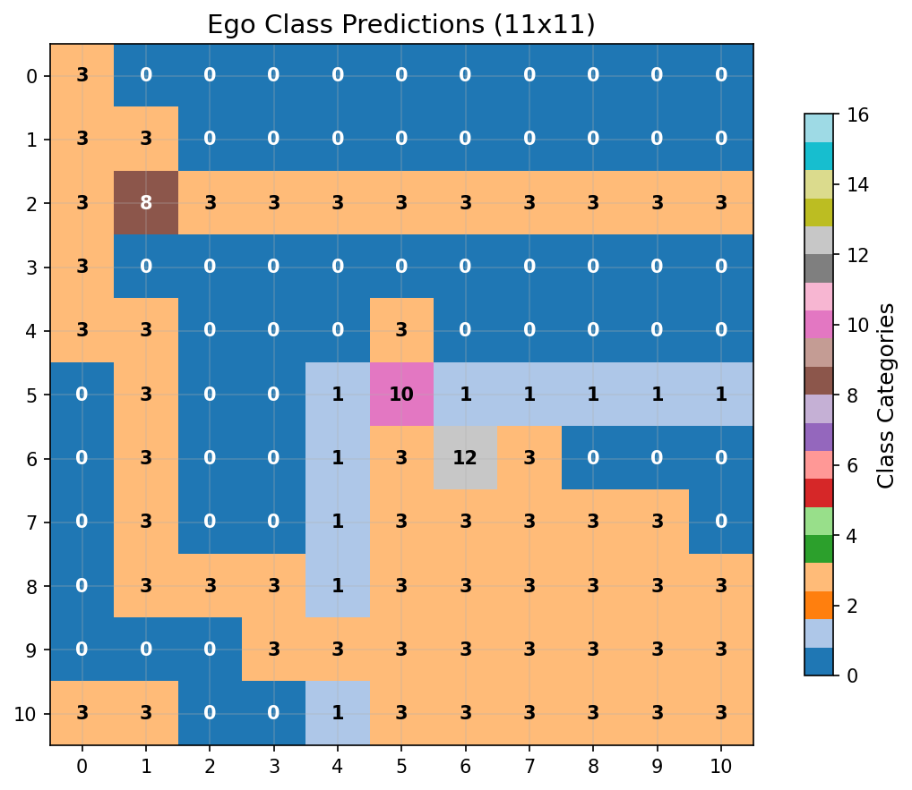 | 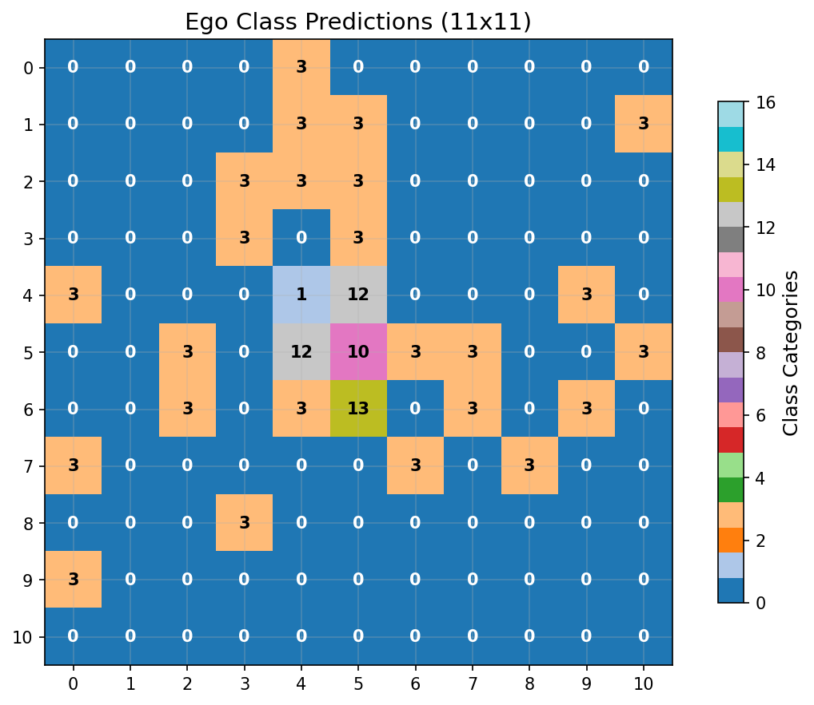 |

**Class Accuracy**: 0.504

### Bag Reconstruction

```
Bag Analysis:
========================================

Original Bag (19 items):
------------------------------
  '#' (color  7)
  ')' (color  3)
  ')' (color  6)
  '+' (color  3)
  '-' (color  3)
  '-' (color  7)
  '.' (color  7)
  '.' (color  8)
  ':' (color 15)
  '<' (color  7)
  '>' (color  7)
  '@' (color 15)
  '[' (color  3)
  '[' (color  6)
  '[' (color 13)
  '`' (color  7)
  'r' (color 15)
  '|' (color  3)
  '|' (color  7)

Reconstructed Bag (20 items):
------------------------------
  '#' (color  7)
  '(' (color  3)
  ')' (color  6)
  '*' (color  1)
  '+' (color  3)
  '-' (color  3)
  '-' (color  7)
  '.' (color  7)
  '.' (color  8)
  ':' (color 11)
  '<' (color  7)
  '@' (color 15)
  '[' (color  8)
  '`' (color  7)
  'd' (color 15)
  'e' (color  7)
  'l' (color  7)
  'r' (color 15)
  '|' (color  3)
  '|' (color  7)

Accuracy Metrics:
------------------------------
  Correctly predicted: 13 items
    '#' (color  7)
    ')' (color  6)
    '+' (color  3)
    '-' (color  3)
    '-' (color  7)
    '.' (color  7)
    '.' (color  8)
    '<' (color  7)
    '@' (color 15)
    '`' (color  7)
    'r' (color 15)
    '|' (color  3)
    '|' (color  7)
  Missed items: 6 items
    ')' (color  3)
    ':' (color 15)
    '>' (color  7)
    '[' (color  3)
    '[' (color  6)
    '[' (color 13)
  False positives: 7 items
    '(' (color  3)
    '*' (color  1)
    ':' (color 11)
    '[' (color  8)
    'd' (color 15)
    'e' (color  7)
    'l' (color  7)

Performance Summary:
------------------------------
  Precision: 0.650 (13/20)
  Recall: 0.684 (13/19)
  F1-Score: 0.667
  Total unique items: 26
```

### Passability & Safety

| Original | Reconstruction |
|---|---|
|  |  |

================================================================================

## Sample 6

### Ego Map Reconstruction

| Original | Reconstruction |
|---|---|
|  |  |

**Accuracy**: Character: 0.174, Color: 0.562

### Ego Class Reconstruction

| Original | Reconstruction |
|---|---|
|  |  |

**Class Accuracy**: 0.529

### Bag Reconstruction

```
Bag Analysis:
========================================

Original Bag (18 items):
------------------------------
  '#' (color  7)
  '%' (color  3)
  ')' (color  6)
  '-' (color  3)
  '-' (color  7)
  '.' (color  7)
  '.' (color  8)
  '<' (color  7)
  '>' (color  7)
  '@' (color 15)
  '[' (color  8)
  '_' (color  7)
  '`' (color  7)
  'd' (color 15)
  '{' (color 12)
  '|' (color  3)
  '|' (color  7)
  '|' (color 15)

Reconstructed Bag (20 items):
------------------------------
  '#' (color  7)
  '(' (color  3)
  ')' (color  6)
  '*' (color  8)
  '-' (color  3)
  '-' (color  7)
  '.' (color  7)
  '.' (color  8)
  '<' (color  7)
  '>' (color  7)
  '@' (color 15)
  'F' (color 15)
  '[' (color  3)
  '[' (color  8)
  'f' (color 15)
  'j' (color  7)
  'n' (color  7)
  '{' (color 12)
  '|' (color  3)
  '|' (color  7)

Accuracy Metrics:
------------------------------
  Correctly predicted: 13 items
    '#' (color  7)
    ')' (color  6)
    '-' (color  3)
    '-' (color  7)
    '.' (color  7)
    '.' (color  8)
    '<' (color  7)
    '>' (color  7)
    '@' (color 15)
    '[' (color  8)
    '{' (color 12)
    '|' (color  3)
    '|' (color  7)
  Missed items: 5 items
    '%' (color  3)
    '_' (color  7)
    '`' (color  7)
    'd' (color 15)
    '|' (color 15)
  False positives: 7 items
    '(' (color  3)
    '*' (color  8)
    'F' (color 15)
    '[' (color  3)
    'f' (color 15)
    'j' (color  7)
    'n' (color  7)

Performance Summary:
------------------------------
  Precision: 0.650 (13/20)
  Recall: 0.722 (13/18)
  F1-Score: 0.684
  Total unique items: 25
```

### Passability & Safety

| Original | Reconstruction |
|---|---|
|  |  |

================================================================================

## Sample 7

### Ego Map Reconstruction

| Original | Reconstruction |
|---|---|
|  |  |

**Accuracy**: Character: 0.165, Color: 0.545

### Ego Class Reconstruction

| Original | Reconstruction |
|---|---|
| 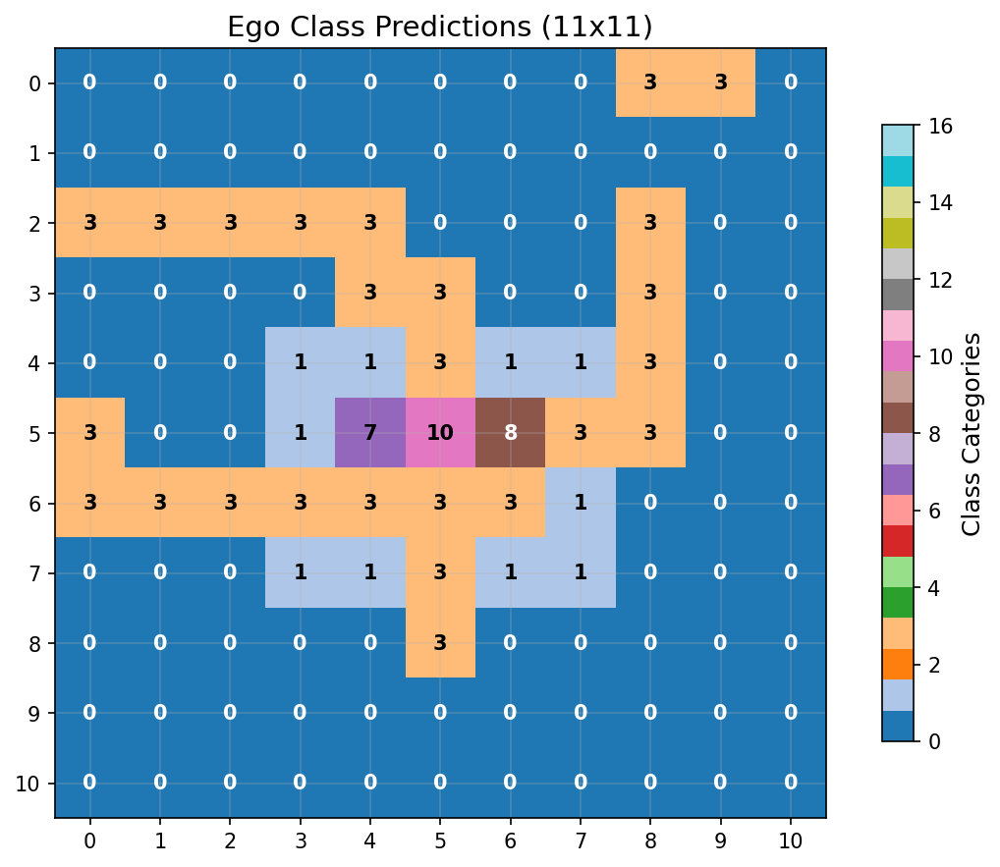 |  |

**Class Accuracy**: 0.562

### Bag Reconstruction

```
Bag Analysis:
========================================

Original Bag (17 items):
------------------------------
  '#' (color  7)
  '%' (color  3)
  '(' (color  3)
  ')' (color  3)
  '+' (color 15)
  '-' (color  3)
  '-' (color  7)
  '.' (color  7)
  '.' (color  8)
  '<' (color  7)
  '>' (color  7)
  '@' (color 15)
  '_' (color  7)
  '`' (color  7)
  '{' (color 12)
  '|' (color  3)
  '|' (color  7)

Reconstructed Bag (17 items):
------------------------------
  '#' (color  7)
  '%' (color  3)
  ')' (color  3)
  '+' (color  9)
  '-' (color  3)
  '-' (color  7)
  '.' (color  7)
  '.' (color  8)
  '<' (color  7)
  '>' (color  7)
  '@' (color 15)
  '^' (color  3)
  '`' (color  7)
  'm' (color  7)
  'u' (color  7)
  '|' (color  3)
  '|' (color  7)

Accuracy Metrics:
------------------------------
  Correctly predicted: 13 items
    '#' (color  7)
    '%' (color  3)
    ')' (color  3)
    '-' (color  3)
    '-' (color  7)
    '.' (color  7)
    '.' (color  8)
    '<' (color  7)
    '>' (color  7)
    '@' (color 15)
    '`' (color  7)
    '|' (color  3)
    '|' (color  7)
  Missed items: 4 items
    '(' (color  3)
    '+' (color 15)
    '_' (color  7)
    '{' (color 12)
  False positives: 4 items
    '+' (color  9)
    '^' (color  3)
    'm' (color  7)
    'u' (color  7)

Performance Summary:
------------------------------
  Precision: 0.765 (13/17)
  Recall: 0.765 (13/17)
  F1-Score: 0.765
  Total unique items: 21
```

### Passability & Safety

| Original | Reconstruction |
|---|---|
|  |  |

================================================================================

## Sample 8

### Ego Map Reconstruction

| Original | Reconstruction |
|---|---|
|  |  |

**Accuracy**: Character: 0.248, Color: 0.413

### Ego Class Reconstruction

| Original | Reconstruction |
|---|---|
| 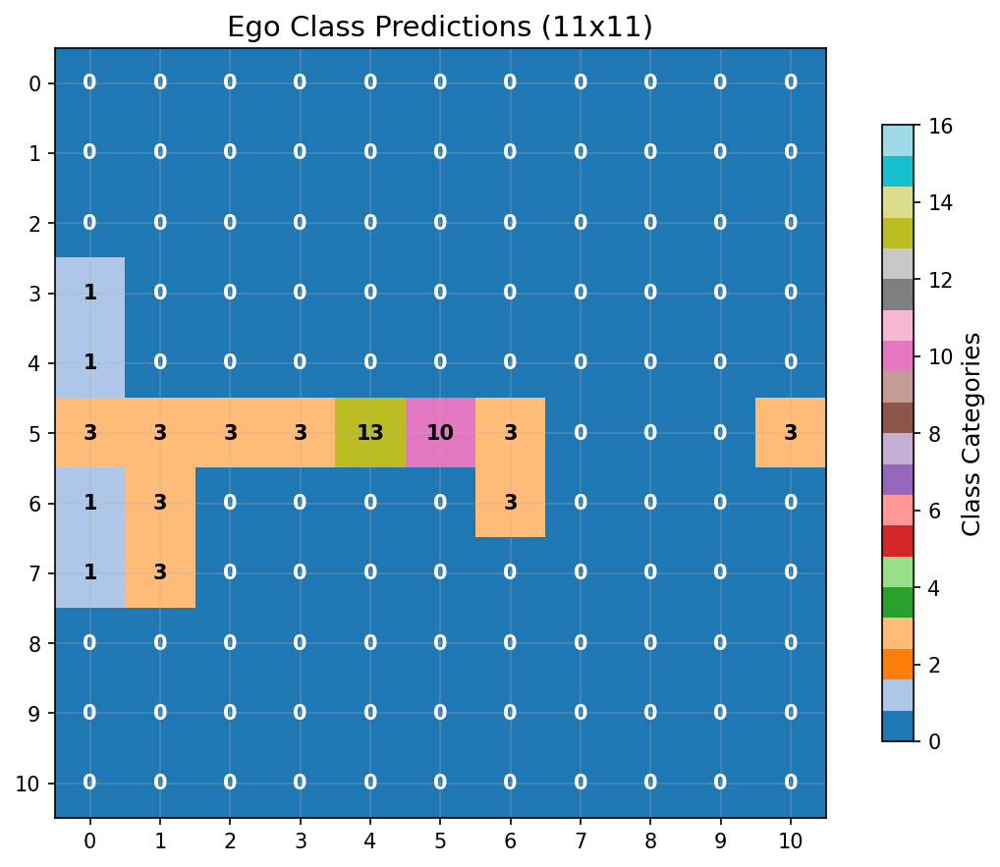 |  |

**Class Accuracy**: 0.430

### Bag Reconstruction

```
Bag Analysis:
========================================

Original Bag (16 items):
------------------------------
  '#' (color  7)
  '%' (color  3)
  '(' (color  3)
  ')' (color  6)
  '-' (color  3)
  '-' (color  7)
  '.' (color  7)
  '.' (color  8)
  '<' (color  7)
  '>' (color  7)
  '@' (color 15)
  '[' (color  8)
  '`' (color  7)
  'u' (color  3)
  '|' (color  3)
  '|' (color  7)

Reconstructed Bag (27 items):
------------------------------
  '#' (color  7)
  '%' (color  7)
  ')' (color  6)
  '*' (color  8)
  '*' (color  9)
  '-' (color  3)
  '-' (color  7)
  '.' (color  7)
  '.' (color  8)
  '<' (color  7)
  '>' (color  7)
  '@' (color 15)
  '[' (color  3)
  '[' (color  8)
  '^' (color  3)
  '^' (color  5)
  '_' (color  7)
  '`' (color  7)
  'd' (color  7)
  'd' (color 15)
  'f' (color 15)
  'o' (color 15)
  'r' (color  7)
  'r' (color 15)
  '{' (color 12)
  '|' (color  3)
  '|' (color  7)

Accuracy Metrics:
------------------------------
  Correctly predicted: 13 items
    '#' (color  7)
    ')' (color  6)
    '-' (color  3)
    '-' (color  7)
    '.' (color  7)
    '.' (color  8)
    '<' (color  7)
    '>' (color  7)
    '@' (color 15)
    '[' (color  8)
    '`' (color  7)
    '|' (color  3)
    '|' (color  7)
  Missed items: 3 items
    '%' (color  3)
    '(' (color  3)
    'u' (color  3)
  False positives: 14 items
    '%' (color  7)
    '*' (color  8)
    '*' (color  9)
    '[' (color  3)
    '^' (color  3)
    '^' (color  5)
    '_' (color  7)
    'd' (color  7)
    'd' (color 15)
    'f' (color 15)
    'o' (color 15)
    'r' (color  7)
    'r' (color 15)
    '{' (color 12)

Performance Summary:
------------------------------
  Precision: 0.481 (13/27)
  Recall: 0.812 (13/16)
  F1-Score: 0.605
  Total unique items: 30
```

### Passability & Safety

| Original | Reconstruction |
|---|---|
|  |  |

================================================================================

## Sample 9

### Ego Map Reconstruction

| Original | Reconstruction |
|---|---|
|  |  |

**Accuracy**: Character: 0.157, Color: 0.760

### Ego Class Reconstruction

| Original | Reconstruction |
|---|---|
| 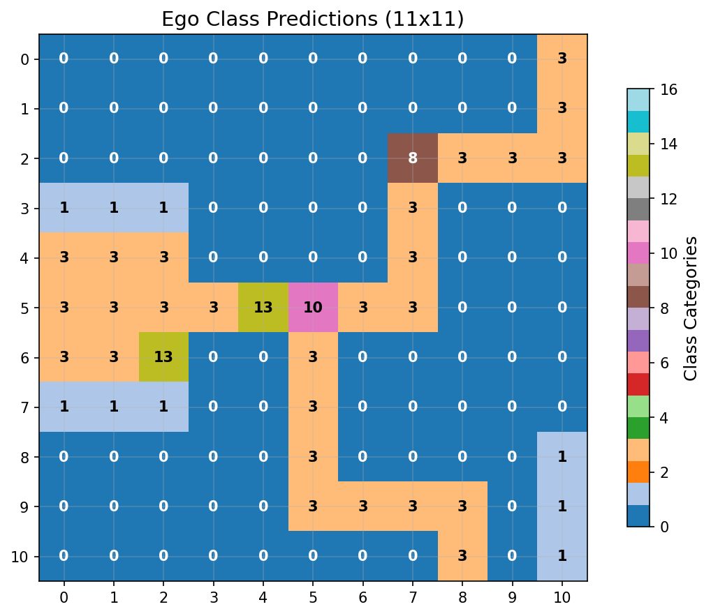 |  |

**Class Accuracy**: 0.744

### Bag Reconstruction

```
Bag Analysis:
========================================

Original Bag (15 items):
------------------------------
  '#' (color  7)
  '(' (color  3)
  '+' (color  3)
  '-' (color  3)
  '-' (color  7)
  '.' (color  7)
  '.' (color  8)
  '<' (color  7)
  '>' (color  7)
  '@' (color 15)
  '`' (color  7)
  'd' (color 15)
  'x' (color 15)
  '|' (color  3)
  '|' (color  7)

Reconstructed Bag (12 items):
------------------------------
  '#' (color  7)
  '-' (color  3)
  '-' (color  7)
  '.' (color  7)
  '.' (color  8)
  '<' (color  7)
  '@' (color 15)
  '_' (color  7)
  '`' (color  7)
  'd' (color 15)
  'f' (color 15)
  '|' (color  7)

Accuracy Metrics:
------------------------------
  Correctly predicted: 10 items
    '#' (color  7)
    '-' (color  3)
    '-' (color  7)
    '.' (color  7)
    '.' (color  8)
    '<' (color  7)
    '@' (color 15)
    '`' (color  7)
    'd' (color 15)
    '|' (color  7)
  Missed items: 5 items
    '(' (color  3)
    '+' (color  3)
    '>' (color  7)
    'x' (color 15)
    '|' (color  3)
  False positives: 2 items
    '_' (color  7)
    'f' (color 15)

Performance Summary:
------------------------------
  Precision: 0.833 (10/12)
  Recall: 0.667 (10/15)
  F1-Score: 0.741
  Total unique items: 17
```

### Passability & Safety

| Original | Reconstruction |
|---|---|
|  | 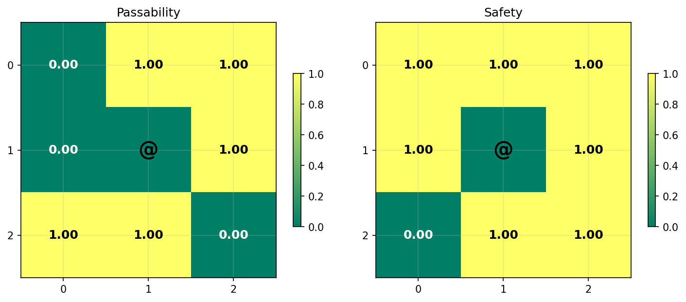 |

================================================================================

## Sample 10

### Ego Map Reconstruction

| Original | Reconstruction |
|---|---|
|  |  |

**Accuracy**: Character: 0.231, Color: 0.504

### Ego Class Reconstruction

| Original | Reconstruction |
|---|---|
|  | 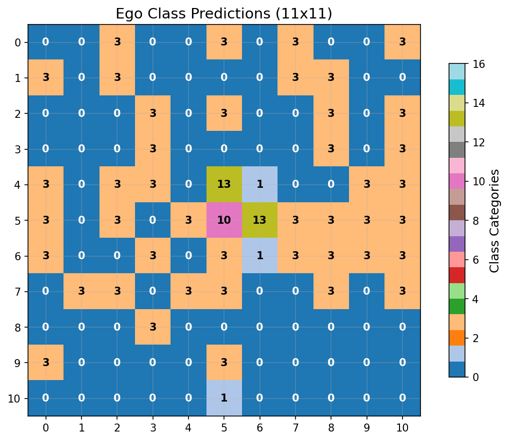 |

**Class Accuracy**: 0.537

### Bag Reconstruction

```
Bag Analysis:
========================================

Original Bag (18 items):
------------------------------
  '#' (color  7)
  '(' (color  3)
  ')' (color  6)
  '-' (color  3)
  '-' (color  7)
  '.' (color  7)
  '.' (color  8)
  '<' (color  7)
  '>' (color  7)
  '@' (color 15)
  '^' (color  6)
  '^' (color  8)
  '`' (color  7)
  'd' (color 15)
  'r' (color 15)
  '{' (color 12)
  '|' (color  3)
  '|' (color  7)

Reconstructed Bag (26 items):
------------------------------
  '#' (color  7)
  '%' (color  7)
  ')' (color  3)
  '*' (color  3)
  '+' (color 14)
  '+' (color 15)
  '-' (color  3)
  '-' (color  7)
  '.' (color  7)
  '.' (color  8)
  '<' (color  7)
  '>' (color  7)
  '@' (color 15)
  'F' (color 15)
  '[' (color  3)
  '[' (color  6)
  '[' (color  8)
  '^' (color  8)
  '`' (color  7)
  'd' (color 15)
  'h' (color  7)
  'l' (color  7)
  't' (color  7)
  'u' (color  7)
  '|' (color  3)
  '|' (color  7)

Accuracy Metrics:
------------------------------
  Correctly predicted: 13 items
    '#' (color  7)
    '-' (color  3)
    '-' (color  7)
    '.' (color  7)
    '.' (color  8)
    '<' (color  7)
    '>' (color  7)
    '@' (color 15)
    '^' (color  8)
    '`' (color  7)
    'd' (color 15)
    '|' (color  3)
    '|' (color  7)
  Missed items: 5 items
    '(' (color  3)
    ')' (color  6)
    '^' (color  6)
    'r' (color 15)
    '{' (color 12)
  False positives: 13 items
    '%' (color  7)
    ')' (color  3)
    '*' (color  3)
    '+' (color 14)
    '+' (color 15)
    'F' (color 15)
    '[' (color  3)
    '[' (color  6)
    '[' (color  8)
    'h' (color  7)
    'l' (color  7)
    't' (color  7)
    'u' (color  7)

Performance Summary:
------------------------------
  Precision: 0.500 (13/26)
  Recall: 0.722 (13/18)
  F1-Score: 0.591
  Total unique items: 31
```

### Passability & Safety

| Original | Reconstruction |
|---|---|
|  | 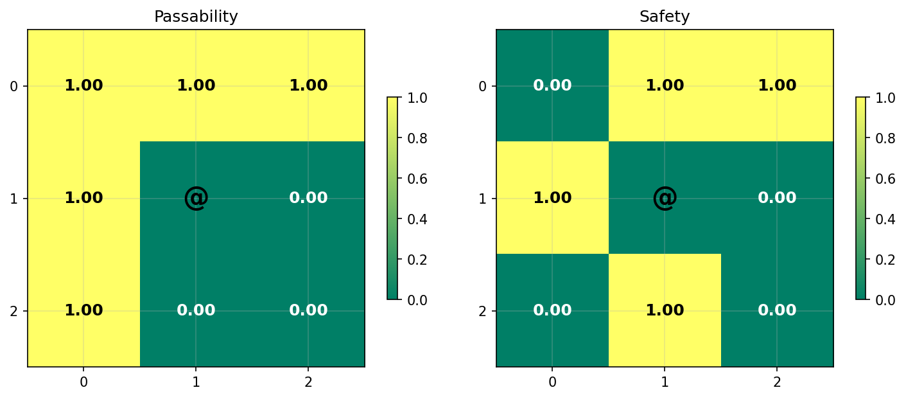 |

## Overall Statistics

- **Average Character Accuracy**: 0.198
- **Average Color Accuracy**: 0.513
- **Total Samples**: 10
