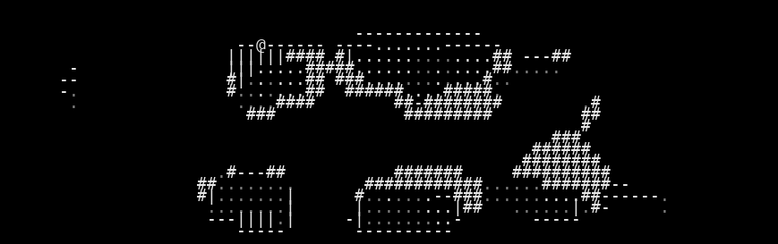
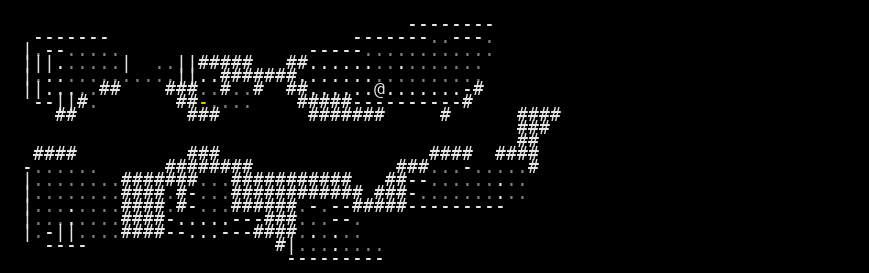

# VAE Reconstruction Comparison

_Generated: 2025-08-12T15:19:36_

## Sample 1

| Original | Reconstruction |
|---|---|
|  |  |

 Sample 1 Accuracy:   Character accuracy: 0.958 (1589/1659 cells)
   Color accuracy: 0.955 (1584/1659 cells)

================================================================================
## Sample 2

| Original | Reconstruction |
|---|---|
|  |  |

 Sample 2 Accuracy:   Character accuracy: 0.972 (1612/1659 cells)
   Color accuracy: 0.971 (1611/1659 cells)

================================================================================
## Sample 3

| Original | Reconstruction |
|---|---|
|  |  |

 Sample 3 Accuracy:   Character accuracy: 0.929 (1541/1659 cells)
   Color accuracy: 0.935 (1551/1659 cells)

================================================================================
## Sample 4

| Original | Reconstruction |
|---|---|
|  |  |

 Sample 4 Accuracy:   Character accuracy: 0.874 (1450/1659 cells)
   Color accuracy: 0.928 (1539/1659 cells)

================================================================================
## Sample 5

| Original | Reconstruction |
|---|---|
|  |  |

 Sample 5 Accuracy:   Character accuracy: 0.960 (1592/1659 cells)
   Color accuracy: 0.963 (1597/1659 cells)

================================================================================
## Sample 6

| Original | Reconstruction |
|---|---|
|  |  |

 Sample 6 Accuracy:   Character accuracy: 0.972 (1612/1659 cells)
   Color accuracy: 0.966 (1602/1659 cells)

================================================================================
## Sample 7

| Original | Reconstruction |
|---|---|
|  |  |

 Sample 7 Accuracy:   Character accuracy: 0.973 (1615/1659 cells)
   Color accuracy: 0.969 (1607/1659 cells)

================================================================================
## Sample 8

| Original | Reconstruction |
|---|---|
|  |  |

 Sample 8 Accuracy:   Character accuracy: 0.963 (1598/1659 cells)
   Color accuracy: 0.969 (1607/1659 cells)

================================================================================
## Sample 9

| Original | Reconstruction |
|---|---|
|  |  |

 Sample 9 Accuracy:   Character accuracy: 0.957 (1587/1659 cells)
   Color accuracy: 0.963 (1597/1659 cells)

================================================================================
## Sample 10

| Original | Reconstruction |
|---|---|
|  |  |

 Sample 10 Accuracy:   Character accuracy: 0.934 (1550/1659 cells)
   Color accuracy: 0.910 (1509/1659 cells)

📈 Overall Reconstruction Statistics:   Average Character Reconstruction Accuracy: 0.949
   Average Color Reconstruction Accuracy: 0.953
