# Enhanced VAE Reconstruction Comparison

_Generated: 2025-09-27T19:22:10_

This analysis includes the following reconstructions:
- **Ego View**: Character, color, and class predictions in ego-centric window
- **Bag Elements**: High-probability glyph elements
- **Passability/Safety**: 3x3 grids around hero position

## Sample 1

### Ego Map Reconstruction

| Original | Reconstruction |
|---|---|
| 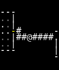 | 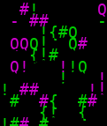 |

**Accuracy**: Character: 0.174, Color: 0.620

### Ego Class Reconstruction

| Original | Reconstruction |
|---|---|
| 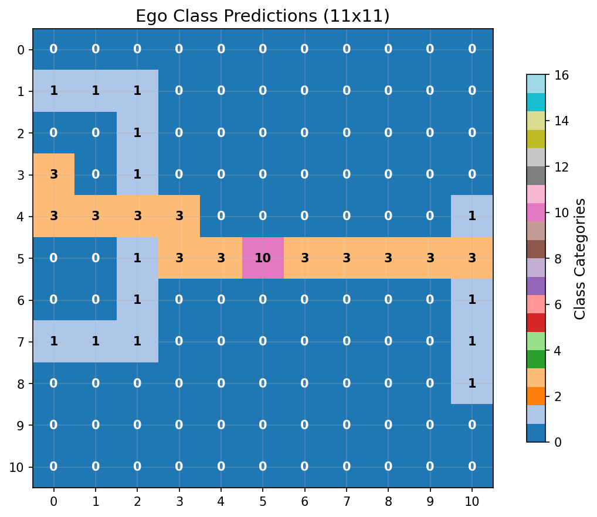 | 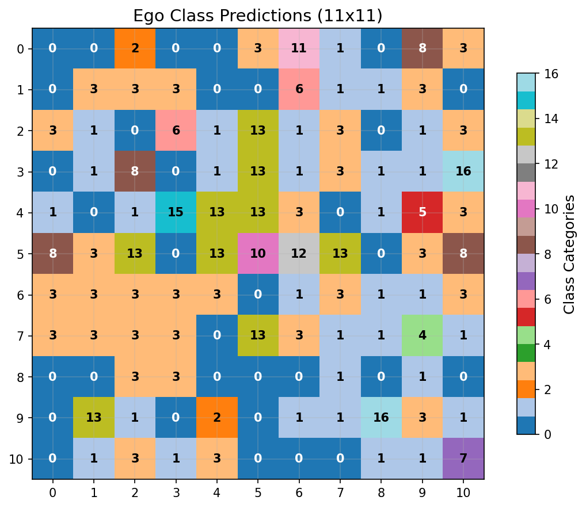 |

**Class Accuracy**: 0.364

### Bag Reconstruction

```
Bag Analysis:
========================================

Original Bag (15 items):
------------------------------
  '#' (color  7)
  '(' (color  3)
  ')' (color  6)
  '*' (color  7)
  '-' (color  3)
  '-' (color  7)
  '.' (color  7)
  '.' (color  8)
  '<' (color  7)
  '>' (color  7)
  '@' (color 15)
  '^' (color  3)
  '^' (color 12)
  '|' (color  3)
  '|' (color  7)

Reconstructed Bag (344 items):
------------------------------
  ' ' (color  1)
  ' ' (color  9)
  '!' (color  0)
  '!' (color  3)
  '!' (color  6)
  '!' (color 10)
  '!' (color 13)
  '"' (color  1)
  '"' (color  4)
  '"' (color 14)
  '"' (color 15)
  '#' (color  0)
  '#' (color  1)
  '#' (color  2)
  '#' (color  4)
  '#' (color 13)
  '$' (color  4)
  '$' (color  6)
  '$' (color 13)
  '%' (color  0)
  '&' (color  2)
  '&' (color  8)
  ''' (color  3)
  ''' (color 10)
  ''' (color 14)
  ''' (color 15)
  '(' (color  2)
  '(' (color 10)
  ')' (color  1)
  ')' (color  4)
  ')' (color  6)
  ')' (color 10)
  ')' (color 13)
  '*' (color  2)
  '*' (color  7)
  '*' (color 10)
  '+' (color  6)
  '+' (color  7)
  '+' (color 12)
  ',' (color  0)
  ',' (color  7)
  ',' (color 11)
  ',' (color 13)
  ',' (color 15)
  '-' (color  2)
  '-' (color  3)
  '-' (color  7)
  '-' (color  8)
  '-' (color 11)
  '-' (color 13)
  '-' (color 14)
  '.' (color  5)
  '.' (color  7)
  '.' (color  8)
  '.' (color 11)
  '/' (color  0)
  '/' (color  8)
  '/' (color 10)
  '0' (color  0)
  '0' (color  2)
  '0' (color  5)
  '0' (color  8)
  '0' (color 10)
  '2' (color  1)
  '2' (color  2)
  '2' (color  3)
  '2' (color 10)
  '2' (color 15)
  '3' (color  2)
  '3' (color  7)
  '3' (color 13)
  '4' (color  4)
  '4' (color  5)
  '4' (color  9)
  '4' (color 10)
  '5' (color  6)
  '5' (color  8)
  '6' (color  1)
  '7' (color 10)
  '7' (color 14)
  '8' (color  1)
  '9' (color  5)
  '9' (color  8)
  '9' (color  9)
  '9' (color 12)
  '9' (color 15)
  ':' (color 15)
  ';' (color 10)
  '<' (color  0)
  '<' (color  7)
  '<' (color  9)
  '<' (color 11)
  '<' (color 15)
  '=' (color  3)
  '=' (color  5)
  '=' (color 13)
  '=' (color 14)
  '=' (color 15)
  '>' (color  2)
  '>' (color  7)
  '>' (color 12)
  '>' (color 13)
  '>' (color 15)
  '?' (color  2)
  '?' (color  7)
  '?' (color 11)
  '?' (color 12)
  '?' (color 14)
  '?' (color 15)
  '@' (color  4)
  '@' (color  7)
  '@' (color 12)
  '@' (color 14)
  'A' (color 13)
  'B' (color  0)
  'B' (color  1)
  'B' (color  9)
  'B' (color 12)
  'C' (color  0)
  'C' (color  2)
  'C' (color  7)
  'C' (color  9)
  'C' (color 10)
  'C' (color 12)
  'C' (color 13)
  'D' (color  0)
  'D' (color  1)
  'D' (color  5)
  'D' (color  9)
  'D' (color 14)
  'E' (color 12)
  'E' (color 15)
  'F' (color  0)
  'F' (color  4)
  'F' (color  5)
  'F' (color  7)
  'F' (color  9)
  'F' (color 13)
  'F' (color 14)
  'F' (color 15)
  'G' (color  1)
  'H' (color  3)
  'H' (color  4)
  'H' (color  6)
  'H' (color 12)
  'I' (color  3)
  'I' (color  4)
  'I' (color  9)
  'I' (color 14)
  'J' (color  6)
  'J' (color  9)
  'J' (color 14)
  'K' (color  2)
  'K' (color  5)
  'K' (color 13)
  'L' (color  9)
  'L' (color 15)
  'M' (color  3)
  'M' (color  6)
  'M' (color  8)
  'M' (color 10)
  'M' (color 12)
  'M' (color 14)
  'N' (color  0)
  'N' (color  3)
  'N' (color  8)
  'N' (color 11)
  'O' (color  0)
  'O' (color  1)
  'O' (color  4)
  'O' (color  5)
  'O' (color  8)
  'O' (color 11)
  'P' (color  6)
  'P' (color  9)
  'P' (color 12)
  'Q' (color  1)
  'Q' (color  5)
  'Q' (color  8)
  'Q' (color 11)
  'Q' (color 12)
  'R' (color  1)
  'S' (color  1)
  'S' (color  7)
  'S' (color  9)
  'S' (color 10)
  'T' (color  0)
  'T' (color  3)
  'T' (color  5)
  'T' (color  6)
  'T' (color 14)
  'T' (color 15)
  'U' (color  1)
  'U' (color  6)
  'U' (color  9)
  'U' (color 10)
  'V' (color  0)
  'V' (color  2)
  'V' (color  3)
  'V' (color 14)
  'W' (color  0)
  'W' (color  6)
  'W' (color  8)
  'W' (color 10)
  'W' (color 11)
  'W' (color 13)
  'X' (color  1)
  'X' (color  3)
  'X' (color  7)
  'X' (color 11)
  'X' (color 13)
  'X' (color 14)
  'Y' (color  0)
  'Y' (color 11)
  'Y' (color 13)
  'Z' (color  1)
  'Z' (color 13)
  '[' (color  0)
  '[' (color  3)
  '[' (color  9)
  '[' (color 10)
  '[' (color 14)
  '\' (color  0)
  '\' (color  7)
  '\' (color 11)
  ']' (color  4)
  ']' (color  7)
  ']' (color 10)
  '^' (color  0)
  '^' (color  1)
  '^' (color  3)
  '^' (color  5)
  '^' (color  8)
  '^' (color 13)
  '_' (color  4)
  '_' (color 13)
  '`' (color  4)
  '`' (color  8)
  'a' (color  1)
  'a' (color  3)
  'a' (color 11)
  'a' (color 13)
  'b' (color  3)
  'b' (color  7)
  'b' (color  8)
  'b' (color 12)
  'b' (color 14)
  'c' (color  1)
  'd' (color  7)
  'd' (color  8)
  'd' (color 15)
  'e' (color  7)
  'e' (color 12)
  'e' (color 14)
  'f' (color  6)
  'f' (color 12)
  'g' (color  5)
  'g' (color  7)
  'g' (color 12)
  'h' (color  5)
  'h' (color  8)
  'h' (color 10)
  'h' (color 15)
  'i' (color  3)
  'i' (color  5)
  'i' (color 11)
  'i' (color 12)
  'j' (color 11)
  'k' (color  1)
  'k' (color  6)
  'l' (color  0)
  'l' (color  3)
  'l' (color  7)
  'l' (color 11)
  'm' (color  3)
  'm' (color  7)
  'm' (color  8)
  'm' (color 10)
  'm' (color 11)
  'm' (color 12)
  'm' (color 14)
  'n' (color  4)
  'n' (color  5)
  'n' (color 13)
  'o' (color  0)
  'o' (color 11)
  'o' (color 14)
  'o' (color 15)
  'p' (color  0)
  'p' (color  7)
  'q' (color  1)
  'q' (color  2)
  'q' (color  4)
  'q' (color  9)
  'r' (color  6)
  'r' (color  7)
  'r' (color 14)
  's' (color  3)
  's' (color  6)
  's' (color 15)
  't' (color  6)
  't' (color  7)
  't' (color  8)
  'u' (color  5)
  'u' (color 15)
  'v' (color  5)
  'v' (color  7)
  'v' (color 10)
  'v' (color 13)
  'v' (color 15)
  'w' (color  1)
  'w' (color  6)
  'w' (color  8)
  'w' (color 12)
  'w' (color 14)
  'x' (color  4)
  'x' (color  6)
  'x' (color  7)
  'x' (color 12)
  'x' (color 15)
  'y' (color  3)
  'y' (color 12)
  'y' (color 13)
  'z' (color  4)
  'z' (color  6)
  '{' (color  2)
  '{' (color  4)
  '{' (color  6)
  '{' (color 15)
  '|' (color  3)
  '|' (color  7)
  '|' (color 11)
  '|' (color 15)
  '}' (color  4)
  '}' (color  8)
  '}' (color 15)
  '~' (color  3)
  '~' (color  5)
  '~' (color 12)
  '~' (color 13)
  '\x7f' (color  9)
  '\x7f' (color 10)
  '\x7f' (color 12)
  '\x7f' (color 13)

Accuracy Metrics:
------------------------------
  Correctly predicted: 11 items
    ')' (color  6)
    '*' (color  7)
    '-' (color  3)
    '-' (color  7)
    '.' (color  7)
    '.' (color  8)
    '<' (color  7)
    '>' (color  7)
    '^' (color  3)
    '|' (color  3)
    '|' (color  7)
  Missed items: 4 items
    '#' (color  7)
    '(' (color  3)
    '@' (color 15)
    '^' (color 12)
  False positives: 333 items
    ' ' (color  1)
    ' ' (color  9)
    '!' (color  0)
    '!' (color  3)
    '!' (color  6)
    '!' (color 10)
    '!' (color 13)
    '"' (color  1)
    '"' (color  4)
    '"' (color 14)
    '"' (color 15)
    '#' (color  0)
    '#' (color  1)
    '#' (color  2)
    '#' (color  4)
    '#' (color 13)
    '$' (color  4)
    '$' (color  6)
    '$' (color 13)
    '%' (color  0)
    '&' (color  2)
    '&' (color  8)
    ''' (color  3)
    ''' (color 10)
    ''' (color 14)
    ''' (color 15)
    '(' (color  2)
    '(' (color 10)
    ')' (color  1)
    ')' (color  4)
    ')' (color 10)
    ')' (color 13)
    '*' (color  2)
    '*' (color 10)
    '+' (color  6)
    '+' (color  7)
    '+' (color 12)
    ',' (color  0)
    ',' (color  7)
    ',' (color 11)
    ',' (color 13)
    ',' (color 15)
    '-' (color  2)
    '-' (color  8)
    '-' (color 11)
    '-' (color 13)
    '-' (color 14)
    '.' (color  5)
    '.' (color 11)
    '/' (color  0)
    '/' (color  8)
    '/' (color 10)
    '0' (color  0)
    '0' (color  2)
    '0' (color  5)
    '0' (color  8)
    '0' (color 10)
    '2' (color  1)
    '2' (color  2)
    '2' (color  3)
    '2' (color 10)
    '2' (color 15)
    '3' (color  2)
    '3' (color  7)
    '3' (color 13)
    '4' (color  4)
    '4' (color  5)
    '4' (color  9)
    '4' (color 10)
    '5' (color  6)
    '5' (color  8)
    '6' (color  1)
    '7' (color 10)
    '7' (color 14)
    '8' (color  1)
    '9' (color  5)
    '9' (color  8)
    '9' (color  9)
    '9' (color 12)
    '9' (color 15)
    ':' (color 15)
    ';' (color 10)
    '<' (color  0)
    '<' (color  9)
    '<' (color 11)
    '<' (color 15)
    '=' (color  3)
    '=' (color  5)
    '=' (color 13)
    '=' (color 14)
    '=' (color 15)
    '>' (color  2)
    '>' (color 12)
    '>' (color 13)
    '>' (color 15)
    '?' (color  2)
    '?' (color  7)
    '?' (color 11)
    '?' (color 12)
    '?' (color 14)
    '?' (color 15)
    '@' (color  4)
    '@' (color  7)
    '@' (color 12)
    '@' (color 14)
    'A' (color 13)
    'B' (color  0)
    'B' (color  1)
    'B' (color  9)
    'B' (color 12)
    'C' (color  0)
    'C' (color  2)
    'C' (color  7)
    'C' (color  9)
    'C' (color 10)
    'C' (color 12)
    'C' (color 13)
    'D' (color  0)
    'D' (color  1)
    'D' (color  5)
    'D' (color  9)
    'D' (color 14)
    'E' (color 12)
    'E' (color 15)
    'F' (color  0)
    'F' (color  4)
    'F' (color  5)
    'F' (color  7)
    'F' (color  9)
    'F' (color 13)
    'F' (color 14)
    'F' (color 15)
    'G' (color  1)
    'H' (color  3)
    'H' (color  4)
    'H' (color  6)
    'H' (color 12)
    'I' (color  3)
    'I' (color  4)
    'I' (color  9)
    'I' (color 14)
    'J' (color  6)
    'J' (color  9)
    'J' (color 14)
    'K' (color  2)
    'K' (color  5)
    'K' (color 13)
    'L' (color  9)
    'L' (color 15)
    'M' (color  3)
    'M' (color  6)
    'M' (color  8)
    'M' (color 10)
    'M' (color 12)
    'M' (color 14)
    'N' (color  0)
    'N' (color  3)
    'N' (color  8)
    'N' (color 11)
    'O' (color  0)
    'O' (color  1)
    'O' (color  4)
    'O' (color  5)
    'O' (color  8)
    'O' (color 11)
    'P' (color  6)
    'P' (color  9)
    'P' (color 12)
    'Q' (color  1)
    'Q' (color  5)
    'Q' (color  8)
    'Q' (color 11)
    'Q' (color 12)
    'R' (color  1)
    'S' (color  1)
    'S' (color  7)
    'S' (color  9)
    'S' (color 10)
    'T' (color  0)
    'T' (color  3)
    'T' (color  5)
    'T' (color  6)
    'T' (color 14)
    'T' (color 15)
    'U' (color  1)
    'U' (color  6)
    'U' (color  9)
    'U' (color 10)
    'V' (color  0)
    'V' (color  2)
    'V' (color  3)
    'V' (color 14)
    'W' (color  0)
    'W' (color  6)
    'W' (color  8)
    'W' (color 10)
    'W' (color 11)
    'W' (color 13)
    'X' (color  1)
    'X' (color  3)
    'X' (color  7)
    'X' (color 11)
    'X' (color 13)
    'X' (color 14)
    'Y' (color  0)
    'Y' (color 11)
    'Y' (color 13)
    'Z' (color  1)
    'Z' (color 13)
    '[' (color  0)
    '[' (color  3)
    '[' (color  9)
    '[' (color 10)
    '[' (color 14)
    '\' (color  0)
    '\' (color  7)
    '\' (color 11)
    ']' (color  4)
    ']' (color  7)
    ']' (color 10)
    '^' (color  0)
    '^' (color  1)
    '^' (color  5)
    '^' (color  8)
    '^' (color 13)
    '_' (color  4)
    '_' (color 13)
    '`' (color  4)
    '`' (color  8)
    'a' (color  1)
    'a' (color  3)
    'a' (color 11)
    'a' (color 13)
    'b' (color  3)
    'b' (color  7)
    'b' (color  8)
    'b' (color 12)
    'b' (color 14)
    'c' (color  1)
    'd' (color  7)
    'd' (color  8)
    'd' (color 15)
    'e' (color  7)
    'e' (color 12)
    'e' (color 14)
    'f' (color  6)
    'f' (color 12)
    'g' (color  5)
    'g' (color  7)
    'g' (color 12)
    'h' (color  5)
    'h' (color  8)
    'h' (color 10)
    'h' (color 15)
    'i' (color  3)
    'i' (color  5)
    'i' (color 11)
    'i' (color 12)
    'j' (color 11)
    'k' (color  1)
    'k' (color  6)
    'l' (color  0)
    'l' (color  3)
    'l' (color  7)
    'l' (color 11)
    'm' (color  3)
    'm' (color  7)
    'm' (color  8)
    'm' (color 10)
    'm' (color 11)
    'm' (color 12)
    'm' (color 14)
    'n' (color  4)
    'n' (color  5)
    'n' (color 13)
    'o' (color  0)
    'o' (color 11)
    'o' (color 14)
    'o' (color 15)
    'p' (color  0)
    'p' (color  7)
    'q' (color  1)
    'q' (color  2)
    'q' (color  4)
    'q' (color  9)
    'r' (color  6)
    'r' (color  7)
    'r' (color 14)
    's' (color  3)
    's' (color  6)
    's' (color 15)
    't' (color  6)
    't' (color  7)
    't' (color  8)
    'u' (color  5)
    'u' (color 15)
    'v' (color  5)
    'v' (color  7)
    'v' (color 10)
    'v' (color 13)
    'v' (color 15)
    'w' (color  1)
    'w' (color  6)
    'w' (color  8)
    'w' (color 12)
    'w' (color 14)
    'x' (color  4)
    'x' (color  6)
    'x' (color  7)
    'x' (color 12)
    'x' (color 15)
    'y' (color  3)
    'y' (color 12)
    'y' (color 13)
    'z' (color  4)
    'z' (color  6)
    '{' (color  2)
    '{' (color  4)
    '{' (color  6)
    '{' (color 15)
    '|' (color 11)
    '|' (color 15)
    '}' (color  4)
    '}' (color  8)
    '}' (color 15)
    '~' (color  3)
    '~' (color  5)
    '~' (color 12)
    '~' (color 13)
    '\x7f' (color  9)
    '\x7f' (color 10)
    '\x7f' (color 12)
    '\x7f' (color 13)

Performance Summary:
------------------------------
  Precision: 0.032 (11/344)
  Recall: 0.733 (11/15)
  F1-Score: 0.061
  Total unique items: 348
```

### Passability & Safety

| Original | Reconstruction |
|---|---|
|  | 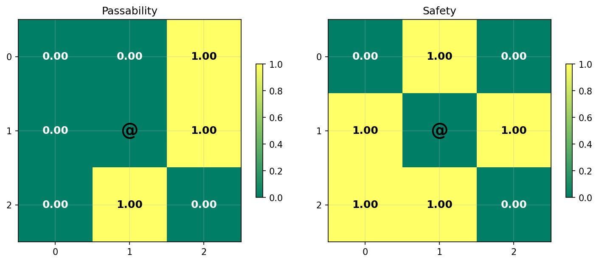 |

================================================================================

## Sample 2

### Ego Map Reconstruction

| Original | Reconstruction |
|---|---|
|  | 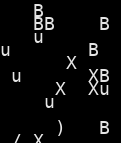 |

**Accuracy**: Character: 0.240, Color: 0.669

### Ego Class Reconstruction

| Original | Reconstruction |
|---|---|
| 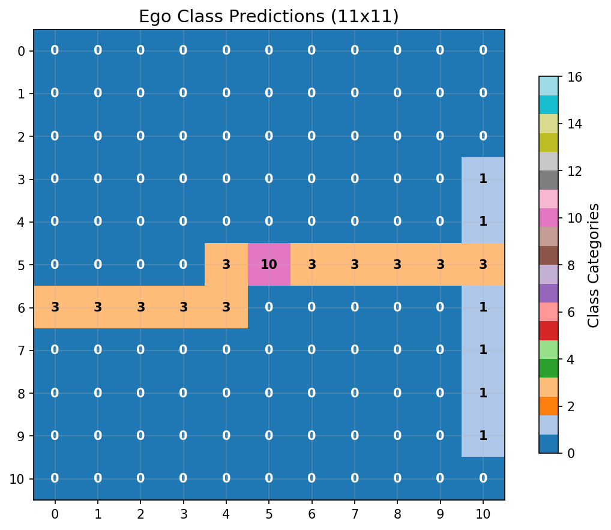 | 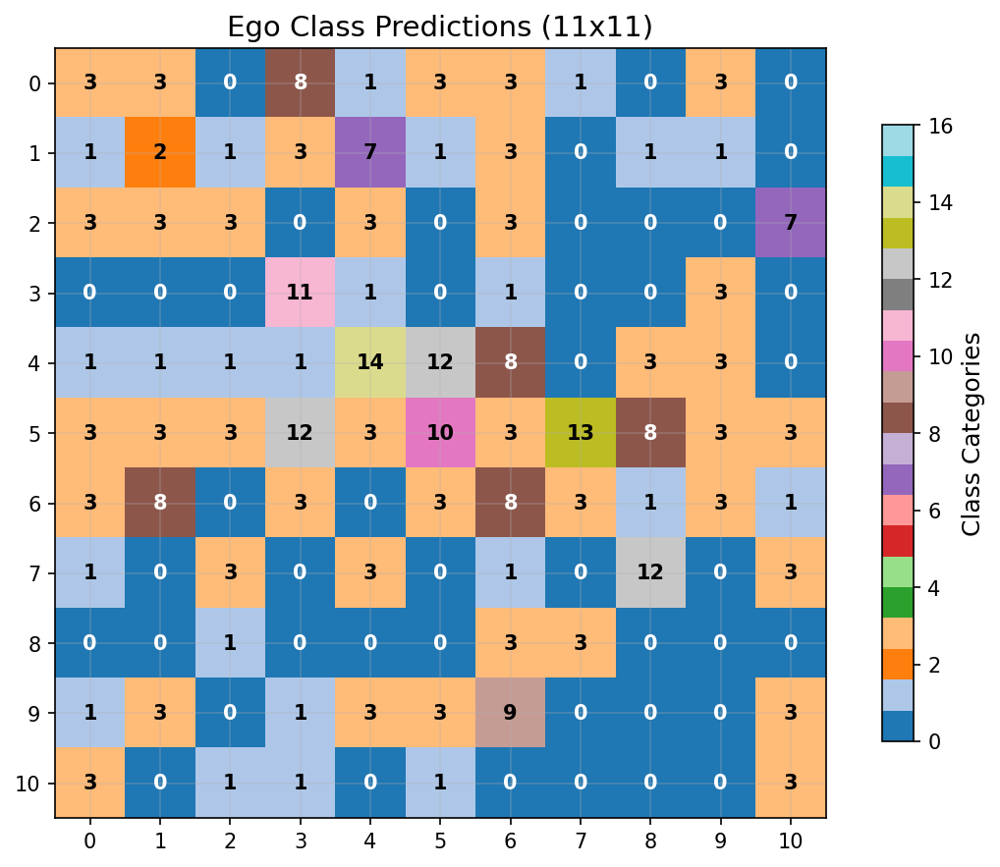 |

**Class Accuracy**: 0.388

### Bag Reconstruction

```
Bag Analysis:
========================================

Original Bag (16 items):
------------------------------
  '#' (color  7)
  '(' (color  3)
  ')' (color  6)
  '-' (color  3)
  '-' (color  7)
  '.' (color  7)
  '.' (color  8)
  ':' (color  2)
  ':' (color 15)
  '<' (color  7)
  '>' (color  7)
  '@' (color 15)
  '[' (color  3)
  '`' (color  7)
  '|' (color  3)
  '|' (color  7)

Reconstructed Bag (341 items):
------------------------------
  ' ' (color  2)
  ' ' (color  4)
  ' ' (color  9)
  ' ' (color 13)
  '!' (color  3)
  '!' (color 12)
  '!' (color 13)
  '!' (color 15)
  '"' (color  0)
  '"' (color  1)
  '"' (color  5)
  '"' (color  8)
  '"' (color 13)
  '"' (color 15)
  '#' (color  0)
  '#' (color  1)
  '#' (color  7)
  '#' (color  8)
  '#' (color 10)
  '#' (color 11)
  '#' (color 14)
  '$' (color  3)
  '$' (color  6)
  '$' (color  9)
  '$' (color 13)
  '%' (color  1)
  '%' (color  3)
  '%' (color 10)
  '%' (color 12)
  '&' (color  0)
  '&' (color  7)
  '&' (color 15)
  ''' (color  0)
  ''' (color  3)
  ''' (color  8)
  ''' (color 10)
  ''' (color 14)
  '(' (color  3)
  '(' (color  7)
  '(' (color 10)
  '(' (color 13)
  ')' (color  0)
  ')' (color  2)
  ')' (color  5)
  ')' (color  6)
  ')' (color  7)
  ')' (color 15)
  '*' (color  5)
  '*' (color  6)
  '*' (color  9)
  '*' (color 10)
  '*' (color 13)
  '+' (color  5)
  '+' (color  8)
  '+' (color 13)
  ',' (color  3)
  ',' (color  4)
  ',' (color  6)
  ',' (color  8)
  ',' (color 11)
  ',' (color 13)
  ',' (color 15)
  '-' (color  3)
  '-' (color  7)
  '-' (color  8)
  '-' (color  9)
  '-' (color 12)
  '-' (color 15)
  '.' (color  1)
  '.' (color  7)
  '.' (color  8)
  '.' (color  9)
  '.' (color 12)
  '.' (color 15)
  '/' (color  1)
  '/' (color  2)
  '/' (color  4)
  '/' (color  5)
  '/' (color  7)
  '0' (color  8)
  '1' (color 11)
  '2' (color 12)
  '3' (color 14)
  '3' (color 15)
  '4' (color  5)
  '4' (color  8)
  '4' (color  9)
  '4' (color 12)
  '5' (color  0)
  '5' (color  7)
  '5' (color 13)
  '6' (color  1)
  '6' (color  3)
  '6' (color 12)
  '7' (color 10)
  '7' (color 15)
  '8' (color  0)
  '8' (color  1)
  '8' (color  5)
  '8' (color 15)
  '9' (color  5)
  '9' (color  6)
  '9' (color  7)
  '9' (color 12)
  '9' (color 14)
  ':' (color  6)
  ';' (color  9)
  '<' (color  3)
  '<' (color  4)
  '<' (color  7)
  '<' (color 14)
  '=' (color  3)
  '=' (color  4)
  '>' (color  4)
  '>' (color  6)
  '>' (color  7)
  '>' (color 11)
  '?' (color  1)
  '?' (color  5)
  '?' (color  8)
  '?' (color  9)
  '?' (color 12)
  '@' (color  7)
  '@' (color 12)
  '@' (color 15)
  'A' (color  3)
  'A' (color  5)
  'A' (color  8)
  'A' (color 11)
  'B' (color  0)
  'B' (color  1)
  'B' (color 15)
  'C' (color  0)
  'C' (color  2)
  'C' (color 10)
  'C' (color 13)
  'D' (color  5)
  'D' (color 11)
  'E' (color  4)
  'F' (color  0)
  'F' (color  5)
  'F' (color  9)
  'G' (color  0)
  'G' (color  2)
  'H' (color  4)
  'I' (color  6)
  'I' (color 10)
  'J' (color  0)
  'J' (color 11)
  'K' (color  2)
  'K' (color  5)
  'K' (color 14)
  'L' (color  4)
  'L' (color  5)
  'L' (color 10)
  'M' (color  1)
  'M' (color  3)
  'M' (color  5)
  'M' (color  7)
  'M' (color  8)
  'M' (color 12)
  'M' (color 13)
  'N' (color  3)
  'N' (color  9)
  'N' (color 10)
  'N' (color 11)
  'N' (color 14)
  'O' (color  0)
  'O' (color  4)
  'P' (color  0)
  'P' (color  2)
  'P' (color  9)
  'P' (color 15)
  'Q' (color  0)
  'Q' (color  1)
  'Q' (color  5)
  'Q' (color  9)
  'Q' (color 10)
  'R' (color  1)
  'R' (color  9)
  'R' (color 14)
  'S' (color  7)
  'S' (color  9)
  'S' (color 11)
  'S' (color 12)
  'T' (color  1)
  'T' (color  8)
  'U' (color  1)
  'U' (color  8)
  'U' (color  9)
  'U' (color 10)
  'V' (color  3)
  'V' (color  4)
  'V' (color 11)
  'W' (color  0)
  'W' (color  6)
  'W' (color 10)
  'W' (color 11)
  'X' (color  1)
  'X' (color  2)
  'X' (color  3)
  'X' (color 10)
  'Z' (color  7)
  'Z' (color 12)
  'Z' (color 13)
  'Z' (color 15)
  '[' (color  0)
  '[' (color  1)
  '[' (color  3)
  '[' (color  9)
  '[' (color 12)
  '\' (color  2)
  '\' (color  5)
  '\' (color  6)
  '\' (color  7)
  '\' (color 11)
  '\' (color 15)
  ']' (color  4)
  ']' (color 15)
  '^' (color  6)
  '^' (color  8)
  '^' (color  9)
  '^' (color 13)
  '^' (color 15)
  '_' (color  4)
  '_' (color  6)
  '_' (color  8)
  '_' (color  9)
  '_' (color 11)
  '_' (color 12)
  '_' (color 13)
  '`' (color  2)
  '`' (color  3)
  '`' (color  4)
  '`' (color  6)
  '`' (color  7)
  '`' (color  8)
  'a' (color  1)
  'a' (color  5)
  'a' (color  9)
  'a' (color 13)
  'b' (color  1)
  'b' (color  7)
  'b' (color 10)
  'c' (color  0)
  'c' (color  3)
  'c' (color  4)
  'c' (color  6)
  'c' (color  8)
  'c' (color 10)
  'd' (color  6)
  'd' (color 11)
  'd' (color 14)
  'd' (color 15)
  'e' (color 14)
  'f' (color  0)
  'f' (color 11)
  'f' (color 15)
  'g' (color  4)
  'g' (color  5)
  'g' (color  7)
  'g' (color 11)
  'h' (color  2)
  'h' (color  3)
  'h' (color  5)
  'h' (color  6)
  'h' (color 15)
  'i' (color  7)
  'j' (color  0)
  'j' (color  2)
  'j' (color  3)
  'j' (color  6)
  'j' (color 14)
  'k' (color  0)
  'k' (color  1)
  'k' (color  2)
  'k' (color  7)
  'k' (color 11)
  'l' (color  0)
  'l' (color  7)
  'm' (color  1)
  'm' (color  2)
  'm' (color 10)
  'm' (color 15)
  'n' (color  4)
  'n' (color  6)
  'o' (color 11)
  'p' (color  2)
  'p' (color  4)
  'p' (color  8)
  'p' (color  9)
  'q' (color  2)
  'q' (color  4)
  'q' (color  5)
  'q' (color  9)
  'r' (color  0)
  'r' (color  6)
  'r' (color 11)
  's' (color  8)
  's' (color 10)
  't' (color  0)
  't' (color  1)
  't' (color  6)
  'u' (color  4)
  'u' (color  5)
  'u' (color  9)
  'u' (color 11)
  'u' (color 14)
  'v' (color  5)
  'v' (color  7)
  'v' (color  9)
  'v' (color 12)
  'v' (color 15)
  'w' (color  9)
  'w' (color 14)
  'x' (color  6)
  'x' (color 11)
  'y' (color  3)
  'y' (color 11)
  'y' (color 14)
  'z' (color  1)
  'z' (color  4)
  '{' (color  4)
  '{' (color  6)
  '{' (color  8)
  '{' (color 12)
  '{' (color 14)
  '|' (color  1)
  '|' (color  7)
  '|' (color  9)
  '|' (color 10)
  '}' (color  4)
  '~' (color  0)
  '~' (color  2)
  '~' (color  3)
  '~' (color  6)
  '~' (color  7)
  '~' (color 15)
  '\x7f' (color  3)
  '\x7f' (color 12)
  '\x7f' (color 13)

Accuracy Metrics:
------------------------------
  Correctly predicted: 13 items
    '#' (color  7)
    '(' (color  3)
    ')' (color  6)
    '-' (color  3)
    '-' (color  7)
    '.' (color  7)
    '.' (color  8)
    '<' (color  7)
    '>' (color  7)
    '@' (color 15)
    '[' (color  3)
    '`' (color  7)
    '|' (color  7)
  Missed items: 3 items
    ':' (color  2)
    ':' (color 15)
    '|' (color  3)
  False positives: 328 items
    ' ' (color  2)
    ' ' (color  4)
    ' ' (color  9)
    ' ' (color 13)
    '!' (color  3)
    '!' (color 12)
    '!' (color 13)
    '!' (color 15)
    '"' (color  0)
    '"' (color  1)
    '"' (color  5)
    '"' (color  8)
    '"' (color 13)
    '"' (color 15)
    '#' (color  0)
    '#' (color  1)
    '#' (color  8)
    '#' (color 10)
    '#' (color 11)
    '#' (color 14)
    '$' (color  3)
    '$' (color  6)
    '$' (color  9)
    '$' (color 13)
    '%' (color  1)
    '%' (color  3)
    '%' (color 10)
    '%' (color 12)
    '&' (color  0)
    '&' (color  7)
    '&' (color 15)
    ''' (color  0)
    ''' (color  3)
    ''' (color  8)
    ''' (color 10)
    ''' (color 14)
    '(' (color  7)
    '(' (color 10)
    '(' (color 13)
    ')' (color  0)
    ')' (color  2)
    ')' (color  5)
    ')' (color  7)
    ')' (color 15)
    '*' (color  5)
    '*' (color  6)
    '*' (color  9)
    '*' (color 10)
    '*' (color 13)
    '+' (color  5)
    '+' (color  8)
    '+' (color 13)
    ',' (color  3)
    ',' (color  4)
    ',' (color  6)
    ',' (color  8)
    ',' (color 11)
    ',' (color 13)
    ',' (color 15)
    '-' (color  8)
    '-' (color  9)
    '-' (color 12)
    '-' (color 15)
    '.' (color  1)
    '.' (color  9)
    '.' (color 12)
    '.' (color 15)
    '/' (color  1)
    '/' (color  2)
    '/' (color  4)
    '/' (color  5)
    '/' (color  7)
    '0' (color  8)
    '1' (color 11)
    '2' (color 12)
    '3' (color 14)
    '3' (color 15)
    '4' (color  5)
    '4' (color  8)
    '4' (color  9)
    '4' (color 12)
    '5' (color  0)
    '5' (color  7)
    '5' (color 13)
    '6' (color  1)
    '6' (color  3)
    '6' (color 12)
    '7' (color 10)
    '7' (color 15)
    '8' (color  0)
    '8' (color  1)
    '8' (color  5)
    '8' (color 15)
    '9' (color  5)
    '9' (color  6)
    '9' (color  7)
    '9' (color 12)
    '9' (color 14)
    ':' (color  6)
    ';' (color  9)
    '<' (color  3)
    '<' (color  4)
    '<' (color 14)
    '=' (color  3)
    '=' (color  4)
    '>' (color  4)
    '>' (color  6)
    '>' (color 11)
    '?' (color  1)
    '?' (color  5)
    '?' (color  8)
    '?' (color  9)
    '?' (color 12)
    '@' (color  7)
    '@' (color 12)
    'A' (color  3)
    'A' (color  5)
    'A' (color  8)
    'A' (color 11)
    'B' (color  0)
    'B' (color  1)
    'B' (color 15)
    'C' (color  0)
    'C' (color  2)
    'C' (color 10)
    'C' (color 13)
    'D' (color  5)
    'D' (color 11)
    'E' (color  4)
    'F' (color  0)
    'F' (color  5)
    'F' (color  9)
    'G' (color  0)
    'G' (color  2)
    'H' (color  4)
    'I' (color  6)
    'I' (color 10)
    'J' (color  0)
    'J' (color 11)
    'K' (color  2)
    'K' (color  5)
    'K' (color 14)
    'L' (color  4)
    'L' (color  5)
    'L' (color 10)
    'M' (color  1)
    'M' (color  3)
    'M' (color  5)
    'M' (color  7)
    'M' (color  8)
    'M' (color 12)
    'M' (color 13)
    'N' (color  3)
    'N' (color  9)
    'N' (color 10)
    'N' (color 11)
    'N' (color 14)
    'O' (color  0)
    'O' (color  4)
    'P' (color  0)
    'P' (color  2)
    'P' (color  9)
    'P' (color 15)
    'Q' (color  0)
    'Q' (color  1)
    'Q' (color  5)
    'Q' (color  9)
    'Q' (color 10)
    'R' (color  1)
    'R' (color  9)
    'R' (color 14)
    'S' (color  7)
    'S' (color  9)
    'S' (color 11)
    'S' (color 12)
    'T' (color  1)
    'T' (color  8)
    'U' (color  1)
    'U' (color  8)
    'U' (color  9)
    'U' (color 10)
    'V' (color  3)
    'V' (color  4)
    'V' (color 11)
    'W' (color  0)
    'W' (color  6)
    'W' (color 10)
    'W' (color 11)
    'X' (color  1)
    'X' (color  2)
    'X' (color  3)
    'X' (color 10)
    'Z' (color  7)
    'Z' (color 12)
    'Z' (color 13)
    'Z' (color 15)
    '[' (color  0)
    '[' (color  1)
    '[' (color  9)
    '[' (color 12)
    '\' (color  2)
    '\' (color  5)
    '\' (color  6)
    '\' (color  7)
    '\' (color 11)
    '\' (color 15)
    ']' (color  4)
    ']' (color 15)
    '^' (color  6)
    '^' (color  8)
    '^' (color  9)
    '^' (color 13)
    '^' (color 15)
    '_' (color  4)
    '_' (color  6)
    '_' (color  8)
    '_' (color  9)
    '_' (color 11)
    '_' (color 12)
    '_' (color 13)
    '`' (color  2)
    '`' (color  3)
    '`' (color  4)
    '`' (color  6)
    '`' (color  8)
    'a' (color  1)
    'a' (color  5)
    'a' (color  9)
    'a' (color 13)
    'b' (color  1)
    'b' (color  7)
    'b' (color 10)
    'c' (color  0)
    'c' (color  3)
    'c' (color  4)
    'c' (color  6)
    'c' (color  8)
    'c' (color 10)
    'd' (color  6)
    'd' (color 11)
    'd' (color 14)
    'd' (color 15)
    'e' (color 14)
    'f' (color  0)
    'f' (color 11)
    'f' (color 15)
    'g' (color  4)
    'g' (color  5)
    'g' (color  7)
    'g' (color 11)
    'h' (color  2)
    'h' (color  3)
    'h' (color  5)
    'h' (color  6)
    'h' (color 15)
    'i' (color  7)
    'j' (color  0)
    'j' (color  2)
    'j' (color  3)
    'j' (color  6)
    'j' (color 14)
    'k' (color  0)
    'k' (color  1)
    'k' (color  2)
    'k' (color  7)
    'k' (color 11)
    'l' (color  0)
    'l' (color  7)
    'm' (color  1)
    'm' (color  2)
    'm' (color 10)
    'm' (color 15)
    'n' (color  4)
    'n' (color  6)
    'o' (color 11)
    'p' (color  2)
    'p' (color  4)
    'p' (color  8)
    'p' (color  9)
    'q' (color  2)
    'q' (color  4)
    'q' (color  5)
    'q' (color  9)
    'r' (color  0)
    'r' (color  6)
    'r' (color 11)
    's' (color  8)
    's' (color 10)
    't' (color  0)
    't' (color  1)
    't' (color  6)
    'u' (color  4)
    'u' (color  5)
    'u' (color  9)
    'u' (color 11)
    'u' (color 14)
    'v' (color  5)
    'v' (color  7)
    'v' (color  9)
    'v' (color 12)
    'v' (color 15)
    'w' (color  9)
    'w' (color 14)
    'x' (color  6)
    'x' (color 11)
    'y' (color  3)
    'y' (color 11)
    'y' (color 14)
    'z' (color  1)
    'z' (color  4)
    '{' (color  4)
    '{' (color  6)
    '{' (color  8)
    '{' (color 12)
    '{' (color 14)
    '|' (color  1)
    '|' (color  9)
    '|' (color 10)
    '}' (color  4)
    '~' (color  0)
    '~' (color  2)
    '~' (color  3)
    '~' (color  6)
    '~' (color  7)
    '~' (color 15)
    '\x7f' (color  3)
    '\x7f' (color 12)
    '\x7f' (color 13)

Performance Summary:
------------------------------
  Precision: 0.038 (13/341)
  Recall: 0.812 (13/16)
  F1-Score: 0.073
  Total unique items: 344
```

### Passability & Safety

| Original | Reconstruction |
|---|---|
|  | 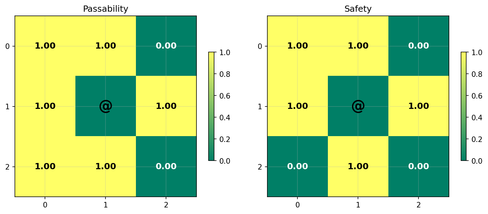 |

================================================================================

## Sample 3

### Ego Map Reconstruction

| Original | Reconstruction |
|---|---|
| 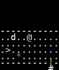 |  |

**Accuracy**: Character: 0.099, Color: 0.496

### Ego Class Reconstruction

| Original | Reconstruction |
|---|---|
| 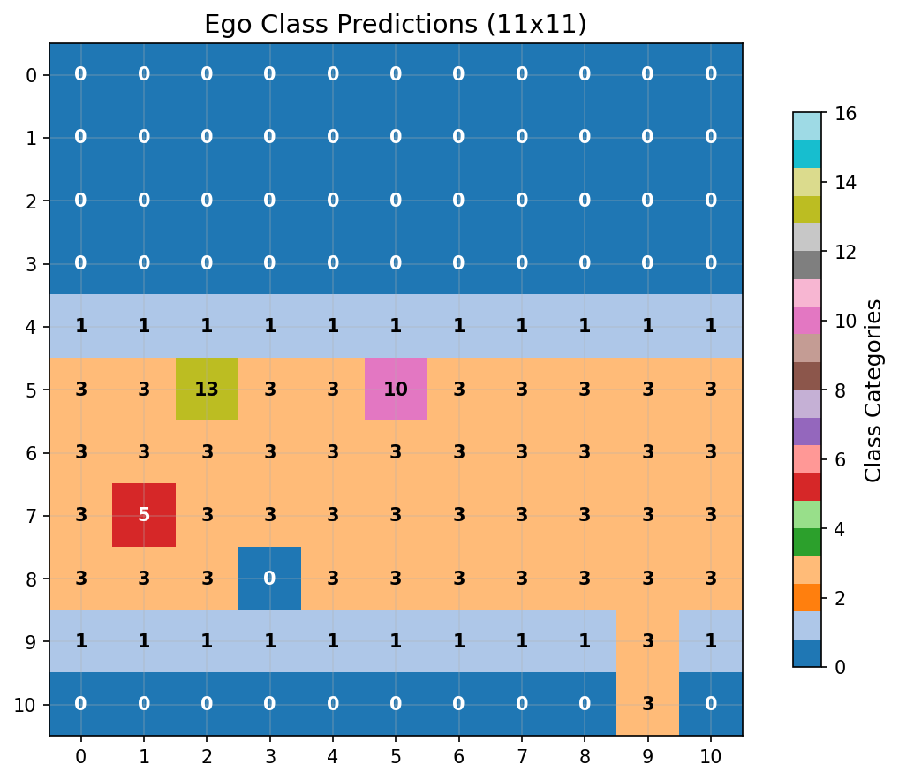 | 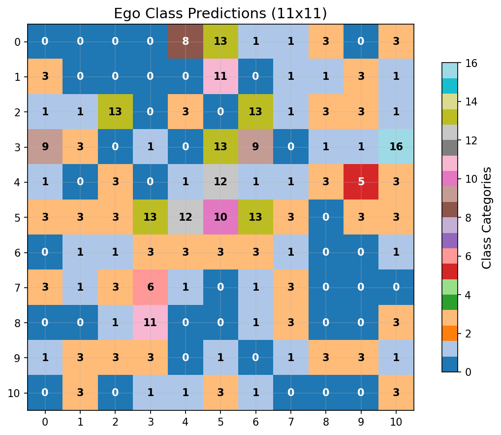 |

**Class Accuracy**: 0.347

### Bag Reconstruction

```
Bag Analysis:
========================================

Original Bag (15 items):
------------------------------
  '#' (color  7)
  '*' (color  8)
  '-' (color  3)
  '-' (color  7)
  '.' (color  7)
  '.' (color  8)
  '<' (color  7)
  '>' (color  7)
  '@' (color 15)
  '[' (color  8)
  '^' (color  6)
  '`' (color  7)
  'd' (color 15)
  '|' (color  3)
  '|' (color  7)

Reconstructed Bag (349 items):
------------------------------
  ' ' (color  4)
  ' ' (color  9)
  ' ' (color 13)
  ' ' (color 14)
  '!' (color  5)
  '!' (color 10)
  '!' (color 11)
  '!' (color 12)
  '"' (color  6)
  '"' (color  7)
  '#' (color  1)
  '#' (color  3)
  '#' (color  7)
  '$' (color 10)
  '$' (color 12)
  '$' (color 14)
  '%' (color  1)
  '%' (color  2)
  '%' (color  3)
  '%' (color 14)
  '%' (color 15)
  '&' (color  0)
  '&' (color  7)
  '&' (color 11)
  '&' (color 15)
  ''' (color  4)
  ''' (color 14)
  '(' (color  3)
  '(' (color  5)
  '(' (color  8)
  '(' (color 15)
  ')' (color  1)
  ')' (color 11)
  '*' (color  5)
  '*' (color  9)
  '*' (color 10)
  '*' (color 12)
  '*' (color 14)
  '*' (color 15)
  ',' (color  0)
  ',' (color  2)
  ',' (color  4)
  ',' (color  8)
  ',' (color 11)
  ',' (color 13)
  '-' (color  3)
  '-' (color  4)
  '-' (color  6)
  '-' (color  7)
  '-' (color  9)
  '-' (color 15)
  '.' (color  3)
  '.' (color  7)
  '.' (color 15)
  '/' (color  0)
  '/' (color  1)
  '/' (color  4)
  '/' (color  5)
  '/' (color 13)
  '0' (color  0)
  '0' (color  2)
  '0' (color 10)
  '0' (color 12)
  '1' (color  0)
  '1' (color  1)
  '1' (color 13)
  '1' (color 14)
  '2' (color  3)
  '2' (color  4)
  '2' (color  6)
  '3' (color  2)
  '3' (color  7)
  '3' (color 13)
  '4' (color  5)
  '4' (color  9)
  '4' (color 12)
  '4' (color 14)
  '5' (color  7)
  '6' (color  0)
  '6' (color  1)
  '6' (color  2)
  '6' (color  8)
  '6' (color 10)
  '6' (color 11)
  '7' (color  1)
  '7' (color  4)
  '7' (color  8)
  '7' (color 11)
  '7' (color 12)
  '8' (color  4)
  '8' (color  5)
  '8' (color  8)
  '9' (color  6)
  '9' (color 10)
  ':' (color  6)
  ':' (color 10)
  ':' (color 11)
  ':' (color 13)
  ':' (color 14)
  ';' (color  4)
  ';' (color 11)
  ';' (color 15)
  '<' (color  0)
  '<' (color  2)
  '<' (color  3)
  '<' (color  7)
  '<' (color  9)
  '<' (color 11)
  '>' (color  2)
  '>' (color  5)
  '>' (color 12)
  '?' (color  0)
  '?' (color  6)
  '?' (color  7)
  '?' (color  8)
  '@' (color  2)
  '@' (color  7)
  '@' (color 10)
  '@' (color 14)
  '@' (color 15)
  'A' (color  6)
  'A' (color  9)
  'A' (color 11)
  'A' (color 12)
  'A' (color 15)
  'B' (color  9)
  'B' (color 11)
  'B' (color 13)
  'C' (color  4)
  'C' (color  9)
  'C' (color 13)
  'D' (color  2)
  'D' (color  8)
  'D' (color 11)
  'D' (color 15)
  'E' (color  2)
  'E' (color  8)
  'E' (color 10)
  'E' (color 13)
  'F' (color  1)
  'F' (color  4)
  'F' (color  7)
  'F' (color  8)
  'F' (color 12)
  'G' (color  0)
  'G' (color  1)
  'G' (color 12)
  'G' (color 15)
  'H' (color  1)
  'H' (color  3)
  'H' (color  4)
  'H' (color 14)
  'I' (color  1)
  'I' (color  3)
  'I' (color  4)
  'I' (color  9)
  'I' (color 12)
  'J' (color 11)
  'K' (color  2)
  'K' (color  5)
  'K' (color 10)
  'K' (color 12)
  'K' (color 13)
  'K' (color 14)
  'L' (color 10)
  'M' (color  2)
  'M' (color  3)
  'M' (color  9)
  'M' (color 10)
  'M' (color 12)
  'M' (color 15)
  'N' (color  7)
  'N' (color 13)
  'N' (color 14)
  'O' (color  2)
  'O' (color  4)
  'O' (color  8)
  'O' (color  9)
  'O' (color 15)
  'P' (color  3)
  'P' (color  4)
  'P' (color  7)
  'P' (color 11)
  'P' (color 12)
  'Q' (color  1)
  'Q' (color 12)
  'R' (color  0)
  'R' (color  3)
  'R' (color 11)
  'S' (color  0)
  'S' (color  1)
  'S' (color 10)
  'S' (color 11)
  'T' (color  0)
  'T' (color  4)
  'T' (color 12)
  'U' (color  0)
  'U' (color  1)
  'U' (color  9)
  'V' (color  3)
  'V' (color  7)
  'W' (color  4)
  'W' (color  6)
  'X' (color  4)
  'X' (color  7)
  'X' (color  8)
  'X' (color 10)
  'Y' (color  2)
  'Y' (color  9)
  'Y' (color 10)
  'Z' (color  2)
  'Z' (color  4)
  'Z' (color  6)
  '[' (color  1)
  '[' (color 13)
  '[' (color 14)
  '\' (color  0)
  '\' (color  1)
  '\' (color  7)
  '\' (color  9)
  ']' (color  4)
  ']' (color  6)
  ']' (color  7)
  ']' (color  8)
  ']' (color 10)
  ']' (color 12)
  '^' (color  0)
  '^' (color  7)
  '^' (color 12)
  '^' (color 13)
  '_' (color  1)
  '_' (color  4)
  '_' (color  6)
  '_' (color  8)
  '_' (color  9)
  '`' (color  4)
  '`' (color  7)
  '`' (color 15)
  'a' (color  7)
  'b' (color  8)
  'b' (color 13)
  'c' (color 10)
  'd' (color  6)
  'd' (color  7)
  'd' (color 10)
  'd' (color 14)
  'e' (color  5)
  'e' (color 12)
  'e' (color 14)
  'e' (color 15)
  'f' (color  2)
  'f' (color  6)
  'f' (color  8)
  'f' (color  9)
  'f' (color 11)
  'f' (color 13)
  'g' (color  4)
  'g' (color  5)
  'g' (color  7)
  'h' (color  5)
  'h' (color  8)
  'h' (color  9)
  'i' (color  1)
  'i' (color  3)
  'i' (color  4)
  'i' (color 11)
  'i' (color 14)
  'j' (color  1)
  'j' (color  5)
  'j' (color  6)
  'j' (color  7)
  'j' (color 10)
  'k' (color  1)
  'k' (color  2)
  'k' (color  8)
  'k' (color  9)
  'l' (color  0)
  'l' (color  2)
  'l' (color  3)
  'l' (color  7)
  'l' (color  8)
  'l' (color 10)
  'l' (color 11)
  'm' (color  1)
  'm' (color  7)
  'm' (color 10)
  'm' (color 12)
  'n' (color  5)
  'o' (color  0)
  'o' (color  4)
  'o' (color 14)
  'p' (color  4)
  'p' (color  6)
  'p' (color  7)
  'q' (color  0)
  'q' (color  1)
  'q' (color  2)
  'q' (color  4)
  'q' (color 15)
  'r' (color  2)
  'r' (color  9)
  'r' (color 14)
  's' (color  0)
  's' (color 10)
  's' (color 11)
  't' (color  0)
  't' (color 10)
  'u' (color  4)
  'u' (color  5)
  'u' (color  9)
  'v' (color  5)
  'v' (color  7)
  'v' (color 12)
  'v' (color 15)
  'w' (color  4)
  'w' (color  5)
  'w' (color  8)
  'w' (color  9)
  'w' (color 12)
  'x' (color  6)
  'x' (color 12)
  'x' (color 13)
  'x' (color 14)
  'y' (color  2)
  'y' (color  6)
  'y' (color  8)
  'y' (color 15)
  'z' (color  1)
  'z' (color  8)
  '{' (color  0)
  '{' (color  5)
  '{' (color 11)
  '{' (color 13)
  '|' (color  2)
  '|' (color  5)
  '|' (color  7)
  '|' (color  9)
  '|' (color 14)
  '}' (color  0)
  '}' (color  8)
  '}' (color 15)
  '~' (color  2)
  '~' (color  5)
  '~' (color  7)
  '~' (color 12)
  '~' (color 13)
  '~' (color 14)
  '\x7f' (color 12)
  '\x7f' (color 13)

Accuracy Metrics:
------------------------------
  Correctly predicted: 8 items
    '#' (color  7)
    '-' (color  3)
    '-' (color  7)
    '.' (color  7)
    '<' (color  7)
    '@' (color 15)
    '`' (color  7)
    '|' (color  7)
  Missed items: 7 items
    '*' (color  8)
    '.' (color  8)
    '>' (color  7)
    '[' (color  8)
    '^' (color  6)
    'd' (color 15)
    '|' (color  3)
  False positives: 341 items
    ' ' (color  4)
    ' ' (color  9)
    ' ' (color 13)
    ' ' (color 14)
    '!' (color  5)
    '!' (color 10)
    '!' (color 11)
    '!' (color 12)
    '"' (color  6)
    '"' (color  7)
    '#' (color  1)
    '#' (color  3)
    '$' (color 10)
    '$' (color 12)
    '$' (color 14)
    '%' (color  1)
    '%' (color  2)
    '%' (color  3)
    '%' (color 14)
    '%' (color 15)
    '&' (color  0)
    '&' (color  7)
    '&' (color 11)
    '&' (color 15)
    ''' (color  4)
    ''' (color 14)
    '(' (color  3)
    '(' (color  5)
    '(' (color  8)
    '(' (color 15)
    ')' (color  1)
    ')' (color 11)
    '*' (color  5)
    '*' (color  9)
    '*' (color 10)
    '*' (color 12)
    '*' (color 14)
    '*' (color 15)
    ',' (color  0)
    ',' (color  2)
    ',' (color  4)
    ',' (color  8)
    ',' (color 11)
    ',' (color 13)
    '-' (color  4)
    '-' (color  6)
    '-' (color  9)
    '-' (color 15)
    '.' (color  3)
    '.' (color 15)
    '/' (color  0)
    '/' (color  1)
    '/' (color  4)
    '/' (color  5)
    '/' (color 13)
    '0' (color  0)
    '0' (color  2)
    '0' (color 10)
    '0' (color 12)
    '1' (color  0)
    '1' (color  1)
    '1' (color 13)
    '1' (color 14)
    '2' (color  3)
    '2' (color  4)
    '2' (color  6)
    '3' (color  2)
    '3' (color  7)
    '3' (color 13)
    '4' (color  5)
    '4' (color  9)
    '4' (color 12)
    '4' (color 14)
    '5' (color  7)
    '6' (color  0)
    '6' (color  1)
    '6' (color  2)
    '6' (color  8)
    '6' (color 10)
    '6' (color 11)
    '7' (color  1)
    '7' (color  4)
    '7' (color  8)
    '7' (color 11)
    '7' (color 12)
    '8' (color  4)
    '8' (color  5)
    '8' (color  8)
    '9' (color  6)
    '9' (color 10)
    ':' (color  6)
    ':' (color 10)
    ':' (color 11)
    ':' (color 13)
    ':' (color 14)
    ';' (color  4)
    ';' (color 11)
    ';' (color 15)
    '<' (color  0)
    '<' (color  2)
    '<' (color  3)
    '<' (color  9)
    '<' (color 11)
    '>' (color  2)
    '>' (color  5)
    '>' (color 12)
    '?' (color  0)
    '?' (color  6)
    '?' (color  7)
    '?' (color  8)
    '@' (color  2)
    '@' (color  7)
    '@' (color 10)
    '@' (color 14)
    'A' (color  6)
    'A' (color  9)
    'A' (color 11)
    'A' (color 12)
    'A' (color 15)
    'B' (color  9)
    'B' (color 11)
    'B' (color 13)
    'C' (color  4)
    'C' (color  9)
    'C' (color 13)
    'D' (color  2)
    'D' (color  8)
    'D' (color 11)
    'D' (color 15)
    'E' (color  2)
    'E' (color  8)
    'E' (color 10)
    'E' (color 13)
    'F' (color  1)
    'F' (color  4)
    'F' (color  7)
    'F' (color  8)
    'F' (color 12)
    'G' (color  0)
    'G' (color  1)
    'G' (color 12)
    'G' (color 15)
    'H' (color  1)
    'H' (color  3)
    'H' (color  4)
    'H' (color 14)
    'I' (color  1)
    'I' (color  3)
    'I' (color  4)
    'I' (color  9)
    'I' (color 12)
    'J' (color 11)
    'K' (color  2)
    'K' (color  5)
    'K' (color 10)
    'K' (color 12)
    'K' (color 13)
    'K' (color 14)
    'L' (color 10)
    'M' (color  2)
    'M' (color  3)
    'M' (color  9)
    'M' (color 10)
    'M' (color 12)
    'M' (color 15)
    'N' (color  7)
    'N' (color 13)
    'N' (color 14)
    'O' (color  2)
    'O' (color  4)
    'O' (color  8)
    'O' (color  9)
    'O' (color 15)
    'P' (color  3)
    'P' (color  4)
    'P' (color  7)
    'P' (color 11)
    'P' (color 12)
    'Q' (color  1)
    'Q' (color 12)
    'R' (color  0)
    'R' (color  3)
    'R' (color 11)
    'S' (color  0)
    'S' (color  1)
    'S' (color 10)
    'S' (color 11)
    'T' (color  0)
    'T' (color  4)
    'T' (color 12)
    'U' (color  0)
    'U' (color  1)
    'U' (color  9)
    'V' (color  3)
    'V' (color  7)
    'W' (color  4)
    'W' (color  6)
    'X' (color  4)
    'X' (color  7)
    'X' (color  8)
    'X' (color 10)
    'Y' (color  2)
    'Y' (color  9)
    'Y' (color 10)
    'Z' (color  2)
    'Z' (color  4)
    'Z' (color  6)
    '[' (color  1)
    '[' (color 13)
    '[' (color 14)
    '\' (color  0)
    '\' (color  1)
    '\' (color  7)
    '\' (color  9)
    ']' (color  4)
    ']' (color  6)
    ']' (color  7)
    ']' (color  8)
    ']' (color 10)
    ']' (color 12)
    '^' (color  0)
    '^' (color  7)
    '^' (color 12)
    '^' (color 13)
    '_' (color  1)
    '_' (color  4)
    '_' (color  6)
    '_' (color  8)
    '_' (color  9)
    '`' (color  4)
    '`' (color 15)
    'a' (color  7)
    'b' (color  8)
    'b' (color 13)
    'c' (color 10)
    'd' (color  6)
    'd' (color  7)
    'd' (color 10)
    'd' (color 14)
    'e' (color  5)
    'e' (color 12)
    'e' (color 14)
    'e' (color 15)
    'f' (color  2)
    'f' (color  6)
    'f' (color  8)
    'f' (color  9)
    'f' (color 11)
    'f' (color 13)
    'g' (color  4)
    'g' (color  5)
    'g' (color  7)
    'h' (color  5)
    'h' (color  8)
    'h' (color  9)
    'i' (color  1)
    'i' (color  3)
    'i' (color  4)
    'i' (color 11)
    'i' (color 14)
    'j' (color  1)
    'j' (color  5)
    'j' (color  6)
    'j' (color  7)
    'j' (color 10)
    'k' (color  1)
    'k' (color  2)
    'k' (color  8)
    'k' (color  9)
    'l' (color  0)
    'l' (color  2)
    'l' (color  3)
    'l' (color  7)
    'l' (color  8)
    'l' (color 10)
    'l' (color 11)
    'm' (color  1)
    'm' (color  7)
    'm' (color 10)
    'm' (color 12)
    'n' (color  5)
    'o' (color  0)
    'o' (color  4)
    'o' (color 14)
    'p' (color  4)
    'p' (color  6)
    'p' (color  7)
    'q' (color  0)
    'q' (color  1)
    'q' (color  2)
    'q' (color  4)
    'q' (color 15)
    'r' (color  2)
    'r' (color  9)
    'r' (color 14)
    's' (color  0)
    's' (color 10)
    's' (color 11)
    't' (color  0)
    't' (color 10)
    'u' (color  4)
    'u' (color  5)
    'u' (color  9)
    'v' (color  5)
    'v' (color  7)
    'v' (color 12)
    'v' (color 15)
    'w' (color  4)
    'w' (color  5)
    'w' (color  8)
    'w' (color  9)
    'w' (color 12)
    'x' (color  6)
    'x' (color 12)
    'x' (color 13)
    'x' (color 14)
    'y' (color  2)
    'y' (color  6)
    'y' (color  8)
    'y' (color 15)
    'z' (color  1)
    'z' (color  8)
    '{' (color  0)
    '{' (color  5)
    '{' (color 11)
    '{' (color 13)
    '|' (color  2)
    '|' (color  5)
    '|' (color  9)
    '|' (color 14)
    '}' (color  0)
    '}' (color  8)
    '}' (color 15)
    '~' (color  2)
    '~' (color  5)
    '~' (color  7)
    '~' (color 12)
    '~' (color 13)
    '~' (color 14)
    '\x7f' (color 12)
    '\x7f' (color 13)

Performance Summary:
------------------------------
  Precision: 0.023 (8/349)
  Recall: 0.533 (8/15)
  F1-Score: 0.044
  Total unique items: 356
```

### Passability & Safety

| Original | Reconstruction |
|---|---|
|  | 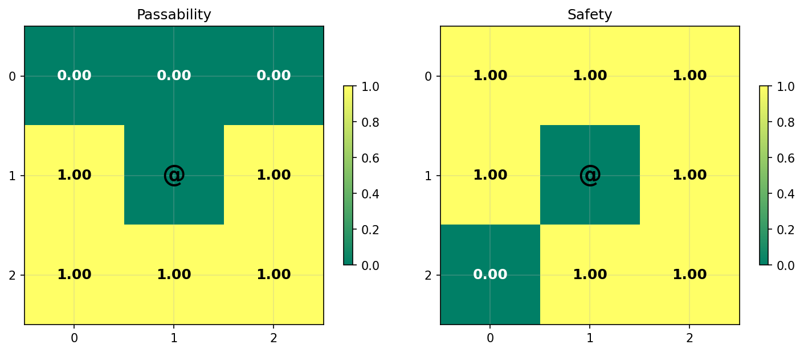 |

================================================================================

## Sample 4

### Ego Map Reconstruction

| Original | Reconstruction |
|---|---|
| 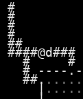 |  |

**Accuracy**: Character: 0.223, Color: 0.595

### Ego Class Reconstruction

| Original | Reconstruction |
|---|---|
| 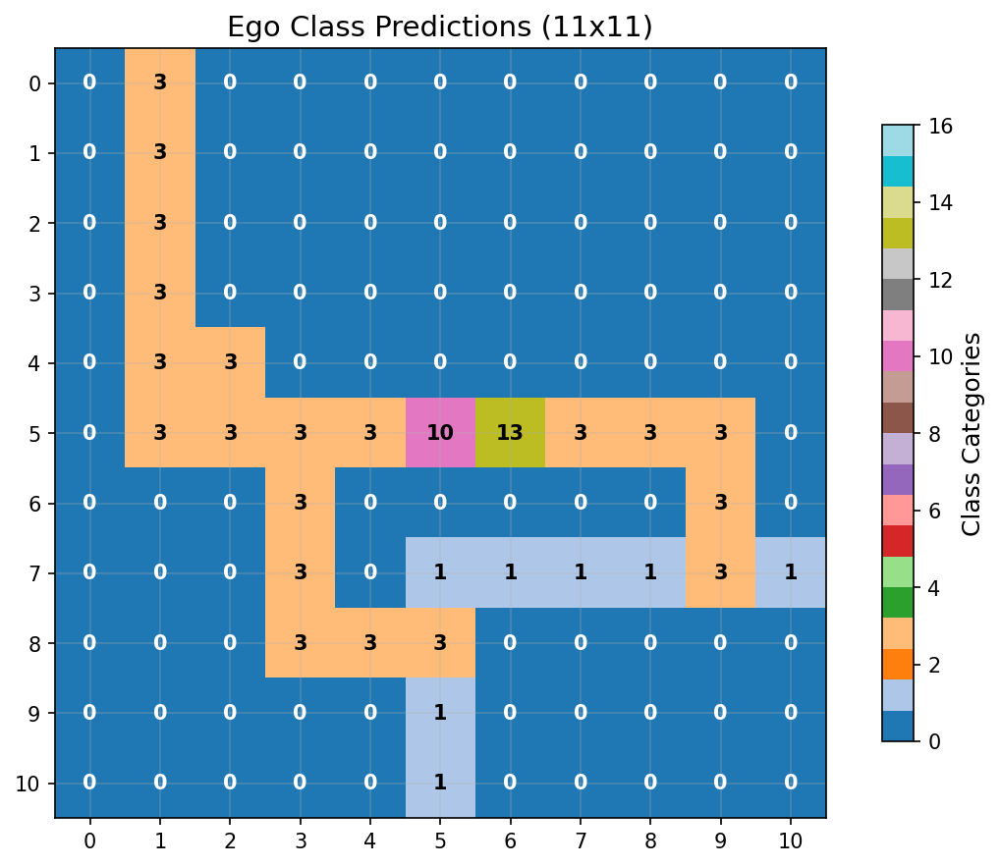 | 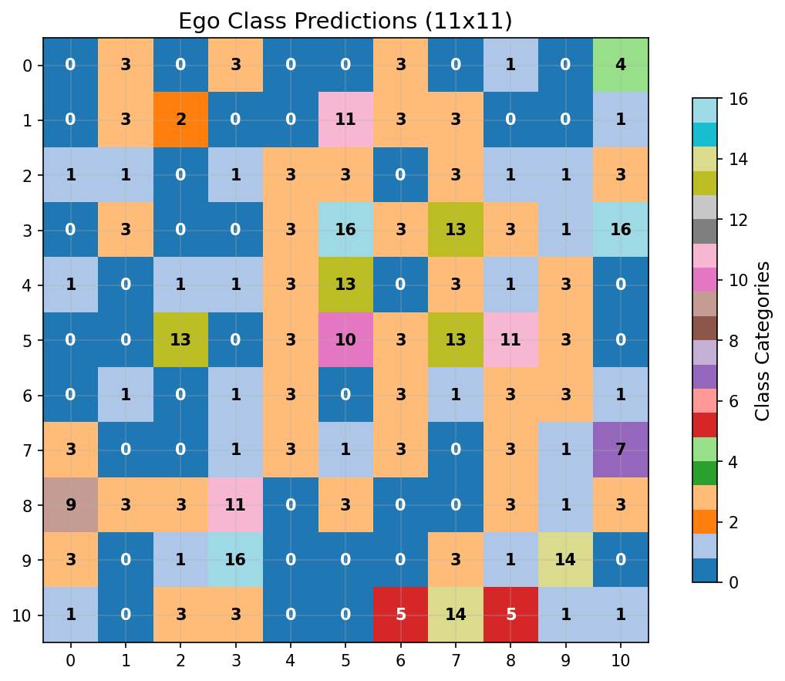 |

**Class Accuracy**: 0.397

### Bag Reconstruction

```
Bag Analysis:
========================================

Original Bag (17 items):
------------------------------
  '#' (color  7)
  '(' (color  3)
  '(' (color  6)
  '+' (color  3)
  '+' (color  6)
  '+' (color 11)
  '-' (color  3)
  '-' (color  7)
  '.' (color  7)
  '.' (color  8)
  '<' (color  7)
  '>' (color  7)
  '@' (color 15)
  '`' (color  7)
  'd' (color 15)
  '{' (color 12)
  '|' (color  7)

Reconstructed Bag (341 items):
------------------------------
  ' ' (color  1)
  ' ' (color 11)
  ' ' (color 12)
  ' ' (color 13)
  ' ' (color 15)
  '!' (color  0)
  '!' (color  4)
  '!' (color  8)
  '"' (color 12)
  '#' (color  7)
  '#' (color  8)
  '#' (color 10)
  '#' (color 12)
  '#' (color 15)
  '$' (color  0)
  '$' (color  4)
  '$' (color  6)
  '$' (color  7)
  '$' (color 14)
  '%' (color  2)
  '%' (color  3)
  '%' (color  4)
  '%' (color  8)
  '%' (color 10)
  '&' (color  0)
  '&' (color  3)
  '&' (color  5)
  '&' (color  7)
  '&' (color  9)
  ''' (color  1)
  ''' (color 14)
  '(' (color  2)
  '(' (color  3)
  ')' (color  5)
  ')' (color  6)
  ')' (color 11)
  ')' (color 12)
  ')' (color 14)
  '*' (color  4)
  '*' (color 11)
  '*' (color 13)
  '+' (color  2)
  '+' (color  3)
  '+' (color 13)
  ',' (color  4)
  '-' (color  2)
  '-' (color  3)
  '-' (color  5)
  '-' (color  7)
  '-' (color 11)
  '-' (color 12)
  '-' (color 15)
  '.' (color  1)
  '.' (color  7)
  '.' (color  8)
  '.' (color  9)
  '/' (color  1)
  '/' (color 14)
  '0' (color  0)
  '0' (color  2)
  '0' (color  9)
  '0' (color 12)
  '1' (color  2)
  '1' (color  4)
  '1' (color  6)
  '1' (color  7)
  '1' (color 15)
  '2' (color 12)
  '2' (color 15)
  '3' (color  1)
  '3' (color  2)
  '3' (color 13)
  '4' (color  1)
  '4' (color 10)
  '5' (color  0)
  '5' (color  7)
  '5' (color 11)
  '5' (color 15)
  '6' (color  0)
  '6' (color  1)
  '6' (color  3)
  '6' (color  5)
  '6' (color  6)
  '6' (color 11)
  '6' (color 15)
  '7' (color  0)
  '7' (color  9)
  '8' (color 14)
  '9' (color  5)
  '9' (color  7)
  '9' (color  8)
  '9' (color 11)
  '9' (color 12)
  '9' (color 14)
  ':' (color  2)
  ':' (color  7)
  ':' (color  8)
  ':' (color  9)
  ':' (color 12)
  ';' (color 10)
  ';' (color 13)
  '<' (color  3)
  '<' (color  7)
  '<' (color 12)
  '<' (color 13)
  '=' (color  3)
  '>' (color  7)
  '?' (color  0)
  '?' (color  1)
  '@' (color  4)
  '@' (color  7)
  '@' (color  9)
  '@' (color 13)
  '@' (color 15)
  'A' (color 14)
  'B' (color  2)
  'B' (color  4)
  'B' (color  6)
  'B' (color 14)
  'C' (color  1)
  'C' (color  3)
  'C' (color  5)
  'C' (color 13)
  'D' (color  0)
  'D' (color  2)
  'D' (color  4)
  'D' (color 11)
  'D' (color 13)
  'E' (color  2)
  'E' (color  4)
  'E' (color  5)
  'E' (color  8)
  'F' (color  3)
  'F' (color  7)
  'F' (color  8)
  'F' (color  9)
  'F' (color 12)
  'G' (color  0)
  'G' (color  1)
  'G' (color  2)
  'G' (color  3)
  'G' (color  9)
  'G' (color 14)
  'H' (color  2)
  'H' (color  3)
  'H' (color  6)
  'H' (color  8)
  'H' (color  9)
  'I' (color  2)
  'I' (color  3)
  'J' (color  0)
  'J' (color 14)
  'K' (color 11)
  'K' (color 15)
  'L' (color  0)
  'L' (color 10)
  'L' (color 11)
  'L' (color 15)
  'M' (color  0)
  'M' (color  2)
  'M' (color  7)
  'M' (color 14)
  'N' (color  0)
  'N' (color  3)
  'N' (color  6)
  'N' (color 12)
  'O' (color  2)
  'O' (color  6)
  'O' (color 10)
  'O' (color 11)
  'O' (color 12)
  'O' (color 15)
  'P' (color  0)
  'P' (color  1)
  'P' (color  2)
  'P' (color  5)
  'P' (color  6)
  'P' (color  7)
  'P' (color  9)
  'P' (color 11)
  'Q' (color 10)
  'R' (color  0)
  'R' (color  2)
  'R' (color 12)
  'R' (color 13)
  'S' (color  0)
  'S' (color  1)
  'S' (color  2)
  'S' (color 10)
  'S' (color 12)
  'S' (color 13)
  'S' (color 14)
  'T' (color  0)
  'T' (color  1)
  'T' (color  3)
  'T' (color 15)
  'U' (color  6)
  'U' (color 13)
  'V' (color  0)
  'V' (color 13)
  'W' (color  6)
  'W' (color 11)
  'W' (color 15)
  'X' (color  6)
  'X' (color  8)
  'X' (color 15)
  'Y' (color  3)
  'Y' (color 10)
  'Y' (color 15)
  'Z' (color  8)
  'Z' (color  9)
  '[' (color  4)
  '[' (color  7)
  '[' (color  8)
  '[' (color 10)
  '\' (color  0)
  '\' (color  7)
  '\' (color  9)
  '\' (color 10)
  '\' (color 11)
  ']' (color  2)
  ']' (color  4)
  ']' (color  5)
  ']' (color 15)
  '^' (color  3)
  '^' (color 12)
  '^' (color 13)
  '^' (color 15)
  '_' (color  8)
  '_' (color 11)
  '_' (color 13)
  '_' (color 14)
  '_' (color 15)
  '`' (color  4)
  '`' (color  7)
  '`' (color 10)
  'a' (color  0)
  'a' (color  2)
  'a' (color  5)
  'a' (color 12)
  'b' (color  3)
  'b' (color  8)
  'c' (color  0)
  'c' (color  2)
  'c' (color  3)
  'c' (color  6)
  'c' (color 10)
  'd' (color  4)
  'd' (color  6)
  'd' (color 15)
  'e' (color  2)
  'e' (color  9)
  'e' (color 13)
  'e' (color 14)
  'f' (color  3)
  'f' (color  5)
  'h' (color  3)
  'h' (color  5)
  'h' (color 11)
  'h' (color 12)
  'i' (color  9)
  'i' (color 11)
  'i' (color 15)
  'j' (color  0)
  'j' (color 10)
  'j' (color 13)
  'j' (color 14)
  'k' (color  1)
  'k' (color  7)
  'k' (color  9)
  'l' (color  3)
  'l' (color 11)
  'm' (color  3)
  'm' (color 10)
  'n' (color  0)
  'n' (color  5)
  'n' (color  8)
  'n' (color 12)
  'n' (color 15)
  'o' (color  4)
  'o' (color 11)
  'p' (color  1)
  'p' (color  6)
  'q' (color  8)
  'q' (color  9)
  'q' (color 12)
  'r' (color 10)
  'r' (color 12)
  'r' (color 13)
  's' (color  7)
  's' (color 10)
  't' (color  3)
  't' (color  8)
  't' (color  9)
  't' (color 11)
  't' (color 13)
  'u' (color  7)
  'u' (color  9)
  'v' (color  3)
  'v' (color  5)
  'v' (color  7)
  'v' (color  8)
  'v' (color 12)
  'v' (color 13)
  'w' (color  5)
  'w' (color  6)
  'w' (color 10)
  'w' (color 11)
  'w' (color 15)
  'x' (color  2)
  'x' (color 12)
  'x' (color 15)
  'y' (color  3)
  'y' (color  5)
  'y' (color  7)
  'y' (color  8)
  'y' (color 15)
  'z' (color  5)
  'z' (color  7)
  'z' (color 11)
  'z' (color 14)
  '{' (color  4)
  '|' (color  3)
  '|' (color  7)
  '|' (color  8)
  '|' (color 10)
  '|' (color 11)
  '}' (color  0)
  '}' (color  6)
  '}' (color  8)
  '~' (color  6)
  '~' (color  8)
  '~' (color 12)
  '~' (color 15)
  '\x7f' (color  0)
  '\x7f' (color  3)
  '\x7f' (color  5)
  '\x7f' (color  6)
  '\x7f' (color  8)
  '\x7f' (color 12)
  '\x7f' (color 13)

Accuracy Metrics:
------------------------------
  Correctly predicted: 13 items
    '#' (color  7)
    '(' (color  3)
    '+' (color  3)
    '-' (color  3)
    '-' (color  7)
    '.' (color  7)
    '.' (color  8)
    '<' (color  7)
    '>' (color  7)
    '@' (color 15)
    '`' (color  7)
    'd' (color 15)
    '|' (color  7)
  Missed items: 4 items
    '(' (color  6)
    '+' (color  6)
    '+' (color 11)
    '{' (color 12)
  False positives: 328 items
    ' ' (color  1)
    ' ' (color 11)
    ' ' (color 12)
    ' ' (color 13)
    ' ' (color 15)
    '!' (color  0)
    '!' (color  4)
    '!' (color  8)
    '"' (color 12)
    '#' (color  8)
    '#' (color 10)
    '#' (color 12)
    '#' (color 15)
    '$' (color  0)
    '$' (color  4)
    '$' (color  6)
    '$' (color  7)
    '$' (color 14)
    '%' (color  2)
    '%' (color  3)
    '%' (color  4)
    '%' (color  8)
    '%' (color 10)
    '&' (color  0)
    '&' (color  3)
    '&' (color  5)
    '&' (color  7)
    '&' (color  9)
    ''' (color  1)
    ''' (color 14)
    '(' (color  2)
    ')' (color  5)
    ')' (color  6)
    ')' (color 11)
    ')' (color 12)
    ')' (color 14)
    '*' (color  4)
    '*' (color 11)
    '*' (color 13)
    '+' (color  2)
    '+' (color 13)
    ',' (color  4)
    '-' (color  2)
    '-' (color  5)
    '-' (color 11)
    '-' (color 12)
    '-' (color 15)
    '.' (color  1)
    '.' (color  9)
    '/' (color  1)
    '/' (color 14)
    '0' (color  0)
    '0' (color  2)
    '0' (color  9)
    '0' (color 12)
    '1' (color  2)
    '1' (color  4)
    '1' (color  6)
    '1' (color  7)
    '1' (color 15)
    '2' (color 12)
    '2' (color 15)
    '3' (color  1)
    '3' (color  2)
    '3' (color 13)
    '4' (color  1)
    '4' (color 10)
    '5' (color  0)
    '5' (color  7)
    '5' (color 11)
    '5' (color 15)
    '6' (color  0)
    '6' (color  1)
    '6' (color  3)
    '6' (color  5)
    '6' (color  6)
    '6' (color 11)
    '6' (color 15)
    '7' (color  0)
    '7' (color  9)
    '8' (color 14)
    '9' (color  5)
    '9' (color  7)
    '9' (color  8)
    '9' (color 11)
    '9' (color 12)
    '9' (color 14)
    ':' (color  2)
    ':' (color  7)
    ':' (color  8)
    ':' (color  9)
    ':' (color 12)
    ';' (color 10)
    ';' (color 13)
    '<' (color  3)
    '<' (color 12)
    '<' (color 13)
    '=' (color  3)
    '?' (color  0)
    '?' (color  1)
    '@' (color  4)
    '@' (color  7)
    '@' (color  9)
    '@' (color 13)
    'A' (color 14)
    'B' (color  2)
    'B' (color  4)
    'B' (color  6)
    'B' (color 14)
    'C' (color  1)
    'C' (color  3)
    'C' (color  5)
    'C' (color 13)
    'D' (color  0)
    'D' (color  2)
    'D' (color  4)
    'D' (color 11)
    'D' (color 13)
    'E' (color  2)
    'E' (color  4)
    'E' (color  5)
    'E' (color  8)
    'F' (color  3)
    'F' (color  7)
    'F' (color  8)
    'F' (color  9)
    'F' (color 12)
    'G' (color  0)
    'G' (color  1)
    'G' (color  2)
    'G' (color  3)
    'G' (color  9)
    'G' (color 14)
    'H' (color  2)
    'H' (color  3)
    'H' (color  6)
    'H' (color  8)
    'H' (color  9)
    'I' (color  2)
    'I' (color  3)
    'J' (color  0)
    'J' (color 14)
    'K' (color 11)
    'K' (color 15)
    'L' (color  0)
    'L' (color 10)
    'L' (color 11)
    'L' (color 15)
    'M' (color  0)
    'M' (color  2)
    'M' (color  7)
    'M' (color 14)
    'N' (color  0)
    'N' (color  3)
    'N' (color  6)
    'N' (color 12)
    'O' (color  2)
    'O' (color  6)
    'O' (color 10)
    'O' (color 11)
    'O' (color 12)
    'O' (color 15)
    'P' (color  0)
    'P' (color  1)
    'P' (color  2)
    'P' (color  5)
    'P' (color  6)
    'P' (color  7)
    'P' (color  9)
    'P' (color 11)
    'Q' (color 10)
    'R' (color  0)
    'R' (color  2)
    'R' (color 12)
    'R' (color 13)
    'S' (color  0)
    'S' (color  1)
    'S' (color  2)
    'S' (color 10)
    'S' (color 12)
    'S' (color 13)
    'S' (color 14)
    'T' (color  0)
    'T' (color  1)
    'T' (color  3)
    'T' (color 15)
    'U' (color  6)
    'U' (color 13)
    'V' (color  0)
    'V' (color 13)
    'W' (color  6)
    'W' (color 11)
    'W' (color 15)
    'X' (color  6)
    'X' (color  8)
    'X' (color 15)
    'Y' (color  3)
    'Y' (color 10)
    'Y' (color 15)
    'Z' (color  8)
    'Z' (color  9)
    '[' (color  4)
    '[' (color  7)
    '[' (color  8)
    '[' (color 10)
    '\' (color  0)
    '\' (color  7)
    '\' (color  9)
    '\' (color 10)
    '\' (color 11)
    ']' (color  2)
    ']' (color  4)
    ']' (color  5)
    ']' (color 15)
    '^' (color  3)
    '^' (color 12)
    '^' (color 13)
    '^' (color 15)
    '_' (color  8)
    '_' (color 11)
    '_' (color 13)
    '_' (color 14)
    '_' (color 15)
    '`' (color  4)
    '`' (color 10)
    'a' (color  0)
    'a' (color  2)
    'a' (color  5)
    'a' (color 12)
    'b' (color  3)
    'b' (color  8)
    'c' (color  0)
    'c' (color  2)
    'c' (color  3)
    'c' (color  6)
    'c' (color 10)
    'd' (color  4)
    'd' (color  6)
    'e' (color  2)
    'e' (color  9)
    'e' (color 13)
    'e' (color 14)
    'f' (color  3)
    'f' (color  5)
    'h' (color  3)
    'h' (color  5)
    'h' (color 11)
    'h' (color 12)
    'i' (color  9)
    'i' (color 11)
    'i' (color 15)
    'j' (color  0)
    'j' (color 10)
    'j' (color 13)
    'j' (color 14)
    'k' (color  1)
    'k' (color  7)
    'k' (color  9)
    'l' (color  3)
    'l' (color 11)
    'm' (color  3)
    'm' (color 10)
    'n' (color  0)
    'n' (color  5)
    'n' (color  8)
    'n' (color 12)
    'n' (color 15)
    'o' (color  4)
    'o' (color 11)
    'p' (color  1)
    'p' (color  6)
    'q' (color  8)
    'q' (color  9)
    'q' (color 12)
    'r' (color 10)
    'r' (color 12)
    'r' (color 13)
    's' (color  7)
    's' (color 10)
    't' (color  3)
    't' (color  8)
    't' (color  9)
    't' (color 11)
    't' (color 13)
    'u' (color  7)
    'u' (color  9)
    'v' (color  3)
    'v' (color  5)
    'v' (color  7)
    'v' (color  8)
    'v' (color 12)
    'v' (color 13)
    'w' (color  5)
    'w' (color  6)
    'w' (color 10)
    'w' (color 11)
    'w' (color 15)
    'x' (color  2)
    'x' (color 12)
    'x' (color 15)
    'y' (color  3)
    'y' (color  5)
    'y' (color  7)
    'y' (color  8)
    'y' (color 15)
    'z' (color  5)
    'z' (color  7)
    'z' (color 11)
    'z' (color 14)
    '{' (color  4)
    '|' (color  3)
    '|' (color  8)
    '|' (color 10)
    '|' (color 11)
    '}' (color  0)
    '}' (color  6)
    '}' (color  8)
    '~' (color  6)
    '~' (color  8)
    '~' (color 12)
    '~' (color 15)
    '\x7f' (color  0)
    '\x7f' (color  3)
    '\x7f' (color  5)
    '\x7f' (color  6)
    '\x7f' (color  8)
    '\x7f' (color 12)
    '\x7f' (color 13)

Performance Summary:
------------------------------
  Precision: 0.038 (13/341)
  Recall: 0.765 (13/17)
  F1-Score: 0.073
  Total unique items: 345
```

### Passability & Safety

| Original | Reconstruction |
|---|---|
|  | 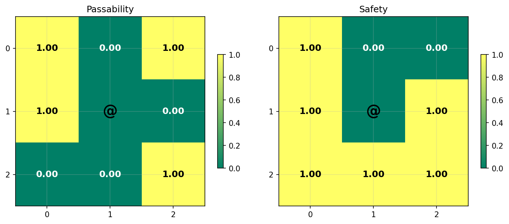 |

================================================================================

## Sample 5

### Ego Map Reconstruction

| Original | Reconstruction |
|---|---|
| 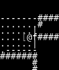 | 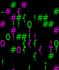 |

**Accuracy**: Character: 0.140, Color: 0.488

### Ego Class Reconstruction

| Original | Reconstruction |
|---|---|
| 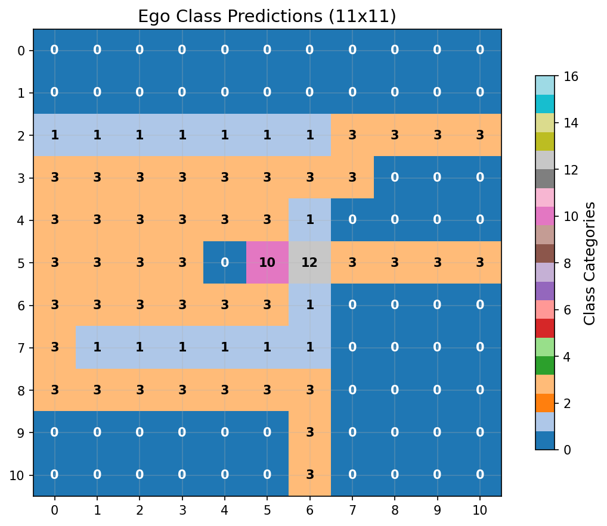 | 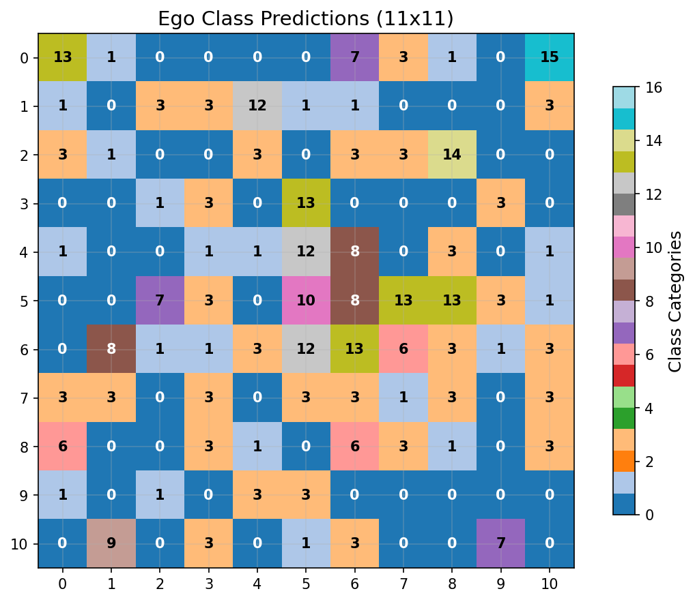 |

**Class Accuracy**: 0.314

### Bag Reconstruction

```
Bag Analysis:
========================================

Original Bag (17 items):
------------------------------
  '#' (color  7)
  ')' (color  6)
  '+' (color  3)
  '+' (color  5)
  '-' (color  3)
  '-' (color  7)
  '.' (color  7)
  '.' (color  8)
  '<' (color  7)
  '>' (color  7)
  '@' (color 15)
  '[' (color  8)
  '^' (color 12)
  '_' (color  7)
  'f' (color 15)
  '|' (color  3)
  '|' (color  7)

Reconstructed Bag (325 items):
------------------------------
  ' ' (color  4)
  '!' (color  0)
  '!' (color  2)
  '!' (color  3)
  '!' (color  4)
  '!' (color 11)
  '"' (color  6)
  '"' (color 12)
  '"' (color 14)
  '#' (color  1)
  '#' (color  7)
  '#' (color 10)
  '#' (color 12)
  '#' (color 15)
  '$' (color  4)
  '$' (color  6)
  '$' (color  7)
  '%' (color  0)
  '%' (color  2)
  '%' (color  4)
  '%' (color  6)
  '%' (color 12)
  '&' (color  5)
  '&' (color  8)
  '&' (color  9)
  '&' (color 12)
  '&' (color 13)
  ''' (color  8)
  ''' (color  9)
  ''' (color 10)
  ''' (color 11)
  ''' (color 12)
  ''' (color 13)
  '(' (color  4)
  ')' (color  6)
  ')' (color 12)
  ')' (color 15)
  '*' (color  0)
  '*' (color  2)
  '*' (color  6)
  '*' (color 10)
  '*' (color 12)
  '*' (color 13)
  '*' (color 14)
  '+' (color  2)
  '+' (color 10)
  '+' (color 12)
  '+' (color 13)
  '+' (color 15)
  ',' (color  4)
  ',' (color  5)
  ',' (color 11)
  '-' (color  1)
  '-' (color  2)
  '-' (color  3)
  '-' (color  6)
  '-' (color  7)
  '.' (color  7)
  '.' (color  8)
  '.' (color 12)
  '.' (color 15)
  '/' (color  1)
  '/' (color  2)
  '/' (color  5)
  '/' (color  6)
  '/' (color 14)
  '0' (color  1)
  '0' (color  7)
  '0' (color  8)
  '0' (color 10)
  '0' (color 13)
  '1' (color  2)
  '1' (color  7)
  '2' (color  2)
  '2' (color  6)
  '2' (color 14)
  '2' (color 15)
  '3' (color  1)
  '3' (color  5)
  '3' (color  6)
  '3' (color  8)
  '3' (color 13)
  '4' (color  0)
  '4' (color  5)
  '4' (color  9)
  '5' (color  7)
  '5' (color  8)
  '6' (color  8)
  '6' (color 12)
  '7' (color  6)
  '7' (color  8)
  '7' (color 10)
  '7' (color 11)
  '7' (color 12)
  '8' (color  1)
  '8' (color 13)
  '8' (color 14)
  '9' (color  1)
  '9' (color  6)
  ':' (color  0)
  ':' (color  6)
  ':' (color  9)
  ':' (color 12)
  ';' (color  1)
  ';' (color  4)
  '<' (color  1)
  '<' (color  6)
  '<' (color  7)
  '<' (color 11)
  '=' (color  3)
  '=' (color  5)
  '=' (color 10)
  '=' (color 13)
  '>' (color  9)
  '>' (color 10)
  '>' (color 13)
  '?' (color  0)
  '?' (color  1)
  '?' (color  6)
  '?' (color  7)
  '@' (color  7)
  '@' (color  8)
  '@' (color 12)
  '@' (color 14)
  '@' (color 15)
  'A' (color  5)
  'A' (color 10)
  'A' (color 14)
  'C' (color  5)
  'C' (color  9)
  'C' (color 10)
  'C' (color 13)
  'D' (color  2)
  'D' (color  6)
  'D' (color  8)
  'E' (color  2)
  'E' (color  3)
  'E' (color  8)
  'E' (color 15)
  'F' (color  4)
  'F' (color  6)
  'F' (color  9)
  'F' (color 10)
  'F' (color 13)
  'G' (color  0)
  'G' (color  7)
  'H' (color  0)
  'H' (color  6)
  'H' (color 12)
  'I' (color  3)
  'J' (color  2)
  'J' (color 10)
  'J' (color 11)
  'K' (color  5)
  'K' (color  7)
  'K' (color  8)
  'K' (color 11)
  'K' (color 15)
  'L' (color 11)
  'L' (color 15)
  'M' (color 10)
  'M' (color 14)
  'N' (color  1)
  'N' (color  6)
  'N' (color  9)
  'N' (color 14)
  'O' (color  1)
  'Q' (color  3)
  'Q' (color  6)
  'Q' (color  9)
  'Q' (color 11)
  'R' (color  1)
  'R' (color 11)
  'S' (color  0)
  'S' (color 10)
  'T' (color  4)
  'T' (color  5)
  'T' (color  6)
  'T' (color 12)
  'T' (color 15)
  'U' (color  4)
  'U' (color  6)
  'U' (color  9)
  'U' (color 13)
  'V' (color  0)
  'V' (color  7)
  'V' (color 11)
  'V' (color 14)
  'W' (color  0)
  'W' (color  5)
  'W' (color 12)
  'X' (color 13)
  'Y' (color 10)
  '[' (color  0)
  '[' (color  9)
  '[' (color 15)
  '\' (color  7)
  '\' (color  8)
  '\' (color  9)
  '\' (color 10)
  '\' (color 11)
  ']' (color  1)
  ']' (color  7)
  ']' (color 15)
  '^' (color  3)
  '^' (color  5)
  '^' (color  8)
  '^' (color  9)
  '^' (color 15)
  '_' (color  1)
  '_' (color  6)
  '_' (color  8)
  '`' (color  3)
  '`' (color  7)
  '`' (color  9)
  '`' (color 11)
  'a' (color  0)
  'a' (color  1)
  'a' (color  5)
  'a' (color  9)
  'a' (color 10)
  'b' (color  4)
  'b' (color  5)
  'b' (color  6)
  'b' (color  7)
  'b' (color 10)
  'b' (color 12)
  'c' (color  6)
  'c' (color  7)
  'c' (color 13)
  'd' (color  1)
  'd' (color  6)
  'd' (color  7)
  'd' (color  9)
  'd' (color 11)
  'd' (color 15)
  'e' (color  2)
  'e' (color  6)
  'e' (color  7)
  'e' (color 14)
  'f' (color  2)
  'f' (color  5)
  'f' (color  6)
  'f' (color 11)
  'g' (color  1)
  'g' (color 10)
  'g' (color 11)
  'h' (color  4)
  'h' (color  7)
  'i' (color  4)
  'i' (color  9)
  'i' (color 11)
  'i' (color 14)
  'j' (color 12)
  'j' (color 14)
  'l' (color  2)
  'l' (color  3)
  'l' (color 12)
  'l' (color 13)
  'l' (color 15)
  'm' (color  1)
  'm' (color  2)
  'm' (color  7)
  'm' (color 10)
  'm' (color 11)
  'o' (color  1)
  'o' (color 11)
  'p' (color  8)
  'p' (color 13)
  'q' (color  3)
  'q' (color  8)
  'q' (color  9)
  'q' (color 11)
  'q' (color 13)
  'r' (color  0)
  'r' (color  1)
  'r' (color  2)
  'r' (color  4)
  'r' (color  8)
  'r' (color 13)
  's' (color  3)
  's' (color  8)
  's' (color 11)
  't' (color  1)
  't' (color  2)
  't' (color  7)
  't' (color  8)
  't' (color  9)
  't' (color 10)
  'u' (color  6)
  'u' (color  9)
  'u' (color 12)
  'v' (color  2)
  'v' (color  5)
  'v' (color 10)
  'v' (color 12)
  'w' (color  4)
  'w' (color  5)
  'w' (color  6)
  'w' (color  7)
  'w' (color  8)
  'x' (color  1)
  'x' (color  7)
  'x' (color 12)
  'x' (color 13)
  'y' (color  8)
  'y' (color  9)
  'z' (color  2)
  'z' (color  4)
  'z' (color 10)
  'z' (color 13)
  '{' (color  4)
  '{' (color  6)
  '{' (color 11)
  '|' (color  7)
  '|' (color 10)
  '}' (color  6)
  '}' (color 15)
  '~' (color  3)
  '~' (color  4)
  '~' (color 12)
  '~' (color 15)
  '\x7f' (color  0)
  '\x7f' (color  5)
  '\x7f' (color 10)

Accuracy Metrics:
------------------------------
  Correctly predicted: 9 items
    '#' (color  7)
    ')' (color  6)
    '-' (color  3)
    '-' (color  7)
    '.' (color  7)
    '.' (color  8)
    '<' (color  7)
    '@' (color 15)
    '|' (color  7)
  Missed items: 8 items
    '+' (color  3)
    '+' (color  5)
    '>' (color  7)
    '[' (color  8)
    '^' (color 12)
    '_' (color  7)
    'f' (color 15)
    '|' (color  3)
  False positives: 316 items
    ' ' (color  4)
    '!' (color  0)
    '!' (color  2)
    '!' (color  3)
    '!' (color  4)
    '!' (color 11)
    '"' (color  6)
    '"' (color 12)
    '"' (color 14)
    '#' (color  1)
    '#' (color 10)
    '#' (color 12)
    '#' (color 15)
    '$' (color  4)
    '$' (color  6)
    '$' (color  7)
    '%' (color  0)
    '%' (color  2)
    '%' (color  4)
    '%' (color  6)
    '%' (color 12)
    '&' (color  5)
    '&' (color  8)
    '&' (color  9)
    '&' (color 12)
    '&' (color 13)
    ''' (color  8)
    ''' (color  9)
    ''' (color 10)
    ''' (color 11)
    ''' (color 12)
    ''' (color 13)
    '(' (color  4)
    ')' (color 12)
    ')' (color 15)
    '*' (color  0)
    '*' (color  2)
    '*' (color  6)
    '*' (color 10)
    '*' (color 12)
    '*' (color 13)
    '*' (color 14)
    '+' (color  2)
    '+' (color 10)
    '+' (color 12)
    '+' (color 13)
    '+' (color 15)
    ',' (color  4)
    ',' (color  5)
    ',' (color 11)
    '-' (color  1)
    '-' (color  2)
    '-' (color  6)
    '.' (color 12)
    '.' (color 15)
    '/' (color  1)
    '/' (color  2)
    '/' (color  5)
    '/' (color  6)
    '/' (color 14)
    '0' (color  1)
    '0' (color  7)
    '0' (color  8)
    '0' (color 10)
    '0' (color 13)
    '1' (color  2)
    '1' (color  7)
    '2' (color  2)
    '2' (color  6)
    '2' (color 14)
    '2' (color 15)
    '3' (color  1)
    '3' (color  5)
    '3' (color  6)
    '3' (color  8)
    '3' (color 13)
    '4' (color  0)
    '4' (color  5)
    '4' (color  9)
    '5' (color  7)
    '5' (color  8)
    '6' (color  8)
    '6' (color 12)
    '7' (color  6)
    '7' (color  8)
    '7' (color 10)
    '7' (color 11)
    '7' (color 12)
    '8' (color  1)
    '8' (color 13)
    '8' (color 14)
    '9' (color  1)
    '9' (color  6)
    ':' (color  0)
    ':' (color  6)
    ':' (color  9)
    ':' (color 12)
    ';' (color  1)
    ';' (color  4)
    '<' (color  1)
    '<' (color  6)
    '<' (color 11)
    '=' (color  3)
    '=' (color  5)
    '=' (color 10)
    '=' (color 13)
    '>' (color  9)
    '>' (color 10)
    '>' (color 13)
    '?' (color  0)
    '?' (color  1)
    '?' (color  6)
    '?' (color  7)
    '@' (color  7)
    '@' (color  8)
    '@' (color 12)
    '@' (color 14)
    'A' (color  5)
    'A' (color 10)
    'A' (color 14)
    'C' (color  5)
    'C' (color  9)
    'C' (color 10)
    'C' (color 13)
    'D' (color  2)
    'D' (color  6)
    'D' (color  8)
    'E' (color  2)
    'E' (color  3)
    'E' (color  8)
    'E' (color 15)
    'F' (color  4)
    'F' (color  6)
    'F' (color  9)
    'F' (color 10)
    'F' (color 13)
    'G' (color  0)
    'G' (color  7)
    'H' (color  0)
    'H' (color  6)
    'H' (color 12)
    'I' (color  3)
    'J' (color  2)
    'J' (color 10)
    'J' (color 11)
    'K' (color  5)
    'K' (color  7)
    'K' (color  8)
    'K' (color 11)
    'K' (color 15)
    'L' (color 11)
    'L' (color 15)
    'M' (color 10)
    'M' (color 14)
    'N' (color  1)
    'N' (color  6)
    'N' (color  9)
    'N' (color 14)
    'O' (color  1)
    'Q' (color  3)
    'Q' (color  6)
    'Q' (color  9)
    'Q' (color 11)
    'R' (color  1)
    'R' (color 11)
    'S' (color  0)
    'S' (color 10)
    'T' (color  4)
    'T' (color  5)
    'T' (color  6)
    'T' (color 12)
    'T' (color 15)
    'U' (color  4)
    'U' (color  6)
    'U' (color  9)
    'U' (color 13)
    'V' (color  0)
    'V' (color  7)
    'V' (color 11)
    'V' (color 14)
    'W' (color  0)
    'W' (color  5)
    'W' (color 12)
    'X' (color 13)
    'Y' (color 10)
    '[' (color  0)
    '[' (color  9)
    '[' (color 15)
    '\' (color  7)
    '\' (color  8)
    '\' (color  9)
    '\' (color 10)
    '\' (color 11)
    ']' (color  1)
    ']' (color  7)
    ']' (color 15)
    '^' (color  3)
    '^' (color  5)
    '^' (color  8)
    '^' (color  9)
    '^' (color 15)
    '_' (color  1)
    '_' (color  6)
    '_' (color  8)
    '`' (color  3)
    '`' (color  7)
    '`' (color  9)
    '`' (color 11)
    'a' (color  0)
    'a' (color  1)
    'a' (color  5)
    'a' (color  9)
    'a' (color 10)
    'b' (color  4)
    'b' (color  5)
    'b' (color  6)
    'b' (color  7)
    'b' (color 10)
    'b' (color 12)
    'c' (color  6)
    'c' (color  7)
    'c' (color 13)
    'd' (color  1)
    'd' (color  6)
    'd' (color  7)
    'd' (color  9)
    'd' (color 11)
    'd' (color 15)
    'e' (color  2)
    'e' (color  6)
    'e' (color  7)
    'e' (color 14)
    'f' (color  2)
    'f' (color  5)
    'f' (color  6)
    'f' (color 11)
    'g' (color  1)
    'g' (color 10)
    'g' (color 11)
    'h' (color  4)
    'h' (color  7)
    'i' (color  4)
    'i' (color  9)
    'i' (color 11)
    'i' (color 14)
    'j' (color 12)
    'j' (color 14)
    'l' (color  2)
    'l' (color  3)
    'l' (color 12)
    'l' (color 13)
    'l' (color 15)
    'm' (color  1)
    'm' (color  2)
    'm' (color  7)
    'm' (color 10)
    'm' (color 11)
    'o' (color  1)
    'o' (color 11)
    'p' (color  8)
    'p' (color 13)
    'q' (color  3)
    'q' (color  8)
    'q' (color  9)
    'q' (color 11)
    'q' (color 13)
    'r' (color  0)
    'r' (color  1)
    'r' (color  2)
    'r' (color  4)
    'r' (color  8)
    'r' (color 13)
    's' (color  3)
    's' (color  8)
    's' (color 11)
    't' (color  1)
    't' (color  2)
    't' (color  7)
    't' (color  8)
    't' (color  9)
    't' (color 10)
    'u' (color  6)
    'u' (color  9)
    'u' (color 12)
    'v' (color  2)
    'v' (color  5)
    'v' (color 10)
    'v' (color 12)
    'w' (color  4)
    'w' (color  5)
    'w' (color  6)
    'w' (color  7)
    'w' (color  8)
    'x' (color  1)
    'x' (color  7)
    'x' (color 12)
    'x' (color 13)
    'y' (color  8)
    'y' (color  9)
    'z' (color  2)
    'z' (color  4)
    'z' (color 10)
    'z' (color 13)
    '{' (color  4)
    '{' (color  6)
    '{' (color 11)
    '|' (color 10)
    '}' (color  6)
    '}' (color 15)
    '~' (color  3)
    '~' (color  4)
    '~' (color 12)
    '~' (color 15)
    '\x7f' (color  0)
    '\x7f' (color  5)
    '\x7f' (color 10)

Performance Summary:
------------------------------
  Precision: 0.028 (9/325)
  Recall: 0.529 (9/17)
  F1-Score: 0.053
  Total unique items: 333
```

### Passability & Safety

| Original | Reconstruction |
|---|---|
|  | 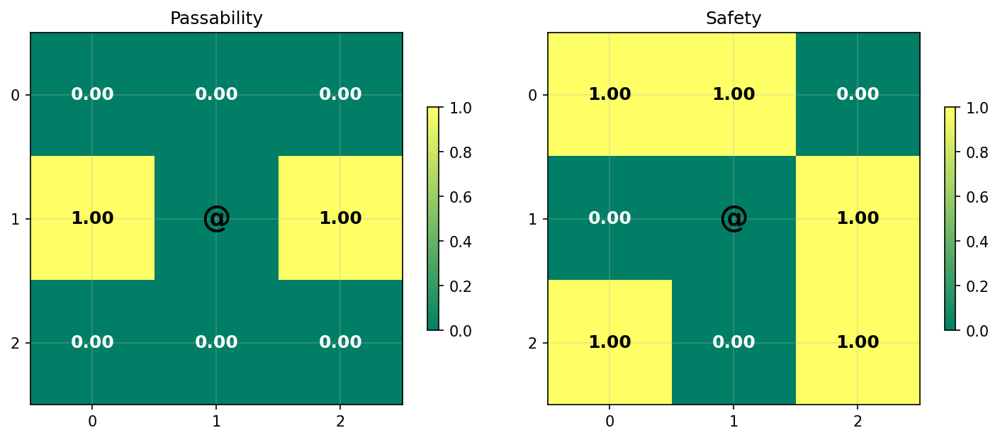 |

================================================================================

## Sample 6

### Ego Map Reconstruction

| Original | Reconstruction |
|---|---|
| 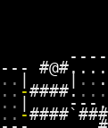 | 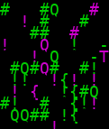 |

**Accuracy**: Character: 0.174, Color: 0.537

### Ego Class Reconstruction

| Original | Reconstruction |
|---|---|
| 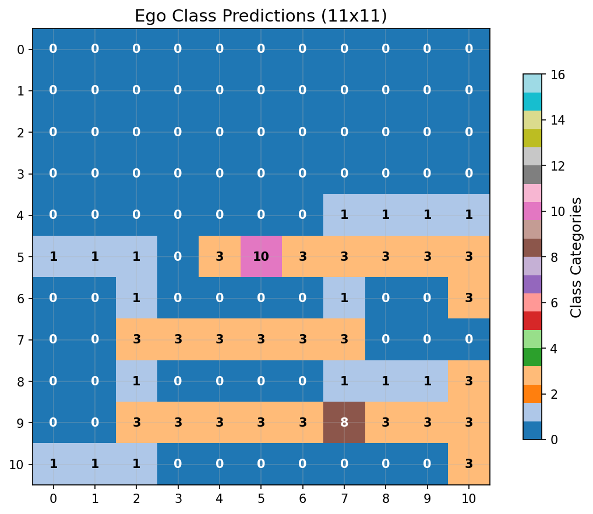 | 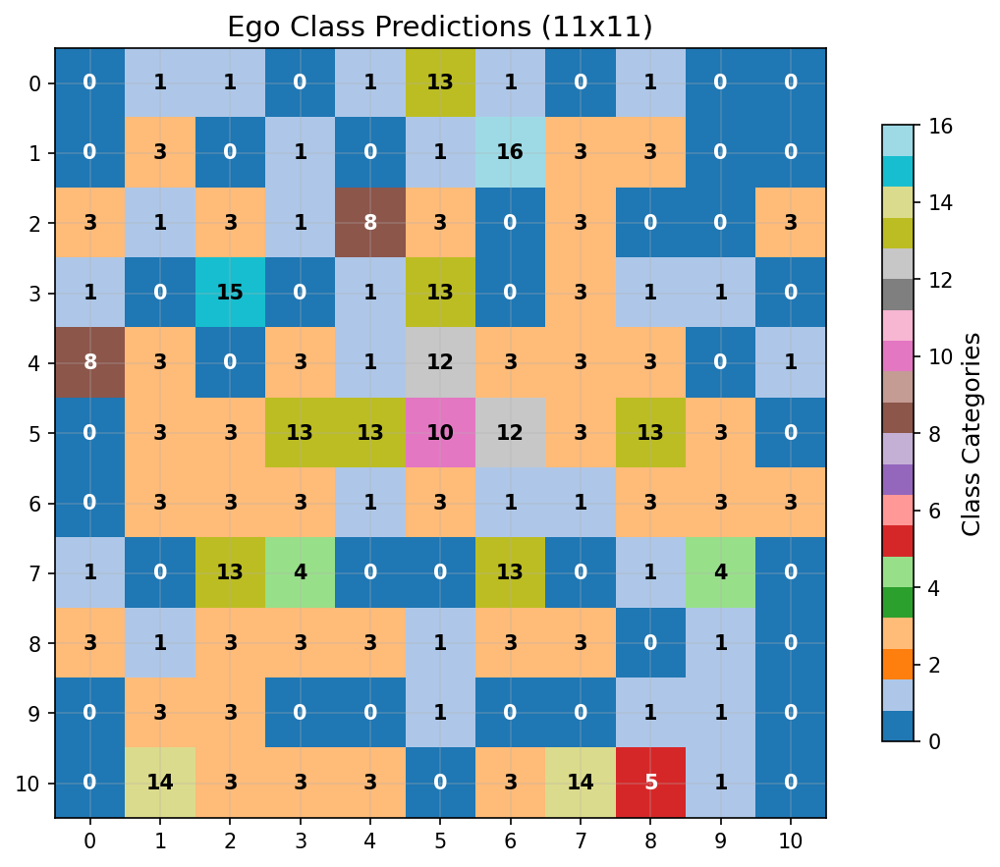 |

**Class Accuracy**: 0.264

### Bag Reconstruction

```
Bag Analysis:
========================================

Original Bag (10 items):
------------------------------
  '#' (color  7)
  '-' (color  3)
  '-' (color  7)
  '.' (color  7)
  '.' (color  8)
  '<' (color  7)
  '@' (color 15)
  '`' (color  7)
  '|' (color  3)
  '|' (color  7)

Reconstructed Bag (313 items):
------------------------------
  ' ' (color  2)
  ' ' (color  4)
  ' ' (color  9)
  ' ' (color 13)
  '!' (color  5)
  '"' (color  1)
  '"' (color  4)
  '"' (color 13)
  '"' (color 15)
  '#' (color  4)
  '#' (color  5)
  '#' (color 11)
  '#' (color 15)
  '$' (color  3)
  '$' (color  6)
  '$' (color 10)
  '$' (color 15)
  '%' (color  2)
  '%' (color  3)
  '%' (color 10)
  '&' (color  0)
  '&' (color  2)
  '&' (color  4)
  '&' (color  5)
  '&' (color  7)
  '&' (color 10)
  '&' (color 15)
  ''' (color  7)
  ''' (color 14)
  ''' (color 15)
  '(' (color  3)
  ')' (color  4)
  ')' (color  8)
  ')' (color 10)
  ')' (color 12)
  '*' (color  7)
  '*' (color  9)
  '+' (color  0)
  '+' (color  5)
  '+' (color  8)
  '+' (color 11)
  '+' (color 13)
  '+' (color 15)
  ',' (color  2)
  ',' (color  5)
  ',' (color  8)
  ',' (color  9)
  ',' (color 10)
  ',' (color 11)
  '-' (color  5)
  '-' (color  6)
  '-' (color  7)
  '-' (color  9)
  '-' (color 10)
  '-' (color 15)
  '.' (color  1)
  '.' (color  7)
  '/' (color  1)
  '/' (color  6)
  '/' (color 12)
  '1' (color  0)
  '2' (color  1)
  '2' (color  3)
  '2' (color  6)
  '2' (color  9)
  '2' (color 10)
  '2' (color 12)
  '2' (color 15)
  '3' (color  1)
  '3' (color 13)
  '3' (color 14)
  '3' (color 15)
  '4' (color  2)
  '4' (color 10)
  '5' (color  0)
  '5' (color  2)
  '5' (color  3)
  '5' (color  5)
  '5' (color  9)
  '5' (color 10)
  '5' (color 11)
  '5' (color 13)
  '6' (color  1)
  '6' (color  5)
  '6' (color 11)
  '7' (color  0)
  '7' (color  8)
  '7' (color 11)
  '7' (color 15)
  '8' (color  7)
  '8' (color  9)
  '8' (color 10)
  '9' (color  1)
  '9' (color  6)
  '9' (color  7)
  '9' (color 11)
  ':' (color 11)
  ';' (color  2)
  ';' (color  4)
  '<' (color  3)
  '<' (color  4)
  '<' (color  6)
  '<' (color  7)
  '<' (color 13)
  '=' (color  2)
  '=' (color 14)
  '>' (color  2)
  '>' (color  7)
  '?' (color  7)
  '?' (color  8)
  '?' (color  9)
  '?' (color 12)
  '@' (color  0)
  '@' (color  7)
  '@' (color 12)
  '@' (color 14)
  '@' (color 15)
  'A' (color 11)
  'A' (color 13)
  'B' (color  1)
  'B' (color  3)
  'B' (color  5)
  'B' (color 11)
  'B' (color 15)
  'C' (color  0)
  'C' (color  2)
  'C' (color  5)
  'C' (color  9)
  'C' (color 12)
  'C' (color 13)
  'D' (color  2)
  'D' (color 12)
  'E' (color  8)
  'E' (color 12)
  'E' (color 15)
  'F' (color  0)
  'F' (color  4)
  'F' (color  6)
  'F' (color 11)
  'G' (color  7)
  'H' (color  4)
  'H' (color  8)
  'I' (color  3)
  'I' (color  4)
  'I' (color  6)
  'I' (color 11)
  'I' (color 13)
  'J' (color  4)
  'K' (color  4)
  'K' (color  5)
  'K' (color 10)
  'K' (color 15)
  'L' (color  6)
  'L' (color  7)
  'L' (color 10)
  'L' (color 11)
  'L' (color 14)
  'M' (color  0)
  'M' (color  2)
  'M' (color  3)
  'M' (color  4)
  'M' (color  6)
  'M' (color  7)
  'M' (color 12)
  'N' (color  5)
  'N' (color  6)
  'N' (color  7)
  'O' (color  0)
  'O' (color  2)
  'O' (color  4)
  'O' (color  6)
  'O' (color 10)
  'O' (color 11)
  'P' (color  2)
  'P' (color  9)
  'P' (color 15)
  'Q' (color  0)
  'R' (color  9)
  'R' (color 11)
  'S' (color 10)
  'S' (color 12)
  'T' (color  6)
  'T' (color 10)
  'U' (color  3)
  'U' (color  5)
  'U' (color  9)
  'U' (color 14)
  'V' (color  0)
  'V' (color  2)
  'V' (color  3)
  'V' (color 11)
  'W' (color  6)
  'X' (color  0)
  'X' (color 10)
  'X' (color 11)
  'X' (color 13)
  'X' (color 14)
  'Y' (color 12)
  '[' (color 10)
  '\' (color  0)
  '\' (color  1)
  '\' (color  3)
  '\' (color  9)
  '\' (color 15)
  ']' (color  4)
  ']' (color  7)
  ']' (color 14)
  '^' (color  3)
  '^' (color 13)
  '^' (color 14)
  '_' (color  4)
  '_' (color 11)
  '_' (color 12)
  '_' (color 14)
  '`' (color  0)
  '`' (color  4)
  '`' (color 12)
  'a' (color  5)
  'b' (color  3)
  'b' (color  8)
  'b' (color 11)
  'b' (color 12)
  'c' (color 11)
  'c' (color 12)
  'd' (color 11)
  'e' (color  4)
  'e' (color  5)
  'e' (color 12)
  'f' (color  2)
  'f' (color  3)
  'f' (color  9)
  'f' (color 10)
  'g' (color  7)
  'g' (color  8)
  'g' (color 11)
  'i' (color  3)
  'i' (color  9)
  'j' (color  0)
  'j' (color  8)
  'j' (color 10)
  'j' (color 13)
  'k' (color  1)
  'k' (color  6)
  'k' (color  8)
  'k' (color 15)
  'l' (color  9)
  'm' (color  3)
  'm' (color  7)
  'm' (color 10)
  'n' (color 15)
  'o' (color  1)
  'o' (color  2)
  'o' (color 10)
  'p' (color  8)
  'p' (color 13)
  'p' (color 15)
  'q' (color  8)
  'q' (color  9)
  'q' (color 10)
  'q' (color 11)
  'q' (color 15)
  'r' (color  1)
  'r' (color  5)
  'r' (color  6)
  'r' (color  8)
  'r' (color 10)
  'r' (color 11)
  's' (color  2)
  's' (color  3)
  's' (color 10)
  's' (color 11)
  's' (color 15)
  't' (color  3)
  't' (color 10)
  't' (color 13)
  'u' (color  3)
  'u' (color  4)
  'u' (color  5)
  'u' (color  9)
  'u' (color 11)
  'v' (color  2)
  'v' (color  4)
  'v' (color 13)
  'w' (color  5)
  'w' (color  7)
  'w' (color 13)
  'w' (color 14)
  'x' (color  2)
  'x' (color  4)
  'x' (color  6)
  'x' (color 12)
  'y' (color  0)
  'y' (color  2)
  'y' (color  6)
  'z' (color 14)
  '{' (color  2)
  '{' (color 11)
  '|' (color  7)
  '|' (color 15)
  '}' (color  8)
  '}' (color 10)
  '}' (color 15)
  '~' (color  5)
  '~' (color  7)
  '~' (color 14)
  '\x7f' (color  0)
  '\x7f' (color  1)
  '\x7f' (color  2)
  '\x7f' (color  4)
  '\x7f' (color  5)
  '\x7f' (color 10)
  '\x7f' (color 11)
  '\x7f' (color 12)

Accuracy Metrics:
------------------------------
  Correctly predicted: 5 items
    '-' (color  7)
    '.' (color  7)
    '<' (color  7)
    '@' (color 15)
    '|' (color  7)
  Missed items: 5 items
    '#' (color  7)
    '-' (color  3)
    '.' (color  8)
    '`' (color  7)
    '|' (color  3)
  False positives: 308 items
    ' ' (color  2)
    ' ' (color  4)
    ' ' (color  9)
    ' ' (color 13)
    '!' (color  5)
    '"' (color  1)
    '"' (color  4)
    '"' (color 13)
    '"' (color 15)
    '#' (color  4)
    '#' (color  5)
    '#' (color 11)
    '#' (color 15)
    '$' (color  3)
    '$' (color  6)
    '$' (color 10)
    '$' (color 15)
    '%' (color  2)
    '%' (color  3)
    '%' (color 10)
    '&' (color  0)
    '&' (color  2)
    '&' (color  4)
    '&' (color  5)
    '&' (color  7)
    '&' (color 10)
    '&' (color 15)
    ''' (color  7)
    ''' (color 14)
    ''' (color 15)
    '(' (color  3)
    ')' (color  4)
    ')' (color  8)
    ')' (color 10)
    ')' (color 12)
    '*' (color  7)
    '*' (color  9)
    '+' (color  0)
    '+' (color  5)
    '+' (color  8)
    '+' (color 11)
    '+' (color 13)
    '+' (color 15)
    ',' (color  2)
    ',' (color  5)
    ',' (color  8)
    ',' (color  9)
    ',' (color 10)
    ',' (color 11)
    '-' (color  5)
    '-' (color  6)
    '-' (color  9)
    '-' (color 10)
    '-' (color 15)
    '.' (color  1)
    '/' (color  1)
    '/' (color  6)
    '/' (color 12)
    '1' (color  0)
    '2' (color  1)
    '2' (color  3)
    '2' (color  6)
    '2' (color  9)
    '2' (color 10)
    '2' (color 12)
    '2' (color 15)
    '3' (color  1)
    '3' (color 13)
    '3' (color 14)
    '3' (color 15)
    '4' (color  2)
    '4' (color 10)
    '5' (color  0)
    '5' (color  2)
    '5' (color  3)
    '5' (color  5)
    '5' (color  9)
    '5' (color 10)
    '5' (color 11)
    '5' (color 13)
    '6' (color  1)
    '6' (color  5)
    '6' (color 11)
    '7' (color  0)
    '7' (color  8)
    '7' (color 11)
    '7' (color 15)
    '8' (color  7)
    '8' (color  9)
    '8' (color 10)
    '9' (color  1)
    '9' (color  6)
    '9' (color  7)
    '9' (color 11)
    ':' (color 11)
    ';' (color  2)
    ';' (color  4)
    '<' (color  3)
    '<' (color  4)
    '<' (color  6)
    '<' (color 13)
    '=' (color  2)
    '=' (color 14)
    '>' (color  2)
    '>' (color  7)
    '?' (color  7)
    '?' (color  8)
    '?' (color  9)
    '?' (color 12)
    '@' (color  0)
    '@' (color  7)
    '@' (color 12)
    '@' (color 14)
    'A' (color 11)
    'A' (color 13)
    'B' (color  1)
    'B' (color  3)
    'B' (color  5)
    'B' (color 11)
    'B' (color 15)
    'C' (color  0)
    'C' (color  2)
    'C' (color  5)
    'C' (color  9)
    'C' (color 12)
    'C' (color 13)
    'D' (color  2)
    'D' (color 12)
    'E' (color  8)
    'E' (color 12)
    'E' (color 15)
    'F' (color  0)
    'F' (color  4)
    'F' (color  6)
    'F' (color 11)
    'G' (color  7)
    'H' (color  4)
    'H' (color  8)
    'I' (color  3)
    'I' (color  4)
    'I' (color  6)
    'I' (color 11)
    'I' (color 13)
    'J' (color  4)
    'K' (color  4)
    'K' (color  5)
    'K' (color 10)
    'K' (color 15)
    'L' (color  6)
    'L' (color  7)
    'L' (color 10)
    'L' (color 11)
    'L' (color 14)
    'M' (color  0)
    'M' (color  2)
    'M' (color  3)
    'M' (color  4)
    'M' (color  6)
    'M' (color  7)
    'M' (color 12)
    'N' (color  5)
    'N' (color  6)
    'N' (color  7)
    'O' (color  0)
    'O' (color  2)
    'O' (color  4)
    'O' (color  6)
    'O' (color 10)
    'O' (color 11)
    'P' (color  2)
    'P' (color  9)
    'P' (color 15)
    'Q' (color  0)
    'R' (color  9)
    'R' (color 11)
    'S' (color 10)
    'S' (color 12)
    'T' (color  6)
    'T' (color 10)
    'U' (color  3)
    'U' (color  5)
    'U' (color  9)
    'U' (color 14)
    'V' (color  0)
    'V' (color  2)
    'V' (color  3)
    'V' (color 11)
    'W' (color  6)
    'X' (color  0)
    'X' (color 10)
    'X' (color 11)
    'X' (color 13)
    'X' (color 14)
    'Y' (color 12)
    '[' (color 10)
    '\' (color  0)
    '\' (color  1)
    '\' (color  3)
    '\' (color  9)
    '\' (color 15)
    ']' (color  4)
    ']' (color  7)
    ']' (color 14)
    '^' (color  3)
    '^' (color 13)
    '^' (color 14)
    '_' (color  4)
    '_' (color 11)
    '_' (color 12)
    '_' (color 14)
    '`' (color  0)
    '`' (color  4)
    '`' (color 12)
    'a' (color  5)
    'b' (color  3)
    'b' (color  8)
    'b' (color 11)
    'b' (color 12)
    'c' (color 11)
    'c' (color 12)
    'd' (color 11)
    'e' (color  4)
    'e' (color  5)
    'e' (color 12)
    'f' (color  2)
    'f' (color  3)
    'f' (color  9)
    'f' (color 10)
    'g' (color  7)
    'g' (color  8)
    'g' (color 11)
    'i' (color  3)
    'i' (color  9)
    'j' (color  0)
    'j' (color  8)
    'j' (color 10)
    'j' (color 13)
    'k' (color  1)
    'k' (color  6)
    'k' (color  8)
    'k' (color 15)
    'l' (color  9)
    'm' (color  3)
    'm' (color  7)
    'm' (color 10)
    'n' (color 15)
    'o' (color  1)
    'o' (color  2)
    'o' (color 10)
    'p' (color  8)
    'p' (color 13)
    'p' (color 15)
    'q' (color  8)
    'q' (color  9)
    'q' (color 10)
    'q' (color 11)
    'q' (color 15)
    'r' (color  1)
    'r' (color  5)
    'r' (color  6)
    'r' (color  8)
    'r' (color 10)
    'r' (color 11)
    's' (color  2)
    's' (color  3)
    's' (color 10)
    's' (color 11)
    's' (color 15)
    't' (color  3)
    't' (color 10)
    't' (color 13)
    'u' (color  3)
    'u' (color  4)
    'u' (color  5)
    'u' (color  9)
    'u' (color 11)
    'v' (color  2)
    'v' (color  4)
    'v' (color 13)
    'w' (color  5)
    'w' (color  7)
    'w' (color 13)
    'w' (color 14)
    'x' (color  2)
    'x' (color  4)
    'x' (color  6)
    'x' (color 12)
    'y' (color  0)
    'y' (color  2)
    'y' (color  6)
    'z' (color 14)
    '{' (color  2)
    '{' (color 11)
    '|' (color 15)
    '}' (color  8)
    '}' (color 10)
    '}' (color 15)
    '~' (color  5)
    '~' (color  7)
    '~' (color 14)
    '\x7f' (color  0)
    '\x7f' (color  1)
    '\x7f' (color  2)
    '\x7f' (color  4)
    '\x7f' (color  5)
    '\x7f' (color 10)
    '\x7f' (color 11)
    '\x7f' (color 12)

Performance Summary:
------------------------------
  Precision: 0.016 (5/313)
  Recall: 0.500 (5/10)
  F1-Score: 0.031
  Total unique items: 318
```

### Passability & Safety

| Original | Reconstruction |
|---|---|
|  | 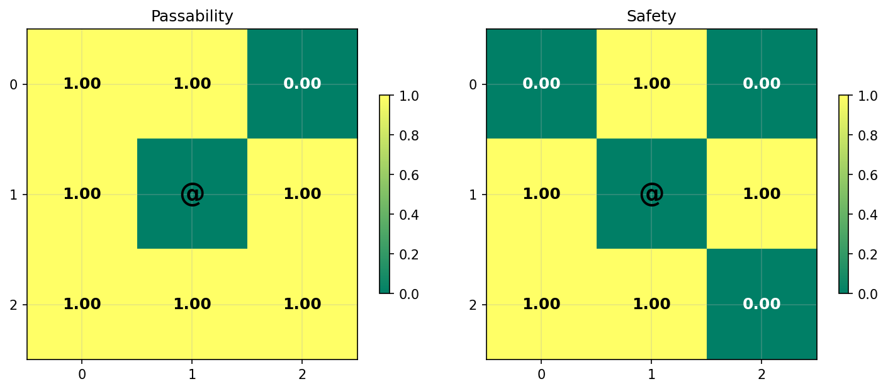 |

================================================================================

## Sample 7

### Ego Map Reconstruction

| Original | Reconstruction |
|---|---|
| 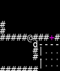 |  |

**Accuracy**: Character: 0.207, Color: 0.595

### Ego Class Reconstruction

| Original | Reconstruction |
|---|---|
| 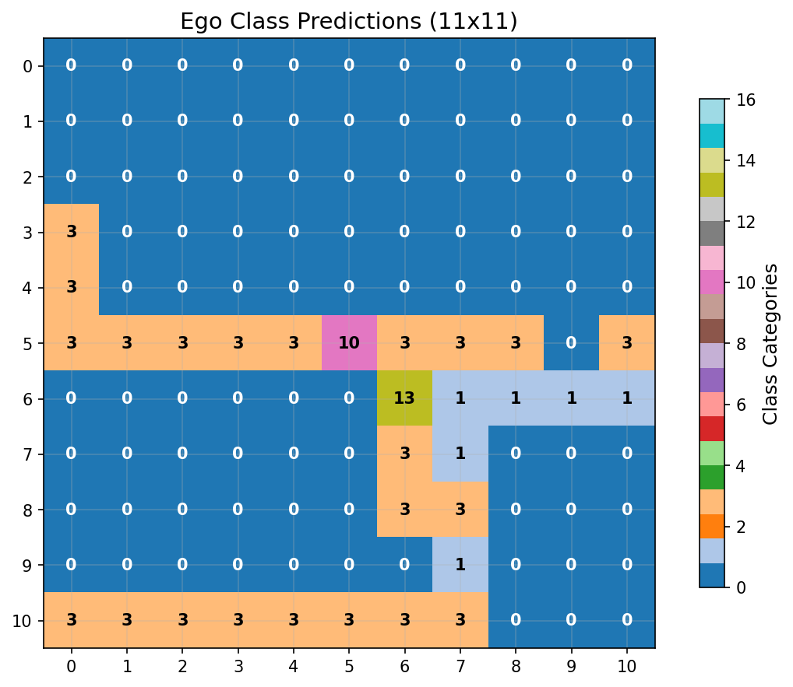 | 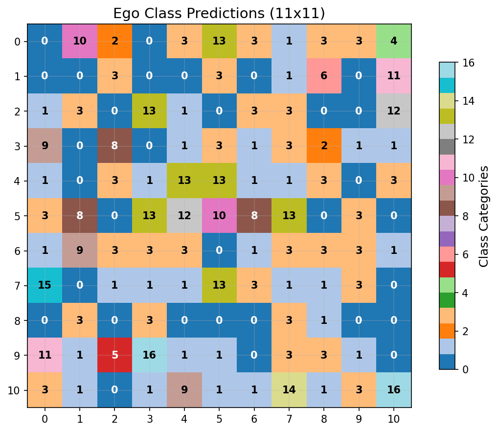 |

**Class Accuracy**: 0.364

### Bag Reconstruction

```
Bag Analysis:
========================================

Original Bag (17 items):
------------------------------
  '#' (color  7)
  '%' (color  2)
  '%' (color  3)
  '%' (color 11)
  '(' (color  3)
  '+' (color  5)
  '+' (color 15)
  '-' (color  3)
  '-' (color  7)
  '.' (color  7)
  '.' (color  8)
  '<' (color  7)
  '>' (color  7)
  '@' (color 15)
  'd' (color 15)
  '|' (color  3)
  '|' (color  7)

Reconstructed Bag (324 items):
------------------------------
  ' ' (color  7)
  ' ' (color  9)
  ' ' (color 11)
  ' ' (color 13)
  '!' (color  0)
  '!' (color  1)
  '!' (color  3)
  '!' (color 10)
  '!' (color 11)
  '"' (color 10)
  '"' (color 13)
  '"' (color 14)
  '"' (color 15)
  '#' (color  1)
  '#' (color  7)
  '#' (color 12)
  '#' (color 14)
  '$' (color  1)
  '$' (color  6)
  '$' (color  7)
  '%' (color  4)
  '%' (color  6)
  '%' (color 10)
  '&' (color  9)
  ''' (color 11)
  ''' (color 14)
  ''' (color 15)
  '(' (color 15)
  ')' (color  0)
  ')' (color  7)
  ')' (color 10)
  ')' (color 12)
  '*' (color  6)
  '*' (color  9)
  '*' (color 11)
  '*' (color 15)
  '+' (color  5)
  '+' (color 14)
  ',' (color 13)
  ',' (color 15)
  '-' (color  1)
  '-' (color  3)
  '-' (color  7)
  '-' (color  8)
  '-' (color  9)
  '-' (color 12)
  '.' (color  1)
  '.' (color  7)
  '.' (color  8)
  '.' (color 15)
  '/' (color  0)
  '/' (color  1)
  '/' (color 10)
  '0' (color  0)
  '0' (color 12)
  '1' (color  7)
  '1' (color 13)
  '1' (color 14)
  '2' (color  3)
  '2' (color  7)
  '2' (color 11)
  '2' (color 15)
  '3' (color  2)
  '4' (color  1)
  '4' (color 10)
  '4' (color 12)
  '5' (color  5)
  '6' (color  1)
  '6' (color  3)
  '6' (color  4)
  '6' (color  8)
  '6' (color 12)
  '6' (color 14)
  '7' (color  7)
  '7' (color 10)
  '7' (color 12)
  '7' (color 15)
  '8' (color 10)
  '9' (color  1)
  '9' (color  2)
  '9' (color  5)
  '9' (color 10)
  '9' (color 11)
  '9' (color 12)
  ':' (color  6)
  ':' (color 11)
  ':' (color 15)
  ';' (color  1)
  ';' (color  6)
  '<' (color  4)
  '<' (color  5)
  '<' (color  7)
  '<' (color 11)
  '=' (color  3)
  '=' (color  5)
  '=' (color  6)
  '=' (color 12)
  '=' (color 14)
  '=' (color 15)
  '>' (color  7)
  '>' (color 10)
  '>' (color 15)
  '?' (color  0)
  '?' (color  1)
  '?' (color  3)
  '?' (color  9)
  '?' (color 10)
  '@' (color  2)
  '@' (color  4)
  '@' (color  7)
  '@' (color  9)
  '@' (color 15)
  'A' (color  2)
  'A' (color 14)
  'A' (color 15)
  'B' (color  1)
  'B' (color  5)
  'B' (color  7)
  'B' (color 14)
  'C' (color  0)
  'D' (color  5)
  'D' (color  8)
  'D' (color 13)
  'E' (color  2)
  'E' (color  4)
  'E' (color  8)
  'E' (color 12)
  'E' (color 15)
  'F' (color  4)
  'G' (color  1)
  'G' (color  2)
  'G' (color 10)
  'G' (color 14)
  'H' (color  3)
  'H' (color 11)
  'H' (color 13)
  'I' (color  1)
  'I' (color  3)
  'I' (color  7)
  'I' (color  8)
  'I' (color 11)
  'J' (color  7)
  'J' (color  8)
  'J' (color 11)
  'J' (color 14)
  'K' (color  2)
  'K' (color  4)
  'K' (color 10)
  'K' (color 15)
  'L' (color  4)
  'L' (color 10)
  'L' (color 15)
  'M' (color  2)
  'M' (color  5)
  'N' (color  5)
  'N' (color  8)
  'N' (color 10)
  'N' (color 11)
  'O' (color  6)
  'O' (color 10)
  'O' (color 14)
  'O' (color 15)
  'Q' (color  0)
  'Q' (color  1)
  'Q' (color  5)
  'Q' (color  8)
  'R' (color 13)
  'S' (color  8)
  'S' (color 13)
  'T' (color  0)
  'T' (color  2)
  'T' (color  7)
  'T' (color  8)
  'U' (color  1)
  'U' (color  6)
  'U' (color  9)
  'U' (color 11)
  'V' (color  3)
  'V' (color  5)
  'V' (color  7)
  'V' (color 10)
  'V' (color 11)
  'V' (color 14)
  'W' (color  0)
  'W' (color  1)
  'W' (color  5)
  'W' (color  8)
  'W' (color 10)
  'W' (color 15)
  'X' (color  2)
  'Y' (color  2)
  'Y' (color  3)
  'Y' (color  8)
  'Y' (color 10)
  'Z' (color  0)
  'Z' (color 12)
  'Z' (color 13)
  'Z' (color 15)
  '[' (color  4)
  '[' (color  8)
  '\' (color  8)
  '\' (color  9)
  '\' (color 13)
  ']' (color  0)
  ']' (color  6)
  '^' (color  5)
  '^' (color 10)
  '^' (color 12)
  '^' (color 13)
  '_' (color  4)
  '_' (color  6)
  '_' (color  8)
  '_' (color  9)
  '`' (color  7)
  '`' (color  9)
  '`' (color 14)
  'a' (color  2)
  'a' (color  5)
  'a' (color  9)
  'a' (color 13)
  'b' (color  2)
  'b' (color  3)
  'b' (color  4)
  'b' (color  6)
  'b' (color  9)
  'b' (color 12)
  'c' (color  0)
  'c' (color  3)
  'c' (color  4)
  'd' (color  3)
  'd' (color  7)
  'd' (color  8)
  'd' (color 15)
  'f' (color 15)
  'g' (color  4)
  'g' (color 11)
  'g' (color 12)
  'h' (color  4)
  'h' (color  5)
  'h' (color  6)
  'h' (color  7)
  'h' (color  9)
  'i' (color  2)
  'i' (color  8)
  'i' (color  9)
  'j' (color  6)
  'j' (color 10)
  'j' (color 11)
  'k' (color  6)
  'l' (color  3)
  'l' (color  8)
  'm' (color  7)
  'm' (color  9)
  'm' (color 15)
  'n' (color  0)
  'n' (color  5)
  'n' (color 10)
  'n' (color 12)
  'o' (color  3)
  'o' (color  8)
  'o' (color 11)
  'o' (color 12)
  'o' (color 15)
  'p' (color  2)
  'q' (color  1)
  'q' (color  2)
  'q' (color  5)
  'q' (color  8)
  'q' (color 10)
  'q' (color 14)
  'r' (color  0)
  'r' (color 11)
  'r' (color 12)
  's' (color  2)
  's' (color  7)
  's' (color  8)
  's' (color 10)
  't' (color  1)
  't' (color  8)
  'u' (color  5)
  'u' (color 10)
  'u' (color 12)
  'v' (color  4)
  'v' (color  5)
  'v' (color 15)
  'w' (color  2)
  'w' (color  6)
  'w' (color  8)
  'w' (color  9)
  'w' (color 12)
  'w' (color 14)
  'x' (color  2)
  'x' (color  4)
  'x' (color  5)
  'x' (color  6)
  'y' (color  0)
  'y' (color  1)
  'y' (color  3)
  'y' (color  5)
  'y' (color 10)
  'z' (color  5)
  'z' (color  6)
  '{' (color  5)
  '{' (color  8)
  '|' (color  3)
  '|' (color  7)
  '|' (color  8)
  '|' (color  9)
  '|' (color 10)
  '|' (color 13)
  '}' (color  2)
  '}' (color 11)
  '}' (color 13)
  '~' (color  2)
  '~' (color  4)
  '~' (color  5)
  '~' (color  7)
  '~' (color 11)
  '~' (color 13)
  '\x7f' (color  5)
  '\x7f' (color  9)
  '\x7f' (color 10)
  '\x7f' (color 11)
  '\x7f' (color 13)

Accuracy Metrics:
------------------------------
  Correctly predicted: 12 items
    '#' (color  7)
    '+' (color  5)
    '-' (color  3)
    '-' (color  7)
    '.' (color  7)
    '.' (color  8)
    '<' (color  7)
    '>' (color  7)
    '@' (color 15)
    'd' (color 15)
    '|' (color  3)
    '|' (color  7)
  Missed items: 5 items
    '%' (color  2)
    '%' (color  3)
    '%' (color 11)
    '(' (color  3)
    '+' (color 15)
  False positives: 312 items
    ' ' (color  7)
    ' ' (color  9)
    ' ' (color 11)
    ' ' (color 13)
    '!' (color  0)
    '!' (color  1)
    '!' (color  3)
    '!' (color 10)
    '!' (color 11)
    '"' (color 10)
    '"' (color 13)
    '"' (color 14)
    '"' (color 15)
    '#' (color  1)
    '#' (color 12)
    '#' (color 14)
    '$' (color  1)
    '$' (color  6)
    '$' (color  7)
    '%' (color  4)
    '%' (color  6)
    '%' (color 10)
    '&' (color  9)
    ''' (color 11)
    ''' (color 14)
    ''' (color 15)
    '(' (color 15)
    ')' (color  0)
    ')' (color  7)
    ')' (color 10)
    ')' (color 12)
    '*' (color  6)
    '*' (color  9)
    '*' (color 11)
    '*' (color 15)
    '+' (color 14)
    ',' (color 13)
    ',' (color 15)
    '-' (color  1)
    '-' (color  8)
    '-' (color  9)
    '-' (color 12)
    '.' (color  1)
    '.' (color 15)
    '/' (color  0)
    '/' (color  1)
    '/' (color 10)
    '0' (color  0)
    '0' (color 12)
    '1' (color  7)
    '1' (color 13)
    '1' (color 14)
    '2' (color  3)
    '2' (color  7)
    '2' (color 11)
    '2' (color 15)
    '3' (color  2)
    '4' (color  1)
    '4' (color 10)
    '4' (color 12)
    '5' (color  5)
    '6' (color  1)
    '6' (color  3)
    '6' (color  4)
    '6' (color  8)
    '6' (color 12)
    '6' (color 14)
    '7' (color  7)
    '7' (color 10)
    '7' (color 12)
    '7' (color 15)
    '8' (color 10)
    '9' (color  1)
    '9' (color  2)
    '9' (color  5)
    '9' (color 10)
    '9' (color 11)
    '9' (color 12)
    ':' (color  6)
    ':' (color 11)
    ':' (color 15)
    ';' (color  1)
    ';' (color  6)
    '<' (color  4)
    '<' (color  5)
    '<' (color 11)
    '=' (color  3)
    '=' (color  5)
    '=' (color  6)
    '=' (color 12)
    '=' (color 14)
    '=' (color 15)
    '>' (color 10)
    '>' (color 15)
    '?' (color  0)
    '?' (color  1)
    '?' (color  3)
    '?' (color  9)
    '?' (color 10)
    '@' (color  2)
    '@' (color  4)
    '@' (color  7)
    '@' (color  9)
    'A' (color  2)
    'A' (color 14)
    'A' (color 15)
    'B' (color  1)
    'B' (color  5)
    'B' (color  7)
    'B' (color 14)
    'C' (color  0)
    'D' (color  5)
    'D' (color  8)
    'D' (color 13)
    'E' (color  2)
    'E' (color  4)
    'E' (color  8)
    'E' (color 12)
    'E' (color 15)
    'F' (color  4)
    'G' (color  1)
    'G' (color  2)
    'G' (color 10)
    'G' (color 14)
    'H' (color  3)
    'H' (color 11)
    'H' (color 13)
    'I' (color  1)
    'I' (color  3)
    'I' (color  7)
    'I' (color  8)
    'I' (color 11)
    'J' (color  7)
    'J' (color  8)
    'J' (color 11)
    'J' (color 14)
    'K' (color  2)
    'K' (color  4)
    'K' (color 10)
    'K' (color 15)
    'L' (color  4)
    'L' (color 10)
    'L' (color 15)
    'M' (color  2)
    'M' (color  5)
    'N' (color  5)
    'N' (color  8)
    'N' (color 10)
    'N' (color 11)
    'O' (color  6)
    'O' (color 10)
    'O' (color 14)
    'O' (color 15)
    'Q' (color  0)
    'Q' (color  1)
    'Q' (color  5)
    'Q' (color  8)
    'R' (color 13)
    'S' (color  8)
    'S' (color 13)
    'T' (color  0)
    'T' (color  2)
    'T' (color  7)
    'T' (color  8)
    'U' (color  1)
    'U' (color  6)
    'U' (color  9)
    'U' (color 11)
    'V' (color  3)
    'V' (color  5)
    'V' (color  7)
    'V' (color 10)
    'V' (color 11)
    'V' (color 14)
    'W' (color  0)
    'W' (color  1)
    'W' (color  5)
    'W' (color  8)
    'W' (color 10)
    'W' (color 15)
    'X' (color  2)
    'Y' (color  2)
    'Y' (color  3)
    'Y' (color  8)
    'Y' (color 10)
    'Z' (color  0)
    'Z' (color 12)
    'Z' (color 13)
    'Z' (color 15)
    '[' (color  4)
    '[' (color  8)
    '\' (color  8)
    '\' (color  9)
    '\' (color 13)
    ']' (color  0)
    ']' (color  6)
    '^' (color  5)
    '^' (color 10)
    '^' (color 12)
    '^' (color 13)
    '_' (color  4)
    '_' (color  6)
    '_' (color  8)
    '_' (color  9)
    '`' (color  7)
    '`' (color  9)
    '`' (color 14)
    'a' (color  2)
    'a' (color  5)
    'a' (color  9)
    'a' (color 13)
    'b' (color  2)
    'b' (color  3)
    'b' (color  4)
    'b' (color  6)
    'b' (color  9)
    'b' (color 12)
    'c' (color  0)
    'c' (color  3)
    'c' (color  4)
    'd' (color  3)
    'd' (color  7)
    'd' (color  8)
    'f' (color 15)
    'g' (color  4)
    'g' (color 11)
    'g' (color 12)
    'h' (color  4)
    'h' (color  5)
    'h' (color  6)
    'h' (color  7)
    'h' (color  9)
    'i' (color  2)
    'i' (color  8)
    'i' (color  9)
    'j' (color  6)
    'j' (color 10)
    'j' (color 11)
    'k' (color  6)
    'l' (color  3)
    'l' (color  8)
    'm' (color  7)
    'm' (color  9)
    'm' (color 15)
    'n' (color  0)
    'n' (color  5)
    'n' (color 10)
    'n' (color 12)
    'o' (color  3)
    'o' (color  8)
    'o' (color 11)
    'o' (color 12)
    'o' (color 15)
    'p' (color  2)
    'q' (color  1)
    'q' (color  2)
    'q' (color  5)
    'q' (color  8)
    'q' (color 10)
    'q' (color 14)
    'r' (color  0)
    'r' (color 11)
    'r' (color 12)
    's' (color  2)
    's' (color  7)
    's' (color  8)
    's' (color 10)
    't' (color  1)
    't' (color  8)
    'u' (color  5)
    'u' (color 10)
    'u' (color 12)
    'v' (color  4)
    'v' (color  5)
    'v' (color 15)
    'w' (color  2)
    'w' (color  6)
    'w' (color  8)
    'w' (color  9)
    'w' (color 12)
    'w' (color 14)
    'x' (color  2)
    'x' (color  4)
    'x' (color  5)
    'x' (color  6)
    'y' (color  0)
    'y' (color  1)
    'y' (color  3)
    'y' (color  5)
    'y' (color 10)
    'z' (color  5)
    'z' (color  6)
    '{' (color  5)
    '{' (color  8)
    '|' (color  8)
    '|' (color  9)
    '|' (color 10)
    '|' (color 13)
    '}' (color  2)
    '}' (color 11)
    '}' (color 13)
    '~' (color  2)
    '~' (color  4)
    '~' (color  5)
    '~' (color  7)
    '~' (color 11)
    '~' (color 13)
    '\x7f' (color  5)
    '\x7f' (color  9)
    '\x7f' (color 10)
    '\x7f' (color 11)
    '\x7f' (color 13)

Performance Summary:
------------------------------
  Precision: 0.037 (12/324)
  Recall: 0.706 (12/17)
  F1-Score: 0.070
  Total unique items: 329
```

### Passability & Safety

| Original | Reconstruction |
|---|---|
|  | 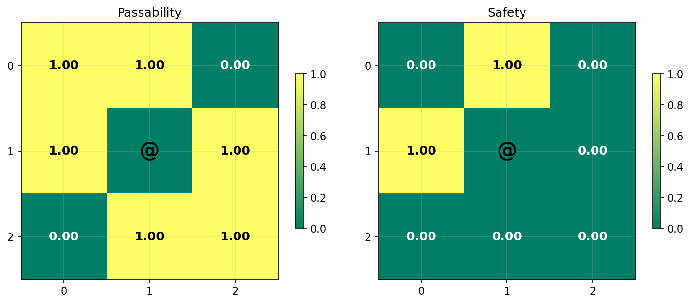 |

================================================================================

## Sample 8

### Ego Map Reconstruction

| Original | Reconstruction |
|---|---|
| 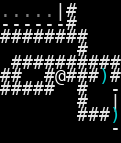 | 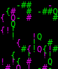 |

**Accuracy**: Character: 0.091, Color: 0.521

### Ego Class Reconstruction

| Original | Reconstruction |
|---|---|
| 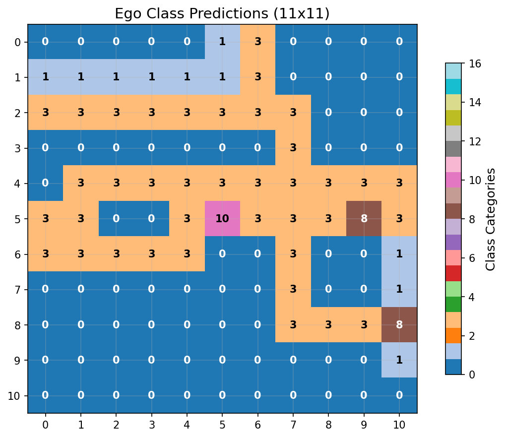 | 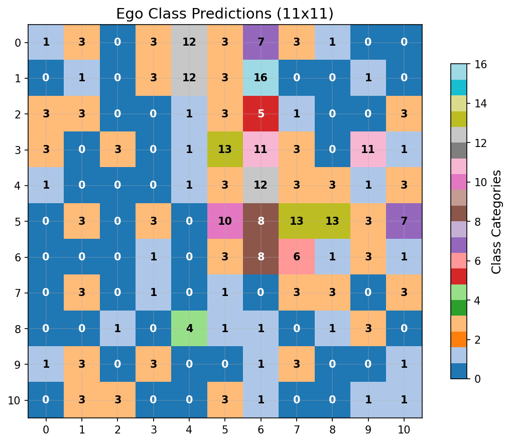 |

**Class Accuracy**: 0.372

### Bag Reconstruction

```
Bag Analysis:
========================================

Original Bag (17 items):
------------------------------
  '#' (color  7)
  '(' (color  3)
  ')' (color  6)
  '+' (color 12)
  '+' (color 15)
  '-' (color  3)
  '-' (color  7)
  '.' (color  7)
  '.' (color  8)
  '<' (color  7)
  '>' (color  7)
  '@' (color 15)
  '[' (color  8)
  '`' (color  7)
  '{' (color 12)
  '|' (color  3)
  '|' (color  7)

Reconstructed Bag (350 items):
------------------------------
  ' ' (color  3)
  ' ' (color 15)
  '!' (color  0)
  '!' (color  3)
  '!' (color  7)
  '"' (color  4)
  '"' (color 11)
  '"' (color 12)
  '"' (color 15)
  '#' (color  0)
  '#' (color  7)
  '%' (color  4)
  '%' (color  8)
  '%' (color  9)
  '%' (color 11)
  '%' (color 12)
  '%' (color 13)
  '&' (color  7)
  '&' (color 10)
  '&' (color 13)
  ''' (color  1)
  ''' (color 10)
  ''' (color 11)
  ''' (color 14)
  ''' (color 15)
  '(' (color  5)
  '(' (color 10)
  ')' (color  6)
  ')' (color  7)
  ')' (color  9)
  ')' (color 11)
  '*' (color  4)
  '*' (color  5)
  '*' (color  9)
  '*' (color 10)
  '*' (color 12)
  '+' (color  1)
  '+' (color  2)
  '+' (color  6)
  '+' (color  7)
  '+' (color 14)
  ',' (color  1)
  ',' (color 10)
  ',' (color 11)
  ',' (color 13)
  ',' (color 15)
  '-' (color  0)
  '-' (color  4)
  '-' (color  7)
  '-' (color  9)
  '-' (color 15)
  '.' (color  1)
  '.' (color  5)
  '.' (color  7)
  '.' (color 11)
  '.' (color 15)
  '/' (color  1)
  '/' (color  6)
  '/' (color 14)
  '0' (color  2)
  '0' (color  9)
  '0' (color 11)
  '0' (color 15)
  '1' (color  8)
  '1' (color  9)
  '1' (color 10)
  '2' (color  1)
  '2' (color  2)
  '2' (color  3)
  '2' (color  7)
  '2' (color  9)
  '3' (color  2)
  '3' (color  7)
  '4' (color  1)
  '4' (color  5)
  '4' (color 10)
  '4' (color 14)
  '5' (color  0)
  '6' (color  2)
  '6' (color  8)
  '6' (color 10)
  '6' (color 11)
  '7' (color  4)
  '7' (color  6)
  '7' (color 10)
  '7' (color 11)
  '7' (color 15)
  '8' (color  1)
  '8' (color  5)
  '8' (color 10)
  '8' (color 12)
  '9' (color  1)
  '9' (color  5)
  '9' (color 11)
  '9' (color 12)
  ':' (color  6)
  ':' (color  8)
  ';' (color  2)
  ';' (color  8)
  '<' (color  0)
  '<' (color  5)
  '<' (color  7)
  '<' (color 13)
  '=' (color  2)
  '=' (color 14)
  '>' (color  5)
  '>' (color  7)
  '?' (color  0)
  '?' (color  7)
  '?' (color 11)
  '@' (color  7)
  '@' (color 14)
  '@' (color 15)
  'A' (color  5)
  'A' (color  9)
  'A' (color 13)
  'A' (color 14)
  'A' (color 15)
  'B' (color  2)
  'B' (color  3)
  'B' (color  5)
  'C' (color  0)
  'C' (color  3)
  'C' (color  5)
  'C' (color  8)
  'C' (color 12)
  'D' (color  0)
  'E' (color  3)
  'E' (color 11)
  'E' (color 12)
  'E' (color 14)
  'F' (color  0)
  'F' (color  3)
  'F' (color  6)
  'F' (color  7)
  'F' (color 10)
  'F' (color 12)
  'F' (color 13)
  'G' (color  0)
  'H' (color  3)
  'H' (color  6)
  'H' (color  9)
  'H' (color 14)
  'I' (color  4)
  'J' (color 11)
  'K' (color  2)
  'K' (color  5)
  'K' (color 11)
  'L' (color  4)
  'L' (color  6)
  'L' (color 10)
  'M' (color  1)
  'M' (color  3)
  'M' (color  6)
  'M' (color  9)
  'M' (color 12)
  'M' (color 14)
  'N' (color  2)
  'N' (color  7)
  'N' (color  8)
  'O' (color  0)
  'O' (color  1)
  'O' (color  2)
  'O' (color  4)
  'O' (color  5)
  'O' (color  8)
  'O' (color 15)
  'P' (color  0)
  'P' (color  1)
  'P' (color  4)
  'P' (color  7)
  'Q' (color  2)
  'Q' (color 12)
  'R' (color  0)
  'R' (color  3)
  'S' (color  0)
  'S' (color  1)
  'S' (color  6)
  'S' (color 12)
  'S' (color 14)
  'U' (color  0)
  'U' (color  1)
  'U' (color  6)
  'U' (color  8)
  'V' (color  2)
  'V' (color  3)
  'V' (color  9)
  'W' (color  0)
  'W' (color 15)
  'X' (color  2)
  'X' (color  3)
  'X' (color  4)
  'X' (color  6)
  'X' (color 11)
  'X' (color 13)
  'Y' (color  2)
  'Y' (color  3)
  'Y' (color  7)
  'Y' (color  8)
  'Y' (color 10)
  'Z' (color  6)
  'Z' (color  8)
  'Z' (color 12)
  'Z' (color 15)
  '[' (color  3)
  '[' (color  7)
  '[' (color 11)
  '\' (color  2)
  '\' (color  4)
  '\' (color  6)
  '\' (color 13)
  ']' (color  0)
  ']' (color  3)
  ']' (color  4)
  ']' (color  7)
  ']' (color  9)
  '^' (color  1)
  '^' (color  7)
  '^' (color  8)
  '^' (color 11)
  '^' (color 12)
  '^' (color 13)
  '_' (color  6)
  '_' (color  9)
  '_' (color 11)
  '_' (color 12)
  '_' (color 14)
  '`' (color  1)
  '`' (color  2)
  '`' (color  4)
  '`' (color  7)
  '`' (color  9)
  '`' (color 10)
  '`' (color 12)
  '`' (color 14)
  'a' (color  2)
  'a' (color  8)
  'a' (color  9)
  'a' (color 11)
  'a' (color 14)
  'b' (color 10)
  'b' (color 14)
  'c' (color  6)
  'c' (color  8)
  'c' (color 10)
  'c' (color 13)
  'c' (color 15)
  'd' (color  5)
  'd' (color  6)
  'd' (color  7)
  'd' (color 11)
  'd' (color 12)
  'd' (color 14)
  'e' (color 12)
  'e' (color 14)
  'f' (color  1)
  'f' (color  2)
  'f' (color  5)
  'f' (color 11)
  'f' (color 13)
  'f' (color 15)
  'g' (color  7)
  'g' (color 15)
  'h' (color  1)
  'h' (color  3)
  'h' (color  6)
  'h' (color 15)
  'i' (color  4)
  'i' (color  5)
  'i' (color  7)
  'i' (color 11)
  'i' (color 13)
  'i' (color 14)
  'j' (color  2)
  'j' (color  3)
  'j' (color  4)
  'j' (color  5)
  'j' (color  6)
  'j' (color 13)
  'k' (color  0)
  'k' (color  8)
  'k' (color  9)
  'l' (color  0)
  'l' (color  2)
  'l' (color  3)
  'l' (color  4)
  'l' (color  7)
  'l' (color 11)
  'l' (color 13)
  'm' (color  8)
  'm' (color 10)
  'm' (color 15)
  'o' (color  3)
  'o' (color  9)
  'o' (color 11)
  'o' (color 12)
  'o' (color 14)
  'o' (color 15)
  'p' (color  4)
  'q' (color  2)
  'q' (color  5)
  'q' (color  8)
  'r' (color  1)
  'r' (color 12)
  'r' (color 14)
  's' (color  7)
  's' (color 12)
  't' (color  6)
  't' (color  9)
  't' (color 10)
  't' (color 13)
  'u' (color  1)
  'u' (color  3)
  'u' (color  9)
  'u' (color 10)
  'u' (color 11)
  'v' (color  5)
  'v' (color  7)
  'v' (color 12)
  'v' (color 15)
  'w' (color  5)
  'w' (color  6)
  'w' (color  8)
  'w' (color 10)
  'w' (color 12)
  'x' (color  2)
  'y' (color  0)
  'y' (color  1)
  'y' (color  3)
  'y' (color  6)
  'y' (color 12)
  'z' (color  0)
  'z' (color  6)
  'z' (color 12)
  'z' (color 13)
  '|' (color  7)
  '|' (color 10)
  '|' (color 11)
  '|' (color 13)
  '}' (color  9)
  '}' (color 13)
  '~' (color  2)
  '~' (color  4)
  '~' (color 11)
  '\x7f' (color  5)
  '\x7f' (color  8)
  '\x7f' (color  9)
  '\x7f' (color 11)
  '\x7f' (color 12)
  '\x7f' (color 13)

Accuracy Metrics:
------------------------------
  Correctly predicted: 9 items
    '#' (color  7)
    ')' (color  6)
    '-' (color  7)
    '.' (color  7)
    '<' (color  7)
    '>' (color  7)
    '@' (color 15)
    '`' (color  7)
    '|' (color  7)
  Missed items: 8 items
    '(' (color  3)
    '+' (color 12)
    '+' (color 15)
    '-' (color  3)
    '.' (color  8)
    '[' (color  8)
    '{' (color 12)
    '|' (color  3)
  False positives: 341 items
    ' ' (color  3)
    ' ' (color 15)
    '!' (color  0)
    '!' (color  3)
    '!' (color  7)
    '"' (color  4)
    '"' (color 11)
    '"' (color 12)
    '"' (color 15)
    '#' (color  0)
    '%' (color  4)
    '%' (color  8)
    '%' (color  9)
    '%' (color 11)
    '%' (color 12)
    '%' (color 13)
    '&' (color  7)
    '&' (color 10)
    '&' (color 13)
    ''' (color  1)
    ''' (color 10)
    ''' (color 11)
    ''' (color 14)
    ''' (color 15)
    '(' (color  5)
    '(' (color 10)
    ')' (color  7)
    ')' (color  9)
    ')' (color 11)
    '*' (color  4)
    '*' (color  5)
    '*' (color  9)
    '*' (color 10)
    '*' (color 12)
    '+' (color  1)
    '+' (color  2)
    '+' (color  6)
    '+' (color  7)
    '+' (color 14)
    ',' (color  1)
    ',' (color 10)
    ',' (color 11)
    ',' (color 13)
    ',' (color 15)
    '-' (color  0)
    '-' (color  4)
    '-' (color  9)
    '-' (color 15)
    '.' (color  1)
    '.' (color  5)
    '.' (color 11)
    '.' (color 15)
    '/' (color  1)
    '/' (color  6)
    '/' (color 14)
    '0' (color  2)
    '0' (color  9)
    '0' (color 11)
    '0' (color 15)
    '1' (color  8)
    '1' (color  9)
    '1' (color 10)
    '2' (color  1)
    '2' (color  2)
    '2' (color  3)
    '2' (color  7)
    '2' (color  9)
    '3' (color  2)
    '3' (color  7)
    '4' (color  1)
    '4' (color  5)
    '4' (color 10)
    '4' (color 14)
    '5' (color  0)
    '6' (color  2)
    '6' (color  8)
    '6' (color 10)
    '6' (color 11)
    '7' (color  4)
    '7' (color  6)
    '7' (color 10)
    '7' (color 11)
    '7' (color 15)
    '8' (color  1)
    '8' (color  5)
    '8' (color 10)
    '8' (color 12)
    '9' (color  1)
    '9' (color  5)
    '9' (color 11)
    '9' (color 12)
    ':' (color  6)
    ':' (color  8)
    ';' (color  2)
    ';' (color  8)
    '<' (color  0)
    '<' (color  5)
    '<' (color 13)
    '=' (color  2)
    '=' (color 14)
    '>' (color  5)
    '?' (color  0)
    '?' (color  7)
    '?' (color 11)
    '@' (color  7)
    '@' (color 14)
    'A' (color  5)
    'A' (color  9)
    'A' (color 13)
    'A' (color 14)
    'A' (color 15)
    'B' (color  2)
    'B' (color  3)
    'B' (color  5)
    'C' (color  0)
    'C' (color  3)
    'C' (color  5)
    'C' (color  8)
    'C' (color 12)
    'D' (color  0)
    'E' (color  3)
    'E' (color 11)
    'E' (color 12)
    'E' (color 14)
    'F' (color  0)
    'F' (color  3)
    'F' (color  6)
    'F' (color  7)
    'F' (color 10)
    'F' (color 12)
    'F' (color 13)
    'G' (color  0)
    'H' (color  3)
    'H' (color  6)
    'H' (color  9)
    'H' (color 14)
    'I' (color  4)
    'J' (color 11)
    'K' (color  2)
    'K' (color  5)
    'K' (color 11)
    'L' (color  4)
    'L' (color  6)
    'L' (color 10)
    'M' (color  1)
    'M' (color  3)
    'M' (color  6)
    'M' (color  9)
    'M' (color 12)
    'M' (color 14)
    'N' (color  2)
    'N' (color  7)
    'N' (color  8)
    'O' (color  0)
    'O' (color  1)
    'O' (color  2)
    'O' (color  4)
    'O' (color  5)
    'O' (color  8)
    'O' (color 15)
    'P' (color  0)
    'P' (color  1)
    'P' (color  4)
    'P' (color  7)
    'Q' (color  2)
    'Q' (color 12)
    'R' (color  0)
    'R' (color  3)
    'S' (color  0)
    'S' (color  1)
    'S' (color  6)
    'S' (color 12)
    'S' (color 14)
    'U' (color  0)
    'U' (color  1)
    'U' (color  6)
    'U' (color  8)
    'V' (color  2)
    'V' (color  3)
    'V' (color  9)
    'W' (color  0)
    'W' (color 15)
    'X' (color  2)
    'X' (color  3)
    'X' (color  4)
    'X' (color  6)
    'X' (color 11)
    'X' (color 13)
    'Y' (color  2)
    'Y' (color  3)
    'Y' (color  7)
    'Y' (color  8)
    'Y' (color 10)
    'Z' (color  6)
    'Z' (color  8)
    'Z' (color 12)
    'Z' (color 15)
    '[' (color  3)
    '[' (color  7)
    '[' (color 11)
    '\' (color  2)
    '\' (color  4)
    '\' (color  6)
    '\' (color 13)
    ']' (color  0)
    ']' (color  3)
    ']' (color  4)
    ']' (color  7)
    ']' (color  9)
    '^' (color  1)
    '^' (color  7)
    '^' (color  8)
    '^' (color 11)
    '^' (color 12)
    '^' (color 13)
    '_' (color  6)
    '_' (color  9)
    '_' (color 11)
    '_' (color 12)
    '_' (color 14)
    '`' (color  1)
    '`' (color  2)
    '`' (color  4)
    '`' (color  9)
    '`' (color 10)
    '`' (color 12)
    '`' (color 14)
    'a' (color  2)
    'a' (color  8)
    'a' (color  9)
    'a' (color 11)
    'a' (color 14)
    'b' (color 10)
    'b' (color 14)
    'c' (color  6)
    'c' (color  8)
    'c' (color 10)
    'c' (color 13)
    'c' (color 15)
    'd' (color  5)
    'd' (color  6)
    'd' (color  7)
    'd' (color 11)
    'd' (color 12)
    'd' (color 14)
    'e' (color 12)
    'e' (color 14)
    'f' (color  1)
    'f' (color  2)
    'f' (color  5)
    'f' (color 11)
    'f' (color 13)
    'f' (color 15)
    'g' (color  7)
    'g' (color 15)
    'h' (color  1)
    'h' (color  3)
    'h' (color  6)
    'h' (color 15)
    'i' (color  4)
    'i' (color  5)
    'i' (color  7)
    'i' (color 11)
    'i' (color 13)
    'i' (color 14)
    'j' (color  2)
    'j' (color  3)
    'j' (color  4)
    'j' (color  5)
    'j' (color  6)
    'j' (color 13)
    'k' (color  0)
    'k' (color  8)
    'k' (color  9)
    'l' (color  0)
    'l' (color  2)
    'l' (color  3)
    'l' (color  4)
    'l' (color  7)
    'l' (color 11)
    'l' (color 13)
    'm' (color  8)
    'm' (color 10)
    'm' (color 15)
    'o' (color  3)
    'o' (color  9)
    'o' (color 11)
    'o' (color 12)
    'o' (color 14)
    'o' (color 15)
    'p' (color  4)
    'q' (color  2)
    'q' (color  5)
    'q' (color  8)
    'r' (color  1)
    'r' (color 12)
    'r' (color 14)
    's' (color  7)
    's' (color 12)
    't' (color  6)
    't' (color  9)
    't' (color 10)
    't' (color 13)
    'u' (color  1)
    'u' (color  3)
    'u' (color  9)
    'u' (color 10)
    'u' (color 11)
    'v' (color  5)
    'v' (color  7)
    'v' (color 12)
    'v' (color 15)
    'w' (color  5)
    'w' (color  6)
    'w' (color  8)
    'w' (color 10)
    'w' (color 12)
    'x' (color  2)
    'y' (color  0)
    'y' (color  1)
    'y' (color  3)
    'y' (color  6)
    'y' (color 12)
    'z' (color  0)
    'z' (color  6)
    'z' (color 12)
    'z' (color 13)
    '|' (color 10)
    '|' (color 11)
    '|' (color 13)
    '}' (color  9)
    '}' (color 13)
    '~' (color  2)
    '~' (color  4)
    '~' (color 11)
    '\x7f' (color  5)
    '\x7f' (color  8)
    '\x7f' (color  9)
    '\x7f' (color 11)
    '\x7f' (color 12)
    '\x7f' (color 13)

Performance Summary:
------------------------------
  Precision: 0.026 (9/350)
  Recall: 0.529 (9/17)
  F1-Score: 0.049
  Total unique items: 358
```

### Passability & Safety

| Original | Reconstruction |
|---|---|
|  | 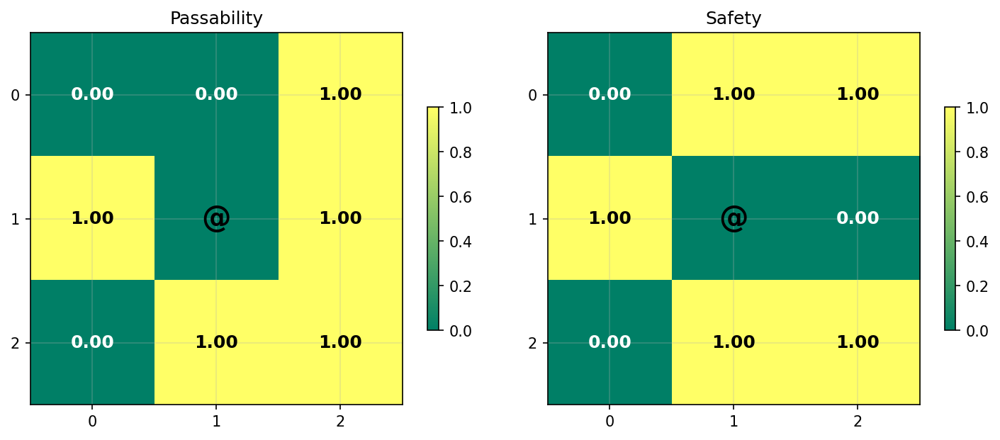 |

================================================================================

## Sample 9

### Ego Map Reconstruction

| Original | Reconstruction |
|---|---|
| 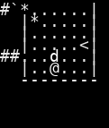 | 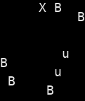 |

**Accuracy**: Character: 0.174, Color: 0.504

### Ego Class Reconstruction

| Original | Reconstruction |
|---|---|
| 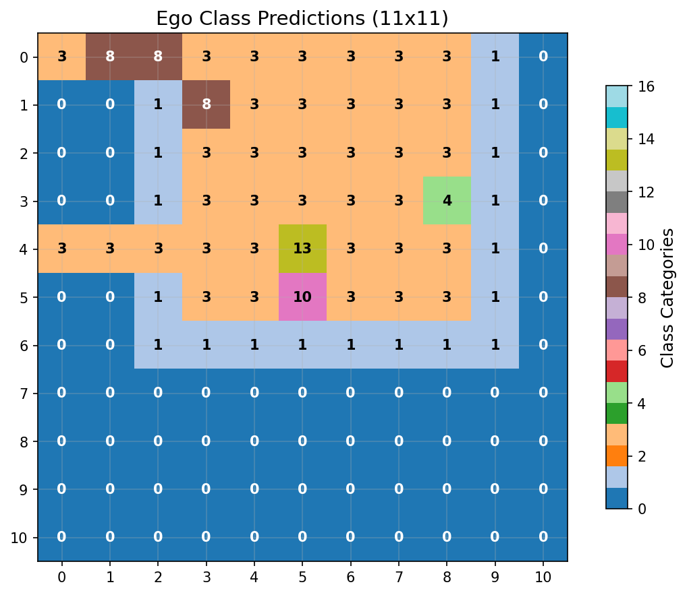 | 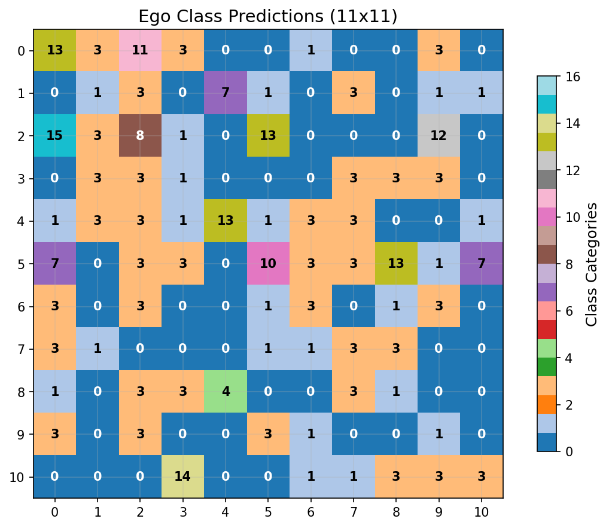 |

**Class Accuracy**: 0.364

### Bag Reconstruction

```
Bag Analysis:
========================================

Original Bag (15 items):
------------------------------
  '#' (color  7)
  '(' (color  3)
  ')' (color  6)
  '*' (color  7)
  '-' (color  3)
  '-' (color  7)
  '.' (color  7)
  '.' (color  8)
  '<' (color  7)
  '>' (color  7)
  '@' (color 15)
  '`' (color  7)
  'd' (color 15)
  '|' (color  3)
  '|' (color  7)

Reconstructed Bag (336 items):
------------------------------
  ' ' (color  9)
  ' ' (color 11)
  '!' (color  3)
  '!' (color  6)
  '"' (color  0)
  '"' (color 14)
  '#' (color  2)
  '#' (color 13)
  '#' (color 14)
  '$' (color  4)
  '$' (color  6)
  '$' (color  7)
  '$' (color 12)
  '$' (color 13)
  '%' (color  6)
  '%' (color 11)
  '&' (color  0)
  ''' (color  5)
  ''' (color  8)
  ''' (color 15)
  '(' (color  3)
  '(' (color  7)
  '(' (color 11)
  ')' (color  7)
  ')' (color  8)
  ')' (color  9)
  '*' (color  4)
  '*' (color  7)
  '*' (color 10)
  '+' (color 12)
  ',' (color  2)
  ',' (color  3)
  ',' (color 11)
  ',' (color 12)
  '-' (color  0)
  '-' (color  1)
  '-' (color  3)
  '-' (color  6)
  '-' (color  7)
  '-' (color  9)
  '-' (color 12)
  '.' (color  2)
  '.' (color  3)
  '.' (color  7)
  '.' (color 12)
  '.' (color 13)
  '.' (color 15)
  '/' (color  1)
  '/' (color  5)
  '/' (color  6)
  '/' (color 14)
  '0' (color  0)
  '0' (color  8)
  '0' (color 10)
  '0' (color 15)
  '1' (color  2)
  '2' (color  1)
  '2' (color  3)
  '2' (color  7)
  '2' (color 12)
  '3' (color  1)
  '3' (color  2)
  '3' (color  3)
  '3' (color  9)
  '3' (color 10)
  '3' (color 11)
  '3' (color 13)
  '4' (color  0)
  '4' (color  4)
  '4' (color  8)
  '4' (color  9)
  '4' (color 11)
  '4' (color 14)
  '5' (color  5)
  '5' (color 10)
  '5' (color 14)
  '6' (color  4)
  '6' (color  5)
  '6' (color  6)
  '6' (color 10)
  '6' (color 11)
  '6' (color 12)
  '6' (color 13)
  '6' (color 14)
  '7' (color  0)
  '7' (color  4)
  '7' (color  6)
  '7' (color 11)
  '7' (color 15)
  '8' (color  1)
  '8' (color  7)
  '9' (color  1)
  '9' (color  2)
  '9' (color 10)
  ':' (color  2)
  ';' (color  7)
  ';' (color  8)
  ';' (color 10)
  '<' (color  4)
  '<' (color  6)
  '<' (color  7)
  '<' (color 12)
  '=' (color 10)
  '=' (color 11)
  '=' (color 14)
  '>' (color  6)
  '>' (color  9)
  '>' (color 10)
  '>' (color 12)
  '?' (color  2)
  '@' (color  0)
  '@' (color  7)
  '@' (color 10)
  '@' (color 15)
  'A' (color  0)
  'A' (color  1)
  'A' (color  8)
  'A' (color  9)
  'A' (color 11)
  'A' (color 14)
  'A' (color 15)
  'B' (color  2)
  'B' (color 10)
  'B' (color 13)
  'C' (color  1)
  'C' (color  5)
  'C' (color  9)
  'C' (color 10)
  'C' (color 12)
  'D' (color  2)
  'D' (color  4)
  'D' (color  6)
  'D' (color 11)
  'D' (color 13)
  'D' (color 15)
  'E' (color 10)
  'E' (color 12)
  'F' (color  2)
  'F' (color  3)
  'F' (color  6)
  'F' (color  8)
  'F' (color  9)
  'F' (color 12)
  'G' (color  0)
  'G' (color  2)
  'G' (color  9)
  'G' (color 12)
  'G' (color 14)
  'H' (color  3)
  'H' (color  6)
  'H' (color  7)
  'H' (color 14)
  'I' (color  0)
  'I' (color  4)
  'J' (color  8)
  'K' (color  5)
  'K' (color  7)
  'K' (color  8)
  'K' (color 12)
  'L' (color  6)
  'L' (color  8)
  'L' (color 10)
  'M' (color  1)
  'M' (color  5)
  'M' (color  7)
  'N' (color  2)
  'N' (color  3)
  'N' (color  6)
  'N' (color  8)
  'N' (color 11)
  'O' (color  0)
  'O' (color  1)
  'O' (color  9)
  'P' (color  0)
  'P' (color  6)
  'Q' (color  8)
  'Q' (color  9)
  'Q' (color 10)
  'Q' (color 14)
  'R' (color 11)
  'R' (color 14)
  'S' (color  6)
  'S' (color  9)
  'S' (color 12)
  'S' (color 13)
  'T' (color  0)
  'T' (color  2)
  'U' (color  9)
  'U' (color 10)
  'U' (color 13)
  'U' (color 15)
  'V' (color  8)
  'V' (color 12)
  'V' (color 14)
  'V' (color 15)
  'W' (color  1)
  'W' (color  4)
  'W' (color  6)
  'W' (color  7)
  'W' (color 10)
  'X' (color  0)
  'X' (color  3)
  'X' (color  5)
  'X' (color  7)
  'X' (color 15)
  'Y' (color  1)
  'Y' (color 15)
  'Z' (color  1)
  'Z' (color  9)
  'Z' (color 15)
  '[' (color  3)
  '[' (color  4)
  '[' (color  7)
  '[' (color  8)
  '[' (color 14)
  '\' (color  8)
  ']' (color  5)
  ']' (color 11)
  ']' (color 12)
  '^' (color  5)
  '^' (color  8)
  '^' (color 10)
  '^' (color 13)
  '^' (color 15)
  '_' (color  6)
  '_' (color  8)
  '`' (color  4)
  '`' (color  7)
  'a' (color  2)
  'a' (color  8)
  'b' (color  9)
  'b' (color 10)
  'b' (color 14)
  'c' (color  1)
  'd' (color 14)
  'd' (color 15)
  'e' (color  1)
  'e' (color  2)
  'e' (color  7)
  'e' (color  9)
  'f' (color  4)
  'f' (color  7)
  'f' (color 10)
  'g' (color  1)
  'g' (color  4)
  'g' (color  7)
  'g' (color  8)
  'g' (color 11)
  'h' (color  3)
  'h' (color  6)
  'i' (color  1)
  'i' (color  7)
  'i' (color 14)
  'j' (color  0)
  'j' (color  5)
  'j' (color 10)
  'k' (color  1)
  'k' (color  4)
  'k' (color  6)
  'k' (color  9)
  'k' (color 13)
  'l' (color  0)
  'l' (color  2)
  'l' (color  4)
  'l' (color  9)
  'l' (color 11)
  'm' (color  3)
  'm' (color  7)
  'm' (color  8)
  'm' (color 11)
  'm' (color 15)
  'n' (color 15)
  'o' (color  2)
  'o' (color 11)
  'o' (color 14)
  'p' (color  4)
  'p' (color  6)
  'p' (color 15)
  'q' (color  1)
  'q' (color 11)
  'r' (color  0)
  'r' (color  1)
  'r' (color  2)
  'r' (color 11)
  'r' (color 12)
  's' (color  3)
  's' (color  7)
  's' (color  8)
  's' (color 10)
  't' (color  0)
  't' (color  2)
  't' (color  6)
  't' (color 10)
  'u' (color  5)
  'u' (color  6)
  'u' (color  9)
  'u' (color 13)
  'v' (color  0)
  'v' (color  4)
  'v' (color  5)
  'v' (color  7)
  'v' (color 13)
  'v' (color 14)
  'w' (color  7)
  'w' (color 12)
  'w' (color 14)
  'x' (color  4)
  'x' (color 13)
  'y' (color  3)
  'y' (color  4)
  'y' (color  8)
  'y' (color 14)
  'z' (color 10)
  'z' (color 11)
  '{' (color  0)
  '{' (color  2)
  '{' (color  5)
  '{' (color 12)
  '{' (color 14)
  '|' (color  0)
  '|' (color  3)
  '|' (color  5)
  '|' (color  7)
  '|' (color  8)
  '|' (color 11)
  '|' (color 13)
  '}' (color  6)
  '}' (color 13)
  '~' (color  1)
  '~' (color 12)
  '~' (color 15)
  '\x7f' (color  0)
  '\x7f' (color  1)
  '\x7f' (color  2)
  '\x7f' (color  5)
  '\x7f' (color  9)

Accuracy Metrics:
------------------------------
  Correctly predicted: 11 items
    '(' (color  3)
    '*' (color  7)
    '-' (color  3)
    '-' (color  7)
    '.' (color  7)
    '<' (color  7)
    '@' (color 15)
    '`' (color  7)
    'd' (color 15)
    '|' (color  3)
    '|' (color  7)
  Missed items: 4 items
    '#' (color  7)
    ')' (color  6)
    '.' (color  8)
    '>' (color  7)
  False positives: 325 items
    ' ' (color  9)
    ' ' (color 11)
    '!' (color  3)
    '!' (color  6)
    '"' (color  0)
    '"' (color 14)
    '#' (color  2)
    '#' (color 13)
    '#' (color 14)
    '$' (color  4)
    '$' (color  6)
    '$' (color  7)
    '$' (color 12)
    '$' (color 13)
    '%' (color  6)
    '%' (color 11)
    '&' (color  0)
    ''' (color  5)
    ''' (color  8)
    ''' (color 15)
    '(' (color  7)
    '(' (color 11)
    ')' (color  7)
    ')' (color  8)
    ')' (color  9)
    '*' (color  4)
    '*' (color 10)
    '+' (color 12)
    ',' (color  2)
    ',' (color  3)
    ',' (color 11)
    ',' (color 12)
    '-' (color  0)
    '-' (color  1)
    '-' (color  6)
    '-' (color  9)
    '-' (color 12)
    '.' (color  2)
    '.' (color  3)
    '.' (color 12)
    '.' (color 13)
    '.' (color 15)
    '/' (color  1)
    '/' (color  5)
    '/' (color  6)
    '/' (color 14)
    '0' (color  0)
    '0' (color  8)
    '0' (color 10)
    '0' (color 15)
    '1' (color  2)
    '2' (color  1)
    '2' (color  3)
    '2' (color  7)
    '2' (color 12)
    '3' (color  1)
    '3' (color  2)
    '3' (color  3)
    '3' (color  9)
    '3' (color 10)
    '3' (color 11)
    '3' (color 13)
    '4' (color  0)
    '4' (color  4)
    '4' (color  8)
    '4' (color  9)
    '4' (color 11)
    '4' (color 14)
    '5' (color  5)
    '5' (color 10)
    '5' (color 14)
    '6' (color  4)
    '6' (color  5)
    '6' (color  6)
    '6' (color 10)
    '6' (color 11)
    '6' (color 12)
    '6' (color 13)
    '6' (color 14)
    '7' (color  0)
    '7' (color  4)
    '7' (color  6)
    '7' (color 11)
    '7' (color 15)
    '8' (color  1)
    '8' (color  7)
    '9' (color  1)
    '9' (color  2)
    '9' (color 10)
    ':' (color  2)
    ';' (color  7)
    ';' (color  8)
    ';' (color 10)
    '<' (color  4)
    '<' (color  6)
    '<' (color 12)
    '=' (color 10)
    '=' (color 11)
    '=' (color 14)
    '>' (color  6)
    '>' (color  9)
    '>' (color 10)
    '>' (color 12)
    '?' (color  2)
    '@' (color  0)
    '@' (color  7)
    '@' (color 10)
    'A' (color  0)
    'A' (color  1)
    'A' (color  8)
    'A' (color  9)
    'A' (color 11)
    'A' (color 14)
    'A' (color 15)
    'B' (color  2)
    'B' (color 10)
    'B' (color 13)
    'C' (color  1)
    'C' (color  5)
    'C' (color  9)
    'C' (color 10)
    'C' (color 12)
    'D' (color  2)
    'D' (color  4)
    'D' (color  6)
    'D' (color 11)
    'D' (color 13)
    'D' (color 15)
    'E' (color 10)
    'E' (color 12)
    'F' (color  2)
    'F' (color  3)
    'F' (color  6)
    'F' (color  8)
    'F' (color  9)
    'F' (color 12)
    'G' (color  0)
    'G' (color  2)
    'G' (color  9)
    'G' (color 12)
    'G' (color 14)
    'H' (color  3)
    'H' (color  6)
    'H' (color  7)
    'H' (color 14)
    'I' (color  0)
    'I' (color  4)
    'J' (color  8)
    'K' (color  5)
    'K' (color  7)
    'K' (color  8)
    'K' (color 12)
    'L' (color  6)
    'L' (color  8)
    'L' (color 10)
    'M' (color  1)
    'M' (color  5)
    'M' (color  7)
    'N' (color  2)
    'N' (color  3)
    'N' (color  6)
    'N' (color  8)
    'N' (color 11)
    'O' (color  0)
    'O' (color  1)
    'O' (color  9)
    'P' (color  0)
    'P' (color  6)
    'Q' (color  8)
    'Q' (color  9)
    'Q' (color 10)
    'Q' (color 14)
    'R' (color 11)
    'R' (color 14)
    'S' (color  6)
    'S' (color  9)
    'S' (color 12)
    'S' (color 13)
    'T' (color  0)
    'T' (color  2)
    'U' (color  9)
    'U' (color 10)
    'U' (color 13)
    'U' (color 15)
    'V' (color  8)
    'V' (color 12)
    'V' (color 14)
    'V' (color 15)
    'W' (color  1)
    'W' (color  4)
    'W' (color  6)
    'W' (color  7)
    'W' (color 10)
    'X' (color  0)
    'X' (color  3)
    'X' (color  5)
    'X' (color  7)
    'X' (color 15)
    'Y' (color  1)
    'Y' (color 15)
    'Z' (color  1)
    'Z' (color  9)
    'Z' (color 15)
    '[' (color  3)
    '[' (color  4)
    '[' (color  7)
    '[' (color  8)
    '[' (color 14)
    '\' (color  8)
    ']' (color  5)
    ']' (color 11)
    ']' (color 12)
    '^' (color  5)
    '^' (color  8)
    '^' (color 10)
    '^' (color 13)
    '^' (color 15)
    '_' (color  6)
    '_' (color  8)
    '`' (color  4)
    'a' (color  2)
    'a' (color  8)
    'b' (color  9)
    'b' (color 10)
    'b' (color 14)
    'c' (color  1)
    'd' (color 14)
    'e' (color  1)
    'e' (color  2)
    'e' (color  7)
    'e' (color  9)
    'f' (color  4)
    'f' (color  7)
    'f' (color 10)
    'g' (color  1)
    'g' (color  4)
    'g' (color  7)
    'g' (color  8)
    'g' (color 11)
    'h' (color  3)
    'h' (color  6)
    'i' (color  1)
    'i' (color  7)
    'i' (color 14)
    'j' (color  0)
    'j' (color  5)
    'j' (color 10)
    'k' (color  1)
    'k' (color  4)
    'k' (color  6)
    'k' (color  9)
    'k' (color 13)
    'l' (color  0)
    'l' (color  2)
    'l' (color  4)
    'l' (color  9)
    'l' (color 11)
    'm' (color  3)
    'm' (color  7)
    'm' (color  8)
    'm' (color 11)
    'm' (color 15)
    'n' (color 15)
    'o' (color  2)
    'o' (color 11)
    'o' (color 14)
    'p' (color  4)
    'p' (color  6)
    'p' (color 15)
    'q' (color  1)
    'q' (color 11)
    'r' (color  0)
    'r' (color  1)
    'r' (color  2)
    'r' (color 11)
    'r' (color 12)
    's' (color  3)
    's' (color  7)
    's' (color  8)
    's' (color 10)
    't' (color  0)
    't' (color  2)
    't' (color  6)
    't' (color 10)
    'u' (color  5)
    'u' (color  6)
    'u' (color  9)
    'u' (color 13)
    'v' (color  0)
    'v' (color  4)
    'v' (color  5)
    'v' (color  7)
    'v' (color 13)
    'v' (color 14)
    'w' (color  7)
    'w' (color 12)
    'w' (color 14)
    'x' (color  4)
    'x' (color 13)
    'y' (color  3)
    'y' (color  4)
    'y' (color  8)
    'y' (color 14)
    'z' (color 10)
    'z' (color 11)
    '{' (color  0)
    '{' (color  2)
    '{' (color  5)
    '{' (color 12)
    '{' (color 14)
    '|' (color  0)
    '|' (color  5)
    '|' (color  8)
    '|' (color 11)
    '|' (color 13)
    '}' (color  6)
    '}' (color 13)
    '~' (color  1)
    '~' (color 12)
    '~' (color 15)
    '\x7f' (color  0)
    '\x7f' (color  1)
    '\x7f' (color  2)
    '\x7f' (color  5)
    '\x7f' (color  9)

Performance Summary:
------------------------------
  Precision: 0.033 (11/336)
  Recall: 0.733 (11/15)
  F1-Score: 0.063
  Total unique items: 340
```

### Passability & Safety

| Original | Reconstruction |
|---|---|
|  | 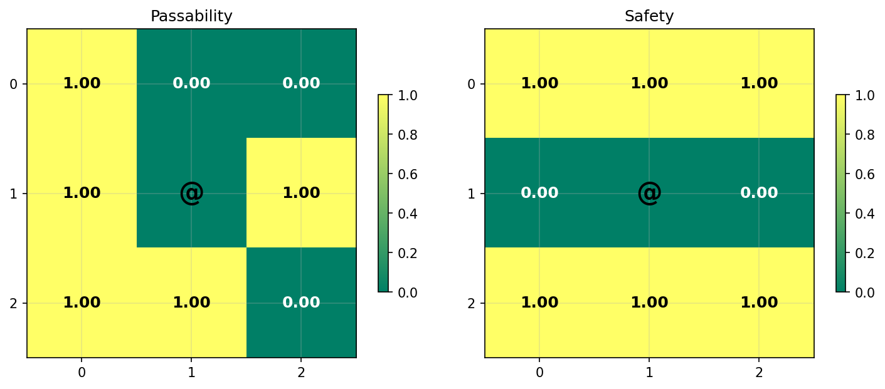 |

================================================================================

## Sample 10

### Ego Map Reconstruction

| Original | Reconstruction |
|---|---|
| 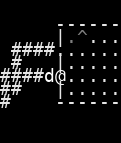 | 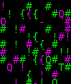 |

**Accuracy**: Character: 0.165, Color: 0.521

### Ego Class Reconstruction

| Original | Reconstruction |
|---|---|
| 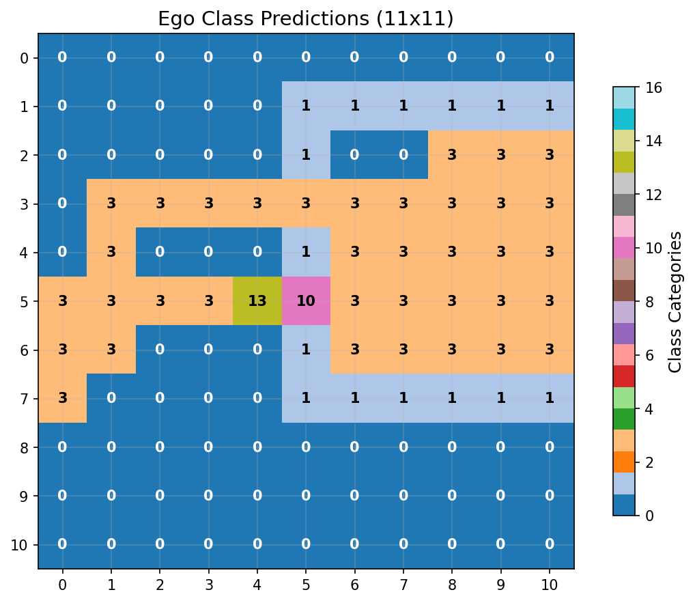 | 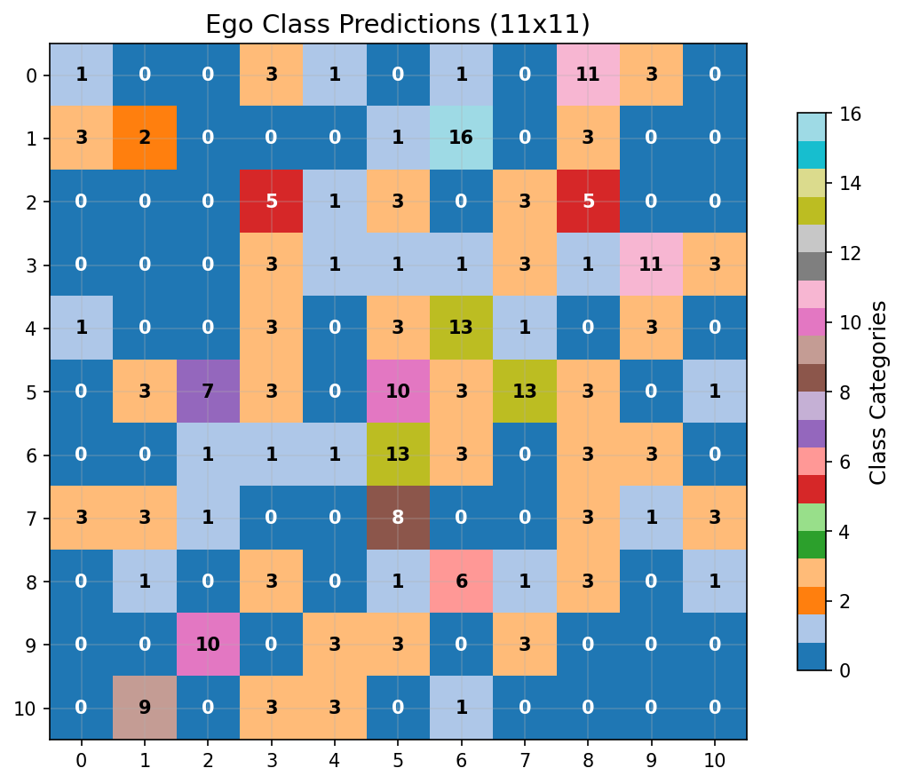 |

**Class Accuracy**: 0.413

### Bag Reconstruction

```
Bag Analysis:
========================================

Original Bag (16 items):
------------------------------
  '#' (color  7)
  '%' (color  3)
  ')' (color  6)
  '-' (color  3)
  '-' (color  7)
  '.' (color  7)
  '.' (color  8)
  '<' (color  7)
  '>' (color  7)
  '@' (color 15)
  '^' (color  8)
  'd' (color 15)
  'r' (color  3)
  '{' (color 12)
  '|' (color  3)
  '|' (color  7)

Reconstructed Bag (344 items):
------------------------------
  ' ' (color  1)
  ' ' (color  6)
  ' ' (color  9)
  ' ' (color 11)
  ' ' (color 13)
  '!' (color  5)
  '!' (color  6)
  '!' (color  7)
  '!' (color  8)
  '!' (color 11)
  '!' (color 14)
  '"' (color  4)
  '"' (color  7)
  '"' (color 12)
  '"' (color 14)
  '#' (color  1)
  '#' (color  6)
  '#' (color  7)
  '#' (color  8)
  '#' (color 10)
  '#' (color 12)
  '#' (color 13)
  '$' (color  2)
  '$' (color  6)
  '$' (color  7)
  '%' (color  4)
  '%' (color  6)
  '%' (color  8)
  '&' (color  9)
  '&' (color 14)
  '&' (color 15)
  ''' (color  7)
  ''' (color 12)
  '(' (color  2)
  '(' (color  3)
  '(' (color  5)
  '(' (color  7)
  ')' (color  5)
  ')' (color 10)
  ')' (color 12)
  '*' (color  3)
  '*' (color  6)
  '*' (color  9)
  '*' (color 10)
  '+' (color  5)
  '+' (color  6)
  ',' (color  2)
  ',' (color  4)
  ',' (color 11)
  ',' (color 14)
  '-' (color  3)
  '-' (color  6)
  '-' (color  7)
  '-' (color 14)
  '.' (color  7)
  '.' (color  8)
  '.' (color 15)
  '/' (color  0)
  '/' (color  1)
  '/' (color  4)
  '/' (color  6)
  '0' (color  2)
  '0' (color  8)
  '0' (color 10)
  '1' (color  2)
  '2' (color  2)
  '2' (color  7)
  '2' (color  9)
  '2' (color 15)
  '3' (color  1)
  '3' (color  3)
  '3' (color  7)
  '3' (color 11)
  '3' (color 13)
  '4' (color  0)
  '5' (color 10)
  '6' (color  1)
  '6' (color  2)
  '6' (color  5)
  '6' (color  8)
  '6' (color 12)
  '6' (color 15)
  '7' (color  0)
  '7' (color  4)
  '7' (color  9)
  '7' (color 11)
  '7' (color 12)
  '7' (color 13)
  '7' (color 15)
  '8' (color  1)
  '8' (color  3)
  '8' (color  5)
  '9' (color  5)
  ':' (color  9)
  ':' (color 14)
  ';' (color 11)
  ';' (color 15)
  '<' (color  5)
  '<' (color  7)
  '<' (color 13)
  '=' (color  0)
  '=' (color  2)
  '=' (color  4)
  '>' (color 11)
  '>' (color 15)
  '?' (color  2)
  '?' (color  5)
  '?' (color  6)
  '@' (color 10)
  '@' (color 12)
  '@' (color 13)
  'A' (color  2)
  'A' (color 14)
  'B' (color  1)
  'B' (color 14)
  'C' (color  1)
  'C' (color  8)
  'C' (color 10)
  'C' (color 12)
  'C' (color 14)
  'D' (color  0)
  'D' (color 10)
  'E' (color  3)
  'E' (color  4)
  'E' (color  7)
  'E' (color 10)
  'E' (color 12)
  'F' (color  6)
  'F' (color  8)
  'F' (color 10)
  'G' (color  0)
  'G' (color  1)
  'G' (color  2)
  'G' (color  3)
  'G' (color  4)
  'G' (color  7)
  'H' (color  1)
  'H' (color  2)
  'H' (color  9)
  'H' (color 11)
  'H' (color 13)
  'I' (color  4)
  'I' (color  5)
  'I' (color 12)
  'J' (color  0)
  'J' (color  3)
  'J' (color  6)
  'J' (color  8)
  'J' (color 11)
  'K' (color  5)
  'K' (color  7)
  'K' (color  8)
  'M' (color  2)
  'M' (color  4)
  'M' (color 10)
  'M' (color 12)
  'M' (color 15)
  'N' (color  6)
  'N' (color 13)
  'O' (color  9)
  'O' (color 10)
  'O' (color 13)
  'P' (color  4)
  'P' (color  9)
  'P' (color 11)
  'Q' (color  1)
  'Q' (color  6)
  'Q' (color 15)
  'R' (color  0)
  'R' (color 14)
  'S' (color  0)
  'S' (color 13)
  'T' (color  3)
  'T' (color  7)
  'T' (color 11)
  'T' (color 12)
  'T' (color 15)
  'U' (color  6)
  'U' (color  9)
  'U' (color 15)
  'V' (color  1)
  'V' (color  2)
  'V' (color  3)
  'V' (color 13)
  'V' (color 14)
  'W' (color  0)
  'W' (color  5)
  'X' (color  2)
  'X' (color  3)
  'X' (color  5)
  'X' (color 10)
  'Y' (color  2)
  'Y' (color  5)
  'Y' (color 10)
  'Y' (color 11)
  'Y' (color 15)
  'Z' (color  4)
  'Z' (color  6)
  'Z' (color  7)
  'Z' (color  9)
  'Z' (color 10)
  'Z' (color 11)
  '[' (color  1)
  '[' (color  2)
  '[' (color  5)
  '\' (color  2)
  ']' (color  2)
  ']' (color  4)
  ']' (color  5)
  ']' (color  7)
  ']' (color 10)
  ']' (color 15)
  '^' (color  0)
  '^' (color  2)
  '^' (color 10)
  '^' (color 13)
  '^' (color 14)
  '_' (color  5)
  '_' (color  6)
  '_' (color  8)
  '_' (color 14)
  '`' (color  0)
  '`' (color 15)
  'a' (color  3)
  'a' (color  8)
  'a' (color 12)
  'b' (color  3)
  'b' (color  5)
  'b' (color  7)
  'b' (color  8)
  'b' (color 10)
  'b' (color 12)
  'c' (color 12)
  'c' (color 13)
  'd' (color  4)
  'd' (color  6)
  'd' (color  9)
  'd' (color 14)
  'd' (color 15)
  'e' (color  7)
  'e' (color 10)
  'e' (color 14)
  'f' (color  2)
  'f' (color  4)
  'f' (color  6)
  'f' (color 10)
  'g' (color  2)
  'g' (color  5)
  'g' (color  9)
  'g' (color 11)
  'h' (color  6)
  'h' (color 15)
  'i' (color  1)
  'i' (color  2)
  'i' (color  4)
  'i' (color  9)
  'j' (color  4)
  'j' (color  6)
  'j' (color  7)
  'j' (color  9)
  'j' (color 13)
  'j' (color 14)
  'j' (color 15)
  'k' (color  1)
  'k' (color  2)
  'k' (color  8)
  'k' (color 13)
  'l' (color  0)
  'l' (color  3)
  'l' (color  4)
  'l' (color 11)
  'l' (color 12)
  'l' (color 13)
  'l' (color 15)
  'm' (color  0)
  'm' (color  1)
  'm' (color  2)
  'm' (color  3)
  'n' (color  8)
  'n' (color 12)
  'n' (color 14)
  'o' (color  1)
  'o' (color  3)
  'o' (color  5)
  'p' (color 12)
  'q' (color  2)
  'q' (color  5)
  'q' (color  8)
  'q' (color 12)
  'r' (color  5)
  'r' (color  7)
  's' (color  0)
  's' (color  3)
  's' (color  7)
  's' (color 10)
  's' (color 12)
  's' (color 15)
  't' (color  8)
  't' (color 10)
  't' (color 13)
  'u' (color  1)
  'u' (color 11)
  'v' (color  7)
  'v' (color  8)
  'v' (color 11)
  'w' (color  5)
  'w' (color  6)
  'w' (color  7)
  'w' (color 11)
  'x' (color  3)
  'x' (color  4)
  'x' (color  9)
  'y' (color  2)
  'y' (color  3)
  'y' (color  7)
  'y' (color  8)
  'y' (color 12)
  'y' (color 15)
  'z' (color  1)
  'z' (color  5)
  'z' (color  6)
  'z' (color  9)
  'z' (color 12)
  '{' (color  3)
  '{' (color  5)
  '{' (color  6)
  '{' (color 11)
  '{' (color 14)
  '|' (color  2)
  '|' (color  4)
  '|' (color  5)
  '|' (color  7)
  '|' (color  8)
  '}' (color  0)
  '}' (color 13)
  '}' (color 14)
  '~' (color  5)
  '~' (color  7)
  '~' (color 12)
  '~' (color 13)
  '~' (color 15)
  '\x7f' (color  3)
  '\x7f' (color  4)
  '\x7f' (color 12)

Accuracy Metrics:
------------------------------
  Correctly predicted: 8 items
    '#' (color  7)
    '-' (color  3)
    '-' (color  7)
    '.' (color  7)
    '.' (color  8)
    '<' (color  7)
    'd' (color 15)
    '|' (color  7)
  Missed items: 8 items
    '%' (color  3)
    ')' (color  6)
    '>' (color  7)
    '@' (color 15)
    '^' (color  8)
    'r' (color  3)
    '{' (color 12)
    '|' (color  3)
  False positives: 336 items
    ' ' (color  1)
    ' ' (color  6)
    ' ' (color  9)
    ' ' (color 11)
    ' ' (color 13)
    '!' (color  5)
    '!' (color  6)
    '!' (color  7)
    '!' (color  8)
    '!' (color 11)
    '!' (color 14)
    '"' (color  4)
    '"' (color  7)
    '"' (color 12)
    '"' (color 14)
    '#' (color  1)
    '#' (color  6)
    '#' (color  8)
    '#' (color 10)
    '#' (color 12)
    '#' (color 13)
    '$' (color  2)
    '$' (color  6)
    '$' (color  7)
    '%' (color  4)
    '%' (color  6)
    '%' (color  8)
    '&' (color  9)
    '&' (color 14)
    '&' (color 15)
    ''' (color  7)
    ''' (color 12)
    '(' (color  2)
    '(' (color  3)
    '(' (color  5)
    '(' (color  7)
    ')' (color  5)
    ')' (color 10)
    ')' (color 12)
    '*' (color  3)
    '*' (color  6)
    '*' (color  9)
    '*' (color 10)
    '+' (color  5)
    '+' (color  6)
    ',' (color  2)
    ',' (color  4)
    ',' (color 11)
    ',' (color 14)
    '-' (color  6)
    '-' (color 14)
    '.' (color 15)
    '/' (color  0)
    '/' (color  1)
    '/' (color  4)
    '/' (color  6)
    '0' (color  2)
    '0' (color  8)
    '0' (color 10)
    '1' (color  2)
    '2' (color  2)
    '2' (color  7)
    '2' (color  9)
    '2' (color 15)
    '3' (color  1)
    '3' (color  3)
    '3' (color  7)
    '3' (color 11)
    '3' (color 13)
    '4' (color  0)
    '5' (color 10)
    '6' (color  1)
    '6' (color  2)
    '6' (color  5)
    '6' (color  8)
    '6' (color 12)
    '6' (color 15)
    '7' (color  0)
    '7' (color  4)
    '7' (color  9)
    '7' (color 11)
    '7' (color 12)
    '7' (color 13)
    '7' (color 15)
    '8' (color  1)
    '8' (color  3)
    '8' (color  5)
    '9' (color  5)
    ':' (color  9)
    ':' (color 14)
    ';' (color 11)
    ';' (color 15)
    '<' (color  5)
    '<' (color 13)
    '=' (color  0)
    '=' (color  2)
    '=' (color  4)
    '>' (color 11)
    '>' (color 15)
    '?' (color  2)
    '?' (color  5)
    '?' (color  6)
    '@' (color 10)
    '@' (color 12)
    '@' (color 13)
    'A' (color  2)
    'A' (color 14)
    'B' (color  1)
    'B' (color 14)
    'C' (color  1)
    'C' (color  8)
    'C' (color 10)
    'C' (color 12)
    'C' (color 14)
    'D' (color  0)
    'D' (color 10)
    'E' (color  3)
    'E' (color  4)
    'E' (color  7)
    'E' (color 10)
    'E' (color 12)
    'F' (color  6)
    'F' (color  8)
    'F' (color 10)
    'G' (color  0)
    'G' (color  1)
    'G' (color  2)
    'G' (color  3)
    'G' (color  4)
    'G' (color  7)
    'H' (color  1)
    'H' (color  2)
    'H' (color  9)
    'H' (color 11)
    'H' (color 13)
    'I' (color  4)
    'I' (color  5)
    'I' (color 12)
    'J' (color  0)
    'J' (color  3)
    'J' (color  6)
    'J' (color  8)
    'J' (color 11)
    'K' (color  5)
    'K' (color  7)
    'K' (color  8)
    'M' (color  2)
    'M' (color  4)
    'M' (color 10)
    'M' (color 12)
    'M' (color 15)
    'N' (color  6)
    'N' (color 13)
    'O' (color  9)
    'O' (color 10)
    'O' (color 13)
    'P' (color  4)
    'P' (color  9)
    'P' (color 11)
    'Q' (color  1)
    'Q' (color  6)
    'Q' (color 15)
    'R' (color  0)
    'R' (color 14)
    'S' (color  0)
    'S' (color 13)
    'T' (color  3)
    'T' (color  7)
    'T' (color 11)
    'T' (color 12)
    'T' (color 15)
    'U' (color  6)
    'U' (color  9)
    'U' (color 15)
    'V' (color  1)
    'V' (color  2)
    'V' (color  3)
    'V' (color 13)
    'V' (color 14)
    'W' (color  0)
    'W' (color  5)
    'X' (color  2)
    'X' (color  3)
    'X' (color  5)
    'X' (color 10)
    'Y' (color  2)
    'Y' (color  5)
    'Y' (color 10)
    'Y' (color 11)
    'Y' (color 15)
    'Z' (color  4)
    'Z' (color  6)
    'Z' (color  7)
    'Z' (color  9)
    'Z' (color 10)
    'Z' (color 11)
    '[' (color  1)
    '[' (color  2)
    '[' (color  5)
    '\' (color  2)
    ']' (color  2)
    ']' (color  4)
    ']' (color  5)
    ']' (color  7)
    ']' (color 10)
    ']' (color 15)
    '^' (color  0)
    '^' (color  2)
    '^' (color 10)
    '^' (color 13)
    '^' (color 14)
    '_' (color  5)
    '_' (color  6)
    '_' (color  8)
    '_' (color 14)
    '`' (color  0)
    '`' (color 15)
    'a' (color  3)
    'a' (color  8)
    'a' (color 12)
    'b' (color  3)
    'b' (color  5)
    'b' (color  7)
    'b' (color  8)
    'b' (color 10)
    'b' (color 12)
    'c' (color 12)
    'c' (color 13)
    'd' (color  4)
    'd' (color  6)
    'd' (color  9)
    'd' (color 14)
    'e' (color  7)
    'e' (color 10)
    'e' (color 14)
    'f' (color  2)
    'f' (color  4)
    'f' (color  6)
    'f' (color 10)
    'g' (color  2)
    'g' (color  5)
    'g' (color  9)
    'g' (color 11)
    'h' (color  6)
    'h' (color 15)
    'i' (color  1)
    'i' (color  2)
    'i' (color  4)
    'i' (color  9)
    'j' (color  4)
    'j' (color  6)
    'j' (color  7)
    'j' (color  9)
    'j' (color 13)
    'j' (color 14)
    'j' (color 15)
    'k' (color  1)
    'k' (color  2)
    'k' (color  8)
    'k' (color 13)
    'l' (color  0)
    'l' (color  3)
    'l' (color  4)
    'l' (color 11)
    'l' (color 12)
    'l' (color 13)
    'l' (color 15)
    'm' (color  0)
    'm' (color  1)
    'm' (color  2)
    'm' (color  3)
    'n' (color  8)
    'n' (color 12)
    'n' (color 14)
    'o' (color  1)
    'o' (color  3)
    'o' (color  5)
    'p' (color 12)
    'q' (color  2)
    'q' (color  5)
    'q' (color  8)
    'q' (color 12)
    'r' (color  5)
    'r' (color  7)
    's' (color  0)
    's' (color  3)
    's' (color  7)
    's' (color 10)
    's' (color 12)
    's' (color 15)
    't' (color  8)
    't' (color 10)
    't' (color 13)
    'u' (color  1)
    'u' (color 11)
    'v' (color  7)
    'v' (color  8)
    'v' (color 11)
    'w' (color  5)
    'w' (color  6)
    'w' (color  7)
    'w' (color 11)
    'x' (color  3)
    'x' (color  4)
    'x' (color  9)
    'y' (color  2)
    'y' (color  3)
    'y' (color  7)
    'y' (color  8)
    'y' (color 12)
    'y' (color 15)
    'z' (color  1)
    'z' (color  5)
    'z' (color  6)
    'z' (color  9)
    'z' (color 12)
    '{' (color  3)
    '{' (color  5)
    '{' (color  6)
    '{' (color 11)
    '{' (color 14)
    '|' (color  2)
    '|' (color  4)
    '|' (color  5)
    '|' (color  8)
    '}' (color  0)
    '}' (color 13)
    '}' (color 14)
    '~' (color  5)
    '~' (color  7)
    '~' (color 12)
    '~' (color 13)
    '~' (color 15)
    '\x7f' (color  3)
    '\x7f' (color  4)
    '\x7f' (color 12)

Performance Summary:
------------------------------
  Precision: 0.023 (8/344)
  Recall: 0.500 (8/16)
  F1-Score: 0.044
  Total unique items: 352
```

### Passability & Safety

| Original | Reconstruction |
|---|---|
|  | 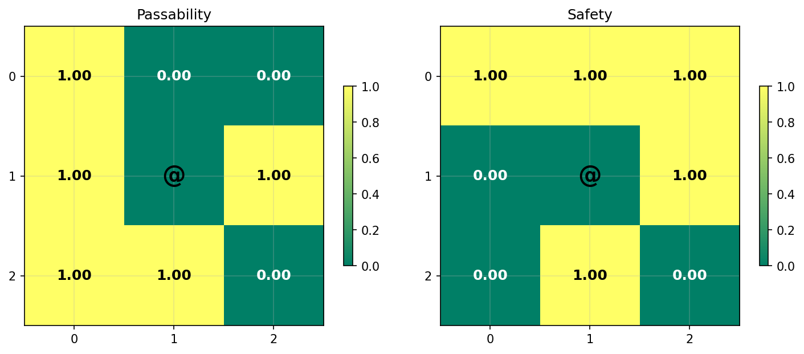 |

## Overall Statistics

- **Average Character Accuracy**: 0.169
- **Average Color Accuracy**: 0.555
- **Total Samples**: 10
